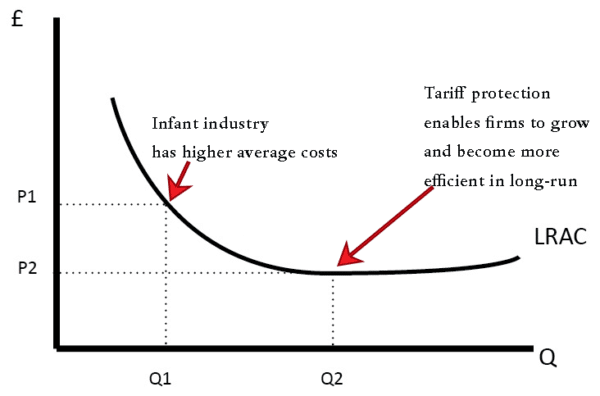

## Table of Contents

## What is the Infant Industry Theory?

The Infant Industry Theory is an economic idea that says new industries in a country need protection when they start out. This is because they are like babies, or "infants," and need help to grow strong enough to compete with bigger, more established industries from other countries. Governments might use tariffs, which are taxes on imports, or other trade barriers to protect these new industries. The idea is that once these industries grow up, they can compete on their own without help.

This theory was first talked about by Alexander Hamilton and later by Friedrich List. They believed that without protection, new industries would struggle against foreign competition and might not survive. The goal is to help the country's economy by making sure these new industries can eventually stand on their own. However, critics argue that this protection can lead to industries becoming too dependent on government help and never becoming competitive. They also say it can lead to higher prices for consumers and less efficient industries.

## Who developed the Infant Industry Theory?

The Infant Industry Theory was first developed by Alexander Hamilton. He was an American statesman who wanted to help the United States grow its economy. Hamilton thought that new industries in America needed protection from foreign competition. He believed that if these new industries were protected, they could grow strong and eventually compete on their own. He suggested using tariffs, which are taxes on imports, to make foreign goods more expensive and give American industries a chance to develop.

Later, a German economist named Friedrich List expanded on Hamilton's ideas. List believed that countries should protect their new industries until they were strong enough to compete with established industries from other countries. He thought that without this protection, these new industries would fail and the country's economy would suffer. List's ideas helped shape economic policies in many countries, encouraging them to support their growing industries.

## What are the main arguments in favor of protecting infant industries?

The main argument for protecting infant industries is to help them grow strong enough to compete with bigger, more established industries from other countries. When a new industry starts, it might not be as good or efficient as older industries. By using tariffs or other trade barriers, the government can make foreign goods more expensive. This gives the new industry a chance to grow without being overwhelmed by competition. The idea is that once the industry gets bigger and better, it can compete on its own without needing protection anymore.

Another argument is that protecting infant industries can help a country's economy grow. If new industries are allowed to develop, they can create jobs and bring in money. This can make the whole country richer and more self-sufficient. Without protection, these new industries might fail, and the country would have to keep relying on other countries for goods. By helping these industries grow, the country can become more independent and stronger economically.

## What are the common methods used to protect infant industries?

One common way to protect infant industries is by using tariffs. Tariffs are taxes that a country puts on goods coming from other countries. When these taxes make foreign goods more expensive, people are more likely to buy things made by the new industry at home. This gives the new industry a chance to grow without being hurt by cheaper foreign competition. Another method is using quotas, which are limits on how much of a certain product can be imported. By limiting the amount of foreign goods that can come in, the new industry has a better chance to sell its products and grow.

Subsidies are another way to help infant industries. Subsidies are money or help that the government gives to a business to make it easier for them to produce goods. This can lower the costs for the new industry, making it easier for them to compete with foreign companies. Governments can also use regulations to protect new industries. For example, they might set rules that make it harder for foreign companies to sell their products in the country. All these methods are used to give new industries the time and space they need to grow strong enough to compete on their own.

## Can you provide examples of countries that have used the Infant Industry Theory?

Many countries have used the Infant Industry Theory to help their new industries grow. One example is the United States in the early 1800s. Alexander Hamilton, one of the country's founders, believed that new American industries needed protection from foreign competition. The U.S. government used tariffs to make foreign goods more expensive, which helped American industries like textiles and iron grow. Over time, these industries became strong enough to compete without help.

Another example is South Korea in the second half of the 20th century. South Korea used tariffs and subsidies to protect its new industries, like electronics and cars. The government helped companies like Samsung and Hyundai grow by making it harder for foreign companies to sell their products in South Korea. This protection helped these industries become big and strong, and now they compete all over the world.

## What are the potential drawbacks or criticisms of the Infant Industry Theory?

One big problem with the Infant Industry Theory is that it can make industries rely too much on government help. If an industry gets used to being protected, it might never learn to compete on its own. This can lead to industries that are not as good or efficient as they should be. Also, the protection can make things more expensive for people who buy the products. When there are tariffs or other barriers, the prices of goods go up because there is less competition. This means that people have to pay more for things, which can be hard on them.

Another criticism is that it's hard to know when to stop protecting an industry. If the government keeps helping an industry for too long, it might never grow up and become strong on its own. This can waste a lot of money and resources. Critics also say that protecting one industry can hurt others. For example, if a country puts tariffs on steel to help its new steel industry, other industries that need steel might have to pay more for it, which can make them less competitive. This can cause problems for the whole economy.

## How does the Infant Industry Theory relate to economic development?

The Infant Industry Theory is important for economic development because it helps new industries grow in a country. When a new industry starts, it is like a baby and needs protection to become strong. By using tariffs or other ways to make foreign goods more expensive, the government gives these new industries a chance to grow without being hurt by bigger, more established foreign companies. This can help the country's economy because when these industries get bigger, they can create jobs and bring in money. If these new industries are successful, the country can become richer and more self-sufficient.

However, there are also problems with using the Infant Industry Theory for economic development. One big issue is that industries might get too used to being protected and never learn to compete on their own. This can make them less efficient and not as good as they should be. Also, the protection can make things more expensive for people who buy the products because there is less competition. This can be hard on them. It's also tricky to know when to stop protecting an industry. If the government keeps helping for too long, it might waste money and resources, and it can hurt other parts of the economy too.

## What is the role of government in implementing the Infant Industry Theory?

The government plays a big role in helping new industries grow by using the Infant Industry Theory. It does this by putting tariffs on goods from other countries. Tariffs are like taxes that make foreign goods more expensive. When foreign goods cost more, people are more likely to buy things made by the new industry at home. The government can also use quotas, which are limits on how much of a certain product can come into the country. By doing these things, the government gives the new industry a chance to grow without being hurt by bigger, more established foreign companies.

But the government has to be careful about how long it helps these new industries. If it keeps helping them for too long, the industries might never learn to compete on their own. This can make them less efficient and not as good as they should be. Also, the help can make things more expensive for people who buy the products because there is less competition. The government needs to find the right balance so that the new industries can grow strong enough to stand on their own, but not so much that it hurts the rest of the economy.

## How does the Infant Industry Theory impact international trade?

The Infant Industry Theory can change how countries trade with each other. When a country uses tariffs or other ways to protect its new industries, it makes foreign goods more expensive. This can make it harder for other countries to sell their products in that country. As a result, countries that are trying to protect their new industries might end up in trade fights with other countries. These fights can lead to less trade overall and can make it harder for countries to work together.

On the other hand, if the new industries grow strong and become good at what they do, they can start selling their products to other countries. This can lead to more trade and can help the country's economy grow. But it's important for the country to stop protecting these industries at the right time. If it keeps helping them for too long, it can hurt international trade and make things more expensive for everyone. Finding the right balance is key to making sure the Infant Industry Theory helps both the country and the world economy.

## What are the conditions under which the Infant Industry Theory is most effective?

The Infant Industry Theory works best when a country has new industries that are just starting out and need help to grow. These industries might not be as good or efficient as older, bigger industries from other countries. By using tariffs or other ways to make foreign goods more expensive, the government gives these new industries a chance to grow without being hurt by bigger competition. The country needs to have a good plan for how long to protect these industries. If the government helps them just long enough, the industries can get strong and start competing on their own.

Another important thing is that the country should have the right resources and skills to make the new industries successful. This means having people who know how to run the industries and having the materials needed to make the products. If the country has these things, the Infant Industry Theory can really help the economy grow. But if the government keeps helping the industries for too long, they might never learn to compete on their own, and that can cause problems. So, it's important to find the right balance and stop the help at the right time.

## How has the application of the Infant Industry Theory evolved over time?

The Infant Industry Theory started a long time ago with people like Alexander Hamilton in the United States. He thought that new American industries needed help to grow strong enough to compete with bigger industries from other countries. So, the U.S. used tariffs to make foreign goods more expensive, which helped industries like textiles and iron grow. Over time, other countries like Germany, with economist Friedrich List, also started using these ideas. They believed that protecting new industries was important for a country's economy to become strong and independent.

As time went on, the way countries used the Infant Industry Theory changed. In the 20th century, countries like South Korea used it to help their new industries in electronics and cars grow. They used tariffs and subsidies to make it harder for foreign companies to sell their products in South Korea. This helped companies like Samsung and Hyundai become big and strong. Today, the theory is still used, but countries have to be careful. They need to find the right balance so that industries don't rely too much on government help and can eventually compete on their own. If they don't, it can lead to problems like higher prices for consumers and less efficient industries.

## What are the modern economic theories that challenge or complement the Infant Industry Theory?

Modern economic theories that challenge the Infant Industry Theory include the theory of comparative advantage. This theory says that countries should focus on making things they are naturally good at, instead of trying to protect new industries. If a country tries to protect too many industries, it might end up not being good at anything. This can lead to less efficient industries and hurt the country's economy. Instead of using tariffs and subsidies to protect new industries, this theory suggests that countries should trade with each other and let each country focus on what it does best.

Another theory that complements the Infant Industry Theory is the New Trade Theory. This theory says that sometimes it's okay to help new industries grow, especially if they can lead to big benefits for the country. It suggests that by protecting certain industries, a country can create economies of scale, which means making things cheaper as they make more of them. This can help the new industry become really good at what it does and compete with other countries. But this theory also warns that countries need to be careful and not protect industries for too long, or they might become too dependent on government help and never become efficient.

## References & Further Reading

[1]: ["The Competitive Advantage of Nations"](https://hbr.org/1990/03/the-competitive-advantage-of-nations) by Michael E. Porter

[2]: ["Infant Industry Protection and Industrial Dynamics"](https://www.sciencedirect.com/science/article/pii/S0022199611000067) Economic Journal, 2015, by Shari Spiegel

[3]: Irwin, D. A. (2000). ["Did Late-Nineteenth-Century U.S. Tariffs Promote Infant Industries? Evidence from the Tinplate Industry."](https://www.jstor.org/stable/pdf/2566374.pdf) Journal of Economic History, 60(2), 335-360.

[4]: ["Algorithmic Trading and DMA: An Introduction to Direct Access Trading Strategies"](https://archive.org/details/algorithmictradi0000john) by Barry Johnson

[5]: Bresnahan, T. F., & Trajtenberg, M. (1995). ["General Purpose Technologies 'Engines of Growth'?"](https://www.sciencedirect.com/science/article/pii/030440769401598T) Journal of Econometrics, 65(1), 83-108.

[6]: ["Kicking Away the Ladder: Development Strategy in Historical Perspective"](https://www.amazon.com/Kicking-Away-Ladder-Development-Perspective/dp/1843310279) by Ha-Joon Chang

[7]: Lee, K. (2013). ["Schumpeterian Analysis of Economic Catch-up: Knowledge, Path-Creation, and the Middle-Income Trap"](https://www.researchgate.net/publication/264037652_Schumpeterian_Analysis_of_Economic_Catch-up_Knowledge_Path-creation_and_the_Middle-income_Trap)

[8]: Grossman, G. M., & Helpman, E. (1991). ["Innovation and Growth in the Global Economy"](https://mitpress.mit.edu/9780262570978/innovation-and-growth-in-the-global-economy/) MIT Press.