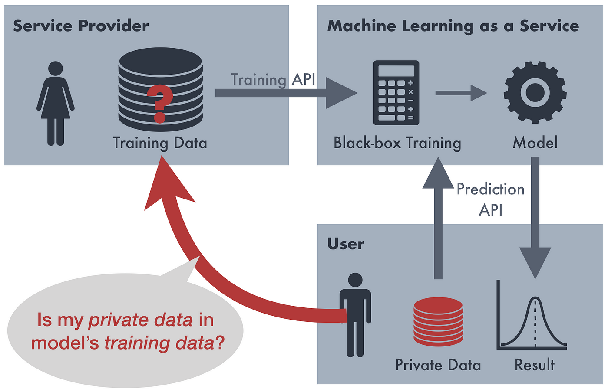

## Table of Contents

## What is an inference attack in the context of machine learning?

An inference attack in machine learning happens when someone tries to learn secret information from a model. This can be a big problem because machine learning models often use a lot of data, and some of that data might be private. For example, if a model is trained on medical records, an attacker might try to figure out if a specific person has a certain disease by asking the model questions in a clever way.

There are different types of inference attacks, but they all have the same goal: to get information the model was not supposed to share. One common type is called a membership inference attack. In this attack, the attacker tries to find out if a certain data point was used to train the model. If the model reacts differently to data it has seen before compared to new data, the attacker can use this difference to guess if the data was part of the training set. Protecting against these attacks is important to keep data private and secure.

## How does an inference attack differ from other types of attacks on machine learning models?

An inference attack is different from other types of attacks on machine learning models because it focuses on extracting private information from the model's outputs rather than directly tampering with the model or its inputs. For example, while an adversarial attack might try to fool a model into misclassifying an image by adding small, carefully crafted changes to the image, an inference attack would try to learn something about the training data by observing how the model responds to various inputs. The goal of an inference attack is to uncover sensitive information that the model was not intended to reveal, such as whether a specific individual's data was used in the training set.

Other types of attacks on [machine learning](/wiki/machine-learning) models include data poisoning, where an attacker corrupts the training data to influence the model's behavior, and model inversion attacks, which aim to reconstruct the training data from the model's outputs. Data poisoning can lead to biased or incorrect predictions, while model inversion attacks seek to reverse-engineer the original data. In contrast, inference attacks do not alter the model or its data but instead exploit the model's responses to infer private details, making them a unique threat to data privacy and security.

## What are the common goals of an inference attack?

The main goal of an inference attack is to learn secret information from a machine learning model. This can be anything from figuring out if someone's data was used to train the model to uncovering private details about the training data itself. For example, if a model was trained on medical records, an attacker might try to find out if a specific person has a certain disease by asking the model questions in a clever way.

Another goal of an inference attack is to exploit the model's responses to learn more about how it was trained. This can help attackers understand the model's weaknesses or biases. By knowing this, they can use the model in ways it was not meant to be used, like guessing what kind of data the model has seen before. This type of attack is a big concern for keeping data private and secure.

## Can you explain the Canvas Method used in inference attacks?

The Canvas Method is a type of inference attack where attackers try to learn about the data used to train a machine learning model. They do this by creating a "canvas" of different inputs and seeing how the model responds to them. For example, if a model was trained to recognize faces, attackers might show the model many different faces and see if it reacts differently to some faces than others. By studying these reactions, attackers can guess if certain faces were part of the training data.

This method can be tricky because it relies on the model behaving differently with data it has seen before compared to new data. If the model is good at hiding its training data, the Canvas Method might not work well. But if the model does show some differences in how it treats familiar and new data, attackers can use this to their advantage. They can keep adjusting their inputs to learn more and more about what the model knows, which can be a big problem for keeping data private.

## What is Spectral DeTuning and how is it applied in inference attacks?

Spectral DeTuning is a method used in inference attacks to learn more about the data that was used to train a machine learning model. It works by looking at how the model behaves when it is given different kinds of data. The idea is to see if the model reacts differently to data it has seen before compared to new data. By studying these reactions, attackers can guess if certain data points were part of the training set. This method is called "Spectral" because it looks at the model's behavior across a range of inputs, and "DeTuning" because it tries to find the points where the model's performance changes or "detunes."

In practice, Spectral DeTuning involves creating a set of inputs that cover a wide range of possible data points. The attacker then feeds these inputs into the model and measures how the model's outputs change. If the model's performance changes in a specific way when it encounters data similar to what it was trained on, this can be a sign that the data was part of the training set. By carefully analyzing these changes, attackers can piece together information about the training data, which can be a big problem for keeping data private and secure.

## What types of data are most vulnerable to inference attacks?

Data that is most vulnerable to inference attacks includes personal and sensitive information like medical records, financial details, and personal identities. For example, if a machine learning model is trained on medical data, an attacker might try to figure out if a specific person has a certain disease by asking the model questions in a clever way. This type of data is at risk because it often contains unique patterns that the model can recognize, making it easier for attackers to guess if someone's information was used in the training set.

Another type of data that is vulnerable is data with clear patterns or categories, like customer behavior data or demographic information. If a model is trained on this kind of data, attackers can use techniques like the Canvas Method or Spectral DeTuning to see how the model reacts to different inputs. By studying these reactions, they can learn about the training data and possibly uncover private details about individuals or groups. Keeping this data private is important to protect people's privacy and prevent misuse.

## How can machine learning models be designed to resist inference attacks?

To make machine learning models more resistant to inference attacks, one approach is to use techniques like differential privacy. This means adding a bit of randomness to the model's training data or its outputs. By doing this, the model's responses become less predictable, making it harder for attackers to guess if certain data was used in training. For example, if a model is trained on medical records, adding some noise can help hide whether a specific person's data was part of the training set. This way, even if attackers use methods like the Canvas Method or Spectral DeTuning, they will have a harder time getting useful information.

Another way to protect models is by using regularization techniques. Regularization helps to make the model's behavior more consistent across different inputs, reducing the chances that an attacker can spot differences in how the model reacts to familiar versus new data. For instance, techniques like L2 regularization can smooth out the model's decision boundaries, making it less likely to overfit to the training data. By ensuring the model generalizes well, it becomes more difficult for attackers to infer private information from the model's outputs. Combining these methods can significantly improve a model's resistance to inference attacks and help keep sensitive data safe.

## What are the ethical implications of conducting or defending against inference attacks?

Conducting inference attacks can raise serious ethical questions. When attackers try to learn private information from a machine learning model, they might uncover sensitive data like someone's medical records or financial details. This can hurt people's privacy and trust in technology. It's not right to use these attacks to get information that should stay private. Companies and researchers need to think carefully about the harm they could cause if they use or study these attacks without strong reasons and safeguards.

On the other hand, defending against inference attacks is important for protecting people's data. By making models more secure, we can help keep personal information safe and build trust in technology. Using methods like differential privacy or regularization can make it harder for attackers to learn private details. But we also need to make sure these defenses don't make the models less useful or fair. It's a balance between keeping data private and making sure the models work well for everyone. Both sides of this issue need to be considered to do the right thing.

## What are some real-world examples where inference attacks have been successfully executed?

One real-world example of an inference attack happened in a study about machine learning models used for healthcare. Researchers showed that they could figure out if someone's medical data was used to train a model. They did this by asking the model questions in a clever way and seeing how it reacted. This showed that even though the model was supposed to keep data private, attackers could still learn sensitive information about people's health.

Another example comes from a case where a machine learning model was used to predict someone's income based on public data. Attackers used a technique called membership inference to find out if a specific person's data was in the training set. By seeing how the model's answers changed with different inputs, they could guess if someone's income information was used to train the model. This example shows how private financial details could be at risk from inference attacks.

## How do regulatory frameworks address the risks posed by inference attacks?

Regulatory frameworks like the General Data Protection Regulation (GDPR) in Europe and the California Consumer Privacy Act (CCPA) in the United States address the risks posed by inference attacks by setting rules to protect people's data. These laws say that companies must keep personal information safe and private. They also give people the right to know what data is collected about them and how it is used. If a company uses machine learning models that could be at risk from inference attacks, they have to take steps to protect the data, like using methods to make the model more secure.

These regulations also push companies to be clear about how they use data in machine learning. They have to tell people if their data is used to train models and what steps are taken to keep it private. If a company does not follow these rules, they can be fined or face other penalties. This helps make sure that companies think about the risks of inference attacks and take action to prevent them, keeping people's private information safe.

## What advanced techniques can be used to enhance the effectiveness of inference attacks?

One advanced technique to make inference attacks more effective is using model inversion attacks. This method tries to reverse-engineer the original training data from the model's outputs. For example, if a model is trained on images of faces, attackers can feed the model random noise and slowly change it until the model thinks it's seeing a real face. By doing this, they can guess what kinds of faces were in the training data. This can be a big problem for keeping personal photos private.

Another technique is called attribute inference attacks. In this type of attack, the goal is to learn specific details about someone from the model's outputs. For example, if a model is trained on customer data, attackers can try to guess things like someone's age or income by seeing how the model reacts to different inputs. By carefully choosing what to ask the model, attackers can piece together a lot of private information about people. This shows why it's important to protect data used in machine learning models.

## What are the current research trends and future directions in defending against inference attacks?

Current research trends in defending against inference attacks focus a lot on improving techniques like differential privacy. This method adds a bit of randomness to the model's training data or its outputs, making it harder for attackers to guess if certain data was used in training. Researchers are working on finding the right balance between adding enough noise to protect privacy and not making the model's predictions too inaccurate. Another trend is developing better regularization methods, like L2 regularization, to make the model's behavior more consistent across different inputs. This helps to prevent attackers from spotting differences in how the model reacts to familiar versus new data.

Future directions in this field are looking at combining different defense strategies to create stronger protections. For example, researchers are exploring how to mix differential privacy with other techniques like adversarial training, where models are trained to be more robust against attacks. There's also a lot of interest in developing new ways to measure how well a model protects against inference attacks, so companies can better understand their risks. As machine learning keeps growing, finding new and better ways to keep data private will be really important to build trust and keep people's information safe.