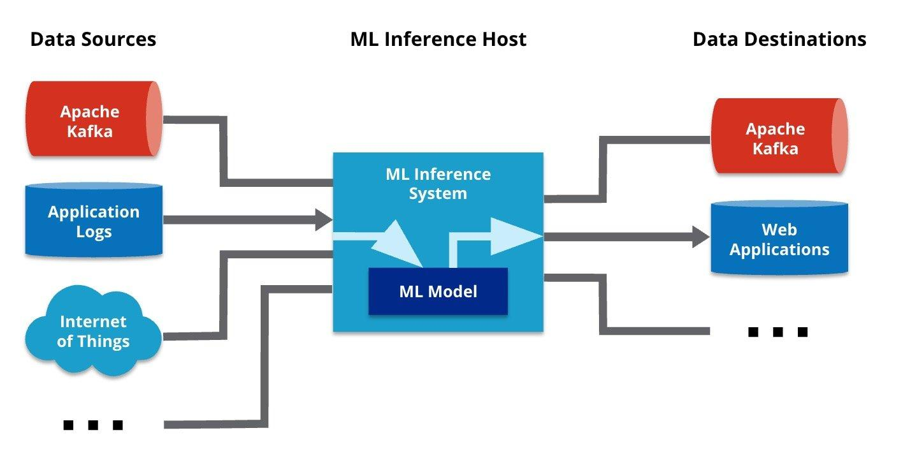

## Table of Contents

## What is an inference engine in the context of machine learning?

An inference engine in machine learning is a part of an AI system that uses rules and data to make decisions or predictions. Think of it as the brain of the system that figures things out based on what it knows. When you train a machine learning model, you give it a lot of examples so it can learn patterns. Once trained, the inference engine uses these learned patterns to make sense of new data it hasn't seen before.

For example, if you have a machine learning model that identifies pictures of cats and dogs, the inference engine is what looks at a new picture and decides if it's a cat or a dog. It does this by applying the rules and patterns it learned during training to the new image. This process is crucial because it's how the model turns raw data into useful information or actions, helping us in tasks like recommending products, diagnosing diseases, or even driving cars autonomously.

## How does an inference engine differ from a training engine?

An inference engine and a training engine are two different parts of a machine learning system. The training engine is like a student that learns from a lot of examples. It looks at data, finds patterns, and adjusts its understanding based on these patterns. This process happens during the training phase, where the model is fed lots of data to learn from. The goal is to make the model good at recognizing or predicting things based on what it has seen.

On the other hand, the inference engine is like a teacher that uses what the student learned to solve new problems. Once the model is trained, the inference engine takes over. It uses the learned patterns to make decisions or predictions about new data it hasn't seen before. For example, if the model was trained to recognize cats and dogs, the inference engine would look at a new picture and decide if it's a cat or a dog based on the patterns learned during training. This makes the inference engine crucial for applying the model in real-world situations.

## What are the key components of an inference engine?

The key components of an inference engine include a knowledge base, an inference mechanism, and a user interface. The knowledge base is like a library of information that the engine uses to make decisions. It contains all the rules and facts that the engine learned during training. For example, if the engine is used to diagnose diseases, the knowledge base would have information about symptoms and their related diseases. The inference mechanism is the part that actually does the thinking. It takes the new information, like a patient's symptoms, and uses the rules from the knowledge base to figure out what the disease might be. It's like solving a puzzle using the pieces from the knowledge base.

The user interface is how people interact with the inference engine. It's the part that lets you input new data and see the results. For example, a doctor might enter a patient's symptoms into the system, and the user interface would show the possible diagnoses. Together, these components make the inference engine work smoothly, turning raw data into useful information or actions.

## What types of models can an inference engine process?

An inference engine can process many different types of [machine learning](/wiki/machine-learning) models. Some common ones include decision trees, which are like flowcharts that help make decisions by answering yes or no questions. Another type is neural networks, which are inspired by how the human brain works and are good at recognizing patterns in data, like images or sounds. There are also models like support vector machines, which are great for classification tasks, where you need to put things into different groups.

Besides these, inference engines can also handle simpler models like linear regression, which predicts a number based on other numbers. For example, it could predict house prices based on size and location. More complex models include ensemble methods like random forests, which combine many decision trees to make better predictions. No matter the type of model, the inference engine uses what the model learned during training to make sense of new data and make predictions or decisions.

## How does an inference engine optimize performance on mobile devices?

An inference engine can optimize performance on mobile devices by using techniques like model compression and quantization. Model compression reduces the size of the machine learning model, making it smaller and faster to run on a mobile device. For example, if a model is too big, it might slow down the phone or use too much memory. By compressing the model, the inference engine can make it work better on a smaller device. Quantization is another technique where the numbers in the model are changed to use fewer bits, which also makes the model smaller and faster.

Another way to optimize performance is through hardware acceleration. Many mobile devices have special chips called neural processing units (NPUs) or graphics processing units (GPUs) that are good at running machine learning models. The inference engine can use these chips to do the calculations faster than if it used the main processor. This means the model can make predictions quickly without using too much power, which is important for mobile devices that need to save battery life.

Lastly, the inference engine can use techniques like pruning, where parts of the model that don't help much are removed. This makes the model simpler and faster. For example, if some parts of the model aren't needed to make good predictions, they can be cut out. By using these methods, the inference engine can make sure the machine learning model works well on a mobile device, giving users quick and accurate results without slowing down their phone.

## What are the common challenges faced when deploying inference engines on mobile platforms?

Deploying inference engines on mobile platforms comes with several challenges. One major issue is the limited computational power and memory of mobile devices. Machine learning models can be very large and complex, requiring a lot of processing power and memory to run smoothly. On a mobile device, this can lead to slow performance or even crashes if the model is too big. To solve this, developers use techniques like model compression and quantization to make the models smaller and faster, but finding the right balance between model size and accuracy can be tricky.

Another challenge is battery life. Running machine learning models can use a lot of power, which can quickly drain a mobile device's battery. This means the inference engine needs to be optimized to use as little power as possible while still giving accurate results. Hardware acceleration, like using neural processing units (NPUs) or graphics processing units (GPUs), can help, but not all mobile devices have these special chips. So, developers need to make sure the inference engine works well on different types of devices.

Lastly, there's the issue of real-time performance. Mobile users expect quick responses from their apps, so the inference engine needs to make predictions or decisions very fast. This can be hard when dealing with complex models or large amounts of data. Techniques like pruning, where unnecessary parts of the model are removed, can help speed things up, but it's a delicate process to keep the model both fast and accurate. All these challenges need to be carefully managed to make sure the inference engine works well on a mobile platform.

## How can quantization improve the efficiency of an inference engine?

Quantization helps make an inference engine more efficient by reducing the size of the machine learning model. It does this by changing the numbers in the model to use fewer bits. For example, instead of using 32-bit numbers, the model might use 8-bit numbers. This makes the model smaller, so it takes up less memory and can run faster on a device. When a model is smaller, it's easier for the device to load it into memory and process it quickly, which is really important for mobile devices that don't have a lot of power.

Using fewer bits also means the model uses less power to run. This is great for mobile devices because it helps save battery life. When the inference engine runs the model, it does calculations with these smaller numbers, which are quicker and use less energy. So, quantization not only makes the model faster but also helps the device last longer on a single charge. This makes the whole system more efficient and better for users who need quick and reliable results from their apps.

## What role does pruning play in optimizing inference engines?

Pruning helps make inference engines work better by getting rid of parts of the machine learning model that aren't very important. Think of it like trimming a tree: you cut off the branches that don't help the tree grow. In a model, these "branches" are parts that don't make a big difference in the model's predictions. By removing them, the model gets smaller and faster, which is great for devices like phones that don't have a lot of power or memory.

When you prune a model, you make it simpler and easier to run. This means the inference engine can make predictions more quickly because it has fewer things to think about. It's also good for saving battery life on mobile devices because a smaller model uses less power. So, pruning helps make the whole system more efficient and gives users faster, more reliable results without slowing down their devices.

## How do you measure the performance of an inference engine?

To measure the performance of an inference engine, you look at how fast and accurate it is. Speed is important because users want quick results, especially on mobile devices. You can measure speed by seeing how long it takes for the engine to make a prediction. This is called latency, and you want it to be as low as possible. Accuracy is also crucial because the engine needs to give correct answers. You can check accuracy by comparing the engine's predictions to the right answers and seeing how often it gets them right. A common way to measure accuracy is by using the accuracy score, which is the number of correct predictions divided by the total number of predictions.

Another way to measure performance is by looking at how much memory and power the inference engine uses. On mobile devices, memory and battery life are important, so you want the engine to use as little of both as possible. You can measure memory usage by checking how much space the model takes up when it's running. Power usage can be measured by seeing how much battery the engine uses over time. By balancing speed, accuracy, memory, and power usage, you can get a good idea of how well the inference engine is performing and make sure it works well for users on different devices.

## What are some popular frameworks used for developing inference engines?

Some popular frameworks for developing inference engines include TensorFlow Lite, PyTorch, and ONNX Runtime. TensorFlow Lite is a lightweight version of TensorFlow that's great for running machine learning models on mobile and embedded devices. It's easy to use and has tools to make models smaller and faster, like quantization. PyTorch is another popular choice, known for its flexibility and ease of use. It has a tool called TorchScript that helps turn PyTorch models into a format that can run on different devices, making it good for inference engines. ONNX Runtime is also widely used because it can work with models from many different frameworks, not just one. It's good at making models run fast and efficiently on different types of hardware.

These frameworks help developers make their inference engines work well on different devices. They have features like model compression and hardware acceleration that make the models smaller and faster. For example, TensorFlow Lite can use quantization to change the numbers in a model to use fewer bits, like from 32-bit to 8-bit. This makes the model smaller and helps save battery life on mobile devices. PyTorch's TorchScript can turn a model into a format that runs quickly on phones or other devices. ONNX Runtime can take models from different frameworks and run them efficiently on many types of hardware, which is great for making sure the inference engine works well no matter what device it's on.

## How can edge computing enhance the capabilities of inference engines?

Edge computing can make inference engines work better by letting them process data right where it's collected, instead of sending it to a faraway server. This means the engine can make decisions faster because it doesn't have to wait for data to travel back and forth. For example, if you have a smart camera that needs to recognize faces, edge computing lets the camera do the work itself. This makes the system quicker and more reliable, especially in places where the internet connection might be slow or not always available.

Using edge computing also helps save bandwidth and protect privacy. When data stays on the device, it doesn't need to be sent over the internet, which means less data usage and less chance of private information being seen by others. This is important for things like health monitors or security systems, where keeping data private is a big deal. By processing data at the edge, inference engines can give faster, more secure results, making them more useful in many different situations.

## What are the future trends and developments expected in inference engine technology?

In the future, inference engines are expected to become even more efficient and powerful. One big trend is the increased use of edge computing, where the engine processes data right on the device instead of sending it to a distant server. This makes the engine faster and more reliable, especially in places with poor internet. Another trend is the development of more advanced quantization and compression techniques. These will make models even smaller and faster, so they can run smoothly on devices like phones and smart cameras. Researchers are also working on new ways to make models more accurate without making them bigger, which will help inference engines give better results.

Another important trend is the rise of specialized hardware like neural processing units (NPUs) and tensor processing units (TPUs). These chips are designed to run machine learning models quickly and efficiently, which will make inference engines work better on all kinds of devices. There's also a growing focus on privacy and security, with more inference engines being designed to process data without sending it over the internet. This is important for things like health apps and smart home devices, where keeping data private is crucial. Overall, these trends will make inference engines faster, more accurate, and more secure, helping them work better in more places and situations.

## References & Further Reading

[1]: Wu, B., & Leng, C. (2016). ["Quantized Convolutional Neural Networks for Mobile Devices."](https://arxiv.org/abs/1512.06473) Proceedings of the IEEE Conference on Computer Vision and Pattern Recognition.

[2]: Han, S., Mao, H., & Dally, W. J. (2016). ["Deep Compression: Compressing Deep Neural Networks with Pruning, Trained Quantization, and Huffman Coding."](https://arxiv.org/abs/1510.00149) arXiv preprint arXiv:1510.00149.

[3]: Lane, N. D., Bhattacharya, S., Mathur, A., Boran, A., & Forlivesi, C. (2016). ["Squeezing Deep Learning into Mobile and Embedded Devices."](https://ieeexplore.ieee.org/document/7994570) IEEE Pervasive Computing.

[4]: Ragan-Kelley, J., Barnes, C., Adams, A., Paris, S., Amano, T., & Durand, F. (2013). ["Halide: a language and compiler for optimizing parallelism, locality, and recomputation in image processing pipelines."](https://dl.acm.org/doi/abs/10.1145/2499370.2462176) ACM SIGPLAN Notices.

[5]: Cheng, Y., Wang, D., Zhou, P., & Zhang, T. (2018). ["Model Compression and Acceleration for Deep Neural Networks: The Principles, Progress, and Challenges."](https://arxiv.org/abs/1710.09282) IEEE Signal Processing Magazine.

[6]: ["Mobile Deep Learning: A Deep Learning SDK of TensorFlow Lite"](https://codezup.com/deploy-deep-learning-models-on-mobile-with-tensorflow-lite-guide/), TensorFlow Lite Documentation.

[7]: He, Y., Zhang, X., & Sun, J. (2017). ["Channel Pruning for Accelerating Very Deep Neural Networks."](https://arxiv.org/abs/1707.06168) Proceedings of the IEEE International Conference on Computer Vision.