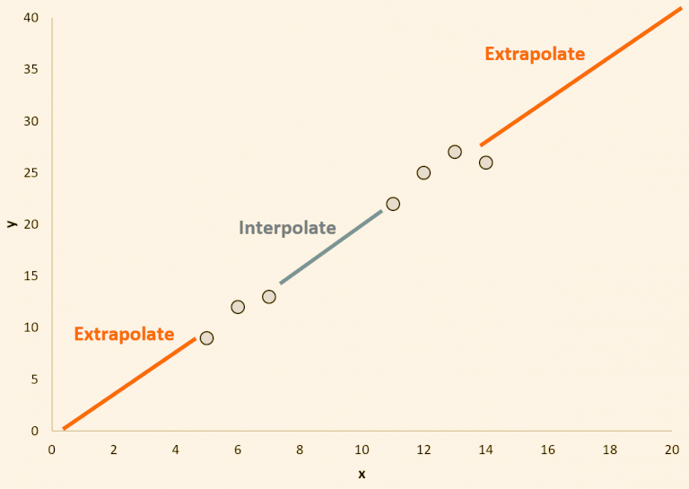

## Table of Contents

## What is inference extrapolation in machine learning?

Inference extrapolation in machine learning is when a model makes predictions or guesses about data it hasn't seen before. Imagine you teach a model to recognize apples and oranges by showing it many pictures of these fruits. If you then show the model a picture of a banana, it might try to guess what it is based on what it knows about apples and oranges. This is extrapolation because the model is going beyond the data it was trained on.

However, extrapolation can be tricky. If the new data is too different from the training data, the model's guesses might not be very accurate. For example, if the model only knows about fruits and you ask it to identify a vegetable, it might not do well. This is because the model is trying to apply what it learned in one situation to a very different situation. So, while extrapolation is useful, it's important to be careful and understand the limits of what the model can do.

## How does inference extrapolation differ from interpolation?

Inference extrapolation and interpolation are two ways a machine learning model can make predictions, but they work differently. Interpolation is when a model makes guesses about data that falls within the range of data it was trained on. For example, if a model was trained on temperatures from 0 to 30 degrees Celsius, it would be interpolating if it predicted the weather at 15 degrees Celsius. Interpolation is usually more accurate because the model is working with familiar data.

On the other hand, extrapolation is when a model makes guesses about data that is outside the range of its training data. Using the same temperature example, if the model tried to predict the weather at 40 degrees Celsius, it would be extrapolating. Extrapolation can be less accurate because the model is working with unfamiliar data, and it's trying to extend its knowledge beyond what it has learned. This can lead to bigger mistakes if the new data is very different from the training data.

## What are the common challenges faced when performing inference extrapolation?

One common challenge when doing inference extrapolation is that the model might not be good at guessing things it hasn't seen before. If a model was trained on data about small cars and you ask it to predict things about big trucks, it might not do well. This is because the model learned from a specific set of data and trying to use that knowledge on very different data can lead to big mistakes. For example, if a model was trained on data where the relationship between two variables was linear, like $$y = 2x + 1$$, and you ask it to predict for values far outside the range it was trained on, it might not work well because the real relationship might not be linear anymore.

Another challenge is that the model might be overconfident in its predictions. Even if the model gives a number or a guess, it might not know how good that guess is. This can be a problem because people might trust the model's predictions too much, thinking they are always right. For instance, if a model was trained on data from a specific region and you use it to predict for a different region, the model might still give a prediction, but it might not be accurate. This can lead to bad decisions if people rely on those predictions without understanding the limits of the model's knowledge.

## Can you explain the concept of patching in the context of inference extrapolation?

Patching in the context of inference extrapolation is like fixing or improving a model's guesses when it's working with new, unfamiliar data. Imagine you trained a model to predict the weather in a city, but now you want it to predict the weather in a different city. The model might not do well because it doesn't know about the new city's weather patterns. Patching helps by adding a bit more information or adjusting the model so it can make better guesses for the new city.

For example, if the model was trained on data where the relationship between temperature and humidity was $$y = 2x + 1$$ and you're trying to predict for a new city where this relationship might be different, patching could involve adding new data points from the new city to help the model understand the new pattern. This way, the model can adjust its predictions to be more accurate for the new situation. Patching is useful because it helps the model extend its knowledge to new areas without having to start all over again with a completely new model.

## How does the ALiBi method assist in inference extrapolation?

The ALiBi method, which stands for Attention with Linear Biases, helps [machine learning](/wiki/machine-learning) models make better guesses about new data they haven't seen before. It does this by adding a special kind of attention to the model. Attention is like the model focusing on different parts of the data. With ALiBi, the model pays more attention to the parts of the data that are closer to what it's trying to predict. This helps the model understand the new data better and make more accurate guesses.

For example, if a model was trained on data where the relationship between two variables was $$y = 2x + 1$$ and you want it to predict for values far outside the range it was trained on, ALiBi can help by making the model focus more on the data points that are closer to the new values. This way, the model can extend its knowledge to new situations without making big mistakes. By using ALiBi, the model can be more confident and accurate when it's working with unfamiliar data.

## What are some practical applications of inference extrapolation in real-world scenarios?

Inference extrapolation is used in weather forecasting to predict temperatures or weather conditions in areas where data is limited. For example, if a model was trained on weather data from cities in the United States, it might be used to predict the weather in a remote part of Canada. The model would look at the data it knows and try to guess what the weather might be like in the new area. This can be helpful for planning events or preparing for extreme weather, but it's important to remember that the predictions might not be as accurate as they would be in the areas where the model was trained.

Another practical application is in financial markets, where inference extrapolation helps predict future stock prices or economic trends. If a model was trained on historical stock data and economic indicators, it can be used to make guesses about what might happen in the future. For instance, if the model sees a pattern in the data where stock prices go up when certain economic indicators rise, it might predict that stock prices will go up in the future if those indicators rise again. However, these predictions can be risky because the future might not follow the same patterns as the past, and the model's guesses might be wrong if the new data is very different from what it was trained on.

In healthcare, inference extrapolation can be used to predict patient outcomes or disease progression. If a model was trained on data from patients with a certain disease, it might be used to predict how a new patient with similar symptoms will respond to treatment. For example, if the model sees that patients with a certain set of symptoms tend to recover quickly with a specific treatment, it might predict that a new patient with those symptoms will also recover quickly. This can help doctors make better decisions about treatment, but it's important to be cautious because each patient is different, and the model's predictions might not always be right if the new patient's data is very different from the training data.

## How can one evaluate the performance of models using inference extrapolation?

To evaluate the performance of models using inference extrapolation, you can use a special set of data that the model hasn't seen before. This data should be different from the data the model was trained on, so you can see how well the model can guess things it doesn't know. One way to do this is by using a test set that includes data points far outside the range of the training data. For example, if a model was trained on temperatures from 0 to 30 degrees Celsius, you could test it on temperatures like -10 or 40 degrees Celsius. You can then compare the model's predictions to the actual values to see how accurate the model is when it's guessing about new, unfamiliar data.

Another way to evaluate the model's performance is by looking at how confident the model is in its predictions. Some models can give you a number that shows how sure they are about their guesses. If a model is very confident in its predictions but those predictions are wrong, it might not be good at extrapolation. You can use metrics like Mean Absolute Error (MAE) or Root Mean Square Error (RMSE) to measure how far off the model's predictions are from the actual values. For example, if the actual temperature was 40 degrees Celsius and the model predicted 30 degrees Celsius, the MAE would be $$|40 - 30| = 10$$ degrees. By looking at these metrics, you can understand how well the model is doing when it's working with data it hasn't seen before.

## What are the limitations of current inference extrapolation techniques?

One big problem with current inference extrapolation techniques is that they can make big mistakes when they guess about data they haven't seen before. If a model was trained on data where the relationship between two variables was $$y = 2x + 1$$ and you ask it to predict for values far outside the range it was trained on, it might not work well because the real relationship might not be linear anymore. This can lead to wrong guesses, and people might trust these guesses too much, thinking they are always right. For example, if a model was trained on data from a specific region and you use it to predict for a different region, the model might still give a prediction, but it might not be accurate.

Another limitation is that models can be overconfident in their predictions. Even if the model gives a number or a guess, it might not know how good that guess is. This can be a problem because people might trust the model's predictions too much, thinking they are always right. For instance, if a model was trained on data where the relationship between temperature and humidity was $$y = 2x + 1$$ and you're trying to predict for a new city where this relationship might be different, the model might still give a prediction with high confidence, but it might not be accurate. This can lead to bad decisions if people rely on those predictions without understanding the limits of the model's knowledge.

## How does the choice of model architecture impact inference extrapolation?

The choice of model architecture can really affect how well a model can guess things it hasn't seen before. Some models, like simple linear models, are good at guessing things within the range of their training data, but they might not do well when they have to guess about data far outside that range. For example, if a model was trained on data where the relationship between two variables was $$y = 2x + 1$$ and you ask it to predict for values far outside the range it was trained on, it might not work well because the real relationship might not be linear anymore. On the other hand, more complex models like neural networks can learn more complicated patterns and might be better at guessing about new data, but they can also be harder to understand and might make big mistakes if the new data is very different from the training data.

Another thing to think about is how the model pays attention to different parts of the data. Some models, like those using the ALiBi method, can focus more on the parts of the data that are closer to what they're trying to predict. This can help the model make better guesses about new data. For example, if a model was trained on data where the relationship between temperature and humidity was $$y = 2x + 1$$ and you're trying to predict for a new city where this relationship might be different, a model using ALiBi might do a better job by focusing more on the data points that are closer to the new values. By choosing the right model architecture, you can help the model make more accurate guesses about new, unfamiliar data.

## Can you discuss any recent advancements in inference extrapolation techniques?

One recent advancement in inference extrapolation is the use of the ALiBi method, which stands for Attention with Linear Biases. This method helps models focus on the parts of the data that are closer to what they're trying to predict. Imagine you trained a model on data where the relationship between temperature and humidity was $$y = 2x + 1$$. If you want to predict for a new city where this relationship might be different, ALiBi can help the model pay more attention to the data points that are closer to the new values. This way, the model can make better guesses about the new data without making big mistakes.

Another advancement is the use of ensemble methods, which combine the predictions of multiple models to make better guesses about new data. If one model was trained on data from a specific region and you want to predict for a different region, an ensemble method could use the predictions from several models trained on different data sets to come up with a more accurate guess. This can help reduce the mistakes that a single model might make when it's trying to guess about unfamiliar data. By using these new techniques, models can be more accurate and reliable when they're working with data they haven't seen before.

## How do you implement ALiBi in a machine learning model for better extrapolation?

To implement ALiBi in a machine learning model for better extrapolation, you need to add a special kind of attention to the model. Attention is like the model focusing on different parts of the data. With ALiBi, you make the model pay more attention to the parts of the data that are closer to what it's trying to predict. For example, if a model was trained on data where the relationship between temperature and humidity was $$y = 2x + 1$$ and you want to predict for a new city where this relationship might be different, ALiBi can help the model focus more on the data points that are closer to the new values. This way, the model can make better guesses about the new data without making big mistakes.

Here's a simple way to add ALiBi to a model using a code block. Imagine you're using a [neural network](/wiki/neural-network) model, and you want to add ALiBi to help with extrapolation. You can modify the attention mechanism in the model to include linear biases that depend on the position of the data points. This can be done by adding a function that calculates these biases and then applies them to the attention scores. By doing this, the model can focus more on the relevant parts of the data and make more accurate predictions about new, unfamiliar data.

```python
import torch
import torch.nn as nn

class ALiBiAttention(nn.Module):
    def __init__(self, heads, max_positions):
        super(ALiBiAttention, self).__init__()
        self.heads = heads
        self.max_positions = max_positions
        self.alibi_bias = self._create_alibi_bias()

    def _create_alibi_bias(self):
        # Create the ALiBi bias matrix
        bias = torch.zeros(self.heads, self.max_positions, self.max_positions)
        for i in range(self.heads):
            for j in range(self.max_positions):
                for k in range(self.max_positions):
                    bias[i, j, k] = - (j - k) * (i + 1)
        return bias

    def forward(self, q, k, v):
        # Calculate attention scores
        attn_scores = torch.matmul(q, k.transpose(-2, -1)) / math.sqrt(q.size(-1))

        # Apply ALiBi bias
        attn_scores = attn_scores + self.alibi_bias[:, :attn_scores.size(1), :attn_scores.size(2)]

        # Compute attention weights
        attn_weights = torch.softmax(attn_scores, dim=-1)

        # Compute output
        output = torch.matmul(attn_weights, v)
        return output
```

By adding this ALiBi attention mechanism to your model, you can help it make better guesses about new data it hasn't seen before. This can be especially useful when you're trying to predict things outside the range of your training data.

## What future research directions could improve the effectiveness of inference extrapolation?

One future research direction to improve the effectiveness of inference extrapolation could be to develop better ways to measure how confident a model is in its predictions. Right now, models can give a number that shows how sure they are about their guesses, but these numbers might not always be right. If we can find a way to make these confidence numbers more accurate, it would help people know when to trust the model's guesses and when to be careful. For example, if a model was trained on data where the relationship between temperature and humidity was $$y = 2x + 1$$ and you want to predict for a new city where this relationship might be different, a better confidence measure could tell you if the model's guess is likely to be right or not.

Another direction could be to create models that can learn from their mistakes when they guess about new data. Right now, if a model makes a wrong guess, it might not learn from that mistake. If we can make models that can update their knowledge based on new data, they could get better at guessing over time. For instance, if a model was trained on data from a specific region and you use it to predict for a different region, the model could learn from the new data and improve its guesses for that region. This could make models more accurate and reliable when they're working with data they haven't seen before.

## References & Further Reading

[1]: Vaswani, A., Shazeer, N., Parmar, N., Uszkoreit, J., Jones, L., Gomez, A. N., ... & Polosukhin, I. (2017). ["Attention is All You Need."](https://arxiv.org/abs/1706.03762) Advances in Neural Information Processing Systems 30.

[2]: Press, O., & Wolf, L. (2016). ["Using the Output Embedding to Improve Language Models."](https://arxiv.org/abs/1608.05859) arXiv preprint arXiv:1608.05859.

[3]: Brown, T. B., Mann, B., Ryder, N., Subbiah, M., Kaplan, J., Dhariwal, P., ... & Amodei, D. (2020). ["Language Models are Few-Shot Learners."](https://arxiv.org/abs/2005.14165) arXiv preprint arXiv:2005.14165.

[4]: Zhou, J., Cui, G., Hu, S., Zhang, Z., Yang, C., Liu, Z., ... & Sun, M. (2020). ["Graph Neural Networks: A Review of Methods and Applications."](https://www.sciencedirect.com/science/article/pii/S2666651021000012) AI Open, 1, 57-81.

[5]: Goodfellow, I., Bengio, Y., & Courville, A. (2016). ["Deep Learning."](https://link.springer.com/article/10.1007/s10710-017-9314-z) MIT Press.