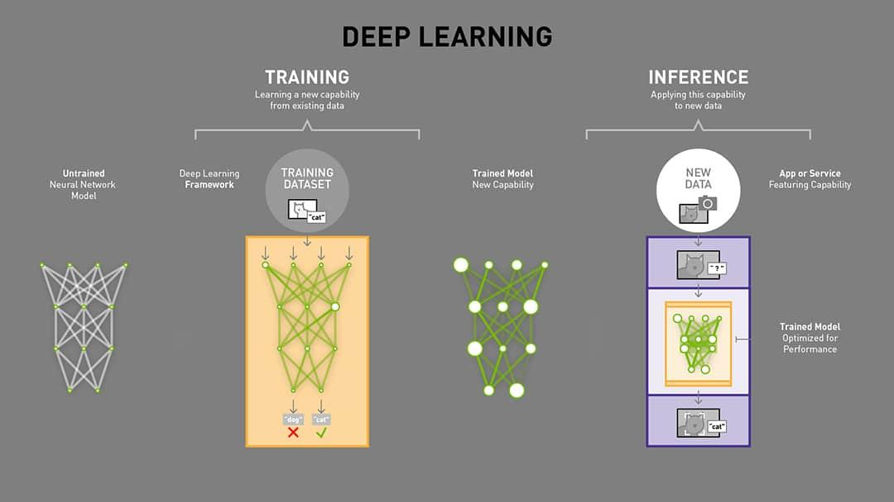

## Table of Contents

## What is inference in the context of machine learning?

Inference in machine learning is the process of using a trained model to make predictions or decisions based on new data. When you train a machine learning model, you're essentially teaching it to recognize patterns in data. Once the model is trained, you can use it to infer outcomes for new, unseen data. For example, if you have a model that predicts house prices based on features like size and location, inference would involve inputting data about a new house and getting an estimated price in return.

The process of inference is crucial because it's the point at which the model's learning is applied in real-world scenarios. It's different from the training phase, where the model learns from a dataset. During inference, the model uses the learned parameters to make predictions. This can be done quickly and efficiently, often in real-time applications like recommendation systems or autonomous driving. The accuracy of these predictions depends on how well the model was trained and how representative the training data was of the real-world data it encounters during inference.

## How does inference differ from training in machine learning models?

In machine learning, training and inference are two key stages but they serve different purposes. Training is like teaching a model. You give it a lot of data, and the model looks for patterns in that data. It adjusts its internal settings, or parameters, to get better at predicting outcomes based on the input it's given. This is a time-consuming process because the model needs to go through the data multiple times to learn well. The goal of training is to make the model as accurate as possible on the data it has seen.

Inference, on the other hand, is when you use the trained model to make predictions on new data. It's like using what the model has learned to answer new questions. When you give the model new information, it uses its learned patterns to make a guess about what the outcome should be. This process is usually much faster than training because the model isn't learning anymore; it's just applying what it knows. The quality of the predictions during inference depends on how well the model was trained and how similar the new data is to the training data.

## What are the common types of inference used in machine learning?

In [machine learning](/wiki/machine-learning), there are mainly two types of inference: batch inference and online inference. Batch inference is when you process a large amount of data all at once. Imagine you have a bunch of pictures and you want to know what's in each one. You could run them all through your model at the same time. This is good for when you don't need answers right away, like when you're analyzing data at the end of the month. 

Online inference, on the other hand, is when you process data one piece at a time, as it comes in. This is useful for things like recommending movies on a website. As soon as you finish watching a movie, the website can suggest a new one right away. Online inference needs to be fast because people expect quick answers. Both types of inference are important, and which one you use depends on what you're trying to do with your model.

## Can you explain the process of making predictions using a trained model?

When you want to make a prediction using a trained model, you start by gathering new data that you want to predict on. This data should be in the same format as the data the model was trained on. For example, if your model predicts house prices based on size and location, you need to give it the size and location of a new house. Once you have the new data ready, you feed it into the model. The model then uses the patterns it learned during training to come up with a prediction. This is like asking the model a question, and it gives you an answer based on what it knows.

The actual prediction process involves the model taking the input data and passing it through its internal structure, which could be a set of equations or a [neural network](/wiki/neural-network). For instance, if you're using a simple linear regression model, the prediction might look like this: $$ \hat{y} = \beta_0 + \beta_1 x_1 + \beta_2 x_2 $$, where $$ \hat{y} $$ is the prediction, $$ \beta_0, \beta_1, \beta_2 $$ are the learned parameters, and $$ x_1, x_2 $$ are the input features. The model uses these parameters to calculate the output. Once the calculation is done, you get your prediction, which you can then use for whatever purpose you need, like deciding whether to buy a house or recommending a movie to a user.

## What are the key challenges faced during inference in machine learning?

One of the main challenges during inference in machine learning is ensuring that the model performs well on new, unseen data. This is tricky because the model was trained on a specific dataset, and the real world can be different. If the new data is too different from the training data, the model's predictions might not be accurate. This is called the problem of generalization. To deal with this, people often try to make sure the training data is as varied and representative as possible, but it's hard to cover all possible scenarios.

Another challenge is making sure that the inference process is fast enough. In many applications, like recommending videos or driving a car, you need the model to give an answer quickly. If the model takes too long to make a prediction, it might not be useful. This is especially important for online inference, where you're processing data as it comes in. To make inference faster, people might use special hardware like GPUs or simplify the model, but this can sometimes make the predictions less accurate.

Lastly, there's the challenge of maintaining the model's performance over time. The world changes, and what was true when the model was trained might not be true anymore. For example, if you're predicting house prices, the market can change a lot in a few years. To keep the model useful, you might need to retrain it with new data or update it in other ways. This process, called model maintenance, can be time-consuming and expensive but is necessary to keep the model's predictions relevant and accurate.

## How does the choice of hardware affect inference performance?

The choice of hardware can make a big difference in how fast and well a model can make predictions during inference. For example, using a GPU (Graphics Processing Unit) instead of a CPU (Central Processing Unit) can speed things up a lot. GPUs are good at doing many calculations at the same time, which is perfect for running machine learning models. This means you can get predictions faster, which is important for things like recommending videos on a website or helping a car drive itself. But, GPUs can be more expensive and use more power, so you have to think about if the speed is worth the cost.

Another thing to consider is the type of memory the hardware has. If your model is big and needs a lot of memory, you'll want hardware with enough RAM (Random Access Memory) to handle it. If the hardware doesn't have enough memory, the model might run slowly or not work at all. Also, some special chips like TPUs (Tensor Processing Units) are made just for machine learning and can make inference even faster and more efficient. But these chips might not be as common or as flexible as CPUs and GPUs, so you have to decide what's best for your specific needs.

## What is the role of model optimization in improving inference speed?

Model optimization is important for making predictions faster during inference. When you optimize a model, you try to make it simpler or more efficient without losing too much accuracy. This can mean changing the model's structure or using special techniques to make calculations quicker. For example, you might use a smaller version of the model that still works well enough for your needs. This is like using a smaller, lighter tool that can still get the job done.

One common way to optimize models is by using techniques like pruning or quantization. Pruning means removing parts of the model that don't contribute much to the predictions. Quantization means using fewer bits to represent the model's numbers, which can make calculations faster. For example, if you have a model that uses a lot of memory and takes a long time to make predictions, you might use these techniques to make it smaller and faster. This helps the model run on less powerful hardware or in real-time applications where speed is important.

## How can quantization and pruning techniques be applied to enhance inference?

Quantization is a technique where you use fewer bits to represent the numbers in your model. Imagine you have a big number like 0.123456789, but you only need to keep 0.123. By doing this, you make the model smaller and the calculations faster. This can be really helpful when you want to run your model on devices with less memory, like a smartphone. For example, if you're using a neural network, you might change the weights from 32-bit floating-point numbers to 8-bit integers. This makes the model lighter and quicker, which is great for real-time applications like voice recognition on your phone.

Pruning is another way to make your model faster and smaller. It's like trimming a tree by cutting off branches that don't help much. In a model, you look for parts that don't contribute a lot to the predictions and remove them. This can make the model simpler and faster. For instance, if you have a neural network with many connections, you might find that some of them don't affect the output much. By removing these, you can speed up the inference process without losing too much accuracy. Both quantization and pruning help you use your model on less powerful hardware or in situations where you need quick results.

## What are the best practices for deploying machine learning models for inference?

When deploying machine learning models for inference, it's important to make sure the model is easy to use and works well in the real world. Start by choosing the right hardware for your needs. If you need fast predictions, a GPU or even a TPU might be a good choice. But if you're working with limited resources, a CPU might be enough. Also, think about how you'll get the data to your model and how you'll use the predictions it makes. You might need to set up a way to send data to the model and get results back, like using an API.

Another key thing is to keep an eye on how well your model is doing after you deploy it. The world changes, and what worked when you trained the model might not work as well later. You can use monitoring tools to check if the model's predictions are still accurate. If they're not, you might need to update the model with new data or even retrain it. It's also a good idea to test the model in a safe environment before you use it for real. This way, you can find and fix any problems without causing trouble for users.

Finally, consider using techniques like quantization and pruning to make your model smaller and faster. Quantization means using fewer bits to represent numbers in the model, which can make it run more quickly on less powerful hardware. Pruning is like trimming away parts of the model that don't help much with predictions. Both of these can help your model work better in the real world, especially on devices like smartphones or in situations where you need quick results.

## How do cloud-based and edge-based inference solutions compare?

Cloud-based inference means using big computers far away to make predictions with your model. You send your data to these computers, and they send back the predictions. This is good because these computers are very powerful and can handle a lot of data at once. But, it can take time to send the data back and forth, and it might cost money to use these computers. Also, if the internet connection is bad, it can be hard to get the predictions quickly.

Edge-based inference is when you use the device you're working on, like a phone or a small computer, to make predictions. This can be faster because you don't need to send data anywhere. It's also good for privacy because the data stays on your device. But, these devices might not be as powerful as the big computers in the cloud, so the model might need to be smaller or simpler. This can sometimes make the predictions less accurate, but it's great for things like smart home devices or self-driving cars where you need quick answers.

Choosing between cloud-based and edge-based inference depends on what you need. If you need speed and privacy, edge-based might be better. If you need a lot of power and don't mind waiting a bit, cloud-based could work well. Sometimes, people use both: they might use the cloud for big tasks and the edge for quick, simple ones. This way, you get the best of both worlds.

## What metrics should be used to evaluate the performance of inference systems?

When you want to see how well your inference system is doing, you should look at a few important things. One key metric is latency, which is how long it takes for the system to give you a prediction after you give it some data. If the latency is too high, it might not be useful for things like recommending videos or helping a car drive itself. Another important metric is throughput, which is how many predictions the system can make in a certain amount of time. If you need to make a lot of predictions quickly, like in a busy online store, you want a high throughput.

Accuracy is also very important. It tells you how often the system's predictions are correct. You can measure accuracy in different ways depending on what you're trying to predict. For example, if you're classifying things, you might use accuracy as the percentage of correct predictions. If you're predicting numbers, you might use mean squared error, which is calculated as $$ \text{MSE} = \frac{1}{n} \sum_{i=1}^{n} (y_i - \hat{y}_i)^2 $$, where $$ y_i $$ is the actual value, $$ \hat{y}_i $$ is the predicted value, and $$ n $$ is the number of predictions. Besides these, you should also think about resource usage, like how much memory or power the system needs. If it uses too much, it might not be practical for devices with limited resources.

Lastly, consider the model's reliability and robustness. Reliability means the system should work well over time without breaking down. Robustness means it should still give good predictions even if the new data is a bit different from what it was trained on. These metrics help you understand if your inference system will work well in the real world, where things can change and you need it to keep performing well.

## What are the future trends and advancements expected in machine learning inference?

In the future, machine learning inference is expected to become faster and more efficient. One big trend is the development of specialized hardware like TPUs (Tensor Processing Units) and other AI chips. These chips are made just for running machine learning models and can make predictions much quicker than regular computers. Another trend is the use of edge computing, where models run on devices like smartphones and smart home gadgets instead of sending data to faraway servers. This can make things faster and more private because the data stays on the device. Also, techniques like quantization and pruning will keep getting better, making models smaller and quicker without losing much accuracy.

Another important trend is the rise of federated learning, where models learn from data on many different devices without actually seeing the data. This helps keep data private but still lets the model get better over time. As models get bigger and more complex, like with large language models, there will be a focus on making inference more energy-efficient. This means finding ways to run big models without using too much power. Finally, there will be more work on making models more robust and reliable, so they can handle new types of data and keep working well even as the world changes. These trends will help machine learning inference become a bigger part of our everyday lives, making things like smart homes and self-driving cars work better and more smoothly.

## References & Further Reading

[1]: LeCun, Y., Bengio, Y., & Hinton, G. (2015). ["Deep Learning."](https://www.nature.com/articles/nature14539) Nature, 521(7553), 436-444.

[2]: Sze, V., Chen, Y., Yang, T.-J., & Emer, J. S. (2017). ["Efficient Processing of Deep Neural Networks: A Tutorial and Survey."](https://ieeexplore.ieee.org/document/8114708) Proceedings of the IEEE, 105(12), 2295-2329.

[3]: Han, S., Mao, H., & Dally, W. J. (2016). ["Deep Compression: Compressing Deep Neural Networks with Pruning, Trained Quantization and Huffman Coding."](https://arxiv.org/abs/1510.00149) International Conference on Learning Representations (ICLR).

[4]: Jouppi, N. P., Young, C., Patil, N., & Patterson, D. (2017). ["In-Datacenter Performance Analysis of a Tensor Processing Unit."](https://ieeexplore.ieee.org/abstract/document/8192463) ACM/IEEE 44th Annual International Symposium on Computer Architecture (ISCA).

[5]: McMahan, H. B., Moore, E., Ramage, D., & Hampson, S. (2017). ["Communication-Efficient Learning of Deep Networks from Decentralized Data."](https://arxiv.org/abs/1602.05629) Proceedings of AISTATS.