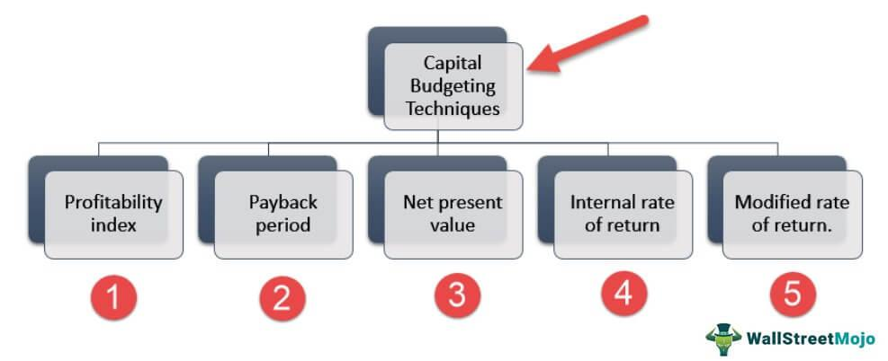

## Table of Contents

## What is Infinium Capital Management?

Infinium Capital Management is a company that helps people invest their money. They work with big investors, like banks and rich people, to manage their money and make it grow. The company uses special computer programs and math to figure out the best ways to invest. They focus on trading things like stocks, bonds, and other financial stuff quickly to make profits.

The company was started in 2002 and is based in Chicago, Illinois. They have a team of smart people who are good at math and computers. Infinium Capital Management is known for using technology to make fast and smart investment choices. They try to stay ahead of the game by always learning and using new tools to help their clients make more money.

## When was Infinium Capital Management founded?

Infinium Capital Management was founded in 2002. It is a company that helps people invest their money. They work with big investors like banks and rich people to manage their money and make it grow.

The company is based in Chicago, Illinois. They use special computer programs and math to figure out the best ways to invest. Infinium Capital Management focuses on trading things like stocks and bonds quickly to make profits.

## Who are the key founders or executives at Infinium Capital Management?

Infinium Capital Management was started by some smart people who are good at math and computers. One of the key founders is George Hanley. He is really important because he helps lead the company and make big decisions. George Hanley is known for being good at figuring out how to invest money in a smart way.

Another important person at Infinium Capital Management is Scott Rafferty. He is one of the top executives and helps run the company every day. Scott Rafferty is good at using technology to make quick and smart investment choices. Together, George Hanley and Scott Rafferty help make sure the company does well and helps their clients make more money.

## What types of investment services does Infinium Capital Management offer?

Infinium Capital Management helps big investors like banks and rich people with their money. They offer services where they manage and invest money to make it grow. They use special computer programs and math to find the best ways to invest. This means they look at lots of information quickly to make smart choices about where to put money.

The company focuses on trading things like stocks and bonds. They do this very quickly to make profits. This is called high-frequency trading. Infinium Capital Management also uses new technology and tools to stay ahead in the investment world. They always try to learn and use the latest methods to help their clients make more money.

## What are the main investment strategies employed by Infinium Capital Management?

Infinium Capital Management uses a strategy called high-frequency trading. This means they buy and sell stocks and bonds very quickly to make small profits many times. They use special computer programs and math to look at lots of information fast. This helps them decide when to buy and sell to make money. They focus on making lots of small trades instead of holding onto investments for a long time.

Another important strategy they use is called quantitative analysis. This means they use math and numbers to figure out the best ways to invest. They look at patterns and data to predict what might happen in the market. By using these numbers, they can make smart choices about where to put money. This helps them stay ahead and make good profits for their clients.

## How does Infinium Capital Management select its investments?

Infinium Capital Management selects its investments by using special computer programs and math. They look at lots of information very quickly to find the best times to buy and sell stocks and bonds. This is called high-frequency trading. They do many small trades to make small profits lots of times. They don't hold onto investments for a long time but instead, they trade them quickly.

They also use something called quantitative analysis. This means they use numbers and patterns to predict what might happen in the market. By looking at this data, they can make smart choices about where to put money. This helps them pick investments that are likely to make money for their clients. They always try to use the latest technology and methods to stay ahead in the investment world.

## What are the performance metrics of Infinium Capital Management's funds?

Infinium Capital Management's funds have done well over time. They look at things like how much money they make compared to how much risk they take. This is called the risk-adjusted return. Their funds often do better than the market average, which means they make more money for their clients than if they just followed the market. They also keep track of how much their funds go up and down, which is called [volatility](/wiki/volatility-trading-strategies). Lower volatility means the fund's value doesn't change a lot, which can be good for people who don't like big swings in their money.

They also measure something called the Sharpe Ratio, which shows how much extra return they get for the risk they take. A higher Sharpe Ratio is better because it means they are getting more return for the same amount of risk. Infinium Capital Management's funds usually have a good Sharpe Ratio, which shows they are doing a good job at managing risk while making money. Overall, their performance metrics show that they are successful at [picking](/wiki/asset-class-picking) good investments and managing money well for their clients.

## How does Infinium Capital Management manage risk in its investment portfolios?

Infinium Capital Management uses smart ways to manage risk in its investment portfolios. They use something called quantitative analysis, which means they use math and numbers to predict what might happen in the market. By looking at lots of data, they can see patterns and make choices that help lower the chance of losing money. They also use something called diversification, which means they spread their investments across different types of stocks and bonds. This way, if one investment does badly, it doesn't hurt the whole portfolio too much.

They also keep a close eye on how much their investments go up and down, which is called volatility. If an investment is too risky, they might sell it or not buy as much of it. They use special computer programs to watch the market all the time and make quick changes to their investments. This helps them stay ahead and manage risk better. Overall, Infinium Capital Management is good at using math, technology, and smart choices to keep their clients' money safe while still trying to make it grow.

## What is the geographical focus of Infinium Capital Management's investments?

Infinium Capital Management mostly focuses on investments in the United States. They use special computer programs and math to find the best times to buy and sell stocks and bonds in the U.S. market. This helps them make quick trades and small profits many times. They look at lots of information to make smart choices about where to put money in the American market.

Sometimes, they might also look at investments in other countries, but their main focus is on the U.S. They use numbers and patterns to predict what might happen in different markets. By doing this, they can pick investments that are likely to make money for their clients, mostly in the United States.

## How does Infinium Capital Management integrate ESG (Environmental, Social, and Governance) factors into its investment decisions?

Infinium Capital Management cares about the environment, how people are treated, and how companies are run. They use these things, called [ESG](/wiki/esg-investing) factors, to help decide where to invest money. They look at how a company treats the planet, like if they pollute or use clean energy. They also check how a company treats its workers and if they do good things for the community. Lastly, they see if the company is run in a fair and honest way.

To use ESG factors, Infinium Capital Management uses special computer programs and math. They look at lots of information to see how well a company does with ESG. If a company does well, it might be a good place to invest. This helps them pick investments that not only make money but also help the world be a better place. By doing this, they try to make sure their clients' money is used in a way that is good for everyone.

## What are some notable successes or case studies from Infinium Capital Management's portfolio?

Infinium Capital Management had a big success with a company called Tesla. They used their special computer programs and math to see that Tesla was doing well with electric cars and clean energy. They decided to invest in Tesla early on, and as Tesla grew, Infinium Capital Management made a lot of money for their clients. This showed how good they are at picking investments that do well in the future.

Another success story is with a company called Apple. Infinium Capital Management saw that Apple was making popular products like the iPhone and was doing well in the market. They used their quick trading strategies to buy and sell Apple stocks at the right times. This helped them make profits for their clients. It shows how they use technology and smart choices to make money from big companies.

## How does Infinium Capital Management adapt its strategies in response to global economic changes?

Infinium Capital Management is really good at changing its ways when the world's economy changes. They use special computer programs and math to look at what's happening in the world. If something big happens, like a country's economy getting better or worse, they can see it quickly. They then use this information to decide if they should buy or sell different investments. This helps them make money for their clients even when the world is changing a lot.

They also keep learning new things and using new technology to stay ahead. For example, if there's a new way to invest that's working well in other places, they might start using it too. They always try to find the best ways to make money, no matter what's happening around the world. By doing this, Infinium Capital Management can keep their clients' money safe and growing, even when the economy is going up and down.

## References & Further Reading

[1]: ["Algorithms for Hyper-Parameter Optimization"](https://dl.acm.org/doi/10.5555/2986459.2986743) by Bergstra, J., Bardenet, R., Bengio, Y., & Kégl, B., Advances in Neural Information Processing Systems 24.

[2]: ["Advances in Financial Machine Learning"](https://www.amazon.com/Advances-Financial-Machine-Learning-Marcos/dp/1119482089) by Marcos Lopez de Prado

[3]: ["Evidence-Based Technical Analysis: Applying the Scientific Method and Statistical Inference to Trading Signals"](https://www.amazon.com/Evidence-Based-Technical-Analysis-Scientific-Statistical/dp/0470008741) by David Aronson

[4]: ["Machine Learning for Algorithmic Trading"](https://github.com/stefan-jansen/machine-learning-for-trading) by Stefan Jansen

[5]: ["Quantitative Trading: How to Build Your Own Algorithmic Trading Business"](https://www.amazon.com/Quantitative-Trading-Build-Algorithmic-Business/dp/1119800064) by Ernest P. Chan