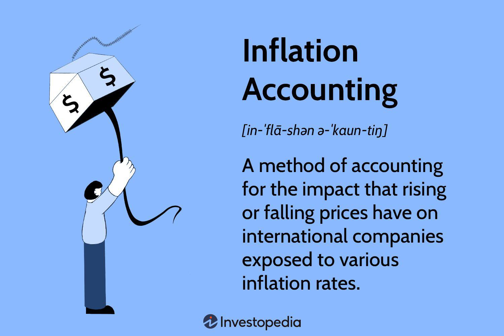

Inflation accounting has gained prominence in financial reporting as businesses navigate a dynamic global economy marked by fluctuating inflation rates. This form of accounting is essential for providing a true and fair view of a company’s financial health in environments prone to significant inflationary pressures. Traditional financial statements, typically based on historical costs, can lose their relevance as they do not accurately reflect the real economic value of transactions over time. This is where inflation accounting becomes vital, as it adjusts financial statements to present more meaningful data to investors, stakeholders, and analysts.

Understanding various accounting methods used to adjust for inflation is fundamental to ensuring the accuracy and reliability of financial statements. These adjustments help businesses and investors make informed decisions by providing a clearer depiction of financial performance and position. Without these adjustments, financial data may misrepresent the actual purchasing power and economic impact of business transactions, leading to potential misjudgments in strategic decision-making.



This article outlines the concept of inflation accounting and underscores its importance in financial reporting. We will explore the different methods employed to ensure financial statements accurately reflect the economic realities faced by businesses. Furthermore, we discuss the broader implications of these methods on modern financial practices, including algorithmic trading. By integrating inflation-adjusted data, algorithmic trading strategies can better respond to economic conditions, thereby improving their effectiveness. Understanding how inflation accounting influences such advanced practices highlights its critical role in adapting financial theories to practical applications in today's fast-paced markets.

## Table of Contents

## What Is Inflation Accounting?

Inflation accounting involves adjusting financial statements to reflect changes in purchasing power due to inflation. It becomes particularly critical in hyperinflationary environments, where traditional financial statements can be significantly misleading. Such adjustments are crucial for businesses operating in economies experiencing significant inflation, as they provide a more accurate representation of the company's financial health.

Traditional financial statements are generally prepared using historical cost accounting, which values assets and liabilities at their original purchase cost. However, during periods of inflation, this approach fails to account for the declining purchasing power of money, leading to distorted financial statements. For instance, if a company purchased an asset for $100 in a year when the inflation rate was high, the asset's value in real terms might be significantly less than $100 in subsequent years. Without adjustments, the financial statements would overstate the asset's value, leading to misleading conclusions about the company’s financial position and performance.

Inflation accounting adjusts these values to reflect the current economic condition. It uses specific indices to update the financials, ensuring that they portray a true picture of an organization's financial status. For instance, an increase in inflation might necessitate adjusting depreciation charges, cost of goods sold, as well as asset valuations, to provide a realistic financial overview. This approach improves the accuracy of financial reporting and helps stakeholders make informed decisions.

The significance of inflation accounting increases in economies with high inflation rates, where not implementing such adjustments can lead to strategic misrepresentation of financial data. Companies operating in such environments need to accurately report their financial conditions to maintain credibility with investors, comply with regulations, and facilitate better economic decision-making. Proper inflation accounting, therefore, plays an essential role in maintaining transparency and reliability in financial reporting, fostering trust among stakeholders in fluctuating economic conditions.

## How Inflation Accounting Works

Inflation accounting adjusts financial statements to reflect the changes in purchasing power caused by inflation. It affects both monetary items, such as cash and receivables, and non-monetary items, like inventory and fixed assets. The distinction between these two categories is crucial, as inflation impacts them differently.

**Monetary Items**: These include assets and liabilities with fixed monetary values, such as cash, bank deposits, and receivables. Inflation reduces the purchasing power of these items, meaning that their real value decreases over time.

**Non-Monetary Items**: These cover assets and liabilities that do not have a fixed monetary value and are often recorded at historical cost, such as inventory, property, plant, and equipment. Inflation can increase the replacement cost of these items, leading to discrepancies between historical and current values.

Accounting standards like International Financial Reporting Standards (IFRS) and Generally Accepted Accounting Principles (GAAP) offer guidelines on when and how to apply inflation accounting. These guidelines ensure that financial statements reflect the true financial position of a company, particularly in inflationary environments.

### Mechanisms of Inflation Accounting

There are primarily two mechanisms employed in inflation accounting:

1. **Restatement of Financial Statements Using a General Price Index (GPI)**:
    - This approach involves adjusting financial statements using a general price index to account for changes in purchasing power. Every line item related to income, expenses, assets, and liabilities is adjusted to reflect current purchasing power.

    Example formula for adjusting a balance sheet item:
$$
    \text{Adjusted Value} = \text{Historical Value} \times \left(\frac{\text{Current GPI}}{\text{GPI at Date of Transaction}}\right)

$$

2. **Use of Current Cost Accounting**:
    - This method focuses on valuing non-monetary items at their current replacement cost rather than historical cost. It seeks to present what it would cost to acquire the same asset at today's prices.

These methods align with guidelines provided by accounting standards. IFRS, specifically IAS 29, prescribes financial reporting in hyperinflationary economies, necessitating the restatement of financial statements. According to IAS 29, a hyperinflationary economy is one where the cumulative inflation rate over three years approaches or exceeds 100%. Under these circumstances, financial statements must be presented in terms of the measuring unit current at the end of the reporting period.

GAAP also provides guidance on addressing inflation effects, though its application is less frequent and more focused on international contexts.

### Implementation Guidelines

- **Assessing Inflation Environment**: Companies must first evaluate whether their operating environment requires inflation accounting. This typically involves assessing the inflation rate and economic indicators.
- **Selection and Application of Method**: Depending on the nature of the company’s assets and liabilities, one of the methods detailed above is chosen and applied consistently.
- **Continuous Monitoring**: Inflation rates and price indices must be monitored persistently, as adjustments may be necessary at different reporting periods to ensure financial statements remain relevant.

Inflation accounting ensures that financial statements provide a more realistic portrayal of a company's financial position by addressing the temporal limitations of static, historical figures. By adhering to specific accounting standards, companies can create more transparent and comparable financial reports in inflationary contexts.

## Inflation Accounting Methods

Inflation accounting primarily utilizes two methods: Current Purchasing Power (CPP) and Current Cost Accounting (CCA). These approaches serve distinct purposes in adjusting financial statements to reflect the impact of inflation, ensuring that financial data maintains relevance and accuracy.

The Current Purchasing Power method adjusts financial statements by tracking changes in a general price index over time. This index reflects the average change in prices for goods and services in an economy, providing a standard measure to recalibrate monetary values on financial statements. Essentially, CPP seeks to maintain the purchasing power of financial figures by restating historical costs based on current inflation rates. For example, if an asset was purchased at a cost of $100,000 and the general price index has increased by 10% since acquisition, the adjusted value in the financial statements would be $110,000. This method ensures that financial reports reflect true economic value in periods of inflation, protecting stakeholder interests by offering a more accurate financial picture.

Current Cost Accounting, on the other hand, emphasizes the present replacement cost of assets rather than their original purchase price. CCA is particularly useful in industries where asset replacement is frequent and costly due to inflation. By focusing on replacement costs, CCA provides a realistic assessment of the resources required to maintain operational capacity. If an asset previously acquired for $50,000 now requires $60,000 for replacement due to inflation, CCA adjusts the financial statements to reflect this present-day cost. This approach offers a forward-looking perspective, allowing companies to better prepare for resource allocation and investment strategies.

Comparing these methods reveals distinct applications. CPP is advantageous in environments where overall price changes affect various financial elements uniformly. It suits businesses with a diversified portfolio of assets and liabilities affected by broad economic trends. CCA, with its focus on replacement costs, is more applicable in industries facing significant asset turnover or where asset replacement cost heavily impacts the operational budget.

Both CPP and CCA provide valuable insights, yet their suitability depends on the nature of the business, industry norms, and specific economic circumstances. Adopting the appropriate inflation accounting method is essential for maintaining accurate, meaningful financial reporting in the face of inflationary pressures.

## Special Considerations in Inflation Accounting

Inflation accounting involves special considerations depending on the accounting framework being applied, such as International Financial Reporting Standards (IFRS) or Generally Accepted Accounting Principles (GAAP). One significant area of difference is the treatment of financial statements in hyperinflationary economies, defined under IFRS as those with cumulative inflation rates exceeding 100% over three years. Argentina is a notable example, where businesses grapple with stringent inflation accounting requirements.

Under IFRS, IAS 29—Financial Reporting in Hyperinflationary Economies—requires companies operating in such environments to adjust their financial statements for inflation. The standard mandates restating non-monetary items, the income statement, and cash flow statement to reflect the purchasing power at the closing balance sheet date. As a result, the restated financial statements are intended to provide a uniform measure of financial performance and position, despite the distorting effects of hyperinflation.

Conversely, GAAP does not have a specific standard for inflation accounting analogous to IAS 29. Instead, U.S. GAAP allows for disclosure of the effects of inflation on the financial statements, generally through supplementary information. The absence of a mandatory, comprehensive standard for accounting in hyperinflationary conditions can lead to discrepancies when comparing U.S.-based companies to those adhering to IFRS, potentially affecting the evaluations by analysts and investors.

For multinational corporations, particularly those with operations in countries like Argentina, adhering to different standards across jurisdictions introduces complexities. These entities must navigate variances in inflation accounting practices, leading to substantial legal and financial implications. For example, a company with subsidiaries in hyperinflationary nations must assess how each local economy's inflation rate impacts their consolidated financial statements.

There are also tax implications to consider, as tax regulations in some jurisdictions may not align with accounting standards. Companies must evaluate how inflation adjustments will affect deferred tax calculations, potentially influencing strategic financial decisions. By understanding these nuances, corporations can better prepare for the challenges of operating across various economic environments, ensuring compliance and accurate financial reporting.

## Advantages and Disadvantages of Inflation Accounting

Inflation accounting offers several advantages, particularly in providing a more accurate representation of a company's financial health. By adjusting financial statements for inflation, these practices enable businesses to reflect the real economic value of their assets and liabilities, thereby offering a clearer picture of their financial condition. This adjustment is crucial for investors, creditors, and other stakeholders who rely on financial statements to make informed decisions. It affords companies operating in high-inflation environments the ability to portray their financial status more accurately, thus enhancing the reliability and comparability of financial data across periods of significant price level changes.

One of the primary benefits of inflation accounting is that it allows for the maintenance of capital in real terms. Traditional accounting methods often record assets at historical cost, which can be misleading in periods of inflation. By adjusting asset values for inflation, companies can ensure that the capital employed reflects its current purchasing power, thereby providing a more meaningful basis for measuring the return on capital.

However, while inflation accounting presents these advantages, it also introduces several challenges and potential drawbacks. The process of constantly restating financial information to account for inflation can add significant complexity to financial reporting. This complexity arises from the need to continuously update asset valuations and recalibrate financial statements, which can be resource-intensive and time-consuming. Furthermore, constant changes to financial data may confuse investors, particularly if they are not familiar with inflation-adjusted figures, potentially leading to misinterpretation of a company's financial results.

Additionally, inflation accounting requires selecting appropriate price indices and valuation methods, which can be subject to judgment and estimates. This subjectivity can introduce variability in financial reporting, depending on the indices and methods chosen by a company. Differences in the application of inflation accounting can lead to inconsistencies across industries and markets, complicating the comparison of financial statements between companies.

Overall, while inflation accounting enhances the accuracy and transparency of financial statements, its implementation necessitates careful consideration of its inherent complexities and potential to cause confusion. Balancing these elements is essential for companies to realize the benefits of inflation-adjusted financial reporting while managing the associated challenges effectively.

## Impact on Financial Reporting

Inflation accounting plays a pivotal role in the distortion correction of financial statements, ensuring they reflect more accurately the economic reality in inflationary environments. The restatement of a company's balance sheet, income statement, and cash flow statement in accordance with inflation accounting principles can significantly alter their structure and the derived financial metrics.

Firstly, the balance sheet is affected as inflation accounting adjusts the asset and liability values to their current cost or purchasing power. For assets, this often means increasing their recorded value to match current market conditions rather than historical acquisition costs. Conversely, liabilities might not always need such adjustments unless they are tied directly to index-linked contracts. This realignment offers a more realistic view of the company's financial health, helping stakeholders understand the actual value of the business’s resources and obligations in contemporary terms.

The income statement also undergoes changes under inflation accounting. Revenues and expenses are adjusted to reflect their current equivalent value. For example, the cost of goods sold (COGS) is often recalibrated to account for modern-day replacement costs rather than historical costs, an essential adjustment in times of rapid inflation. This correction ensures that profit margins are not overstated simply due to the disparity between current selling prices and outdated, lower-cost bases. These adjustments can lead to fluctuations in reported profits, while providing a nuanced understanding of operational effectiveness in inflationary contexts.

The cash flow statement, though less directly impacted by inflation adjustments in terms of actual cash movements, can see indirect effects. For example, if profit figures are affected by inflationary adjustments, this may change the reported cash flow from operating activities. It is vital to adjust the cash flow statement to differentiate between nominal and real values, aiding analysts in distinguishing between inflationary fluctuations and genuine cash performance changes.

These adjustments have significant implications for financial indicators used by investors and analysts. Metrics such as earnings per share (EPS), return on assets (ROA), and debt-to-equity ratios can yield vastly different insights when based on inflation-adjusted financial statements. EPS, for example, may be lower when historical cost depreciation is replaced with higher current cost depreciation, thus affecting investment valuations based on profitability. Similarly, the ROA might appear more favorable if asset base values are adjusted to reflect current replacement costs.

For accurate financial analysis and reporting, understanding these impacts is crucial. Inflation accounting helps overcome the distortions induced by inflation, building a more transparent financial portrait that guides better investment decisions. This transparency bolsters the confidence of stakeholders, from investors to regulators, in the financial records of businesses operating in inflationary settings, thereby facilitating more informed economic decision-making.

## Algorithmic Trading and Inflation Accounting

Algorithmic trading, which involves the use of complex algorithms to manage the buying and selling of financial instruments, depends heavily on accurate and timely financial data. Inflation accounting, by adjusting financial statements for changes in purchasing power, provides more accurate data that can significantly enhance the performance of trading algorithms.

Inflation can distort financial information, influencing critical inputs such as revenue, expenses, and asset valuations. Without adjustments for inflation, these distorted figures can lead to suboptimal trading decisions. For instance, consider a company that reports inflated profit figures due to an unadjusted inflationary environment; trading algorithms that rely on such inaccurate data might overestimate the company's financial health, leading to incorrect investment strategies.

Inflation-adjusted financial statements offer a more true-to-life set of data. They recalibrate key financial indicators, such as earnings per share (EPS) and price-to-earnings (P/E) ratios, by stripping out the artificial effects of rising price levels. For example, Current Purchasing Power (CPP) accounting adjusts reported figures using a general price index, allowing trading algorithms to incorporate more realistic economic conditions into their analyses.

In practice, Python is one of the programming languages commonly used in [algorithmic trading](/wiki/algorithmic-trading). Here's a basic Python example to demonstrate how inflation-adjusted data can be incorporated into trading algorithms:

```python
import numpy as np

def adjust_for_inflation(financial_data, cpi_index):
    # Adjusts financial data based on Consumer Price Index
    adjusted_data = financial_data / cpi_index
    return adjusted_data

# Example financial data and CPI index
financial_data = np.array([5000, 5200, 5400])  # Imaginary financial figures in currency
cpi_index = np.array([1.05, 1.06, 1.07])  # Hypothetical CPI index values

# Adjusting financial data for inflation
adjusted_financial_data = adjust_for_inflation(financial_data, cpi_index)
print(adjusted_financial_data)
```

This script takes raw financial data and adjusts it according to an index like the Consumer Price Index (CPI), providing an inflation-adjusted dataset that can be used to refine trading parameters and strategies.

Algorithmic trading strategies can be significantly improved by integrating inflation-adjusted data, leading to better risk management and more informed decision-making. As a result, traders can develop more robust strategies that account for inflationary pressures, enhancing their ability to predict market movements accurately and respond swiftly to economic shifts.

## Conclusion

Inflation accounting plays a critical role in providing transparency and accuracy in financial reporting. By adjusting financial statements to reflect current economic realities, businesses can present a more accurate depiction of their financial health, which is crucial for stakeholders making informed decisions.

One of the key areas where inflation accounting has a significant impact is in trading practices, particularly algorithmic trading. Algorithmic trading strategies rely heavily on the integrity of financial data. Inflation-adjusted financial statements thus enhance the precision and effectiveness of these trading algorithms, allowing for more accurate modeling and strategy formation. Accurate data input ensures algorithmic models are more reflective of market conditions, improving decision-making processes in trading systems.

Adopting appropriate inflation accounting methods is essential for companies aiming to maintain reliability in their financial data. By using standardized methods such as Current Purchasing Power (CPP) and Current Cost Accounting (CCA), firms can ensure their financial statements are relevant, even in conditions of significant inflation. These methods help in capturing the effects of inflation, maintaining the relevancy of asset valuations and profit calculations. Consequently, companies that employ these inflation accounting methods are better equipped to offer stakeholders a transparent and fair view of financial performance, fostering confidence and trust in their financial disclosures.

## References & Further Reading

[1]: ["International Accounting Standard 29 - Financial Reporting in Hyperinflationary Economies"](https://www.ifrs.org/content/dam/ifrs/publications/pdf-standards/english/2021/issued/part-a/ias-29-financial-reporting-in-hyperinflationary-economies.pdf) by the IFRS Foundation.

[2]: ["Wiley Guide to Fair Value Under IFRS"](https://onlinelibrary.wiley.com/doi/book/10.1002/9781119204008) by James P. Catty.

[3]: ["Accounting for Inflation"](https://www.investopedia.com/terms/i/inflation-accounting.asp) by Hayden Williams.

[4]: ["Advanced Financial Accounting"](https://www.mheducation.com/highered/product/Advanced-Financial-Accounting-Christensen.html) by Richard Lewis and David Pendrill.

[5]: ["The Intelligent Investor: The Definitive Book on Value Investing"](https://www.amazon.com/Intelligent-Investor-3rd-Ed/dp/0063356724) by Benjamin Graham.