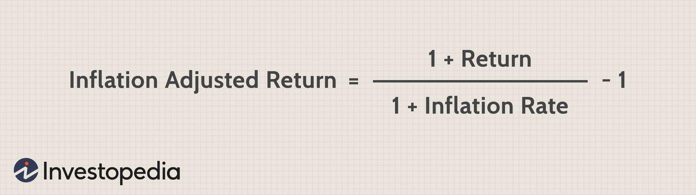

In the complex world of investing, understanding the impact of inflation on returns is crucial. Inflation, defined as the rate at which the general level of prices for goods and services rises, erodes the purchasing power of money over time. As a result, the nominal returns on an investment, which are the gross earnings without any adjustments, can give a skewed picture of the actual financial gain. Without considering inflation, these returns can be misleading, making investments appear more profitable than they truly are in terms of purchasing power. 

This article examines the concept of inflation-adjusted returns, which are essential for assessing true investment performance. By factoring in the erosion of purchasing power due to inflation, investors can gain a clearer understanding of how much real value their investments have gained over time. For instance, in an environment with a 3% inflation rate, a nominal return of 10% effectively translates into a real return of approximately 6.8%. This adjustment is crucial for investors wanting to make informed decisions about the health and trajectory of their portfolios.



Moreover, the article will explore algorithmic trading strategies that can optimize investment outcomes across varying economic climates. Algorithmic trading involves using computer algorithms to manage trading orders efficiently. These systems can be designed to consider inflation rates, enhancing the ability of their users to maintain or even improve returns during inflationary periods. Such strategies are increasingly essential in today's fast-paced and ever-changing financial markets.

Understanding the interplay between inflation and investment returns is vital for both seasoned investors and novices alike. With a firm grasp on these concepts, individuals can better navigate the challenges of long-term financial planning, ensuring that their portfolios are not only yielding profits but also increasing in real value over time.

## Table of Contents

## Understanding Inflation-Adjusted Returns

Inflation-adjusted returns, or real returns, refer to the performance of an investment after accounting for the eroding effects of inflation. Inflation can significantly impact the purchasing power of investment gains, making it essential to focus on this adjusted metric rather than nominal returns alone. Nominal returns merely reflect the gross earnings from an investment without considering how rising prices can diminish their real value. Consequently, investors who rely solely on nominal returns may overestimate the actual growth and performance of their portfolios.

Real returns provide a more accurate picture of the true growth in purchasing power over time. For instance, suppose an investor receives a nominal return of 10% on an investment within a year. If the inflation rate during that period is 3%, the real return is not a straightforward subtraction. Instead, the correct calculation involves adjusting the nominal return with the formula:

$$
\text{Real Return} = \left(\frac{1 + \text{Nominal Return}}{1 + \text{Inflation Rate}}\right) - 1
$$

Plugging the numbers into the formula:

$$
\text{Real Return} = \left(\frac{1 + 0.10}{1 + 0.03}\right) - 1 \approx 0.068
$$

This results in an approximate real return of 6.8%. This example highlights the importance of adjusting for inflation to gain a true understanding of investment performance. By focusing on real returns, investors can better align their financial strategies with their long-term goals, ensuring that their investments genuinely grow their purchasing power rather than merely keeping pace with inflation.

## Calculating Inflation-Adjusted Returns

Calculating real returns involves adjusting nominal returns to account for inflation, thereby reflecting the true increase in purchasing power. The formula to calculate inflation-adjusted, or real, returns is:

$$
\text{Real Return} = \left( \frac{1 + \text{Nominal Return}}{1 + \text{Inflation Rate}} \right) - 1
$$

This approach offers a clearer perspective on actual investment gains by considering the erosion of capital's value due to inflation. For instance, if an investment yields a nominal return of 10% in an economic environment where the inflation rate is 3%, the real return is approximately 6.8%. This is computed as follows: 

$$
\text{Real Return} = \left( \frac{1 + 0.10}{1 + 0.03} \right) - 1 \approx 0.068 \text{ or } 6.8\%
$$

Accurately adjusting nominal returns for inflation is indispensable for informed financial planning and decision-making. By understanding the distinction between nominal and real returns, investors can better evaluate the effectiveness of their portfolios and make strategic adjustments that align with their long-term financial goals. Employing inflation-adjusted metrics ensures that investments not only grow in nominal terms but also preserve and enhance real value over time.

## Nominal vs. Inflation-Adjusted Returns

Nominal returns represent the gross earnings on an investment without considering the impact of inflation. While these returns provide an initial measure of the growth of an investment, they can be misleading if analyzed in isolation. Inflation erodes the purchasing power of money, meaning that a nominal gain may not translate into increased real wealth. For investors, understanding the difference between nominal and inflation-adjusted (or real) returns is essential for aligning investment strategies with financial goals and maintaining the purchasing power of their assets.

Inflation-adjusted returns give a more precise picture by accounting for the loss of purchasing power caused by inflation. The real return reflects the actual growth in value, enabling investors to assess how much their investments are truly increasing their capacity to purchase goods and services. To calculate the inflation-adjusted return, investors typically use the formula:

$$
\text{Real Return} = \left(\frac{1 + \text{Nominal Return}}{1 + \text{Inflation Rate}}\right) - 1
$$

This calculation provides a perspective on investment performance that takes inflation into account, revealing whether an investment genuinely enhances financial stability or merely keeps pace with inflation.

Knowing the difference between nominal and real returns is crucial for making informed investment decisions. Nominal returns may appear impressive at first glance, but if inflation rates are high, the real growth could be minimal or even negative. For instance, in a scenario where an investment yields a nominal return of 10% but the inflation rate is 3%, the real return would be approximately 6.8%. Ignoring the effects of inflation may lead investors to overstate their portfolio’s real growth and make decisions that do not align with their financial aspirations.

Recognizing the impact of inflation-adjusted returns helps investors develop strategies that reflect the true value growth of their investments and align these strategies with long-term financial targets. This understanding is pivotal for preserving and enhancing wealth in an inflationary environment.

## Algorithmic Trading and Investment Returns

Algorithmic trading employs sophisticated algorithms and computational power to enhance investment returns efficiently. These algorithms can analyze large datasets to identify trading opportunities that humans may overlook, executing trades at speeds and frequencies beyond human capability. By automating trading decisions, [algorithmic trading](/wiki/algorithmic-trading) systems can react quickly to market changes and potentially exploit short-term fluctuations for profit.

A significant advantage of algorithmic trading lies in its ability to incorporate economic indicators, such as inflation rates, into trading strategies. Algorithms can be programmed to adjust trading parameters based on anticipated changes in inflation. For example, if inflation is expected to rise, an algorithm might shift investments from fixed-income securities, which are typically more sensitive to inflation, to equities or commodities, which might offer better protection against inflationary pressures.

Python, a popular programming language in quantitative finance, offers libraries such as Pandas and NumPy for data manipulation, and SciPy for statistical analysis, which can be utilized to create and backtest algorithmic trading strategies. Here's a basic example of how one might incorporate inflation data into a trading decision using Python:

```python
import pandas as pd

# Assume inflation_data and market_data are pre-loaded DataFrames
inflation_threshold = 0.02  # Example threshold for inflation impact

# Function to adjust portfolio based on inflation
def adjust_for_inflation(inflation_data, market_data):
    # Select rows where inflation is above a certain threshold
    high_inflation_periods = inflation_data[inflation_data['Rate'] > inflation_threshold]

    # Filter market data for these periods
    adjusted_market_data = market_data[market_data.index.isin(high_inflation_periods.index)]

    # Perform trading logic, e.g., reducing bond holdings, increasing commodities
    # This is a placeholder for your trading algorithm logic
    trading_decisions = create_trading_signals(adjusted_market_data)
    return trading_decisions

# Example placeholder function to demonstrate the structure
def create_trading_signals(data):
    # Implement trading signal logic here
    return "Adjust Portfolio based on market conditions"

trading_signals = adjust_for_inflation(inflation_data, market_data)
print(trading_signals)
```

Additionally, algorithmic systems that integrate [machine learning](/wiki/machine-learning) models can dynamically learn and adapt to inflation patterns, ensuring that trading strategies remain robust even amidst rapidly changing economic conditions. Such adaptability is crucial during inflationary periods, helping investors maintain or even enhance their returns despite the challenging economic environment.

By effectively accounting for inflation, algorithmic trading can significantly improve the accuracy of investment strategies, protecting real returns for investors over time. This meets the strategic objective of sustaining and growing wealth by optimizing the tradable assets and their respective exposures to economic variables.

## Impact of Inflation on Different Asset Classes

Inflation has disparate effects on various asset classes, significantly influencing their real returns and attractiveness to investors. Fixed-income assets, such as bonds, are particularly vulnerable in inflationary environments. The fixed interest payments associated with these assets can diminish in purchasing power as inflation rises, leading to potentially negative real returns. For instance, a bond yielding 5% nominal interest in a 3% inflation rate scenario yields only a 1.9% real return, calculated using the formula:

$$
\text{Real Return} = \left(\frac{1 + \text{Nominal Return}}{1 + \text{Inflation Rate}}\right) - 1
$$

In contrast, equities often provide a more resilient option against inflation. Companies can adjust their pricing strategies in response to rising costs, helping to maintain or potentially enhance profit margins. This ability to pass on costs to consumers can protect or even boost real earnings, making stocks a generally more inflation-tolerant investment than fixed-income securities.

Real assets, such as real estate and commodities, are traditionally regarded as robust hedges against inflation. Real estate often benefits from rising property values and rental income in inflationary periods, as these factors are typically indexed to inflation. Commodities, including precious metals like gold, frequently appreciate in value during inflationary times, as they are tangible assets whose scarcity and intrinsic value tend to increase with inflationary pressures.

Moreover, commodities can act as a direct hedge against inflationary pressures on currency values, as they are not subject to devaluation inherent in fiat currencies. These characteristics make real assets attractive to investors seeking to protect their portfolios from the erosive effects of inflation.

## Strategies to Mitigate Inflation Risk

Investors can mitigate the risks posed by inflation by adopting various strategies focused on diversification and the inclusion of inflation-resistant assets within their portfolios. A well-diversified portfolio not only withstands the erosive effects of inflation but also takes advantage of assets that perform well in inflationary periods.

One effective tool for this purpose is Treasury Inflation-Protected Securities (TIPS). These are U.S. government bonds designed to increase in value with inflation, providing a reliable way to preserve capital. TIPS adjust their principal value according to changes in the Consumer Price Index (CPI), ensuring that both the principal repayment at maturity and interest payments are inflation-proof. 

Additionally, equities in robust sectors like consumer goods, healthcare, and technology often provide a buffer against inflation. Companies in these sectors can adjust their pricing structures more easily, passing cost increases onto consumers. This adaptability can lead to higher revenue and maintain profit margins despite inflationary pressures.

Commodity-related assets, such as gold, oil, and agricultural products, serve as another hedge against inflation. These assets tend to appreciate when inflation increases, as their prices often move in anticipation of or response to inflationary changes. Integrating commodities into a portfolio can thereby help stabilize returns in inflationary environments.

International diversification is another strategy that can offset domestic inflation risks. By investing in foreign markets, particularly those with lower inflation rates, investors can reduce the impact of any single country's inflation on their total portfolio. Global exchange-traded funds (ETFs) or mutual funds provide accessible vehicles for achieving this diversification, spreading investment risk across various currencies and economic conditions.

Overall, an astute combination of these strategies can significantly mitigate the adverse effects of inflation, allowing investors to preserve and potentially enhance their real wealth over time.

## Conclusion

Inflation-adjusted returns, often referred to as real returns, play a crucial role in accurately assessing investment performance. By accounting for inflation, investors can determine the true growth in their purchasing power. This understanding is essential for making informed investment decisions, as it provides a clearer picture of actual financial gains.

Incorporating inflation-adjusted metrics into investment strategies ensures that investors align their portfolios with realistic financial goals. By recognizing the impact of inflation, investors can adjust their strategies to maintain, or even enhance, the real value of their investments over time.

Algorithmic trading offers a strategic advantage in this context. By integrating inflation data into trading algorithms, these systems can dynamically adjust trading decisions to account for inflationary pressures. This adaptability allows investors to refine their approaches and potentially secure higher returns, despite fluctuating economic conditions.

Ultimately, adapting investment strategies to consider inflation is not merely about preserving capital; it's about actively growing real wealth. By proactively managing inflation risks and leveraging tools such as algorithmic trading, investors position themselves to thrive in various economic climates. This approach sustains wealth accumulation and helps in achieving long-term financial objectives.

## References & Further Reading

[1]: ["Advances in Financial Machine Learning"](https://www.amazon.com/Advances-Financial-Machine-Learning-Marcos/dp/1119482089) by Marcos Lopez de Prado

[2]: ["Evidence-Based Technical Analysis: Applying the Scientific Method and Statistical Inference to Trading Signals"](https://www.amazon.com/Evidence-Based-Technical-Analysis-Scientific-Statistical/dp/0470008741) by David Aronson

[3]: ["Machine Learning for Algorithmic Trading"](https://github.com/stefan-jansen/machine-learning-for-trading) by Stefan Jansen

[4]: ["Quantitative Trading: How to Build Your Own Algorithmic Trading Business"](https://www.amazon.com/Quantitative-Trading-Build-Algorithmic-Business/dp/1119800064) by Ernest P. Chan

[5]: ["The Intelligent Investor: The Definitive Book on Value Investing"](https://www.amazon.com/Intelligent-Investor-Third-Definitive-Investing/dp/0063423537) by Benjamin Graham

[6]: ["A Random Walk Down Wall Street: The Time-Tested Strategy for Successful Investing"](https://www.amazon.com/Random-Walk-Down-Wall-Street/dp/0393358380) by Burton G. Malkiel

[7]: ["Algorithmic and High-Frequency Trading"](https://www.cambridge.org/us/universitypress/subjects/mathematics/mathematical-finance/algorithmic-and-high-frequency-trading) by Álvaro Cartea, Sebastian Jaimungal, and José Penalva

[8]: ["Inflation Targeting: Lessons from the International Experience"](https://www.jstor.org/stable/j.ctv301gdr) by Ben S. Bernanke, Thomas Laubach, Frederic S. Mishkin, and Adam S. Posen