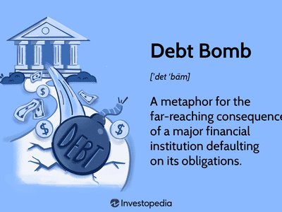

In the modern economic landscape, inflation and national debt are critical topics influencing fiscal policies and global markets. Inflation, the rate at which general price levels increase, erodes the purchasing power of money and has significant implications for both consumers and economies. National debt, the total amount borrowed by a government, affects fiscal stability and influences long-term economic growth. Together, these factors are pivotal in shaping monetary policy and economic strategies.

Algorithmic trading, a cutting-edge technology in financial markets, plays an increasingly important role in navigating these complexities. By utilizing advanced mathematical models and high-speed computing, algorithmic trading systems can analyze market trends and execute trades with speed and precision. This capability is particularly valuable in environments characterized by rapid inflationary changes and fluctuating debt levels.



This article explores the interconnected realms of inflation, debt destruction, economic impact, and algorithmic trading. Inflation can reduce the real value of debt, a phenomenon known as debt destruction, which affects both borrowers and lenders. Understanding these dynamics is crucial for policymakers, traders, and investors as they strive to mitigate risks and maximize opportunities in volatile markets.

We will examine how these factors influence each other and the broader economic implications, underscoring the need for integrated strategies that encompass both traditional and modern approaches to economic management. By providing insights and strategic recommendations, this discussion aims to equip stakeholders with the knowledge necessary to navigate the challenges and opportunities of contemporary financial landscapes.

## Table of Contents

## The Relationship Between Inflation and Debt Destruction

Inflation significantly influences the real value of debt, impacting both borrowers and lenders. When inflation occurs, the purchasing power of money declines. Consequently, if a borrower has a fixed-rate loan, the real value of what they repay decreases as inflation rises. This scenario is often beneficial for borrowers, as they effectively repay their debt with money that is worth less than when they initially borrowed it.

Debt destruction is the process wherein inflation reduces the real value of a principal debt amount. For instance, consider a situation where the nominal [interest rate](/wiki/interest-rate-trading-strategies) is fixed, and inflation increases. The real interest rate, which can be calculated as the nominal interest rate minus the inflation rate, effectively decreases. Mathematically, this is expressed as:

$$
r = i - \pi
$$

where $r$ is the real interest rate, $i$ is the nominal interest rate, and $\pi$ represents the inflation rate. As $\pi$ increases, $r$ decreases, reducing the debt burden in real terms—a mechanism of debt destruction.

This phenomenon poses challenges for lenders, whose returns diminish as the real value of the repayments falls. From a lender's perspective, the contracted repayment, although nominally the same, buys less in terms of goods and services over time, leading to potential losses in purchasing power and real income.

Historically, periods of high inflation have demonstrated these effects on debt. For example, the hyperinflation experienced in the Weimar Republic in the 1920s substantially eroded the real value of existing debts, allowing borrowers to repay loans with money that was practically worthless in comparison to its value at the time of borrowing. More recently, developed economies with significant national debts have been affected by moderate inflation rates, which have subtly decreased real debt burdens over time, facilitating easier debt management.

Understanding these dynamics provides critical insights into contemporary economic conditions. Inflation can be used strategically to manage debt levels but also requires careful consideration to avoid excessive erosion of lender assets or destabilization of the monetary system. Adjusting fiscal strategies and contracts in anticipation of potential inflationary periods is essential for balancing the interests of both borrowers and lenders and maintaining economic stability.

## Economic Impact of Inflation and Debt

Inflation and national debt are closely interlinked, with their relationship influencing economic growth and fiscal stability. When a country accumulates a high level of national debt, it can pressure inflation rates through several mechanisms. One key [factor](/wiki/factor-investing) is the impact of inflation on government debt servicing costs, which plays a critical role in economic management.

Inflation erodes the real value of money, and when a country's inflation rate rises, it diminishes the real value of its debt. This can be somewhat beneficial for the debtor—the government—since the nominal amount of debt remains constant while the real burden decreases. However, the cost of servicing this debt, primarily through interest payments, can become more expensive if inflation leads to higher interest rates.

Lenders, aware of the depreciating value of currency, may demand higher interest rates to compensate for anticipated inflation. This increase in interest rates raises the government's debt servicing costs, potentially leading to larger budget deficits or necessitating austerity measures. Additionally, higher interest rates can stifle economic growth by increasing borrowing costs for businesses and consumers, effectively reducing investment and spending.

The cyclical nature of debt and inflation also has significant implications. For instance, governments may resort to printing more money to manage growing debt obligations, which can further accelerate inflation. This situation can lead to a vicious cycle known as an "inflationary spiral," where rising inflation leads to higher debt servicing costs, prompting more borrowing or currency devaluation.

Understanding these dynamics is crucial for managing economic policies effectively. Policymakers need to balance debt accumulation with strategies to control inflation. Measures such as prudent fiscal policies, monitoring monetary supply, and maintaining investor confidence are critical in ensuring that inflation and debt levels remain sustainable.

Moreover, the interplay between inflation and national debt can affect a country's fiscal stability. Persistent high inflation can undermine economic stability, reducing the government's ability to finance public spending or invest in growth initiatives. On the other hand, controlling inflation can stabilize prices, fostering an environment conducive to sustainable economic growth.

In summary, the economic impact of inflation and debt is profound, influencing government policy, fiscal stability, and overall economic health. Effective management requires a delicate balance between fostering growth and maintaining financial stability, necessitating a comprehensive understanding of debt-inflation dynamics.

## Algorithmic Trading's Role in Economic Dynamics

Algorithmic trading is a method of executing large orders using automated and pre-programmed trading instructions accounting for variables such as timing, price, and [volume](/wiki/volume-trading-strategy). By utilizing complex algorithms and high-speed data processing, [algorithmic trading](/wiki/algorithmic-trading) systems have transformed the financial markets, providing traders with the ability to execute orders at speeds and frequencies that would be impossible for a human trader.

One of the key attributes of algorithmic trading is its ability to respond to market conditions with remarkable speed and precision. During periods of inflation, market [volatility](/wiki/volatility-trading-strategies) often increases as investors react to shifting economic indicators such as interest rates, consumer price indexes, and central bank policies. Algorithmic trading systems can efficiently navigate this volatility by adjusting strategies in real-time based on market signals. For instance, algorithms can detect inflationary trends through data analysis and rapidly execute trades that hedge against potential losses or exploit market opportunities.

Inflation can influence market [liquidity](/wiki/liquidity-risk-premium) and price volatility, factors critically observed by algorithmic trading strategies. When inflation is anticipated, traders might expect central banks to adjust interest rates, leading to rapid changes in bond and equity markets. Algorithms designed to forecast and react to such monetary policy shifts can offer significant advantages to traders. They can quickly reposition portfolios, ensuring alignment with expected market directions and maintaining favorable risk-reward ratios.

However, algorithmic trading also carries risks, especially in inflationary periods. Algorithms operate based on historical data and predictive models, which may not fully capture unprecedented inflationary pressures or sudden economic shifts. During extreme market conditions, such as those seen in hyperinflation scenarios, algorithms might struggle to interpret the data accurately, leading to unanticipated losses or increased market impact costs.

Moreover, the highly automated nature of algorithmic trading can lead to systemic risks. For example, erroneous algorithms or outliers in the data can trigger cascading sell-offs or amplification of inflation-driven market trends, contributing to market instability. Regulators often emphasize the need for robust risk management and monitoring systems to mitigate these potential disruptions.

Benefits of algorithmic trading during inflationary periods include enhanced market efficiency and liquidity, as algorithms are designed to execute large volumes of trades with minimal impact on market prices. This can help stabilize markets during inflation-driven volatility, as automated systems provide continuous liquidity and facilitate price discovery. Additionally, strategies such as statistical [arbitrage](/wiki/arbitrage), where algorithms identify price discrepancies across various markets and execute trades to profit from these discrepancies, can be particularly effective in volatile, inflation-influenced environments.

In addition to the benefits, the risks must be managed with care. Traders implementing algorithmic strategies during inflationary times must ensure that their algorithms are adaptive, incorporating real-time data and anomaly detection systems to adjust to unpredictable market shifts. Regulatory frameworks play a critical role in overseeing algorithmic trading systems, requiring stringent testing and validation to prevent market manipulation or accidental disruptions.

To summarize, algorithmic trading has the potential to significantly impact economic dynamics, especially during inflationary periods. Its speed and accuracy can be a double-edged sword, offering both significant advantages and substantial risks. Successfully leveraging algorithmic trading in such environments necessitates careful strategy formulation, robust risk management, and responsive adaptation to the changing economic landscapes.

## Case Studies and Real-World Applications

Algorithmic trading has emerged as a significant tool in navigating markets during inflationary periods, providing traders with the ability to effectively capitalize on volatility and shifting market conditions. Several case studies demonstrate how algorithmic trading systems have been implemented successfully in such scenarios, offering invaluable insights for future applications.

One notable example is the period following the 2008 financial crisis, where algorithmic trading strategies were adjusted to manage heightened market instability caused by inflationary pressures. High-frequency trading ([HFT](/wiki/high-frequency-trading-strategies)) algorithms exploited short-term price inefficiencies, optimizing buy and sell decisions faster than human capabilities. These algorithms relied on [statistical arbitrage](/wiki/statistical-arbitrage), leveraging historical price relationships to predict future price movements. For instance, pairs trading became a popular strategy where an algorithm would simultaneously buy and sell two correlated securities, betting on the convergence of their prices.

During the inflationary phase in the early 1980s, some institutional traders adopted trend-following algorithms to benefit from sustained directional price movements. These algorithms used moving averages to identify and follow prevailing trends, adjusting trading positions accordingly. The moving average crossover, a specific strategy, involves comparing short-term and long-term moving averages to signal buying or selling actions. The formula for a simple moving average (SMA) is:

$$
\text{SMA}_n = \frac{1}{n} \sum_{i=0}^{n-1} P_i
$$

Where $P_i$ represents the price of an asset at time $i$, and $n$ is the number of periods over which the average is calculated.

In the context of inflationary pressures leading to increased commodity prices, certain algorithmic models focused on commodities futures. Algorithms designed to predict inflation-driven commodity price shifts enabled traders to hedge against inflation risk effectively. This was evident in the commodities boom of the early 2000s, where futures trading algorithms identified arbitrage opportunities between spot prices and futures contracts, optimizing portfolio returns.

Another significant development was the use of [machine learning](/wiki/machine-learning) models in algorithmic trading during periods of inflation uncertainty. Machine learning algorithms, such as neural networks, were trained on vast datasets to identify complex patterns and nonlinear relationships. These models enhanced predictive accuracy concerning asset price movements and volatility, thus providing a strategic edge during times of economic fluctuations driven by inflation.

Python and other programming languages played a crucial role in developing these algorithms. For instance, using libraries such as Pandas for data manipulation and Scikit-learn for machine learning, traders could implement sophisticated trading algorithms relatively quickly. Here's a simple Python example of implementing a moving average crossover strategy:

```python
import pandas as pd

# Load market data
data = pd.read_csv('market_data.csv')
data['SMA_short'] = data['Close'].rolling(window=20).mean()
data['SMA_long'] = data['Close'].rolling(window=50).mean()

# Determine signals
data['Signal'] = 0
data['Signal'][data['SMA_short'] > data['SMA_long']] = 1
data['Signal'][data['SMA_short'] < data['SMA_long']] = -1

# Execute trades based on signals
data['Position'] = data['Signal'].shift()
```

These case studies and examples illustrate the capability of algorithmic trading to not only survive but thrive in inflationary environments. By employing technology-driven strategies, traders can effectively navigate market volatility, providing a roadmap for future implementations that adapt to economic fluctuations.

## Policy Considerations and Strategic Insights

Policy measures aimed at balancing the economic impact of inflation and national debt are essential for maintaining fiscal stability. One approach involves adjusting interest rates through central bank policies to control inflation, thereby influencing debt servicing costs. Higher interest rates can dampen inflation but make existing debt more expensive to service. Conversely, lower rates might stimulate economic activity but could also contribute to rising inflation if not carefully managed. Policymakers must find a delicate balance that promotes sustainable economic growth while keeping inflation and debt levels in check.

Incorporating algorithmic trading into these strategies offers additional tools for managing economic uncertainties. Algorithmic trading systems can analyze vast amounts of market data in real time, allowing traders to identify and react to emerging trends promptly. By utilizing predictive analytics, traders can better anticipate inflationary pressures and adjust their strategies accordingly. For instance, algorithms can be programmed to identify assets likely to perform well in inflationary environments, such as commodities or inflation-linked bonds.

These algorithmic systems can also help manage risks associated with market volatility. By setting predefined rules, traders can reduce emotional biases, ensuring consistent and disciplined trading strategies even during turbulent periods. Algorithmic trading not only provides an avenue to capitalize on opportunities but also serves as a powerful risk mitigation tool.

Regulatory frameworks play a crucial role in ensuring market stability while allowing for technological advancements like algorithmic trading. Effective regulation aims to prevent manipulative practices and ensure transparency, fostering trust in financial markets. Regulatory measures may include mandating thorough testing and auditing of algorithms to ensure they comply with market standards. Moreover, setting limits on trading frequencies and volumes can help prevent market distortions that could arise from algorithmic trading activities.

A well-designed regulatory environment balances the need for innovation with the protection of market participants, ensuring that technological advancements contribute positively to economic stability. Embracing technological advancements such as algorithmic trading, within a robust regulatory framework, allows for the development of more resilient and efficient financial markets.

In conclusion, integrating policy measures with strategic insights from algorithmic trading can enhance the management of inflation and national debt. By fostering innovation and maintaining rigorous regulatory standards, economies can better navigate the challenges and opportunities posed by these financial dynamics.

## Conclusion

The interplay between inflation, debt destruction, and algorithmic trading significantly shapes modern economic outcomes. Inflation, by reducing the real value of debt, offers a mechanism for debt destruction that can benefit borrowers while posing challenges to lenders. This complex relationship influences fiscal policies, demanding strategies that integrate both traditional economic theories and modern technological tools like algorithmic trading.

Algorithmic trading introduces speed and precision in market transactions, allowing for swift responses to inflationary pressures and volatility. This not only supports risk management during economic fluctuations but also presents opportunities for leveraging market trends. To harness these advantages, a cohesive strategy is essential, combining economic policies addressing inflation and debt with state-of-the-art trading systems.

Looking ahead, future economic management must adapt to increasing technological integration by embracing innovations in automated trading. This includes developing robust regulatory frameworks that ensure market stability while fostering technological advancement. As global economies continue to intertwine, understanding the dynamic between inflation, debt destruction, and algorithmic trading is crucial for crafting policies that enhance economic resilience and growth.

Thus, the evolution of economic strategies involves a harmonious blend of historical wisdom and cutting-edge technology, preparing the financial landscape for upcoming trends and innovations. This integrated approach promises not only to navigate the complexities of inflation and debt but also to revolutionize the potential of automated trading systems in shaping economic futures.

## References & Further Reading

1. **Scholarly Articles:**
   - Blanchard, O., & Leigh, D. (2013). "Growth Forecast Errors and Fiscal Multipliers." *American Economic Review, 103*(3), 117–120. This article examines the relationship between fiscal policies and economic growth, providing insights into how inflation and debt influence fiscal multipliers.
   - Eggertsson, G. B., & Krugman, P. (2012). "Debt, Deleveraging, and the Liquidity Trap: A Fisher-Minsky-Koo Approach." *Quarterly Journal of Economics, 127*(3), 1469–1513. This study presents a theoretical framework for understanding debt dynamics in the context of inflationary pressures.
   - Hurd, M. (1993). "The Effect of Inflation on the Real Value of Debt and Economic Activity." *Journal of Economic Perspectives, 7*(1), 5–24. Offering a detailed analysis of how inflation affects the real burden of debt and its repercussions on economic activities.

2. **Economic Journals:**
   - "The Dynamics of Sovereign Debt Crises and Inflation," *Journal of Monetary Economics.* This journal issue extensively covers the interaction between sovereign debt crises and inflationary dynamics.
   - "High-Frequency Trading and its Impact on Financial Markets," available in *The Journal of Finance.* An exploration of algorithmic trading and its implications during periods of economic volatility.

3. **Financial Studies:**
   - Lintner, J. "Inflation and Investment," *The Review of Economics and Statistics.* This study evaluates how inflation affects investment strategies, a crucial consideration for algorithmic trading.
   - "Algorithmic Trading and Market Efficiency," published by the *National Bureau of Economic Research.* A focused examination of how algorithmic trading contributes to market efficiency and liquidity.

4. **Recommended Further Reading:**
   - *"Algorithms and the Future of Financial Markets,"* by JPMorgan Chase Institute. This publication provides a comprehensive forecast on how algorithmic trading will shape future financial markets, particularly during inflationary cycles.
   - *"Debt and Inflation: The Role of Monetary Policy,"* by the International Monetary Fund. A thorough exploration of how monetary policy can balance the effects of inflation on national debt.

These references and readings offer a deeper understanding of the interconnected dynamics of inflation, debt, and algorithmic trading, providing valuable insights for further academic and practical exploration.