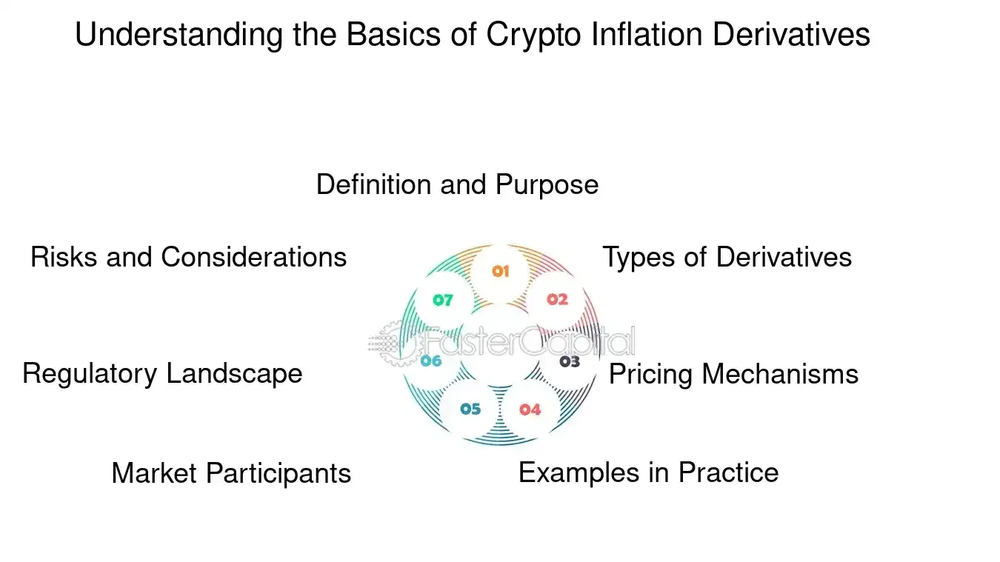

## Table of Contents

## What are inflation derivatives?

Inflation derivatives are financial instruments that help people manage the risk of inflation. Inflation is when the prices of things go up over time, and it can make money worth less. These derivatives let people bet on or protect against changes in inflation rates. They are used by businesses, investors, and governments to plan for the future and keep their money safe.

There are different types of inflation derivatives, but the most common ones are inflation swaps and inflation-linked bonds. In an inflation swap, two parties agree to exchange cash flows based on inflation rates. One party pays a fixed rate, while the other pays a rate that changes with inflation. Inflation-linked bonds are like regular bonds, but their value goes up with inflation. This helps investors keep their money's value even when prices rise.

## What is the purpose of using inflation derivatives?

The main purpose of using inflation derivatives is to help people and businesses manage the risk that comes from inflation. Inflation can make money worth less over time, which can be a big problem for people who need to plan for the future. By using inflation derivatives, they can protect themselves from this risk. For example, a company might use inflation derivatives to make sure that their costs stay the same even if prices go up. This helps them plan their budgets and stay financially stable.

Inflation derivatives also let investors and traders bet on what they think will happen with inflation rates. If someone thinks inflation will go up, they can use these derivatives to make money if they are right. This can be a way to make profits, but it also comes with risks because guessing wrong can lead to losses. Overall, inflation derivatives are useful tools for managing money and planning for the future in a world where prices can change a lot.

## How do inflation derivatives work?

Inflation derivatives work by letting people make deals based on what they think will happen with inflation. The most common type is an inflation swap. In an inflation swap, two people agree to exchange money over time. One person pays a fixed amount, like a set [interest rate](/wiki/interest-rate-trading-strategies), while the other pays an amount that changes with inflation. If inflation goes up, the person paying the changing amount will pay more, but the person paying the fixed amount will still pay the same. This helps the person paying the fixed amount protect their money from losing value because of inflation.

Another type of inflation derivative is an inflation-linked bond. This is like a regular bond, but its value goes up when inflation goes up. When you buy an inflation-linked bond, you get regular payments, and those payments get bigger if inflation rises. This means your money keeps its value even when prices go up. Both inflation swaps and inflation-linked bonds help people and businesses plan for the future by managing the risk that comes from inflation.

## What are the common types of inflation derivatives?

The most common type of inflation derivative is an inflation swap. In an inflation swap, two people make a deal to exchange money over time. One person pays a fixed amount, like a set interest rate, and the other pays an amount that changes with inflation. If inflation goes up, the person paying the changing amount will pay more, but the person paying the fixed amount will still pay the same. This helps the person paying the fixed amount protect their money from losing value because of inflation.

Another common type of inflation derivative is an inflation-linked bond. This is like a regular bond, but its value goes up when inflation goes up. When you buy an inflation-linked bond, you get regular payments, and those payments get bigger if inflation rises. This means your money keeps its value even when prices go up. Both inflation swaps and inflation-linked bonds help people and businesses plan for the future by managing the risk that comes from inflation.

## Who are the typical users of inflation derivatives?

The typical users of inflation derivatives are businesses, investors, and governments. Businesses use inflation derivatives to protect themselves from rising costs. For example, a company might use an inflation swap to make sure that their expenses stay the same even if prices go up. This helps them plan their budgets and stay financially stable. Investors use inflation derivatives to bet on what they think will happen with inflation rates. If they think inflation will go up, they can use these derivatives to make money if they are right. But, guessing wrong can lead to losses, so it's risky.

Governments also use inflation derivatives to manage their finances. They might use inflation-linked bonds to borrow money in a way that keeps up with inflation. This helps them plan for the future and make sure they can pay their bills even if prices rise. Overall, inflation derivatives are useful tools for anyone who needs to manage the risk that comes from inflation and wants to keep their money's value over time.

## What are the risks associated with inflation derivatives?

Using inflation derivatives can be risky. One big risk is that you might guess wrong about what will happen with inflation. If you bet that inflation will go up but it stays the same or goes down, you could lose money. This is especially true for investors who use inflation derivatives to try to make profits. They might think they can predict inflation, but it's hard to do that perfectly, and making the wrong guess can lead to big losses.

Another risk is that inflation derivatives can be complicated. They have a lot of rules and details that can be hard to understand. If you don't fully understand how they work, you might make a mistake and lose money. Also, the value of inflation derivatives can change a lot over time, which can be risky if you need to sell them quickly. Overall, while inflation derivatives can help manage inflation risk, they come with their own set of challenges and potential losses.

## How are inflation derivatives priced?

Inflation derivatives are priced based on what people think will happen with inflation in the future. For an inflation swap, the price depends on the difference between the fixed rate someone is willing to pay and the expected inflation rate. If people think inflation will be high, the price of the swap will be higher because the person paying the inflation-linked rate might have to pay more. The fixed rate is set so that both sides of the swap think the deal is fair based on their guesses about future inflation.

For inflation-linked bonds, the price is also tied to what people expect inflation to be. These bonds have a base value and an extra part that goes up with inflation. The price of the bond will be higher if people think inflation will rise a lot because the payments they get will be bigger. Both types of inflation derivatives use market guesses about future inflation to set their prices, and these guesses can change a lot, making the prices change too.

## What are the key differences between inflation swaps and inflation-linked bonds?

Inflation swaps and inflation-linked bonds are both used to manage the risk of inflation, but they work in different ways. An inflation swap is like a deal between two people where one pays a fixed amount and the other pays an amount that changes with inflation. This helps the person paying the fixed amount protect their money from losing value because of inflation. It's like a bet on what will happen with inflation, and it's often used by businesses and investors to manage their costs or make profits.

On the other hand, an inflation-linked bond is like a special kind of loan. When you buy an inflation-linked bond, you get regular payments, and those payments get bigger if inflation goes up. This means your money keeps its value even when prices rise. Governments and investors often use these bonds to borrow money or invest in a way that keeps up with inflation. Both tools help manage inflation risk, but they do it differently—one through a direct swap and the other through a bond that changes with inflation.

## How do inflation derivatives help in managing inflation risk?

Inflation derivatives help people and businesses manage the risk of inflation by letting them make deals based on what they think will happen with prices in the future. For example, with an inflation swap, one person pays a fixed amount while the other pays an amount that changes with inflation. This way, if inflation goes up, the person paying the fixed amount doesn't have to worry about their costs going up too. This helps businesses plan their budgets better because they know their expenses will stay the same even if prices rise.

Another way inflation derivatives help is through inflation-linked bonds. When someone buys an inflation-linked bond, they get regular payments that get bigger if inflation goes up. This means the value of their investment keeps up with inflation, so their money doesn't lose value over time. Governments and investors use these bonds to borrow money or invest in a way that protects them from inflation. Both inflation swaps and inflation-linked bonds are useful tools for managing the risk that comes from inflation and keeping money's value safe.

## What are some historical examples of inflation derivatives usage?

One historical example of inflation derivatives usage happened in the United States in the early 2000s. During this time, the U.S. government started issuing inflation-linked bonds called Treasury Inflation-Protected Securities (TIPS). These bonds were created to help investors protect their money from inflation. People bought these bonds because they wanted to make sure their investments would keep up with rising prices. This was a big deal because it showed how governments could use inflation derivatives to help people manage the risk of inflation.

Another example comes from the UK in the 1980s. The UK government started issuing inflation-linked bonds called Index-Linked Gilts. These bonds helped the government borrow money in a way that kept up with inflation. At the same time, businesses and investors in the UK started using inflation swaps to manage their costs. For example, a company might use an inflation swap to make sure their expenses stayed the same even if prices went up. These examples show how inflation derivatives have been used by both governments and businesses to plan for the future and keep their money safe from rising prices.

## What are the regulatory considerations for trading inflation derivatives?

Trading inflation derivatives comes with some rules that people need to follow. These rules are made by governments and financial groups to make sure that trading is fair and safe. For example, in the United States, the Commodity Futures Trading Commission (CFTC) and the Securities and Exchange Commission (SEC) watch over inflation derivatives. They make sure that people trading these derivatives follow the rules and report what they are doing. This helps keep the market honest and stops people from doing things that could hurt others.

In Europe, the European Securities and Markets Authority (ESMA) and other groups also have rules for trading inflation derivatives. They want to make sure that everyone knows what they are doing and that the market works well. These rules can include things like how much money someone needs to trade, what they need to tell others about their trades, and how they should handle risks. By following these rules, people can trade inflation derivatives in a way that is safe and fair for everyone.

## What are the alternatives to inflation derivatives for managing inflation risk?

One way to manage inflation risk without using inflation derivatives is by investing in real assets like real estate or commodities. These things often go up in value when prices rise, so they can help protect your money from losing value because of inflation. For example, if you own a house, the price of the house might go up when inflation goes up, which means your investment keeps its value. Commodities like gold or oil can also be good because their prices can rise with inflation, helping to keep your money's worth.

Another way is by using inflation-adjusted savings accounts or inflation-indexed annuities. These are special kinds of accounts or investments that change with inflation. If inflation goes up, the amount of money you get from these accounts or annuities also goes up, so your money stays the same in value. This can be a simpler way to protect against inflation without having to deal with the complicated rules of inflation derivatives. Both real assets and inflation-adjusted accounts can help you plan for the future and keep your money safe from rising prices.

## References & Further Reading

[1]: Hull, J. C. (2011). ["Options, Futures, and Other Derivatives."](https://www.semanticscholar.org/paper/Options%2C-Futures%2C-and-Other-Derivatives-Hull/89bdee500c8623864fc9eb7a471546aa713acc44) Prentice Hall.

[2]: Lopez de Prado, M. (2018). ["Advances in Financial Machine Learning."](https://www.amazon.com/Advances-Financial-Machine-Learning-Marcos/dp/1119482089) Wiley.

[3]: Aronson, D. (2006). ["Evidence-Based Technical Analysis: Applying the Scientific Method and Statistical Inference to Trading Signals."](https://www.amazon.com/Evidence-Based-Technical-Analysis-Scientific-Statistical/dp/0470008741) Wiley.

[4]: Jermann, U. (2013). ["The Future of Inflation-Indexed Bonds: Review and Outlook"](https://www.researchgate.net/publication/319498667_Inflation_Bets_or_Deflation_Hedges_The_Changing_Risks_of_Nominal_Bonds) Federal Reserve Bank of San Francisco Economic Letter.

[5]: Chan, E. (2009). ["Quantitative Trading: How to Build Your Own Algorithmic Trading Business."](https://github.com/ftvision/quant_trading_echan_book) Wiley.

[6]: Shreve, S. E. (2004). ["Stochastic Calculus for Finance I: The Binomial Asset Pricing Model."](https://link.springer.com/book/10.1007/978-0-387-22527-2) Springer.

[7]: Fabozzi, F. J., & Mann, S. V. (2005). ["The Handbook of Fixed Income Securities."](https://www.amazon.com/Handbook-Fixed-Income-Securities-Ninth/dp/1260473899) McGraw-Hill Education.