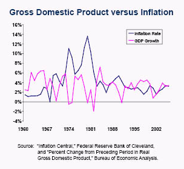

## Table of Contents

## What is inflation?

Inflation is when the prices of things we buy, like food and toys, go up over time. It means that the money we have can buy less than it used to. For example, if a toy cost $10 last year and now it costs $11, that's inflation. It happens because the amount of money in the economy grows faster than the number of things to buy.

Inflation can happen for different reasons. Sometimes, it's because there's more money being printed by the government. Other times, it's because the cost of making things, like the materials and the energy, goes up. When this happens, businesses might raise their prices to cover these higher costs. Inflation is normal and happens in every country, but if it goes too high, it can make life harder for people because their money doesn't go as far.

## What is Gross Domestic Product (GDP)?

Gross Domestic Product, or GDP, is the total value of all the goods and services produced in a country during a specific time, usually a year. It's like adding up everything that's made or done in a country, from cars and computers to haircuts and hamburgers. GDP helps us understand how well a country's economy is doing. If the GDP is growing, it means the economy is getting bigger, and more things are being produced.

GDP can be measured in different ways, but one common method is to add up all the spending in the economy. This includes what people spend on things they buy, what businesses spend on equipment and buildings, what the government spends on services like schools and roads, and what other countries spend on goods and services from the country. By looking at GDP, leaders and economists can make decisions about how to help the economy grow or fix problems if it's not doing well.

## How is inflation measured?

Inflation is measured using something called a price index. The most common one is the Consumer Price Index, or CPI. The CPI looks at the prices of a bunch of different things that people buy every day, like food, clothes, and gas. Every month, people collect the prices of these items from stores all over the country. They then compare these prices to what they were in the past to see if they've gone up or down. If the prices have gone up, that means there's inflation.

The rate of inflation is calculated by figuring out how much the CPI has changed over time. For example, if the CPI was 100 last year and it's 102 this year, that means prices have gone up by 2%. This percentage is the inflation rate. Governments and economists watch this rate closely because it helps them understand how the economy is doing and make decisions about things like interest rates and money policies.

## How is GDP calculated?

GDP is calculated by adding up all the money spent on goods and services in a country during a certain time, usually a year. There are four main parts to this spending: what people buy for themselves, what businesses spend on things like new machines and buildings, what the government spends on things like schools and roads, and what other countries spend on goods and services from the country. Economists add up all these parts to get the total GDP.

Sometimes, GDP is also calculated by looking at the income side of things. This means adding up all the money that people and businesses earn, like wages, profits, and taxes minus subsidies. Both ways should give the same total GDP, but they help economists understand the economy from different angles. By looking at GDP, we can see if the economy is growing or shrinking, which helps leaders make decisions to help the country.

## What is the relationship between inflation and GDP?

Inflation and GDP are connected, but their relationship can be tricky. When the economy is growing and the GDP is going up, it often means more people are working and [earning](/wiki/earning-announcement) money. This can lead to more spending, which might push prices up and cause inflation. But if the economy grows too fast and there's too much money chasing too few goods, inflation can get out of control. So, a growing GDP can lead to inflation, but it's important that the growth is steady and balanced.

On the other hand, if inflation gets too high, it can hurt the economy and slow down GDP growth. When prices rise quickly, people might not be able to buy as much, and businesses might not want to invest because they're worried about the future. This can lead to less spending and slower economic growth. Central banks, like the Federal Reserve in the U.S., try to keep inflation at a healthy level to help the economy grow without causing too many problems. So, while inflation and GDP are linked, managing them well is key to a strong economy.

## Can high inflation affect GDP growth?

High inflation can definitely affect GDP growth. When prices go up a lot, it means that people's money doesn't go as far. They might have to spend more on the same things they used to buy, like food and gas. This can make people feel like they have less money to spend on other stuff, like new clothes or going out to eat. When people cut back on spending, businesses might sell less and make less money. If businesses are making less money, they might not want to grow or hire more people, which can slow down the economy and make GDP growth slower.

On the other hand, if inflation gets really high, it can cause bigger problems. People might start to expect prices to keep going up, so they might spend their money quickly before things get even more expensive. This can make inflation even worse. At the same time, businesses might not want to invest in new projects because they're not sure what prices will be like in the future. If businesses hold back on investing, it can lead to less production and fewer jobs, which can hurt GDP growth. So, high inflation can make the economy unstable and slow down GDP growth if it's not managed well.

## How does the government use monetary policy to manage inflation and GDP?

The government uses something called monetary policy to help manage inflation and GDP. This means they control how much money is in the economy and how easy it is to borrow money. One big way they do this is by changing interest rates. If they want to slow down inflation, they might raise interest rates. When interest rates go up, it costs more for people and businesses to borrow money. This can make people spend less, which can help stop prices from going up too fast. On the other hand, if they want to help the economy grow and boost GDP, they might lower interest rates. Lower rates make it cheaper to borrow money, so people and businesses might spend more, which can help the economy grow.

Another tool the government uses is controlling how much money banks have to keep in reserve. If they want to slow down the economy and fight inflation, they might tell banks to keep more money in reserve. This means banks can lend out less money, which can slow down spending and help keep prices from rising too quickly. If they want to help the economy grow, they might let banks keep less money in reserve. This means banks can lend out more money, which can lead to more spending and help boost GDP. By using these tools, the government tries to keep inflation at a good level and help the economy grow in a steady way.

## What are the different types of inflation and how do they impact GDP?

There are different types of inflation, and each can affect GDP in its own way. One type is demand-pull inflation, which happens when people want to buy more stuff than what's available. This can happen when the economy is doing really well and everyone has money to spend. While this can help GDP grow because more things are being made and sold, if it goes too far, it can lead to prices going up a lot, which might make people spend less later on and slow down the economy.

Another type is cost-push inflation, which happens when the cost of making things goes up. This could be because the price of oil goes up or because workers want more pay. When businesses have to pay more to make their products, they might raise prices to cover these costs. This can lead to less spending because people have to pay more for the same things, which can slow down GDP growth. If it gets bad enough, it can even lead to a situation where the economy shrinks, which is called a recession.

There's also built-in inflation, which happens when people expect prices to keep going up. If workers think prices will be higher next year, they might ask for bigger raises. If businesses think prices will be higher, they might raise their prices now. This can create a cycle where prices keep going up and up. If this cycle gets out of control, it can make the economy unstable and hurt GDP growth because people and businesses might not want to spend or invest when they're not sure what prices will be like in the future.

## How do economists use the Phillips Curve to explain the relationship between inflation and unemployment, and its effect on GDP?

The Phillips Curve is a way economists explain how inflation and unemployment are connected. It says that when unemployment goes down, inflation tends to go up, and when unemployment goes up, inflation tends to go down. Imagine a seesaw: when one side goes up, the other goes down. The idea is that when more people have jobs, they have more money to spend, which can push prices up because there's more demand for stuff. But if a lot of people are out of work, they don't have as much money to spend, so businesses might lower prices to sell their goods, which can keep inflation down.

This relationship between inflation and unemployment can affect GDP. When unemployment is low and inflation is high, the economy might be growing because more people are working and spending money. This can lead to a higher GDP because more goods and services are being produced and sold. But if inflation gets too high, it can start to hurt the economy. People might start to spend less because prices are going up too fast, which can slow down GDP growth. On the other hand, if unemployment is high and inflation is low, the economy might not be doing as well, and GDP might not grow as much because fewer people are working and spending. So, finding a good balance between inflation and unemployment is important for keeping the economy strong and helping GDP grow.

## What are the long-term effects of inflation on GDP?

Over a long time, high inflation can hurt the GDP of a country. When prices keep going up a lot, people might start to expect that things will always be more expensive in the future. This can make them spend their money quickly before prices go up even more, which can make inflation worse. Businesses might not want to invest in new projects or expand because they're not sure what prices will be like later. If businesses aren't investing, they might not produce as much, and fewer people might be working. This can slow down the economy and make GDP grow slower or even shrink.

On the other hand, if inflation is kept at a low and steady level, it can help the economy grow in a healthy way. When prices go up a little bit each year, it can encourage people to spend and businesses to invest because they know what to expect. This can lead to more jobs and more things being made and sold, which can help GDP grow over time. So, managing inflation well is important for keeping the economy strong and helping GDP grow in the long run.

## How do international factors influence inflation and GDP in a country?

International factors can have a big impact on a country's inflation and GDP. One way this happens is through changes in the prices of things that countries buy from other places, like oil or food. If the price of oil goes up a lot, it can make it more expensive for businesses to make things and for people to travel. This can lead to higher prices in the country, which is inflation. Also, if a country buys a lot of stuff from another country and that country raises its prices, it can make things more expensive at home. This can slow down spending and hurt the country's GDP because people have less money to spend on other things.

Another way international factors affect inflation and GDP is through exchange rates. If a country's money gets weaker compared to other countries' money, it can make things from other countries more expensive. This can lead to higher inflation because the cost of imported goods goes up. But if the country's money gets stronger, it can make things from other places cheaper, which can help keep inflation down. Exchange rates can also affect how much other countries want to buy from the country. If the country's money is weak, other countries might buy more because things are cheaper, which can help boost the country's GDP. But if the country's money is strong, other countries might buy less, which can hurt GDP.

## What are some advanced economic models used to predict the impact of inflation on GDP?

Economists use different advanced models to try to predict how inflation might affect GDP. One popular model is the Dynamic Stochastic General Equilibrium (DSGE) model. This model looks at how different parts of the economy, like how much people spend, how much businesses produce, and what the government does, all work together. It tries to show how changes in inflation can lead to changes in GDP by thinking about how people and businesses might react to higher prices. For example, if inflation goes up, people might spend less, which can slow down the economy and make GDP grow slower. DSGE models are really detailed and use a lot of math to help economists understand these relationships better.

Another model economists use is the Vector Autoregression (VAR) model. This model looks at how different economic numbers, like inflation and GDP, change together over time. It uses past data to see if there are patterns that can help predict the future. For example, if inflation has gone up in the past and GDP has slowed down, the VAR model can use this information to guess what might happen next time inflation goes up. These models can help economists and policymakers make better decisions about how to manage the economy to keep inflation and GDP in a good balance.

## What is the relationship between inflation and GDP?

Inflation refers to the rate at which the general level of prices for goods and services rises, consequently diminishing purchasing power. It is typically assessed using various indices, most notably the Consumer Price Index (CPI). The CPI measures changes in the price level of a market basket of consumer goods and services purchased by households. A rising CPI indicates increased living costs, highlighting inflationary trends within an economy. Additionally, other indices such as the Producer Price Index (PPI) and the Wholesale Price Index (WPI) can be used to gauge inflation from different market perspectives.

Gross Domestic Product (GDP) quantifies the total monetary value of all finished goods and services produced within a country's borders over a specific period, usually annually or quarterly. GDP is a comprehensive indicator of a nation's economic health, measuring economic production and growth. It can be analyzed using various approaches, including the nominal GDP, which measures output using current prices, and real GDP, which adjusts for inflation to reflect the value of goods and services at constant prices.

GDP can be expressed using the expenditure approach, one of the most common methodologies, as follows:

$$
\text{GDP} = C + I + G + (X - M)
$$

where:
- $C$ is the total consumption expenditure by households.
- $I$ is the investment made by businesses.
- $G$ is the government spending on goods and services.
- $X$ represents exports of goods and services.
- $M$ denotes imports of goods and services, where $(X - M)$ is the net exports.

Both inflation and GDP are meticulously monitored by policymakers and investors because they profoundly influence central bank policies and affect market behavior. Central banks, such as the Federal Reserve or the European Central Bank, aim to maintain price stability and foster conditions conducive to economic growth. By adjusting interest rates and monetary supply, these institutions manage inflationary pressures and strive to achieve sustainable economic growth signaled by healthy GDP figures.

For investors, the relationship between inflation and GDP is crucial, as changes in these metrics can signal potential shifts in economic conditions and asset valuations. Consequently, understanding the dynamics of inflation and GDP aids in forecasting economic trends and making informed investment decisions.

## What is the relationship between inflation and GDP?

The relationship between inflation and Gross Domestic Product (GDP) is characterized by a nuanced interplay where each influences the other in different ways under varying economic conditions. This relationship is often depicted as a delicate balance, crucial for understanding the dynamics of economic stability and growth.

Moderate GDP growth is often linked to low levels of inflation. When GDP grows at a sustainable rate, it typically signifies that the economy is expanding without overheating. This scenario fosters economic stability, as incremental increases in demand are matched by corresponding increases in supply, thus maintaining price levels relatively stable. This condition is generally favorable for both consumers and investors as it supports steady gains in income and investment returns without the risk of purchasing power erosion.

Conversely, excessive GDP growth can result in high inflation. When economic expansion accelerates too rapidly, demand can outpace supply, leading to upward pressure on prices. Such inflationary times can erode real income, as the cost of goods and services rises more quickly than wages, and may destabilize financial markets. This instability arises because inflation expectations can lead to increased interest rates as policymakers attempt to cool the economy, impacting borrowing costs and investment valuations negatively.

Understanding the relationship between GDP growth and inflation is essential for investors and policymakers. By analyzing patterns in these indicators, stakeholders can predict market trends and make informed decisions. Investors, in particular, can utilize insights from GDP and inflation data to adjust their portfolios and strategize to maximize returns while minimizing risk.

Mathematically, inflation and GDP can be modeled using various economic equations. A common representation is the Phillips Curve, which illustrates an inverse relationship between rates of unemployment and inflation, indirectly reflecting GDP growth effects:

$$
\pi_t = \pi_{t-1} - \beta (u_t - u_n) + \epsilon_t
$$

where $\pi_t$ is the rate of inflation, $u_t$ is the unemployment rate, $u_n$ is the natural rate of unemployment, $\beta$ is a positive coefficient, and $\epsilon_t$ is the error term. Although the Phillips Curve has evolved with economic understanding, it highlights the trade-offs between different economic outcomes.

In summary, the interplay between inflation and GDP requires careful analysis and monitoring. Investors and policymakers must appreciate the complex dynamics to make decisions that enhance economic welfare and stability, and to avoid scenarios that might lead to adverse economic conditions.

## References & Further Reading

[1]: ["The relationship between inflation and economic growth: A multi-country empirical study"](https://www.researchgate.net/publication/5077427_The_Relationship_Between_Inflation_and_Economic_Growth_A_Multi-Country_Empirical_Analysis) - Tawadros, George B. (Finance Research Letters, 2015)

[2]: ["Inflation and Economic Growth"](https://www.economicsonline.co.uk/all/the-relationship-between-inflation-and-economic-growth.html/) - Barro, Robert J. (International Monetary Fund Working Paper, 1995)

[3]: ["Macroeconomics"](https://www.investopedia.com/terms/m/macroeconomics.asp) by N. Gregory Mankiw

[4]: ["Algorithmic Trading and DMA: An introduction to direct access trading strategies"](https://archive.org/details/algorithmictradi0000john) by Barry Johnson

[5]: ["Economic Indicator Handbook: How to Evaluate Economic Trends to Maximize Profits and Minimize Losses"](https://www.wiley.com/en-us/The%20Economic%20Indicator%20Handbook:%20How%20to%20Evaluate%20Economic%20Trends%20to%20Maximize%20Profits%20and%20Minimize%20Losses-p-x000591755) by Richard Yamarone