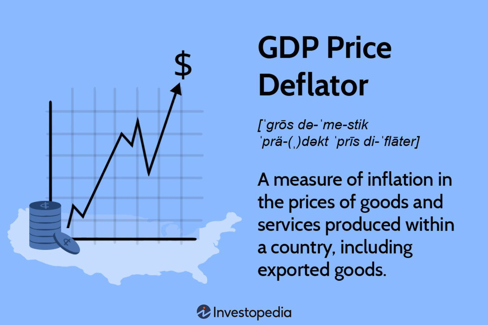

Inflation and Gross Domestic Product (GDP) are central to understanding the complexities of global economic dynamics. For investors and traders, especially those employing algorithmic strategies, these indicators provide essential insights into the state of market conditions. Inflation, reflecting the rate at which prices for goods and services rise, erodes purchasing power and influences consumer behavior and business decisions. On the other hand, GDP represents the aggregate value of all finished goods and services produced within a country's borders over a specified time frame, offering a comprehensive assessment of a nation's economic health.

Inflation and GDP extend beyond mere indicators of economic health; they provide quantitative measures that are pivotal for devising strategies within financial markets. For instance, an increase in inflation may signal potential tightening of monetary policy by central banks, affecting interest rates and consequently, various asset classes. Conversely, GDP growth provides insights into economic expansion or contraction, influencing investor confidence and asset allocation decisions.



Algorithmic trading, which relies significantly on data-driven strategies, takes these economic indicators into account to forecast market movements more accurately and efficiently. By understanding metrics such as inflation and GDP, traders can optimize their trading strategies, thus enhancing their potential returns. Algorithms can be programmed to swiftly analyze and respond to economic data, allowing traders to capitalize on market opportunities far more rapidly than manual trading methods would permit.

This article explores the interconnectedness of inflation and GDP and their implications within algorithmic trading, underscoring the significance of these economic variables in shaping trading strategies and driving market outcomes.

## Table of Contents

## Understanding Inflation and GDP

Inflation refers to the rate at which the general level of prices for goods and services rises, consequently diminishing purchasing power. It is typically assessed using various indices, most notably the Consumer Price Index (CPI). The CPI measures changes in the price level of a market basket of consumer goods and services purchased by households. A rising CPI indicates increased living costs, highlighting inflationary trends within an economy. Additionally, other indices such as the Producer Price Index (PPI) and the Wholesale Price Index (WPI) can be used to gauge inflation from different market perspectives.

Gross Domestic Product (GDP) quantifies the total monetary value of all finished goods and services produced within a country's borders over a specific period, usually annually or quarterly. GDP is a comprehensive indicator of a nation's economic health, measuring economic production and growth. It can be analyzed using various approaches, including the nominal GDP, which measures output using current prices, and real GDP, which adjusts for inflation to reflect the value of goods and services at constant prices.

GDP can be expressed using the expenditure approach, one of the most common methodologies, as follows:

$$
\text{GDP} = C + I + G + (X - M)
$$

where:
- $C$ is the total consumption expenditure by households.
- $I$ is the investment made by businesses.
- $G$ is the government spending on goods and services.
- $X$ represents exports of goods and services.
- $M$ denotes imports of goods and services, where $(X - M)$ is the net exports.

Both inflation and GDP are meticulously monitored by policymakers and investors because they profoundly influence central bank policies and affect market behavior. Central banks, such as the Federal Reserve or the European Central Bank, aim to maintain price stability and foster conditions conducive to economic growth. By adjusting interest rates and monetary supply, these institutions manage inflationary pressures and strive to achieve sustainable economic growth signaled by healthy GDP figures.

For investors, the relationship between inflation and GDP is crucial, as changes in these metrics can signal potential shifts in economic conditions and asset valuations. Consequently, understanding the dynamics of inflation and GDP aids in forecasting economic trends and making informed investment decisions.

## The Relationship Between Inflation and GDP

The relationship between inflation and Gross Domestic Product (GDP) is characterized by a nuanced interplay where each influences the other in different ways under varying economic conditions. This relationship is often depicted as a delicate balance, crucial for understanding the dynamics of economic stability and growth.

Moderate GDP growth is often linked to low levels of inflation. When GDP grows at a sustainable rate, it typically signifies that the economy is expanding without overheating. This scenario fosters economic stability, as incremental increases in demand are matched by corresponding increases in supply, thus maintaining price levels relatively stable. This condition is generally favorable for both consumers and investors as it supports steady gains in income and investment returns without the risk of purchasing power erosion.

Conversely, excessive GDP growth can result in high inflation. When economic expansion accelerates too rapidly, demand can outpace supply, leading to upward pressure on prices. Such inflationary times can erode real income, as the cost of goods and services rises more quickly than wages, and may destabilize financial markets. This instability arises because inflation expectations can lead to increased interest rates as policymakers attempt to cool the economy, impacting borrowing costs and investment valuations negatively.

Understanding the relationship between GDP growth and inflation is essential for investors and policymakers. By analyzing patterns in these indicators, stakeholders can predict market trends and make informed decisions. Investors, in particular, can utilize insights from GDP and inflation data to adjust their portfolios and strategize to maximize returns while minimizing risk.

Mathematically, inflation and GDP can be modeled using various economic equations. A common representation is the Phillips Curve, which illustrates an inverse relationship between rates of unemployment and inflation, indirectly reflecting GDP growth effects:

$$
\pi_t = \pi_{t-1} - \beta (u_t - u_n) + \epsilon_t
$$

where $\pi_t$ is the rate of inflation, $u_t$ is the unemployment rate, $u_n$ is the natural rate of unemployment, $\beta$ is a positive coefficient, and $\epsilon_t$ is the error term. Although the Phillips Curve has evolved with economic understanding, it highlights the trade-offs between different economic outcomes.

In summary, the interplay between inflation and GDP requires careful analysis and monitoring. Investors and policymakers must appreciate the complex dynamics to make decisions that enhance economic welfare and stability, and to avoid scenarios that might lead to adverse economic conditions.

## Economic Indicators in Algorithmic Trading

Algorithmic trading employs automated strategies designed to execute trades in response to market data, with economic indicators playing a crucial role in informing these strategies. Among these indicators, inflation rates and GDP growth are prominently used in modeling and anticipating market movements.

Inflation rates signify the pace at which prices for goods and services rise, affecting purchasing power and economic equilibrium. In [algorithmic trading](/wiki/algorithmic-trading), inflation data can influence forecasting models by adjusting for expected [interest rate](/wiki/interest-rate-trading-strategies) changes or shifts in consumer behavior. For instance, an unexpected rise in inflation might cause central banks to raise interest rates, potentially leading to market corrections. Algorithms can be programmed to recognize these patterns and adjust trade positions accordingly, enhancing the trader's ability to capitalize on or shield against anticipated market fluctuations.

GDP growth, the measure of the economic output of a nation, reflects economic health and is intrinsically linked to market performance. Traders use GDP data to gauge economic trends and predict asset price movements. Strong GDP growth may lead to increased corporate profits, influencing stock prices positively. Conversely, slow growth or contraction could signal a downturn. Algorithmic models incorporate GDP growth trajectories to fine-tune trading strategies, optimizing entry and [exit](/wiki/exit-strategy) points based on predictive analytics.

The speed and efficiency of algorithmic trading offer a distinct advantage in processing and reacting to economic data. Algorithms can parse economic reports and assess their implications far more swiftly than human traders. For example, upon release of new economic data, algorithms can rapidly conduct analysis using pre-defined criteria and execute corresponding trades within milliseconds, taking advantage of minute price discrepancies before the markets fully adjust.

To implement this in a Python algorithmic trading system, one might use libraries such as `pandas` for data manipulation and `numpy` for numerical operations. As an illustration:

```python
import pandas as pd
import numpy as np

# Mock data for inflation and GDP
economic_data = pd.DataFrame({
    'date': pd.date_range(start='2023-01-01', periods=10, freq='M'),
    'inflation_rate': np.random.uniform(0.01, 0.05, size=10),
    'gdp_growth': np.random.uniform(0.01, 0.04, size=10)
})

# Simple strategy framework: Buy if GDP growth > 3% and inflation < 3%
def trading_decision(row):
    if row['gdp_growth'] > 0.03 and row['inflation_rate'] < 0.03:
        return 'Buy'
    else:
        return 'Hold/Sell'

economic_data['decision'] = economic_data.apply(trading_decision, axis=1)
print(economic_data)
```

This code represents a basic framework wherein trading decisions are made based on the interplay of economic indicators like GDP growth and inflation rate. Such models can be extended with sophisticated [machine learning](/wiki/machine-learning) algorithms to improve accuracy and predictive power. By harnessing these economic indicators, algorithmic trading systems can efficiently navigate complex financial markets, enabling informed and strategic decision-making.

## Case Studies: Economic Indicators and Algo Trading Success

Several hedge funds and trading firms have successfully integrated economic indicators, such as inflation rates and GDP growth figures, into their algorithmic trading strategies. Among these, Two Sigma and Renaissance Technologies stand out for their innovative use of a vast array of economic data points to guide their trading algorithms.

Two Sigma employs a data-driven approach, harnessing the power of machine learning and advanced statistical models to parse through complex datasets. By analyzing GDP, inflation figures, and other macroeconomic indicators, Two Sigma's algorithms identify profitable trading opportunities and execute trades with precision. This approach allows Two Sigma to maintain a competitive edge in increasingly volatile financial markets.

Renaissance Technologies, known for its Medallion Fund, utilizes a similar strategy with an extensive focus on quantifying economic indicators to improve trading outcomes. The firm excels at integrating vast amounts of economic information, including GDP growth rates and inflation dynamics, which are processed by their sophisticated algorithms to predict market trends and optimize trades. Renaissance's success illustrates the effectiveness of leveraging high-frequency economic data for improved trading decisions.

These case studies illustrate the practical application and success of incorporating economic indicators into algorithmic trading. By systematically analyzing GDP and inflation data, these firms have optimized their trading strategies, achieving substantial returns while minimizing risk. This strategic use of economic indicators underscores their critical role in developing resilient and adaptive algorithmic trading systems.

## Challenges and Considerations

One of the primary challenges faced in algorithmic trading is the inherent [volatility](/wiki/volatility-trading-strategies) and frequent revisions of economic data. Economic indicators like inflation rates and GDP are subject to updates and corrections as more accurate information becomes available, often affecting trading algorithms that rely on these metrics for decision-making. The unpredictability in data reporting can lead to sudden and unexpected market movements, posing risks to algorithmic strategies that may not be quick to adapt.

To mitigate these risks, proper risk management techniques are imperative. Strategies such as stop-loss orders can help limit potential losses by setting predetermined points for automatically exiting trades. Diversification is another effective approach, spreading investments across various assets to reduce the impact of any single economic shift on the overall portfolio.

Continual recalibration of algorithms is necessary to address the dynamic nature of economic conditions. This process involves regularly updating the models to account for new data, changing correlations between economic indicators, and evolving market patterns. For instance, the performance of an algorithm might be optimized by adjusting its parameters—a task that can be automated using machine learning techniques. A Python snippet for recalibrating an algorithm using a basic machine learning model might look like this:

```python
from sklearn.linear_model import LinearRegression
import numpy as np

# Sample dataset with economic indicators features and target outcomes
X = np.array([[2.5, 3.0], [3.5, 2.5], [2.0, 2.0], [4.0, 3.5]])
y = np.array([10, 15, 8, 20])

# Initialize and fit the linear regression model
model = LinearRegression().fit(X, y)

# Recalibration with new data
new_data = np.array([[3.0, 3.0]])
new_prediction = model.predict(new_data)

print("Recalibrated prediction:", new_prediction)
```

This snippet demonstrates a simple recalibration using a linear regression model. Such recalibrations help ensure that the algorithm remains effective despite fluctuations in economic conditions. 

Continual learning and adaptation are key components for the successful application of algorithmic trading strategies. As market environments are influenced by myriad factors beyond just inflation and GDP, developing a robust framework that incorporates a broad spectrum of economic indicators, while remaining adaptable, is essential for sustained success in algorithmic trading.

## Conclusion

Inflation and Gross Domestic Product (GDP) are crucial economic indicators with significant implications for both traditional and algorithmic trading strategies. These metrics provide traders with insights necessary to predict market trends and optimize their investment strategies effectively. Successful traders leverage the complex relationship between inflation and GDP to enhance their investment outcomes.

The dynamic nature of financial markets requires traders to continually adapt their strategies. The integration of economic data into algorithmic trading models offers a competitive advantage, allowing traders to process and react to information with unprecedented speed and precision. This capability is essential for maintaining an edge in highly volatile markets.

As these markets continue to evolve, the ability to incorporate economic indicators such as inflation and GDP into trading algorithms remains paramount. Those traders who can adeptly harness this data will be better positioned to capitalize on emerging opportunities, manage risks, and secure superior investment returns in both current and future economic climates.

## References & Further Reading

[1]: ["The relationship between inflation and economic growth: A multi-country empirical study"](https://www.researchgate.net/publication/5077427_The_Relationship_Between_Inflation_and_Economic_Growth_A_Multi-Country_Empirical_Analysis) - Tawadros, George B. (Finance Research Letters, 2015)

[2]: ["Inflation and Economic Growth"](https://www.economicsonline.co.uk/all/the-relationship-between-inflation-and-economic-growth.html/) - Barro, Robert J. (International Monetary Fund Working Paper, 1995)

[3]: ["Macroeconomics"](https://www.investopedia.com/terms/m/macroeconomics.asp) by N. Gregory Mankiw

[4]: ["Algorithmic Trading and DMA: An introduction to direct access trading strategies"](https://archive.org/details/algorithmictradi0000john) by Barry Johnson

[5]: ["Economic Indicator Handbook: How to Evaluate Economic Trends to Maximize Profits and Minimize Losses"](https://www.wiley.com/en-us/The%20Economic%20Indicator%20Handbook:%20How%20to%20Evaluate%20Economic%20Trends%20to%20Maximize%20Profits%20and%20Minimize%20Losses-p-x000591755) by Richard Yamarone