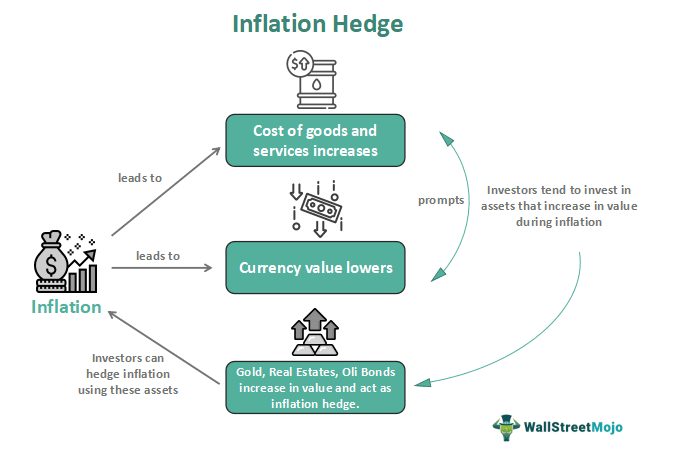

Inflation represents the rate at which the general level of prices for goods and services rises, consequently diminishing the purchasing power of money. As economic landscapes continue to evolve, inflation has emerged as a critical concern for investors, influencing their strategies significantly. Investors are persistently seeking effective methods to shield their assets from the diminishing effects of inflation. The pursuit of preserving the purchasing power of investments amid rising prices is fundamental to maintaining financial stability and achieving long-term growth.

In recent years, algorithmic trading has gained prominence as a modern approach to enhance investment strategies under inflationary pressures. This method leverages computer algorithms to automate trading decisions, allowing for rapid adjustments to market conditions that may result from inflationary trends. By incorporating sophisticated data analysis and machine learning techniques, algorithmic trading can identify patterns and predict market movements that may not be immediately apparent through traditional analysis, providing investors with tools to optimize their portfolios effectively.



This article explores the interconnected nature of inflation hedging, diverse investment strategies, and algorithmic trading. It examines how these components interact to offer robust solutions for managing the inherent risks posed by inflation. The focus is on identifying efficient strategies for risk management and portfolio optimization, ensuring that investments remain resilient and profitable even as general price levels fluctuate.

By understanding these dynamics, investors can better navigate the challenges posed by fluctuating inflation rates, adjusting their strategies accordingly to maintain and enhance their portfolio's value. Through a combination of traditional investment techniques and cutting-edge technological tools like algorithmic trading, investors are better equipped to handle the complexities of modern economic conditions, ultimately securing their financial interests against the erosive impact of inflation.

## Table of Contents

## Understanding Inflation and Its Impacts

Inflation refers to the rate at which the general level of prices for goods and services increases, leading to a reduction in purchasing power. This economic phenomenon has a significant impact on investment strategies, necessitating investors to adapt in order to safeguard their assets. The various forms of inflation include demand-pull, cost-push, and built-in inflation, each with distinct characteristics that affect economic dynamics.

Demand-pull inflation occurs when aggregate demand in an economy surpasses aggregate supply. This imbalance usually leads to increased consumer spending and investment, driving prices higher. For example, during periods of economic expansion, when consumer confidence and employment rates are high, demand-pull inflation tends to rise. Understanding this type of inflation is crucial for investors, as it often necessitates adjustments in investment portfolios to account for potential changes in the value of assets and returns.

Cost-push inflation arises from an increase in the cost of production inputs, such as labor, raw materials, and energy. When production costs rise, businesses may pass these costs onto consumers in the form of higher prices for goods and services. Factors such as rising wage demands, supply chain disruptions, or increases in commodity prices can lead to cost-push inflation. Investors must be aware of these factors, as they may lead to decreased profitability for companies and sectors heavily reliant on inputs with rising costs.

Built-in inflation, also known as wage-price inflation, is driven by the expectation of future inflation. As wages increase, motivated by the expectation of higher prices, businesses may raise prices to maintain profitability, thus creating a self-sustaining inflation cycle. This type of inflation poses a challenge to investors, as it can erode the real returns on investments unless adequately hedged.

Global and macroeconomic factors significantly influence inflation rates, impacting investment strategies on a broader scale. Fiscal policies, such as government spending and taxation, can stimulate or suppress economic activity, influencing inflationary pressures. Likewise, monetary policy, including interest rates and money supply, plays a critical role in managing inflation. Geopolitical tensions and international trade dynamics also contribute to inflationary trends, affecting commodity prices, supply chains, and overall economic stability.

Investors must consider these global and macroeconomic factors when formulating hedging strategies to protect their investments. By understanding the various types of inflation and their driving forces, investors can adopt specific strategies to mitigate risks and preserve the value of their portfolios. Such strategies may include diversification across asset classes, investing in inflation-protected securities, or incorporating commodities and real assets that typically perform well during inflationary periods. Recognizing the multifaceted nature of inflation allows investors to make informed decisions to maintain and potentially enhance their portfolio's performance amidst changing economic landscapes.

## Investment Strategies as an Inflation Hedge

Diversifying asset classes is pivotal for investors aiming to safeguard their portfolios against inflation. The inclusion of various asset types such as stocks, bonds, commodities, and real estate can reduce the overall risk and improve the resilience of investments. Each asset class possesses unique characteristics and responds differently to inflationary pressures, making a balanced approach essential.

Treasury Inflation-Protected Securities (TIPS) stand out as a preferred choice for many investors seeking to preserve their principal value amid rising inflation. TIPS are government-issued bonds specifically designed to protect against inflation. The principal value of TIPS increases with inflation, as measured by the Consumer Price Index (CPI), ensuring that the purchasing power of the invested amount remains stable. This feature makes TIPS a reliable component of an inflation-hedged portfolio.

Commodities, particularly gold, have long been regarded as traditional hedges against inflation. Commodities often exhibit a positive correlation with inflation, meaning their prices tend to rise when inflation increases. Gold, for instance, holds intrinsic value and historically appreciates during inflationary periods due to its scarcity and universal acceptance as a store of wealth. Investors can gain exposure to commodities through direct purchases, futures contracts, or commodity-focused funds.

Real estate is another effective hedge against inflation, as property values and rental incomes generally increase in inflationary environments. Real estate investments can offer a dual benefit: capital appreciation and income generation. As demand for real estate typically persists even during periods of high inflation, property investments tend to retain or grow their value over time. Additionally, real estate offers a tangible asset that provides stability in uncertain economic conditions.

A crucial aspect of building an inflation-hedged portfolio is aligning investments with individual risk tolerance. This involves carefully weighing the portfolio's composition to ensure that the selected assets match the investor's financial goals and risk capacity. Diversification across asset classes not only enhances inflation protection but also optimizes portfolio performance by reducing susceptibility to [volatility](/wiki/volatility-trading-strategies) in any single investment type. An intelligent allocation strategy could look like:

```python
# Python example of asset allocation considering risk tolerance and inflation-hedging
def allocate_portfolio(risk_tolerance: float):
    """
    Allocates portfolio based on risk tolerance.
    risk_tolerance: float, between 0 (low risk) and 1 (high risk)
    """
    # Basic asset classes for inflation hedging
    stocks = 0.3 + 0.3 * risk_tolerance
    bonds = 0.4 - 0.1 * risk_tolerance
    commodities = 0.2 + 0.1 * risk_tolerance
    real_estate = 0.1

    # Normalize to ensure total allocation is 100%
    total = stocks + bonds + commodities + real_estate
    return {
        'stocks': stocks / total,
        'bonds': bonds / total,
        'commodities': commodities / total,
        'real_estate': real_estate / total
    }

# Example usage
portfolio_allocation = allocate_portfolio(0.5)
print(portfolio_allocation)
```

In summary, a well-diversified investment approach that includes TIPS, commodities, and real estate, balanced in accordance with an investor's risk tolerance, offers a robust defense against the erosive effects of inflation. This strategy not only secures against inflation but also positions the portfolio for long-term growth and stability.

## Algorithmic Trading: A Modern Hedge against Inflation

Algorithmic trading employs sophisticated computer algorithms to efficiently manage trading decisions, positioning itself as a modern solution for hedging against inflation. This method capitalizes on the ability of technology to analyze vast amounts of data and execute trades at speeds unattainable by human traders, making it particularly effective in volatile market conditions influenced by inflation.

One of the primary strategies used in [algorithmic trading](/wiki/algorithmic-trading) is statistical [arbitrage](/wiki/arbitrage). This involves the exploitation of price inefficiencies between different markets or securities, often using mean reversion techniques. For instance, if two historically correlative stocks diverge in price, algorithms can identify this anomaly and execute trades that profit from the eventual realignment of their prices. This approach is especially valuable during inflationary periods, when traditional pricing relationships may become distorted.

Another widely used strategy is the moving average crossover. This technical analysis tool helps determine potential buy and sell signals in a trending market. By programming an algorithm to recognize when a short-term moving average crosses a long-term moving average, traders can automate responses to changes in market sentiment due to inflation-induced volatility. For example, a simple moving average crossover strategy can be implemented in Python as follows:

```python
import pandas as pd

def moving_average_crossover(data, short_window, long_window):
    data['Short_MA'] = data['Price'].rolling(window=short_window).mean()
    data['Long_MA'] = data['Price'].rolling(window=long_window).mean()
    data['Signal'] = 0
    data['Signal'][short_window:] = np.where(data['Short_MA'][short_window:] > data['Long_MA'][short_window:], 1, 0)
    data['Position'] = data['Signal'].diff()
    return data

# Example usage
data = pd.DataFrame({'Price': [...]})  # Replace with actual price data
signals = moving_average_crossover(data, short_window=40, long_window=100)
```

The integration of [machine learning](/wiki/machine-learning) enhances these strategies by enabling algorithms to predict complex inflation trends. Machine learning models can sift through historical data to identify patterns and correlations that might indicate future inflationary movements, allowing traders to preemptively adjust their strategies. Techniques such as regression analysis and neural networks can be employed to refine predictions and improve decision accuracy.

Algorithmic trading also minimizes human errors, such as those resulting from emotional bias or fatigue, thereby increasing trade execution speed and optimizing overall portfolio performance. This level of precision and efficiency is crucial when responding to the rapid shifts in economic conditions materializing during inflationary periods.

Moreover, incorporating economic indicators into algorithmic models helps ensure alignment with current and anticipated inflationary realities. By programming algorithms to monitor indicators like the Consumer Price Index (CPI), unemployment rates, and [interest rate](/wiki/interest-rate-trading-strategies) changes, traders can fine-tune their strategies to capitalize on emerging market trends related to inflation.

In summary, algorithmic trading, through its strategic use of statistical techniques, machine learning, and real-time economic data integration, offers a potent arsenal for investors seeking to bolster their portfolios against the challenges of inflation.

## Implementing Algorithmic Trading Strategies

Choosing a robust trading platform is essential for executing algorithmic trading strategies effectively. An ideal platform must be user-friendly, allowing traders of varying experience levels to navigate and utilize its features with ease. It should support the implementation of complex algorithms to accommodate the vast array of trading strategies employed in the market, from simple moving averages to more intricate machine learning models. Cost-effectiveness is also a critical [factor](/wiki/factor-investing), as high operational costs can undermine trading profits. Platforms such as MetaTrader, [Interactive Brokers](/wiki/interactive-brokers-api), and TradeStation are examples that offer comprehensive tools tailored for algorithmic trading.

Backtesting strategies on historical data plays a pivotal role in verifying their potential effectiveness. By simulating trades using historical market data, traders can assess the viability of their algorithms under past market conditions. This process helps identify potential flaws and provides opportunities to refine strategies before committing actual capital. Various platforms and software solutions, such as QuantConnect and Zipline, offer robust [backtesting](/wiki/backtesting) environments where traders can evaluate their strategies rigorously. 

Python, with its rich ecosystem of libraries, facilitates efficient implementation and testing of algorithmic strategies. Libraries such as NumPy and pandas are instrumental for data manipulation and analysis, while libraries like TA-Lib provide prebuilt functions for technical analysis. For backtesting, the `[backtrader](/wiki/backtrader)` library is widely used due to its flexibility and extensive documentation. Here is a simple example of using `backtrader` to backtest a moving average crossover strategy:

```python
import backtrader as bt

class MovingAverageCrossover(bt.SignalStrategy):
    def __init__(self):
        # Short and long moving averages
        self.shortma = bt.indicators.SimpleMovingAverage(self.data, period=10)
        self.longma = bt.indicators.SimpleMovingAverage(self.data, period=30)

    def next(self):
        # Buy when shortma crosses above longma, sell when it's below
        if self.shortma > self.longma:
            self.buy()
        elif self.shortma < self.longma:
            self.sell()

# Prepare and run backtest
cerebro = bt.Cerebro()
cerebro.addstrategy(MovingAverageCrossover)
data = bt.feeds.YahooFinanceData(dataname='AAPL', fromdate=datetime(2020, 1, 1), todate=datetime(2021, 1, 1))
cerebro.adddata(data)
cerebro.run()
```

Continuous monitoring and adaptability of algorithmic models are crucial to ensure sustained performance despite economic changes. Markets are dynamic, and economic contexts can shift rapidly, necessitating algorithms that can adjust accordingly. This often involves periodically recalibrating parameters and incorporating new data into models. Machine learning algorithms, in particular, benefit from retraining with recent data to improve prediction accuracy and adaptability. Ensuring algorithms remain aligned with current market conditions can enhance their effectiveness in achieving targeted investment outcomes.

## Conclusion and Future Outlook

Inflation is projected to persist as a significant force influencing global economic landscapes, driving the need for investors to adopt proactive strategies to safeguard and enhance their portfolios. Algorithmic trading has emerged as a powerful tool in this context, offering dynamic solutions to optimize investment returns in an inflationary environment. By employing advanced computer algorithms, investors can react swiftly to market changes, mitigating the risks associated with inflation's unpredictability. 

Successful investors will integrate traditional investment strategies with algorithmic tools to achieve optimal portfolio management. Traditional methods, such as diversifying asset classes and investing in inflation-protected securities, provide a foundational hedge against inflation. However, the addition of algorithmic trading enhances these strategies by allowing for sophisticated data analysis and timely decision-making. This integration helps to strike a balance between risk and return, improving the resilience of investment portfolios.

It is crucial for investors to remain informed about evolving economic trends and technological advancements. A solid understanding of macroeconomic indicators can aid in aligning investment strategies with anticipated market shifts. Moreover, staying abreast of algorithmic trading innovations ensures that investors are equipped with cutting-edge tools to manage and optimize their portfolios.

In conclusion, the combination of traditional investment approaches with modern algorithmic trading techniques equips investors to effectively navigate future economic fluctuations. By embracing these strategies, investors are better positioned to adapt to varying inflationary pressures and seize opportunities in dynamic market conditions.

## References & Further Reading

[1]: Bergstra, J., Bardenet, R., Bengio, Y., & Kégl, B. (2011). ["Algorithms for Hyper-Parameter Optimization."](https://dl.acm.org/doi/10.5555/2986459.2986743) Advances in Neural Information Processing Systems 24.

[2]: ["Advances in Financial Machine Learning"](https://www.amazon.com/Advances-Financial-Machine-Learning-Marcos/dp/1119482089) by Marcos Lopez de Prado

[3]: ["Evidence-Based Technical Analysis: Applying the Scientific Method and Statistical Inference to Trading Signals"](https://www.amazon.com/Evidence-Based-Technical-Analysis-Scientific-Statistical/dp/0470008741) by David Aronson

[4]: ["Machine Learning for Algorithmic Trading"](https://github.com/stefan-jansen/machine-learning-for-trading) by Stefan Jansen

[5]: ["Quantitative Trading: How to Build Your Own Algorithmic Trading Business"](https://www.amazon.com/Quantitative-Trading-Build-Algorithmic-Business/dp/1119800064) by Ernest P. Chan