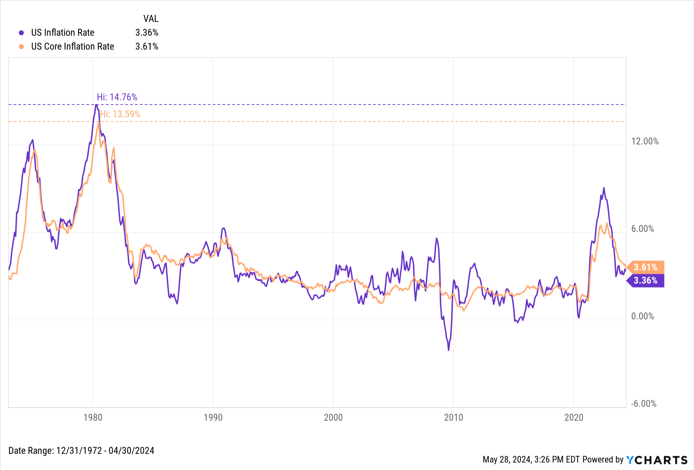

## Table of Contents

## What is inflation and why is it important to hedge against it?

Inflation is when the prices of things we buy, like food and clothes, go up over time. It means that the money we have today will not buy as much stuff in the future. For example, if a candy bar costs $1 now, and inflation is 2%, next year that same candy bar might cost $1.02. Inflation happens because the amount of money in the economy grows faster than the goods and services available.

It's important to hedge against inflation because it helps protect the value of our money. If we don't do anything, the money we save today will be worth less in the future. Hedging means finding ways to make sure our money keeps up with or beats inflation. For example, we might invest in things like stocks or real estate, which can grow in value faster than inflation. By doing this, we can make sure that our savings and investments will still be able to buy the same amount of goods and services even as prices rise.

## What are the common signs that inflation might be increasing?

One of the first signs that inflation might be increasing is when the prices of everyday things like groceries, gas, and clothes start to go up. You might notice that your weekly shopping bill is higher than usual, or that filling up your car's tank costs more. This happens because businesses have to pay more for the things they need to make their products, and they pass those costs on to customers.

Another sign is when people start talking about how much more expensive everything is becoming. You might hear friends or family complaining about the rising costs of living, or see news stories about inflation. This can also show up in official reports, like the Consumer Price Index, which tracks the average price changes of a basket of goods and services over time.

Lastly, if you see that wages are starting to go up, it could be a sign of inflation. When prices rise, workers often ask for higher pay to keep up with the cost of living. If businesses start offering bigger raises or if there are more strikes and negotiations for better pay, it might mean that inflation is on the rise.

## How does inflation affect personal savings and investments?

Inflation can make your savings worth less over time. If you keep your money in a regular savings account that doesn't pay much interest, the money won't grow as fast as prices are going up. For example, if you have $100 in savings and inflation is 3%, next year you'll need $103 to buy the same things you can buy now with $100. If your savings account only gives you 1% interest, you'll have $101 next year, but that's not enough to keep up with inflation. So, your savings lose some of their value.

Inflation also affects investments, but in different ways. Some investments, like stocks or real estate, can go up in value faster than inflation. If you invest in these, your money might grow enough to beat inflation. For example, if a stock you own goes up by 5% in a year, and inflation is 3%, you're ahead by 2%. But not all investments do well during inflation. Bonds, for instance, might pay a fixed [interest rate](/wiki/interest-rate-trading-strategies) that doesn't keep up with rising prices. So, it's important to choose investments that can grow faster than inflation to protect the value of your money.

## What are the basic strategies for hedging against inflation for beginners?

One basic strategy for beginners to hedge against inflation is to invest in stocks. Stocks can grow in value over time, and some companies even raise their prices along with inflation. This means your investment might go up faster than the cost of living. You don't need to pick individual stocks if you're new to investing; you can start with a simple index fund that follows the overall market. This way, you can spread your risk and still have a chance to beat inflation.

Another good option is to invest in real estate. You can buy property, or if that's too expensive, you can invest in a real estate investment trust (REIT). Real estate often goes up in value over time and can give you rental income, both of which can help your money keep up with or outpace inflation. If you're not ready to invest in real estate, you can also consider commodities like gold. Gold is often seen as a safe haven during times of inflation because its value tends to stay steady or even go up when the cost of living rises.

Lastly, consider putting some money into Treasury Inflation-Protected Securities (TIPS). These are special bonds from the U.S. government that adjust their value based on inflation. If inflation goes up, the value of your TIPS goes up too, helping to protect your savings. While the returns might not be as high as stocks or real estate, TIPS are a low-risk way to make sure your money doesn't lose value over time.

## Can you explain how investing in real estate can serve as an inflation hedge?

Investing in real estate can help protect your money from inflation because property values often go up over time. When inflation happens, the cost of everything, including building materials and labor, goes up. This means that it costs more to build new homes or buildings, which makes existing properties more valuable. If you own a piece of real estate, its value might rise faster than inflation, helping your investment grow in value and keep up with or beat the rising costs of living.

Another way real estate can hedge against inflation is through rental income. If you own a property and rent it out, you can increase the rent when inflation goes up. This means your rental income can grow along with inflation, helping to keep the value of your investment strong. By getting more rent over time, you're able to make more money from your property, which can help offset the effects of inflation on your savings and other investments.

## What role do commodities play in an inflation hedging strategy?

Commodities, like gold, oil, and agricultural products, can be a good way to protect your money from inflation. When prices go up because of inflation, the value of commodities often goes up too. This happens because commodities are basic things that people always need, no matter what the economy is doing. For example, gold is often seen as a safe investment during inflation because it tends to hold its value or even increase when the cost of living rises.

Investing in commodities can help your money keep up with inflation. If you buy commodities or invest in funds that focus on them, you might see their value grow faster than the rate of inflation. This means your investment could be worth more in the future, even as prices for other things go up. So, by including commodities in your investment strategy, you're giving yourself a chance to beat inflation and protect the value of your savings.

## How can Treasury Inflation-Protected Securities (TIPS) help protect against inflation?

Treasury Inflation-Protected Securities, or TIPS, are special bonds from the U.S. government that help protect your money from inflation. They do this by adjusting their value based on the rate of inflation. If inflation goes up, the value of your TIPS goes up too. This means that even if the cost of living rises, the money you have invested in TIPS will be worth more to keep up with those rising costs.

While TIPS might not give you as high returns as other investments like stocks or real estate, they are a low-risk way to make sure your money doesn't lose value over time. They're especially good for people who want a safe place to keep their savings and don't want to take big risks. By investing in TIPS, you can feel more secure knowing that your money will keep up with inflation and still be able to buy the same things in the future.

## What are the benefits and risks of using stocks as an inflation hedge?

Using stocks as an inflation hedge can be a good idea because stocks can grow in value over time. When companies do well, their stock prices go up, and sometimes they raise their prices along with inflation. This means your investment might go up faster than the cost of living. If you invest in a broad index fund, which follows the overall market, you spread your risk and still have a chance to beat inflation. This way, your money could be worth more in the future, even as prices rise.

However, there are risks to using stocks as an inflation hedge. The stock market can be unpredictable and go down as well as up. If the market has a bad year, your investment could lose value, even if inflation is going up. Also, not all companies do well during inflation. Some might struggle to raise their prices or have higher costs, which could hurt their stock prices. So, while stocks can be a good way to beat inflation over the long term, they come with the risk of losing money in the short term.

## How can one use foreign currency investments to hedge against domestic inflation?

One way to protect your money from inflation at home is by investing in foreign currencies. If the money in your country is losing value because of inflation, you might be able to get more value by holding a different country's currency. If that country has lower inflation or a stronger economy, their money might be worth more over time. By converting some of your savings into a foreign currency, you can keep the value of your money from going down as much.

However, investing in foreign currencies also comes with risks. The value of one currency compared to another can change a lot, and it's hard to predict. If the currency you invest in loses value against your home currency, you could end up losing money. Also, you might have to pay fees to change your money into a different currency, which can eat into your savings. So, while foreign currency investments can be a good way to hedge against domestic inflation, you need to be careful and understand the risks involved.

## What advanced strategies involve using derivatives for inflation protection?

Using derivatives can be a smart way to protect your money from inflation, but it's a bit more complicated. One common derivative used for this is an inflation swap. In an inflation swap, you and another person agree to exchange payments based on inflation rates. If inflation goes up, you get more money from the other person, which helps keep your money's value the same. This can be useful if you're worried about inflation hurting your savings or investments.

Another advanced strategy is using options on inflation-linked bonds. These options give you the right, but not the obligation, to buy or sell inflation-protected bonds at a set price in the future. If inflation goes up, the value of these bonds usually goes up too, so you can make money by exercising your option. This can be a good way to protect your money, but it's important to understand that options can be risky and hard to predict. Always make sure you know what you're doing before you start using these advanced strategies.

## How should an investment portfolio be diversified to effectively hedge against inflation?

To effectively hedge against inflation, you should spread your money across different types of investments. This means not putting all your money in one place, like just stocks or just savings accounts. Instead, you could invest in a mix of things like stocks, real estate, commodities, and Treasury Inflation-Protected Securities (TIPS). Stocks can grow faster than inflation over time, real estate can go up in value and give you rental income, commodities like gold hold their value well during inflation, and TIPS adjust their value to match inflation. By having a bit of each, you're more likely to keep up with or beat inflation, no matter what happens in the economy.

It's also a good idea to think about foreign currency investments as part of your portfolio. If your home country is dealing with high inflation, having some money in a currency from a country with lower inflation can help protect your savings. However, this comes with risks because currency values can change a lot. So, while diversifying with foreign currencies can be helpful, you need to be careful and understand the risks. Overall, the key to hedging against inflation is to have a balanced mix of investments that can work together to protect your money's value.

## What are the latest trends and predictions for inflation hedging strategies in 2024?

In 2024, one of the latest trends for hedging against inflation is the increased focus on alternative investments like cryptocurrencies and digital assets. Many people are turning to Bitcoin and other cryptocurrencies because they believe these can act like digital gold, holding their value or even growing during times of high inflation. Another trend is the growing popularity of inflation-linked funds, which invest in a mix of assets designed to beat inflation. These funds often include a combination of stocks, real estate, commodities, and TIPS, making it easier for people to diversify their portfolios without having to pick individual investments.

Looking ahead, experts predict that traditional strategies like investing in real estate and stocks will continue to be important for inflation hedging. Real estate is expected to remain a solid choice because property values often rise with inflation, and rental income can be adjusted to keep up with rising costs. Stocks, especially those of companies that can easily raise prices, are also seen as a good way to beat inflation over the long term. However, with the economy constantly changing, it's wise to keep an eye on new trends and be ready to adjust your strategy. Keeping a diversified portfolio and staying informed will be key to protecting your money from inflation in 2024.

## What are the Frequently Asked Questions?

### What are the most effective assets for hedging against inflation?

Inflation erodes the purchasing power of money, making it crucial for investors to select assets that can help preserve value. Some of the most effective assets include:

1. **Treasury Inflation-Protected Securities (TIPS)**: These are government bonds specifically designed to shield against inflation. Their principal increases with inflation and decreases with deflation, providing a reliable hedge.

2. **Commodities**: Investments in commodities like gold, silver, and oil often protect against inflation, as their prices typically rise when the value of currency falls.

3. **Real Estate**: Properties tend to appreciate over time and rental income can increase with inflation, making real estate a solid hedge.

4. **Stocks in Certain Sectors**: Companies in sectors like energy, utilities, and consumer staples often demonstrate resilience and can pass increased costs to consumers during inflationary periods.

### How can algorithmic trading help in managing inflationary risks?

Algorithmic trading utilizes automated systems to make trading decisions, offering several benefits for managing inflationary risks:

- **Speed and Efficiency**: Algorithms can execute trades much faster than human traders, allowing for quick adjustments in response to market changes.

- **Pattern Recognition**: Advanced algorithms can analyze historical data to recognize inflationary trends and predict future occurrences, enabling preemptive investment actions.

- **Reduced Human Error**: By automating trades, the potential for mistakes due to emotional or impulsive decisions decreases significantly.

- **Optimization of Portfolio**: Algorithms can be programmed to automatically rebalance portfolios, ensuring that the asset mix continues to hedge against inflation effectively.

### What resources are available for learning about implementing algorithmic trading strategies?

There are numerous resources for those seeking to learn about [algorithmic trading](/wiki/algorithmic-trading), ranging from online courses to dedicated platforms:

- **Online Courses**: Websites like Coursera, Udemy, and edX offer courses in algorithmic trading and quantitative finance.

- **Books**: Titles like "Algorithmic Trading: Winning Strategies and Their Rationale" by Ernest Chan and "Quantitative Trading" by Xin Guo provide valuable insights.

- **Trading Platforms**: Platforms such as QuantConnect and TradeStation offer learning modules and backtesting capabilities for developing and refining trading algorithms.

- **Open Source Libraries**: Python libraries like PyAlgoTrade and Backtrader are instrumental in building and testing trading strategies.

### Are there specific stocks or sectors that perform well during inflation?

Yes, certain stocks and sectors are generally better positioned to withstand or even benefit from inflation:

- **Energy Sector**: Companies involved in oil, gas, and renewable energy often benefit from rising energy prices, a common feature of inflationary environments.

- **Consumer Staples**: This sector includes companies producing essential goods like food and household items, which maintain steady demand regardless of economic conditions.

- **Utilities**: Utility companies, such as those providing water, electricity, and natural gas, tend to have stable earnings, even as prices increase.

- **Financials**: Banks and financial institutions may profit from rising interest rates, a common occurrence during periods of high inflation.

### How should one evaluate the performance of a hedging strategy?

Evaluating a hedging strategy involves assessing several key performance metrics:

1. **Return on Investment (ROI)**: Calculate the profit or loss relative to the initial investment to measure overall performance.
$$
   \text{ROI} = \left( \frac{\text{Final Value} - \text{Initial Value}}{\text{Initial Value}} \right) \times 100\%

$$

2. **Volatility**: Analyze the price fluctuations of the portfolio to understand risk exposure. Lower volatility indicates a more stable hedge.

3. **Sharpe Ratio**: This metric indicates the risk-adjusted return of a portfolio:
$$
   \text{Sharpe Ratio} = \frac{\text{Average Portfolio Return} - \text{Risk-Free Rate}}{\text{Standard Deviation of Portfolio Return}}

$$

4. **Benchmark Comparison**: Compare the portfolio's performance against a benchmark index to determine relative success.

5. **Inflation Protection**: Assess if the hedging strategy effectively maintains or increases purchasing power during inflationary periods.

## References & Further Reading

[1]: Bergstra, J., Bardenet, R., Bengio, Y., & Kégl, B. (2011). ["Algorithms for Hyper-Parameter Optimization."](https://papers.nips.cc/paper/4443-algorithms-for-hyper-parameter-optimization) Advances in Neural Information Processing Systems 24.

[2]: ["Advances in Financial Machine Learning"](https://www.amazon.com/Advances-Financial-Machine-Learning-Marcos/dp/1119482089) by Marcos Lopez de Prado

[3]: ["Evidence-Based Technical Analysis: Applying the Scientific Method and Statistical Inference to Trading Signals"](https://www.amazon.com/Evidence-Based-Technical-Analysis-Scientific-Statistical/dp/0470008741) by David Aronson

[4]: ["Machine Learning for Algorithmic Trading"](https://github.com/stefan-jansen/machine-learning-for-trading) by Stefan Jansen

[5]: ["Quantitative Trading: How to Build Your Own Algorithmic Trading Business"](https://www.amazon.com/Quantitative-Trading-Build-Algorithmic-Business/dp/1119800064) by Ernest P. Chan