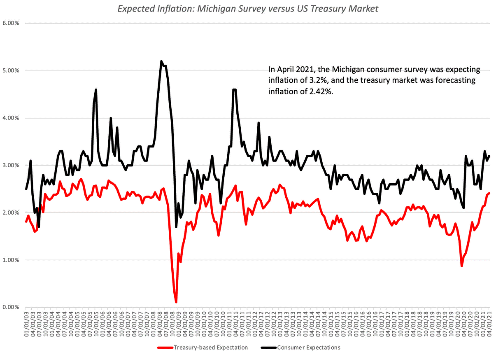

As we approach 2024, inflation continues to be a critical concern for investors, exerting pressure on their ability to preserve and grow their wealth amidst economic uncertainty. Inflation, characterized by a decrease in the purchasing power of money, can erode investment returns and complicate market dynamics, prompting the need for innovative strategies to protect financial portfolios. The complex relationship between rising prices and market volatility underscores the importance of employing effective methods to counteract inflationary pressures.

This article examines current hedging strategies specifically tailored to address inflationary environments. A key focus is on the integration of algorithmic trading, which has emerged as a valuable tool in effectively navigating contemporary financial markets. By leveraging advanced algorithms, investors can automate trading decisions that optimize their investment portfolios, swiftly adapting to fluctuating market conditions while minimizing human error.



Understanding the intricacies of inflation and relevant economic indicators is essential for developing robust strategies that mitigate inflation-related risks. In exploring these elements, investors and financial managers gain insight into best practices for implementing algorithmic trading techniques aimed at hedging against inflationary threats. Such strategies are vital in ensuring competitive performance in an increasingly unpredictable economic landscape.

Given the growing unpredictability in global economics, familiarity with these financial strategies is essential for investors and financial managers who seek to protect their assets in the upcoming year and beyond. The fusion of traditional investment approaches with innovative technological solutions like algorithmic trading provides new avenues for safeguarding and enhancing wealth, reinforcing the need for adaptability in a rapidly evolving economic environment.

## Table of Contents

## Understanding Inflation in 2024

Inflation, characterized by a decrease in the purchasing power of currency, continues to pose significant challenges to consumer spending and investment returns. As we approach 2024, numerous global economic factors are expected to sustain elevated inflation rates, requiring investors and policymakers to sharpen their understanding and response strategies.

Primarily, inflation can be categorized into three types: demand-pull, cost-push, and built-in inflation. Each type represents unique economic pressures and responses.

1. **Demand-Pull Inflation** occurs when the aggregate demand for goods and services exceeds their supply. This imbalance drives prices upward. It is often fueled by strong consumer spending and expansive fiscal policies. For instance, when governments increase expenditure or cut taxes without corresponding increases in production, it can lead to excess demand in the economy, thereby pushing prices higher.

2. **Cost-Push Inflation** results from the increased costs of production, which compel businesses to raise prices to maintain profit margins. Factors contributing to this type include rising wages, increased raw material costs, and supply chain constraints. Geopolitical tensions, such as trade wars or sanctions, can exacerbate cost-push inflation by disrupting global supply chains and increasing the cost of imported goods and services.

3. **Built-In Inflation**, also known as wage-price inflation, is based on the expectation of future inflation. As prices rise, workers demand higher wages, leading to increased production costs, which businesses pass on to consumers in the form of higher prices. This cycle creates a self-sustaining inflationary environment.

In 2024, several external factors are anticipated to contribute to inflationary pressures. Rising national debts in various countries often result in increased government borrowing, which can lead to higher interest rates and inflation. Fiscal policies that prioritize economic stimulus, such as large-scale infrastructure projects or expansive welfare programs, can also contribute to inflation if not managed within the context of overall economic productivity.

Geopolitical tensions play a crucial role as well. Conflicts or political instability can limit the flow of goods, increase transportation costs, and create uncertainty in financial markets, all of which can drive inflation.

Understanding these dimensions of inflation provides the foundation for developing effective hedging strategies. Investors and financial managers must align their portfolios to mitigate inflationary impacts, requiring insights into macroeconomic trends and an ability to anticipate policy shifts. Recognizing the distinct effects of different types of inflation allows for tailored strategies that safeguard purchasing power and return on investment amidst economic variability.

## Hedging Strategies against Inflation

Diversification remains a fundamental strategy for hedging against inflation, encouraging investors to include a variety of asset classes in their portfolios. This approach not only helps in mitigating risks associated with any single investment but also optimizes the chances of preserving purchasing power when inflation rates rise.

Investments in Treasury Inflation-Protected Securities (TIPS) are considered a prudent choice in an inflationary environment. TIPS are U.S. government bonds indexed to inflation, offering investors protection by ensuring that the principal amount increases with inflation, as measured by the Consumer Price Index (CPI). Thus, they provide a reliable hedge by maintaining the real value of investors’ returns. However, the primary disadvantage of TIPS lies in their typically lower yields compared to traditional government or corporate bonds, especially in low or stable inflation periods.

Commodities, particularly gold, are another traditional hedge against inflation. Gold has intrinsic value and historically tends to appreciate when currencies depreciate due to inflation. Its demand as a safe-haven asset often increases during times of economic uncertainty, bolstering its value. However, investors should be wary of its price [volatility](/wiki/volatility-trading-strategies) and the absence of income generation, such as dividends or interest, which might not align with all investors' goals.

Real estate investments can also serve as a robust inflation hedge. Real properties tend to appreciate with inflation, and rental income often adjusts upward as inflation rises, providing a dual benefit of income and capital gains. However, potential downsides include [liquidity](/wiki/liquidity-risk-premium) issues, high transaction costs, and the influence of [interest rate](/wiki/interest-rate-trading-strategies) changes on property values.

High-yield savings accounts, which offer higher interest rates than traditional savings accounts, can also help preserve purchasing power during inflationary periods. While they do not provide substantial returns and might not completely offset inflation's effects, they do offer security and liquidity, which can be advantageous in uncertain economic times.

In balancing these options, the key is to weigh the risk-return trade-off. Investors must critically assess their risk tolerance and investment goals, ensuring that the portfolio comprises a mix of assets that collectively safeguard against the eroding effects of inflation. By strategically allocating investments across TIPS, commodities, real estate, and high-yield savings, investors can aim to maintain, if not enhance, their purchasing power amidst economic fluctuations.

## Algorithmic Trading as a Tool for Hedging

Algorithmic trading (algo trading) refers to the use of computer programs and algorithms to make trading decisions and execute orders. This approach has become increasingly popular as a method to hedge against market volatility and inflationary pressures. By leveraging advanced mathematical models and high-speed computation, [algorithmic trading](/wiki/algorithmic-trading) can optimize portfolio performance through rapid responses to dynamic market conditions.

Algo trading offers various strategies to manage inflation risks. One widely utilized strategy is statistical [arbitrage](/wiki/arbitrage), which involves the simultaneous buying and selling of correlated securities to benefit from pricing inefficiencies. Another effective algorithm is the moving average crossover, which exploits trends in asset prices. By setting short-term and long-term moving averages, this strategy identifies optimal buy or sell points when the short-term moving average crosses the long-term moving average.

Machine learning algorithms have also enhanced trading strategies by identifying complex patterns in financial data that human traders might overlook. Algorithms like the Random Forest and Gradient Boosting can be used to analyze factors contributing to inflationary trends, allowing traders to anticipate and react to changes more efficiently. Here's an example of a simple moving average crossover strategy implemented in Python:

```python
import pandas as pd
import numpy as np

# Load historical price data
data = pd.read_csv('price_data.csv')
data['Short_MA'] = data['Close'].rolling(window=20).mean()
data['Long_MA'] = data['Close'].rolling(window=50).mean()

# Generate trading signals
data['Signal'] = 0
data['Signal'][20:] = np.where(data['Short_MA'][20:] > data['Long_MA'][20:], 1, 0)
data['Position'] = data['Signal'].diff()

# Print trading signals
print(data[['Date', 'Close', 'Short_MA', 'Long_MA', 'Position']].tail())
```

The benefits of algorithmic trading extend beyond strategy efficiency. Automation reduces human error, as algorithms are not influenced by emotions or cognitive biases that may affect manual trading. Furthermore, algo trading ensures increased speed and precision in order execution, crucial for capitalizing on transient market opportunities.

In summary, algorithmic trading provides robust tools for investors seeking to hedge against inflation. By employing algorithms capable of adapting to market shifts, traders can not only minimize risks associated with inflation but also enhance their ability to capitalize on market opportunities.

## Implementing Algorithmic Strategies

Implementing algorithmic strategies in trading requires selecting appropriate platforms and tools, ensuring an effective approach to managing market conditions such as inflation. When selecting a trading platform, consider user-friendliness, algorithmic capabilities, and cost-effectiveness. A user-friendly platform reduces the learning curve for traders, allowing them to navigate the system with ease and focus on strategy development. Algorithmic capabilities are crucial, as they determine the breadth and sophistication of strategies that can be implemented. Robust platforms should support a range of algorithms, from simple moving averages to complex [machine learning](/wiki/machine-learning) models. Cost-effectiveness includes low transaction fees and minimal operational costs, maximizing potential returns on investment.

Backtesting is a critical process in algorithmic trading. It involves evaluating a trading strategy on historical data to assess its viability and performance. The goal is to determine whether a strategy is likely to be profitable and to understand its potential risks. For a backtest to be reliable, it should use data that reflects varying market conditions, including periods of high inflation. Traders can utilize Python libraries like `[backtrader](/wiki/backtrader)`, which allows for comprehensive testing and evaluation of strategies. Here's a simple example to backtest a moving average crossover strategy:

```python
import backtrader as bt

# Create a strategy
class MovingAverageCrossover(bt.Strategy):
    params = (("fast", 10), ("slow", 30),)

    def __init__(self):
        self.fast_ma = bt.indicators.SimpleMovingAverage(self.datas[0], period=self.params.fast)
        self.slow_ma = bt.indicators.SimpleMovingAverage(self.datas[0], period=self.params.slow)
        self.crossover = bt.indicators.CrossOver(self.fast_ma, self.slow_ma)

    def next(self):
        if self.crossover > 0:  # A buy signal
            self.buy()
        elif self.crossover < 0:  # A sell signal
            self.sell()

# Initialize Cerebro and add strategy
cerebro = bt.Cerebro()
cerebro.addstrategy(MovingAverageCrossover)

# Data feed
data = bt.feeds.YahooFinanceData(dataname='AAPL', fromdate=datetime(2020, 1, 1), todate=datetime(2023, 1, 1))
cerebro.adddata(data)

# Run the backtest
cerebro.run()
cerebro.plot()
```

Developing and refining algorithmic models to adapt to inflationary environments involves continuous monitoring and adjustment. This may require incorporating economic indicators like the Consumer Price Index (CPI) or using machine learning algorithms to predict inflation trends and adjust trading strategies accordingly. Data science techniques such as feature selection and hyperparameter tuning in models can enhance the predictive accuracy of inflation-related economic indicators.

Furthermore, consider using ensemble methods, which combine predictions from multiple models to improve stability and robustness in diverse market environments. The integration of macroeconomic data analysis can also support the adaptability of algorithmic models, maintaining their relevance and efficacy under changing economic conditions.

By carefully choosing platforms with robust [backtesting](/wiki/backtesting) capabilities and refining models in response to economic shifts, investors and traders can optimize their algorithmic strategies, ensuring sustained performance even amidst inflationary pressures.

## Conclusion and Future Outlook

As inflation is projected to remain above historical norms, adopting proactive hedging strategies becomes vital for financial survival and growth. The marriage of conventional investment avenues with cutting-edge technological advancements like algorithmic trading opens new avenues for safeguarding and augmenting wealth.

Traditional investments, while reliable, often lack the agility required to counteract the rapid fluctuations brought about by inflationary pressures. On the other hand, algorithmic trading offers a dynamic approach, enabling investors to swiftly adjust their portfolios according to real-time market changes. By automating trade decisions through pre-set algorithms, investors can minimize human error, capitalize on minute market discrepancies, and maintain a more stable financial footing.

To thrive amidst these economic challenges, investors must grasp the interplay between traditional investments and modern algorithmic tools. Through this understanding, they can exploit the strengths of both to create diversified and resilient portfolios that can endure inflationary scenarios.

Looking ahead, staying informed and adaptable in an ever-shifting economic landscape is imperative. This means continuously updating knowledge on financial trends, embracing technological innovations, and refining investment strategies accordingly. With a well-rounded approach and a readiness to evolve, investors can not only safeguard their assets but also leverage inflationary periods to potentially expand their wealth.

Thus, embracing a future-oriented perspective ensures that investors remain well-equipped to handle the uncertainties of the economic climate in 2024 and beyond.

## FAQs

### What are the most effective assets for hedging against inflation?

Inflation erodes the purchasing power of money, making it crucial for investors to select assets that can help preserve value. Some of the most effective assets include:

1. **Treasury Inflation-Protected Securities (TIPS)**: These are government bonds specifically designed to shield against inflation. Their principal increases with inflation and decreases with deflation, providing a reliable hedge.

2. **Commodities**: Investments in commodities like gold, silver, and oil often protect against inflation, as their prices typically rise when the value of currency falls.

3. **Real Estate**: Properties tend to appreciate over time and rental income can increase with inflation, making real estate a solid hedge.

4. **Stocks in Certain Sectors**: Companies in sectors like energy, utilities, and consumer staples often demonstrate resilience and can pass increased costs to consumers during inflationary periods.

### How can algorithmic trading help in managing inflationary risks?

Algorithmic trading utilizes automated systems to make trading decisions, offering several benefits for managing inflationary risks:

- **Speed and Efficiency**: Algorithms can execute trades much faster than human traders, allowing for quick adjustments in response to market changes.

- **Pattern Recognition**: Advanced algorithms can analyze historical data to recognize inflationary trends and predict future occurrences, enabling preemptive investment actions.

- **Reduced Human Error**: By automating trades, the potential for mistakes due to emotional or impulsive decisions decreases significantly.

- **Optimization of Portfolio**: Algorithms can be programmed to automatically rebalance portfolios, ensuring that the asset mix continues to hedge against inflation effectively.

### What resources are available for learning about implementing algorithmic trading strategies?

There are numerous resources for those seeking to learn about algorithmic trading, ranging from online courses to dedicated platforms:

- **Online Courses**: Websites like Coursera, Udemy, and edX offer courses in algorithmic trading and quantitative finance.

- **Books**: Titles like "Algorithmic Trading: Winning Strategies and Their Rationale" by Ernest Chan and "Quantitative Trading" by Xin Guo provide valuable insights.

- **Trading Platforms**: Platforms such as QuantConnect and TradeStation offer learning modules and backtesting capabilities for developing and refining trading algorithms.

- **Open Source Libraries**: Python libraries like PyAlgoTrade and Backtrader are instrumental in building and testing trading strategies.

### Are there specific stocks or sectors that perform well during inflation?

Yes, certain stocks and sectors are generally better positioned to withstand or even benefit from inflation:

- **Energy Sector**: Companies involved in oil, gas, and renewable energy often benefit from rising energy prices, a common feature of inflationary environments.

- **Consumer Staples**: This sector includes companies producing essential goods like food and household items, which maintain steady demand regardless of economic conditions.

- **Utilities**: Utility companies, such as those providing water, electricity, and natural gas, tend to have stable earnings, even as prices increase.

- **Financials**: Banks and financial institutions may profit from rising interest rates, a common occurrence during periods of high inflation.

### How should one evaluate the performance of a hedging strategy?

Evaluating a hedging strategy involves assessing several key performance metrics:

1. **Return on Investment (ROI)**: Calculate the profit or loss relative to the initial investment to measure overall performance.
$$
   \text{ROI} = \left( \frac{\text{Final Value} - \text{Initial Value}}{\text{Initial Value}} \right) \times 100\%

$$

2. **Volatility**: Analyze the price fluctuations of the portfolio to understand risk exposure. Lower volatility indicates a more stable hedge.

3. **Sharpe Ratio**: This metric indicates the risk-adjusted return of a portfolio:
$$
   \text{Sharpe Ratio} = \frac{\text{Average Portfolio Return} - \text{Risk-Free Rate}}{\text{Standard Deviation of Portfolio Return}}

$$

4. **Benchmark Comparison**: Compare the portfolio's performance against a benchmark index to determine relative success.

5. **Inflation Protection**: Assess if the hedging strategy effectively maintains or increases purchasing power during inflationary periods.

## References & Further Reading

[1]: Bergstra, J., Bardenet, R., Bengio, Y., & Kégl, B. (2011). ["Algorithms for Hyper-Parameter Optimization."](https://papers.nips.cc/paper/4443-algorithms-for-hyper-parameter-optimization) Advances in Neural Information Processing Systems 24.

[2]: ["Advances in Financial Machine Learning"](https://www.amazon.com/Advances-Financial-Machine-Learning-Marcos/dp/1119482089) by Marcos Lopez de Prado

[3]: ["Evidence-Based Technical Analysis: Applying the Scientific Method and Statistical Inference to Trading Signals"](https://www.amazon.com/Evidence-Based-Technical-Analysis-Scientific-Statistical/dp/0470008741) by David Aronson

[4]: ["Machine Learning for Algorithmic Trading"](https://github.com/stefan-jansen/machine-learning-for-trading) by Stefan Jansen

[5]: ["Quantitative Trading: How to Build Your Own Algorithmic Trading Business"](https://www.amazon.com/Quantitative-Trading-Build-Algorithmic-Business/dp/1119800064) by Ernest P. Chan