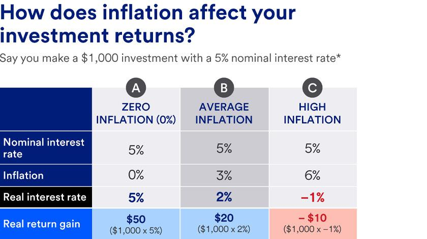

## Table of Contents

## What is inflation?

Inflation is when the prices of things we buy, like food and toys, go up over time. It means that the money we have can buy less than it could before. For example, if a toy costs $10 today, in a year it might cost $11 because of inflation. This happens because the amount of money in the economy grows faster than the number of goods and services available.

Inflation can be caused by many things. Sometimes, it happens when people want to buy more things than there are available, which is called demand-pull inflation. Other times, it can happen if it costs more to make things, like if the price of materials goes up, which is called cost-push inflation. Governments and banks try to keep inflation at a steady level so that it doesn't hurt the economy too much.

## How is inflation measured?

Inflation is measured by looking at how much the prices of a bunch of different things change over time. Economists use something called a "price index" to do this. The most common one is the Consumer Price Index (CPI), which tracks the prices of things that people buy every day, like food, clothes, and gas. They pick a bunch of these items and see how their prices change from one month or year to the next. If the prices go up, that means there's inflation.

To figure out the inflation rate, economists compare the price index from one period to another. For example, if the CPI was 100 last year and it's 102 this year, that means prices have gone up by 2%. They usually look at the change over a year to get the annual inflation rate. Sometimes, they also use other indexes like the Producer Price Index (PPI), which looks at the prices that businesses pay for things they need to make their products. All these measures help us understand how fast prices are rising and how inflation is affecting the economy.

## What causes inflation?

Inflation can happen for a few main reasons. One big reason is when people want to buy more things than there are available. This is called demand-pull inflation. Imagine if everyone suddenly wanted to buy more toys, but the toy factory couldn't make enough toys fast enough. The price of toys would go up because there are more people wanting to buy them than there are toys to sell. This can happen when the economy is doing really well and people have more money to spend.

Another reason for inflation is when it costs more to make things. This is called cost-push inflation. For example, if the price of the materials needed to make toys goes up, like if plastic becomes more expensive, then the toy factory might have to charge more for the toys to cover their costs. This can also happen if workers want higher wages and businesses have to pay them more, which can lead to higher prices for everything.

Governments and central banks can also affect inflation. If they print more money or lower interest rates, there can be more money in the economy, which can lead to higher prices. They try to keep inflation at a steady level, usually around 2%, because too much inflation can make it hard for people to afford things, and too little inflation can slow down the economy.

## How does inflation affect the economy?

Inflation can change how the economy works in big ways. When prices go up, the money people have can buy less than before. This can make it harder for people to afford things they need, like food and clothes. If inflation is too high, people might start saving their money instead of spending it, which can slow down the economy. Businesses might also find it hard to plan for the future because they don't know if the cost of making things will keep going up.

On the other hand, a little bit of inflation can be good for the economy. It can encourage people to spend money now instead of saving it, because they know prices might be higher later. This can help businesses grow and create more jobs. Also, if wages go up with inflation, people can still afford to buy things. Governments and banks try to keep inflation at a steady level, usually around 2%, to help the economy stay healthy.

## What is the relationship between inflation and interest rates?

Inflation and interest rates are closely connected. When inflation goes up, central banks often raise interest rates to try to slow it down. This is because higher interest rates make borrowing money more expensive. When borrowing costs more, people and businesses might borrow less and spend less, which can help bring down the demand for things and, in turn, lower inflation.

On the other hand, if inflation is too low, central banks might lower interest rates to encourage more spending and borrowing. When interest rates are low, it's cheaper to borrow money, so people and businesses might take out more loans to buy things or invest in new projects. This can increase demand and push inflation up a bit, which is good if it helps the economy grow without getting too hot. So, central banks use interest rates as a tool to keep inflation at a healthy level, usually around 2%.

## How does inflation impact personal savings?

Inflation can make your savings worth less over time. If you have money saved in a bank account that doesn't earn much interest, and inflation is going up, the things you want to buy with your savings will cost more in the future. For example, if you save $100 and inflation is 3% per year, after a year, you might be able to buy less with that $100 because prices have gone up. This means your savings lose buying power, which is why people sometimes say inflation "eats away" at savings.

To protect your savings from inflation, you can try to earn more interest on your money than the rate of inflation. If you can find a savings account or investment that gives you more interest than the inflation rate, your money will grow faster than prices are going up. This way, you can keep up with inflation and maybe even come out ahead. But it's important to remember that some investments can be risky, so you need to think carefully about where you put your money.

## What are the effects of inflation on different types of investments?

Inflation can affect different types of investments in different ways. For investments like savings accounts or bonds that pay a fixed [interest rate](/wiki/interest-rate-trading-strategies), inflation can be bad news. If the interest you earn is less than the inflation rate, your money loses buying power over time. For example, if your savings account gives you 1% interest but inflation is 3%, you're actually losing money because the things you want to buy will cost more in the future.

On the other hand, some investments can do well when inflation goes up. Things like real estate or stocks can sometimes keep up with or even outpace inflation. Real estate might go up in value as prices rise, and companies might be able to charge more for their products, which can make their stocks worth more. But these investments can also be risky, so you need to think carefully about where you put your money.

Overall, it's important to consider inflation when you're deciding where to invest your money. Different investments react differently to inflation, so you might want to have a mix of investments to help protect your money from losing value over time. Talking to a financial advisor can help you make the best choices for your situation.

## How can investors protect their portfolios from inflation?

Investors can protect their portfolios from inflation by choosing investments that tend to do well when prices go up. One good option is real estate. When inflation rises, the value of properties often goes up too, and landlords can charge more rent. Another option is stocks, especially those of companies that can raise their prices as costs go up. These companies might be able to keep making money even when inflation is high, which can make their stocks more valuable. It's also a good idea to look into commodities like gold or oil, which can act as a hedge against inflation because their prices often go up when the value of money goes down.

Another way to protect your money from inflation is by investing in Treasury Inflation-Protected Securities (TIPS). These are special bonds from the government that adjust their value based on inflation. If inflation goes up, the value of TIPS goes up too, so they help keep your money's buying power the same. It's also smart to keep some of your money in cash or cash equivalents, like money market funds, but make sure they earn enough interest to at least keep up with inflation. By having a mix of these types of investments, you can help make sure your portfolio stays strong even when prices are rising.

## What are inflation-protected securities and how do they work?

Inflation-protected securities are special types of bonds that help protect your money from losing value when prices go up. The most common kind in the United States are called Treasury Inflation-Protected Securities, or TIPS for short. These are bonds issued by the government, and they work by adjusting the bond's value based on changes in inflation. If inflation goes up, the value of the bond goes up too, so the money you get back at the end is worth more. This helps make sure that your investment keeps up with the rising cost of things.

When you buy a TIPS bond, you get regular interest payments, just like with other bonds. But the cool thing is, these interest payments also go up with inflation. So, if inflation is 2%, your interest payment will go up by 2% too. This way, the money you earn from the bond keeps the same buying power over time. TIPS can be a good choice if you want to make sure your savings don't lose value when prices are going up.

## How do central banks use monetary policy to manage inflation?

Central banks use something called monetary policy to keep inflation under control. One of the main tools they use is changing interest rates. If inflation is too high, the central bank might raise interest rates to make borrowing money more expensive. When borrowing costs more, people and businesses might spend less, which can help slow down the demand for things and bring inflation down. On the other hand, if inflation is too low, the central bank might lower interest rates to make borrowing cheaper. This can encourage people and businesses to borrow and spend more, which can help push inflation up a little bit.

Another way central banks manage inflation is by controlling the amount of money in the economy. If there's too much money chasing too few goods, prices can go up fast. To fix this, the central bank might use tools like selling government bonds to take money out of the economy. This can help slow down inflation. If inflation is too low, the central bank might buy bonds to put more money into the economy, which can help increase spending and push inflation up. By carefully adjusting these tools, central banks try to keep inflation at a healthy level, usually around 2%, to help the economy stay stable.

## What historical examples illustrate the impact of high inflation on investments?

One big example of high inflation's impact on investments happened in Germany after World War I, during the 1920s. This time is known as the Weimar Republic's hyperinflation. People who saved their money in banks saw it become almost worthless because prices were going up so fast. For example, if someone had money saved, they might find that the cost of a loaf of bread went from a few marks to millions of marks in just a few months. People who owned things like land or gold did better because these things kept their value better than money. This shows how high inflation can make some investments lose a lot of value while others can hold up better.

Another example is from the late 1970s and early 1980s in the United States. During this time, inflation was really high, sometimes over 10% a year. People who had money in savings accounts or bonds that paid a fixed interest rate saw their savings lose buying power because the interest they earned was less than the inflation rate. On the other hand, some people who invested in things like real estate or stocks did better. Real estate prices went up with inflation, and some companies could raise their prices to keep up with costs, which helped their stock prices. This shows that during times of high inflation, it's important to think about what kinds of investments might do better and protect your money from losing value.

## How can advanced investment strategies mitigate the risks associated with inflation?

Advanced investment strategies can help protect your money from inflation by spreading it across different types of investments. One way to do this is through diversification, which means not putting all your money in one place. For example, you might invest in a mix of stocks, real estate, commodities like gold, and inflation-protected securities like TIPS. Each of these investments reacts differently to inflation, so if one goes down, another might go up, helping to balance out your overall risk. Another strategy is to use inflation swaps, which are agreements between investors to exchange cash flows based on inflation rates. This can help you earn more if inflation goes up, protecting your money from losing value.

Another advanced strategy is investing in assets that tend to do well during inflation, like real assets. Real assets are things you can touch, like property or natural resources. These often go up in value when inflation rises because their prices can be adjusted to keep up with costs. For example, if you own a rental property, you can raise the rent as inflation goes up, which helps your investment keep its value. Also, some investors use hedging strategies, like buying options or futures contracts, to protect against inflation. These financial tools can help lock in prices for things you want to buy in the future, making sure you don't pay more if inflation goes up. By using these strategies, you can better manage the risks that come with inflation and keep your investments strong.

## What is the Impact of Inflation on Different Asset Classes?

Asset classes such as stocks, bonds, and real estate exhibit varied sensitivities to inflation, affecting their valuation and attractiveness to investors.

### Stocks

Stock market valuations are sensitive to inflation, primarily through the influence on corporate earnings. Higher inflation can lead to increased costs for companies, such as raw materials and labor expenses. This can compress profit margins if companies are unable to pass these costs to consumers through higher prices, potentially leading to lower earnings and, consequently, impacting stock prices. For example, if a company with an earnings yield of 5% experiences inflation at 3%, the real return is reduced to 2%.

Companies operating in sectors where price increases can be swiftly passed onto consumers or where long-term fixed costs dominate (like utilities) might fare better during inflationary periods. Conversely, sectors with high operating leverage and competitive pricing might see disproportionate impacts.

### Bonds

Bonds are particularly affected by inflation because it erodes the purchasing power of their fixed interest payments. When inflation rises, the real value of these payments decreases, leading to a drop in bond prices. The inverse relationship between interest rates and bond prices can be mathematically understood via the bond price formula:

$$
P = \sum_{t=1}^{n} \frac{C}{(1 + i)^t} + \frac{F}{(1 + i)^n}
$$

where $P$ is the bond price, $C$ is the coupon payment, $F$ is the face value of the bond, $n$ is the number of periods, and $i$ is the interest rate. As $i$ increases with rising inflation, $P$ decreases.

Inflation-protected securities, such as Treasury Inflation-Protected Securities (TIPS), are designed to shield against this risk, as their principal value is adjusted according to changes in the Consumer Price Index (CPI).

### Real Estate

Real estate often benefits from inflation, as property values and rental incomes tend to increase. Real estate can act as a hedge against inflation because these tangible assets often appreciate in value over time, thereby maintaining or increasing purchasing power. Additionally, as the cost of replacing buildings increases with inflation, existing properties may gain more value.

Apart from price appreciation, rental income can also increase during inflationary periods. Property owners often have the ability to adjust rent upwards in response to inflation, thereby potentially maintaining or enhancing income streams.

### Conclusion

Understanding the differential impacts of inflation on various asset classes is crucial for investors to effectively manage risks and optimize returns. Stocks, bonds, and real estate each respond uniquely to inflationary pressures, requiring tailored investment strategies to manage portfolio resilience in fluctuating economic conditions.

## References & Further Reading

[1]: ["Algorithmic Trading and DMA: An Introduction to Direct Access Trading Strategies"](https://www.semanticscholar.org/paper/Algorithmic-trading-%26-DMA-%3A-an-introduction-to-Johnson/aa5de1ab883d5e23b6651faa7c1807586d688e4b) by Barry Johnson

[2]: ["Advances in Financial Machine Learning"](https://www.amazon.com/Advances-Financial-Machine-Learning-Marcos/dp/1119482089) by Marcos Lopez de Prado

[3]: ["Machine Learning for Asset Managers"](https://www.cambridge.org/core/elements/machine-learning-for-asset-managers/6D9211305EA2E425D33A9F38D0AE3545) by Marcos Lopez de Prado

[4]: ["The Psychology of Money: Timeless Lessons on Wealth, Greed, and Happiness"](https://www.amazon.com/Psychology-Money-Timeless-lessons-happiness/dp/0857197681) by Morgan Housel

[5]: ["Financial Market Analysis"](https://www.imf.org/en/Capacity-Development/Training/ICDTC/Courses/FMAx) by David Blake

[6]: ["The Intelligent Investor"](https://en.wikipedia.org/wiki/The_Intelligent_Investor) by Benjamin Graham

[7]: ["The Little Book of Common Sense Investing: The Only Way to Guarantee Your Fair Share of Stock Market Returns"](https://www.amazon.com/Little-Book-Common-Sense-Investing/dp/1119404509) by John C. Bogle

[8]: ["Principles of Real Estate Practice"](https://www.amazon.com/Principles-Real-Estate-Practice-7th/dp/1955919313) by Stephen Mettling and David Cusic