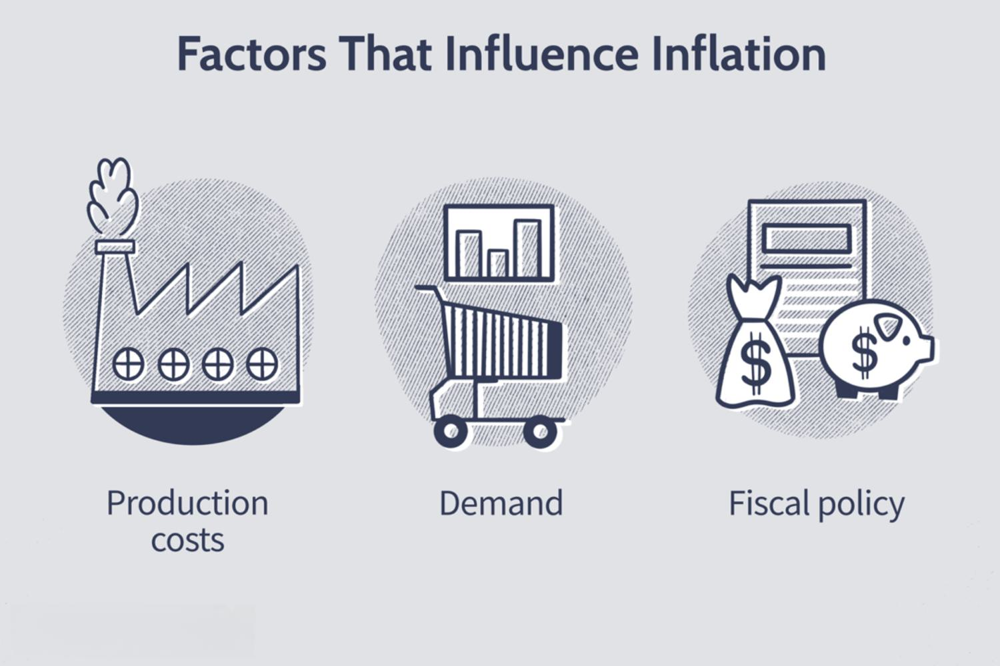

Inflation is a pivotal economic indicator that influences a broad spectrum of sectors, including consumer goods and financial markets. This sustained increase in the prices of goods and services can signal changes in the economic environment affecting purchasing power, savings, and investments. For investors, the dynamics of inflation are particularly significant as they directly impact asset prices and investment returns. Understanding the various causes of inflation, from demand-pull and cost-push factors to built-in inflation, is essential for developing effective strategies that withstand economic fluctuations.

Investment strategies must account for inflation as it can erode the real value of returns. Different asset classes, such as stocks, bonds, and real estate, exhibit varying sensitivities to inflationary pressures, requiring informed decision-making to optimize portfolio performance.



This article examines key economic trends associated with inflation, elucidating its impact on investment returns. Additionally, the role of algorithmic trading in managing and mitigating the effects of inflation within financial markets is explored. Algorithmic trading leverages data and technology to adapt to inflationary signals, providing sophisticated means to optimize trading decisions for enhanced financial outcomes. Understanding these elements is critical for investors aiming to navigate inflationary environments successfully, ensuring the preservation and growth of their wealth amidst changing economic landscapes.

## Table of Contents

## Understanding Inflation and Economic Trends

Inflation is the sustained increase in the prices of goods and services across an economy. It is a pivotal economic indicator as it gauges the erosion of purchasing power and provides insights into the economic health of a nation. Inflation is typically measured by indices such as the Consumer Price Index (CPI) and the Producer Price Index (PPI). CPI tracks the changes in prices for a basket of consumer goods and services, while PPI measures the average change over time in the selling prices received by domestic producers for their output. These indices reflect shifts in consumer purchasing power and are essential for understanding the broader economic landscape.

Several economic dynamics influence inflationary trends, including Gross Domestic Product (GDP) growth, employment rates, and monetary policy. GDP growth is closely linked to inflation; a rapidly growing economy may experience increased demand for goods and services, potentially leading to higher prices. Conversely, stagnant or declining GDP growth can suppress price levels. Employment rates also play a critical role; higher employment levels usually boost consumer spending, which can drive demand-pull inflation, where demand exceeds supply, causing prices to rise.

Monetary policy, primarily conducted by central banks, is a crucial tool in managing inflation. Central banks, such as the Federal Reserve in the United States, utilize policy instruments like interest rates to influence economic activity. For instance, increasing interest rates can help tame inflation by making borrowing more expensive, thereby reducing spending and slowing down the economy. Conversely, decreasing rates can spur economic growth by making borrowing cheaper, which can increase spending. Therefore, central banks monitor inflation closely to adjust these rates accordingly and ensure economic stability.

In conclusion, understanding these economic trends and their intricate relationships with inflation is vital for policymakers and investors alike. It helps them make informed decisions about fiscal and monetary policies and investment strategies. Comprehensive analysis of inflation and its driving factors lays the groundwork for strategic planning in both government and financial arenas.

## Impact of Inflation on Different Asset Classes

Asset classes such as stocks, bonds, and real estate exhibit varied sensitivities to inflation, affecting their valuation and attractiveness to investors.

### Stocks

Stock market valuations are sensitive to inflation, primarily through the influence on corporate earnings. Higher inflation can lead to increased costs for companies, such as raw materials and labor expenses. This can compress profit margins if companies are unable to pass these costs to consumers through higher prices, potentially leading to lower earnings and, consequently, impacting stock prices. For example, if a company with an earnings yield of 5% experiences inflation at 3%, the real return is reduced to 2%.

Companies operating in sectors where price increases can be swiftly passed onto consumers or where long-term fixed costs dominate (like utilities) might fare better during inflationary periods. Conversely, sectors with high operating leverage and competitive pricing might see disproportionate impacts.

### Bonds

Bonds are particularly affected by inflation because it erodes the purchasing power of their fixed interest payments. When inflation rises, the real value of these payments decreases, leading to a drop in bond prices. The inverse relationship between interest rates and bond prices can be mathematically understood via the bond price formula:

$$
P = \sum_{t=1}^{n} \frac{C}{(1 + i)^t} + \frac{F}{(1 + i)^n}
$$

where $P$ is the bond price, $C$ is the coupon payment, $F$ is the face value of the bond, $n$ is the number of periods, and $i$ is the interest rate. As $i$ increases with rising inflation, $P$ decreases.

Inflation-protected securities, such as Treasury Inflation-Protected Securities (TIPS), are designed to shield against this risk, as their principal value is adjusted according to changes in the Consumer Price Index (CPI).

### Real Estate

Real estate often benefits from inflation, as property values and rental incomes tend to increase. Real estate can act as a hedge against inflation because these tangible assets often appreciate in value over time, thereby maintaining or increasing purchasing power. Additionally, as the cost of replacing buildings increases with inflation, existing properties may gain more value.

Apart from price appreciation, rental income can also increase during inflationary periods. Property owners often have the ability to adjust rent upwards in response to inflation, thereby potentially maintaining or enhancing income streams.

### Conclusion

Understanding the differential impacts of inflation on various asset classes is crucial for investors to effectively manage risks and optimize returns. Stocks, bonds, and real estate each respond uniquely to inflationary pressures, requiring tailored investment strategies to manage portfolio resilience in fluctuating economic conditions.

## Investment Strategies Amid Inflationary Conditions

Investors face unique challenges during inflationary periods as rising prices can erode the value of returns. To mitigate such risks, they often employ diversified investment strategies that include commodities and Treasury Inflation-Protected Securities (TIPS). Commodities, such as gold and oil, typically maintain or increase their value when inflation is high, providing a natural hedge. TIPS, issued by the U.S. Department of the Treasury, are explicitly designed to protect against inflation. Unlike regular Treasury bonds, the principal value of TIPS increases with the Consumer Price Index (CPI), ensuring that the purchasing power of the investment remains safeguarded.

Strategic asset allocation plays a critical role. Maintaining a mix of asset classes with varying sensitivities to inflation helps in cushioning portfolio returns against volatile economic conditions. By systematically balancing allocations among asset classes such as equities, fixed-income securities, real estate, and alternative investments, investors can harness different responses to inflation. For instance, equities may offer growth potential, while real estate often benefits from value appreciation.

Portfolio rebalancing is another critical component, especially in inflationary environments. Rebalancing involves periodically adjusting the portfolio to maintain the desired asset allocation. This strategy ensures that investors can capitalize on gains and minimize risks associated with overexposure to any single asset class affected by inflationary pressures.

Risk management is paramount to addressing inflation-induced [volatility](/wiki/volatility-trading-strategies). Investors can adopt various practices, such as using financial derivatives like options and futures, to hedge against adverse market movements. Moreover, regular portfolio reviews and stress-testing against different inflation scenarios enable investors to identify potential vulnerabilities and adapt strategies accordingly.

By integrating these strategies, investors can better protect their portfolios and potentially enhance returns despite the challenges posed by inflation.

## The Role of Algorithmic Trading in Inflation Management

Algorithmic trading leverages automated systems to execute trades at optimal times, aiming to minimize human error and capitalize on market inefficiencies. This method increasingly incorporates inflation data for refining algorithmic market predictions, which becomes particularly pertinent given the variable impact of inflation on asset prices. By integrating comprehensive market indicators, such as the Consumer Price Index (CPI), algorithmic systems can adjust and respond more effectively to changing inflationary conditions.

Machine learning models are integral to enhancing the adaptability of these trading algorithms. They enable dynamic adjustments in response to real-time economic data, thus improving the accuracy of trade execution. For instance, [machine learning](/wiki/machine-learning) techniques can be applied to large datasets containing historical inflation rates and asset prices, facilitating the identification of patterns and trends that human traders might overlook. 

A typical [algorithmic trading](/wiki/algorithmic-trading) strategy that incorporates inflation data might begin by establishing a baseline model using linear regression to predict asset prices based on past inflation rates. However, more advanced models make use of [deep learning](/wiki/deep-learning) techniques like neural networks, which can capture nonlinear relationships between inflation and market variables. Consider a basic implementation using Python:

```python
import numpy as np
from sklearn.model_selection import train_test_split
from sklearn.linear_model import LinearRegression

# Sample historical data: [CPI, asset_prices]
data = np.array([
    [2.1, 150],
    [2.3, 152],
    ...  # Add as many data points as needed
])

X = data[:, 0].reshape(-1, 1)  # CPI
y = data[:, 1]  # Asset prices

# Split data into training and testing
X_train, X_test, y_train, y_test = train_test_split(X, y, test_size=0.2, random_state=42)

# Train a linear regression model
model = LinearRegression().fit(X_train, y_train)

# Predict asset prices based on CPI
predictions = model.predict(X_test)
```

In a more sophisticated setup, integration with real-time inflation data could utilize APIs to update models dynamically, ensuring responsiveness to the latest economic conditions. 

Application of machine learning models such as Long Short-Term Memory (LSTM) networks, designed for time series analysis, offers even more precision. These models capture temporal dependencies in the data, which are particularly useful for predicting market trends influenced by inflation.

The ability of algorithms to evolve is bolstered not only by historical data but also by ongoing innovations in AI technologies. As these models become more advanced, they promise improvements in predicting the economic effects of inflation and optimizing investment strategies accordingly. Hence, algorithmic trading, armed with inflation insights, provides a powerful tool for investors aiming to navigate the complexities of financial markets under inflationary pressures.

## Adapting Algorithms for Inflation and Economic Trends

Trading algorithms are essential tools in modern financial markets, increasingly adapting to inflation and economic trends to optimize performance. These algorithms integrate historical data and employ sophisticated techniques to forecast future market dynamics. Key among these techniques is the analysis of historical inflation impacts on various asset classes, providing insights into potential future outcomes. By examining past inflationary periods, algorithms adjust their predictions and improve decision-making efficacy.

### Backtesting and Historical Analysis

Backtesting is a critical methodology for evaluating how trading strategies would have performed in different economic conditions, particularly during inflationary periods. It involves using historical data to simulate past trading activities, assessing the performance of algorithmic strategies over time. By incorporating inflation data into [backtesting](/wiki/backtesting) processes, traders identify patterns and correlations between inflation rates and asset price movements. This historical understanding enables the refinement of trading decisions and forecasting accuracy. For example, if a particular asset consistently loses value during high inflation, trading algorithms can adjust to reduce exposure to that asset when inflationary trends arise. 

### Enhancing Predictive Abilities with AI

Artificial intelligence (AI) technologies have significantly advanced the predictive capabilities of trading algorithms. Machine learning models, for instance, learn from vast datasets, identifying non-linear patterns and relationships that may not be apparent through traditional analytical methods. Algorithms can utilize supervised learning techniques to predict asset price changes in response to inflationary pressures. For instance, regression models can be trained with features like historical inflation rates, interest rates, and commodity prices to predict future price movements across various asset classes. Python libraries such as scikit-learn and TensorFlow are widely used in developing such machine learning models. 

```python
import numpy as np
from sklearn.model_selection import train_test_split
from sklearn.ensemble import RandomForestRegressor

# Example: Predictive model for asset prices
def predict_asset_prices(historical_data, target_prices):
    X_train, X_test, y_train, y_test = train_test_split(historical_data, target_prices, test_size=0.2)
    model = RandomForestRegressor(n_estimators=100, random_state=42)
    model.fit(X_train, y_train)
    predictions = model.predict(X_test)
    return predictions

# Historical data could include various economic indicators
historical_data = np.array([...])  # Example: Replace with actual historical data
target_prices = np.array([...])  # Example: Replace with asset prices

predictions = predict_asset_prices(historical_data, target_prices)
```

### Case Studies and Practical Applications

Numerous case studies demonstrate successful algorithmic adjustments to rising inflation. In these examples, algorithms have been refined to incorporate consumer price indices (CPI) and producer price indices (PPI) data, adjusting asset allocation and diversifying portfolios in response to inflationary signals. A noteworthy example includes algorithms used by hedge funds that optimize commodity holdings during inflationary spikes due to commodities' typically inversely correlated behavior to inflation. Such strategies effectively manage the risk posed by inflation, enhancing portfolio resilience.

In summary, trading algorithms continue to evolve, integrating historical inflation data and leveraging AI advancements to predict economic trends. This approach bolsters their effectiveness in navigating complex financial landscapes. As technological innovations in AI and data analytics progress, algorithms will become increasingly adept at adjusting to inflationary pressures, offering investors more robust tools for informed decision-making.

## Conclusion and Future Outlook

Inflation remains an enduring concern for both investors and policymakers. It affects purchasing power, alters investment returns, and can destabilize economic growth. As a result, managing its impact is crucial to maintaining financial stability and fostering economic development. Amid rising inflationary pressures, algorithmic trading presents an innovative approach to navigating the complexities of inflation within financial markets.

Algorithmic trading, characterized by its use of automated systems and advanced technologies, allows for the swift execution of trades in response to evolving market conditions. By incorporating real-time data on inflation indicators, such as the Consumer Price Index (CPI), algorithms can enhance their responsiveness to inflationary trends, enabling more accurate market predictions and optimized trading strategies. For instance, machine learning models applied within algorithmic trading frameworks can continuously fine-tune themselves by analyzing historical inflation impacts on various asset classes, adapting to emerging patterns to maintain or improve trading performance.

The continuous innovation and advancement in technology promise even greater strides in inflation analysis and management. As computational power increases and the sophistication of algorithms grows, the ability to process large datasets efficiently and apply complex models becomes increasingly feasible. This development is paving the way for enhanced predictive capabilities, offering investors more robust tools for risk mitigation and return optimization during periods of inflation.

Moreover, understanding and preparing for inflationary trends remains key to future investment success. As algorithms become more integral to financial strategies, investors can leverage these technologies to hedge against uncertainties introduced by inflation. By combining algorithmic trading with traditional risk management techniques, investors can strive for a balanced approach that secures real returns and supports long-term financial objectives.

In conclusion, algorithmic trading not only holds promise for managing the immediate impacts of inflation but also offers a pathway to refining investment strategies amid economic fluctuations. As technology and analytics continue to evolve, they will play a critical role in understanding and adapting to inflation's multifaceted effects, ensuring that investors and policymakers are better equipped to face future inflationary challenges.

## References & Further Reading

[1]: ["Algorithmic Trading and DMA: An Introduction to Direct Access Trading Strategies"](https://www.semanticscholar.org/paper/Algorithmic-trading-%26-DMA-%3A-an-introduction-to-Johnson/aa5de1ab883d5e23b6651faa7c1807586d688e4b) by Barry Johnson

[2]: ["Advances in Financial Machine Learning"](https://www.amazon.com/Advances-Financial-Machine-Learning-Marcos/dp/1119482089) by Marcos Lopez de Prado

[3]: ["Machine Learning for Asset Managers"](https://www.cambridge.org/core/elements/machine-learning-for-asset-managers/6D9211305EA2E425D33A9F38D0AE3545) by Marcos Lopez de Prado

[4]: ["The Psychology of Money: Timeless Lessons on Wealth, Greed, and Happiness"](https://www.amazon.com/Psychology-Money-Timeless-lessons-happiness/dp/0857197681) by Morgan Housel

[5]: ["Financial Market Analysis"](https://www.imf.org/en/Capacity-Development/Training/ICDTC/Courses/FMAx) by David Blake

[6]: ["The Intelligent Investor"](https://en.wikipedia.org/wiki/The_Intelligent_Investor) by Benjamin Graham

[7]: ["The Little Book of Common Sense Investing: The Only Way to Guarantee Your Fair Share of Stock Market Returns"](https://www.amazon.com/Little-Book-Common-Sense-Investing/dp/1119404509) by John C. Bogle

[8]: ["Principles of Real Estate Practice"](https://www.amazon.com/Principles-Real-Estate-Practice-7th/dp/1955919313) by Stephen Mettling and David Cusic