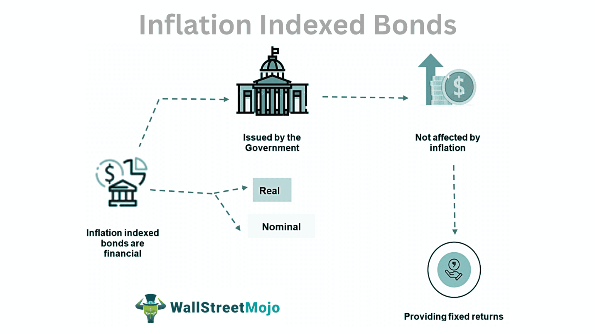

In the current economic climate, inflation poses a significant threat to the value of fixed-income investments. Rising inflation erodes the purchasing power of fixed income streams, creating a need for effective hedging strategies. Inflation-indexed bonds, also known as inflation-linked bonds, offer a solution by protecting investors from inflation through adjustments in principal and interest payments based on a recognized inflation index such as the Consumer Price Index (CPI). These bonds aim to maintain the real value of investments, thus safeguarding investor wealth.

This article examines the investment strategy of employing inflation-indexed bonds to mitigate inflation risks, coupled with the application of algorithmic trading to enhance returns and manage potential risks. Algorithmic trading, leveraging computational power and advanced algorithms, can optimize the management of these assets by dynamically adjusting exposure based on market conditions and economic indicators.



We will explore the benefits and challenges associated with investing in inflation-indexed bonds, including their potential to provide a hedge against unexpected inflation while offering diversification and stable returns. Moreover, the integration of algorithmic trading strategies with these bonds can further refine investment approaches, enabling investors to achieve consistent performance even in volatile markets.

Understanding the dynamics surrounding inflation-indexed bonds and their use in algorithmic trading is crucial for investors aiming for long-term financial stability. These strategies offer an effective means to protect portfolios against the uncertainties of the economic environment while striving for sustainable growth and income.

## Table of Contents

## Understanding Inflation-Indexed Bonds

Inflation-indexed bonds are a specialized category of fixed-income securities designed to protect investors from inflation's erosive impact on purchasing power. These bonds achieve this by adjusting their principal value according to an inflation index, such as the Consumer Price Index (CPI). Consequently, both the principal and the interest payments grow with inflation, ensuring that the investor's real return remains constant over time.

A prominent example of inflation-indexed bonds is the United States Treasury Inflation-Protected Securities (TIPS). TIPS are particularly popular among investors because they are backed by the U.S. government and provide a real return over the prevailing inflation rate, thus effectively hedging against rising prices. The principal of TIPS increases with inflation and decreases with deflation, as determined by the CPI. At maturity, investors receive either the adjusted or the original principal, whichever is greater, safeguarding their initial investment against inflation.

Inflation-indexed bonds function by recalculating both their principal and interest payments based on changes in the inflation index. The interest payment is usually calculated using a fixed [interest rate](/wiki/interest-rate-trading-strategies) applied to the adjusted principal. Mathematically, the interest payment can be expressed as:

$$
\text{Interest Payment} = \text{Adjusted Principal} \times \text{Fixed Interest Rate}
$$

However, while inflation-indexed bonds shield investors from inflation, they are not without risks. One key concern is their sensitivity to interest rate fluctuations. When interest rates rise, the market value of these bonds may decrease, potentially resulting in capital losses for investors who sell before maturity. Additionally, investors might encounter tax implications on 'phantom income.' This occurs because, for tax purposes, the inflation adjustments to the principal are considered taxable income, even though the investor does not receive this amount until the bond matures or is sold.

Despite these risks, inflation-indexed bonds are valuable tools within a diversified portfolio. By understanding their underlying mechanics and potential pitfalls, investors can assess how these securities align with their financial goals, particularly in inflationary environments. Leveraging inflation-indexed bonds can help maintain purchasing power while providing a stable and predictable real rate of return.

## Benefits of Hedging with Inflation-Indexed Bonds

Inflation-indexed bonds offer a significant advantage in preserving purchasing power during inflationary periods. This is achieved by adjusting their principal and interest payments based on inflation indices, such as the Consumer Price Index (CPI). Consequently, these bonds provide a level of protection against inflationary pressures, particularly when inflation expectations are uncertain. This protective feature makes them an attractive choice for long-term investors seeking to safeguard their investment returns from the eroding effects of inflation.

Moreover, inflation-indexed bonds contribute to portfolio diversification because their returns do not exhibit high correlation with stock returns. This means that during periods of market [volatility](/wiki/volatility-trading-strategies), when equity markets may experience downturns, inflation-indexed bonds can provide stability, reducing overall portfolio risk.

The ability of these bonds to deliver a fixed real return, irrespective of inflation rates, establishes them as a steady income source. This characteristic is particularly appealing for retirement portfolios and conservative investment strategies aiming for predictable and stable returns over time. In these contexts, investors benefit from income that maintains its real value, aligning well with objectives centered on financial security and risk aversion.

In addition to these advantages, inflation-indexed bonds act as an effective hedge against unexpected inflation spikes. Traditional fixed-income securities often face adverse impacts when inflation surges unexpectedly, as rising inflation erodes the real value of future cash flows. Conversely, inflation-linked bonds adjust to compensate for inflation increases, thereby preserving their value and providing a safeguard against inflationary surprises.

## Risks and Challenges

Inflation-linked bonds offer a range of benefits, but they also present specific risks and challenges that investors must consider. One significant concern is deflation, or a reduction in the rate of inflation, which can decrease the purchasing power of inflation-linked bonds. Since these bonds adjust for inflation, a dip in inflation rates can negatively affect the bond's value by reducing both its adjusted principal and expected interest payments.

Another complexity involves the tax treatment of these bonds. Inflation-linked bonds, such as Treasury Inflation-Protected Securities (TIPS), often generate what is termed "phantom income." While the principal of these bonds adjusts for inflation, this adjustment is considered taxable income by the U.S. Internal Revenue Service (IRS), even though investors only receive actual cash flows at the bond's maturity or when coupons are paid. This can lead to a tax burden on income that hasn't been realized in cash, affecting the bond's effectiveness as an inflation hedge.

Interest rate fluctuations also pose a risk. As fixed-income securities, inflation-linked bonds are sensitive to changes in interest rates. An increase in market interest rates can reduce the present value of future cash flows, causing bond prices to fall. Conversely, declining interest rates may bolster prices. This interest rate risk adds volatility to inflation-linked bonds, which investors must [factor](/wiki/factor-investing) into their portfolio management strategies.

The integration of [algorithmic trading](/wiki/algorithmic-trading) with inflation-linked bonds introduces additional challenges. Algorithms must be sophisticated enough to account for interest rate changes, inflation data, and tax implications to effectively mitigate potential losses. Successful algorithmic trading relies heavily on robust risk management systems that dynamically adjust strategies in response to evolving market conditions and economic indicators related to inflation expectations. 

Importantly, investors must have a thorough understanding of these risks to seamlessly incorporate inflation-linked bonds into their portfolios. This knowledge enables investors to make informed decisions that align with their risk tolerance and investment objectives, ultimately contributing to a well-rounded and resilient investment strategy.

## Algorithmic Trading Strategies for Inflation-Indexed Bonds

Algorithmic trading involves using computer algorithms to automate trading processes, enabling trades to be executed at speeds and frequencies that are beyond human capabilities. When applied to inflation-indexed bonds, algorithmic trading strategies can optimize portfolio management and enhance returns.

One popular strategy is statistical [arbitrage](/wiki/arbitrage), which relies on mathematical models to exploit price differentials among related securities. By identifying temporary anomalies in the pricing of inflation-indexed bonds relative to other assets, algorithms can execute trades to capture small profit margins, often for very short time frames. These models typically involve a mix of statistical and computational techniques to maximize the efficiency of trading activities.

Trend following is another strategy that algorithms can utilize, characterized by identifying and capitalizing on the directional movement of bond prices over time. Algorithmic systems track market trends and initiate trades consistent with observed [momentum](/wiki/momentum). This can involve moving averages or other trend analysis indicators that signify optimal entry or [exit](/wiki/exit-strategy) points.

Market making is a technique where algorithms provide [liquidity](/wiki/liquidity-risk-premium) by continuously quoting both buy and sell prices for inflation-indexed bonds, profiting from the bid-ask spread. These systems must be designed to quickly assess supply and demand conditions and adjust quotes in real time to maintain competitive positioning in the market.

Key to the success of algorithmic trading in this context is robust risk management. Algorithms must be programmed to account for variables such as interest rate changes and inflation expectations, which influence the pricing and performance of inflation-indexed bonds. Strategies may incorporate financial derivatives, such as interest rate swaps, to hedge exposure and mitigate risk.

Python, a popular programming language for developing algorithmic trading systems, offers libraries such as NumPy and pandas for data analysis, and SciPy for statistical computations. Here's a simple illustration of a moving average crossover strategy, which can be part of a trend-following algorithm:

```python
import pandas as pd
import numpy as np

# Assume 'data' is a DataFrame with a 'Close' column for bond prices
short_window = 40
long_window = 100

signals = pd.DataFrame(index=data.index)
signals['signal'] = 0.0

# Create short simple moving average (SMA)
signals['short_mavg'] = data['Close'].rolling(window=short_window, min_periods=1, center=False).mean()

# Create long simple moving average (SMA)
signals['long_mavg'] = data['Close'].rolling(window=long_window, min_periods=1, center=False).mean()

# Create signals
signals['signal'][short_window:] = np.where(signals['short_mavg'][short_window:] > signals['long_mavg'][short_window:], 1.0, 0.0)   

# Generate trading orders
signals['positions'] = signals['signal'].diff()

print(signals)
```

Utilizing such strategies requires continual adaptation to changing economic indicators, such as GDP growth rates, unemployment figures, and other macroeconomic variables that impact inflation expectations. By effectively leveraging technology and algorithmic methods, investors can achieve more predictable and consistent performance in bond portfolios, aligned with their risk tolerance and investment objectives.

## Conclusion

As economic conditions continue to shift, investors face the challenge of protecting their portfolios from the adverse effects of inflation. Inflation-indexed bonds, such as Treasury Inflation-Protected Securities (TIPS), offer a dependable approach for mitigating these risks. By adjusting principal and interest payments in line with an inflation index like the Consumer Price Index (CPI), these bonds preserve purchasing power and provide a measure of financial stability. Moreover, they serve as a source of diversification, uncorrelated with the returns of equities, thus supporting a balanced investment strategy.

Integrating algorithmic trading into the management of inflation-indexed bonds introduces a strategic advantage. This technological approach enables the rapid processing of data and execution of trades, thus allowing for improved yield optimization and risk management. Algorithms can identify profitable opportunities through methods like [statistical arbitrage](/wiki/statistical-arbitrage) and [trend following](/wiki/trend-following) while adapting swiftly to changes in economic indicators affecting inflation expectations.

Investors, however, must align these strategies with their individual risk tolerance and investment objectives. It is essential to consider the broader market environment to ensure that these tools are applied effectively. By utilizing a thoughtful combination of inflation-indexed bonds and algorithmic trading, investors can construct a resilient portfolio that weathers economic uncertainties and supports long-term financial growth. The prudent application of these strategies offers a pathway to achieving investment goals amidst fluctuating economic circumstances.

## References & Further Reading

[1]: ["Inflation-Index Bonds: A Performance Analysis"](https://www.forbes.com/advisor/investing/inflation-indexed-bonds/) by Richard Roll. Financial Analysts Journal, 2009.

[2]: ["The Use of Inflation-Indexed Bonds"](https://en.wikipedia.org/wiki/Inflation-indexed_bond) by Fernando Broner, Guido Lorenzoni, and Sergio L. Schmukler. International Monetary Fund, 2010.

[3]: Campbell, John Y., Shiller, Robert J., & Viceira, Luis M. ["Understanding Inflation-Indexed Bond Markets"](https://www.nber.org/papers/w15014). National Bureau of Economic Research, 1996.

[4]: ["Programming for Computations - Python: A Gentle Introduction to Numerical Simulations with Python"](https://link.springer.com/book/10.1007/978-3-030-16877-3) by Svein Linge and Hans Petter Langtangen.

[5]: ["Python for Finance: Mastering Data-Driven Finance"](https://www.amazon.com/Python-Finance-Mastering-Data-Driven/dp/1492024333) by Yves Hilpisch.

[6]: ["A Primer on TIPS"]. Federal Reserve Bank of St. Louis Review, May/June 2003. 