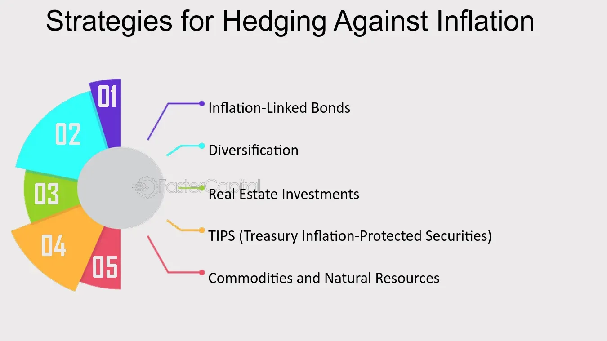

## Table of Contents

## What are inflation-indexed bonds?

Inflation-indexed bonds are a type of investment where the bond's value goes up and down with inflation. This means if prices for things like food and gas go up, the bond's value will also go up to match that. This helps protect the money you invest from losing value over time because of inflation.

These bonds are often issued by governments, like the U.S. Treasury with its Treasury Inflation-Protected Securities (TIPS). When you buy these bonds, you get regular interest payments, but the amount of interest changes based on inflation rates. This makes them a good choice for people who want their investments to keep up with the cost of living.

## How do inflation-indexed bonds work?

Inflation-indexed bonds are special types of bonds that help protect your money from losing value because of inflation. When you buy one of these bonds, the amount of money you get back when the bond matures, and the interest payments you receive along the way, both go up with inflation. This means if the prices of things like food and gas go up, the value of your bond goes up too. This helps make sure that the money you get back is worth about the same as when you first invested it.

These bonds are usually issued by governments, like the U.S. Treasury with its Treasury Inflation-Protected Securities (TIPS). When you invest in a TIPS bond, you get interest payments every six months. The interest rate stays the same, but the amount of money you get changes because it's based on the bond's new value, which goes up with inflation. This makes inflation-indexed bonds a good choice for people who want their savings to keep up with the rising cost of living.

## What is the purpose of using inflation-indexed bonds as a hedge?

The main reason people use inflation-indexed bonds as a hedge is to protect their money from losing value over time due to inflation. Inflation means the prices of things like food, gas, and rent go up. If you have regular bonds or cash, the money you get back might not buy as much as it used to. But with inflation-indexed bonds, the value of the bond goes up along with inflation, so the money you get back can still buy about the same amount of stuff.

For example, if you invest in a Treasury Inflation-Protected Security (TIPS), the bond's value and the interest payments you receive will increase if inflation goes up. This helps make sure that the money you get back at the end is worth about the same as when you first invested it. This makes inflation-indexed bonds a good choice for people who want to keep their savings safe from the effects of rising prices.

## What are the common types of inflation-indexed bonds?

There are a few common types of inflation-indexed bonds that people often use. The most well-known type is the Treasury Inflation-Protected Securities, or TIPS, issued by the U.S. government. TIPS are designed to protect investors from inflation by adjusting both the bond's principal and the interest payments according to changes in the Consumer Price Index (CPI). This means if inflation goes up, the value of the TIPS bond and the interest payments you receive will also go up.

Another type of inflation-indexed bond is the Inflation-Linked Gilts, which are issued by the UK government. These bonds work similarly to TIPS by adjusting their principal and interest payments based on the UK's Retail Price Index (RPI). They help UK investors protect their money from inflation. In France, there are also inflation-indexed bonds called OATi and OAT€i, which are adjusted based on the French CPI and the Eurozone's Harmonized Index of Consumer Prices (HICP), respectively. These bonds serve the same purpose of safeguarding investors' money against the rising cost of living.

## How can inflation-indexed bonds protect against inflation?

Inflation-indexed bonds help protect your money from losing value because of inflation. When you buy these bonds, their value goes up if the prices of things like food and gas go up. This means the money you get back when the bond matures will be worth about the same as when you first invested it. For example, if you invest in a Treasury Inflation-Protected Security (TIPS), the bond's value and the interest payments you receive will increase if inflation goes up. This helps make sure that your money keeps up with the rising cost of living.

These bonds are a good choice for people who want to keep their savings safe from inflation. Governments, like the U.S. with TIPS, issue these bonds to help investors protect their money. The bond's principal and the interest payments are adjusted based on inflation rates, like the Consumer Price Index (CPI) in the U.S. This adjustment means that even if prices go up, the money you get from the bond will still buy about the same amount of stuff as before.

## What are the benefits of including inflation-indexed bonds in a portfolio?

Including inflation-indexed bonds in a portfolio can help protect your money from losing value because of rising prices. When you invest in these bonds, like the U.S. Treasury Inflation-Protected Securities (TIPS), the bond's value goes up with inflation. This means if the cost of things like food and gas goes up, the bond's value will go up too. So, the money you get back when the bond matures will be worth about the same as when you first invested it. This helps make sure that your savings keep up with the cost of living.

Another benefit is that inflation-indexed bonds can make your investment portfolio more stable. Since the value of these bonds changes with inflation, they can help balance out other investments that might lose value when prices go up. This can be really helpful if you want to keep your money safe and grow it over time. By adding inflation-indexed bonds to your portfolio, you can feel more secure knowing that part of your money is protected against the effects of inflation.

## What are the potential risks associated with inflation-indexed bonds?

Inflation-indexed bonds, like any investment, come with some risks. One risk is that if inflation turns out to be lower than expected, the bond's value won't go up as much as you might have hoped. This means you might not get as much money back as you thought you would. Also, if interest rates go up, the value of existing bonds can go down. This happens because new bonds might be issued with higher interest rates, making the older bonds less attractive to investors.

Another risk is that these bonds might not keep up with other types of investments like stocks or regular bonds when the economy is doing well. Stocks can go up a lot more than inflation-indexed bonds, so if you put all your money in these bonds, you might miss out on bigger gains. Also, inflation-indexed bonds can be a bit tricky to understand because their value changes based on inflation rates. If you don't keep an eye on inflation and how it's affecting your bond, you might be surprised by how much your bond is worth when it's time to cash it in.

## How do inflation-indexed bonds perform compared to traditional bonds during inflationary periods?

During times when prices are going up, inflation-indexed bonds usually do better than traditional bonds. This is because the value of inflation-indexed bonds, like TIPS, goes up with inflation. So, if the cost of things like food and gas goes up, the bond's value will go up too. This helps make sure that the money you get back is worth about the same as when you first invested it. On the other hand, traditional bonds don't change with inflation. So, if prices go up a lot, the money you get from a traditional bond might not buy as much as it used to.

However, it's not always a sure thing. If inflation turns out to be lower than what people expected, inflation-indexed bonds might not go up as much as you hoped. Also, if interest rates go up, the value of all bonds, including inflation-indexed ones, can go down. This happens because new bonds might be issued with higher interest rates, making the older bonds less attractive to investors. So, while inflation-indexed bonds can help protect your money from rising prices, they still come with some risks.

## What should investors consider when selecting inflation-indexed bonds for their portfolios?

When choosing inflation-indexed bonds for their portfolios, investors should think about how much inflation they expect in the future. If they believe prices will go up a lot, inflation-indexed bonds like TIPS can be a good choice because they help protect their money from losing value. It's also important to consider how long they plan to keep the bond. Inflation-indexed bonds usually have terms of 5, 10, or 30 years, so investors need to match the bond's term with their investment goals and when they might need the money back.

Another thing to consider is the overall mix of investments in their portfolio. Adding inflation-indexed bonds can help balance out other investments like stocks or regular bonds, which might not do as well when prices go up. Investors should also think about the risks. If inflation turns out to be lower than expected, the bond might not go up in value as much as hoped. And if interest rates go up, the value of the bond could go down. So, it's a good idea to keep an eye on inflation rates and economic news to make smart choices about inflation-indexed bonds.

## How can inflation-indexed bonds be used in conjunction with other investment strategies?

Inflation-indexed bonds can be a great part of a bigger investment plan, working well with other types of investments like stocks and regular bonds. If you mix inflation-indexed bonds with stocks, you can protect some of your money from losing value because of rising prices while still having the chance to make more money from stocks. Stocks can go up a lot when the economy is doing well, but they can also go down. By adding inflation-indexed bonds to your portfolio, you can balance out the ups and downs of stocks, making your overall investments more stable.

You can also use inflation-indexed bonds alongside regular bonds to help manage risk. Regular bonds don't change with inflation, so if prices go up a lot, the money you get from them might not be worth as much. But if you have some inflation-indexed bonds, they can help keep your money's value safe. This mix can be especially helpful if you're saving for something important in the future, like retirement, because it helps make sure your savings will still be worth a lot even if prices go up. By carefully choosing how much to put into inflation-indexed bonds and other investments, you can create a plan that fits your goals and helps you feel more secure about your money.

## What are the tax implications of investing in inflation-indexed bonds?

When you invest in inflation-indexed bonds like TIPS, you need to know about the taxes. The interest you get from these bonds is usually taxed as regular income every year, just like the interest from other bonds. But there's something special about TIPS: the part of the bond's value that goes up because of inflation is also taxed, even though you don't get that money until the bond matures. This means you might have to pay taxes on money you haven't actually received yet.

To handle these taxes better, some people put their TIPS in special accounts like retirement accounts, such as an IRA or a 401(k). In these accounts, you don't have to pay taxes on the interest or the inflation adjustments until you take the money out. This can help you keep more of your money growing over time. So, when thinking about investing in inflation-indexed bonds, it's a good idea to consider how taxes will affect your returns and whether using a tax-advantaged account might be a smart move.

## How do global economic policies influence the effectiveness of inflation-indexed bonds as a hedge?

Global economic policies can really affect how well inflation-indexed bonds work as a hedge against rising prices. When countries like the U.S. or big economies in Europe change their policies, it can cause inflation rates to go up or down. If a country decides to print more money or lower interest rates to help the economy grow, that can lead to higher inflation. Inflation-indexed bonds, like TIPS, are designed to go up in value when inflation goes up, so they can be a good choice in these situations. But if global policies keep inflation low, then these bonds might not go up as much as you hoped, and they might not protect your money as well.

Also, policies from big global banks like the Federal Reserve or the European Central Bank can change how well inflation-indexed bonds work. If these banks decide to raise interest rates to fight inflation, the value of existing bonds, including inflation-indexed ones, can go down. This happens because new bonds might be issued with higher interest rates, making the older bonds less attractive to investors. So, when you're thinking about using inflation-indexed bonds to protect your money, it's important to keep an eye on what's happening with global economic policies and how they might affect inflation and interest rates.

## What are Inflation-Indexed Bonds and how do they work?

Inflation-indexed bonds are a specialized category of fixed-income securities designed to protect investors from inflation's erosive impact on purchasing power. These bonds achieve this by adjusting their principal value according to an inflation index, such as the Consumer Price Index (CPI). Consequently, both the principal and the interest payments grow with inflation, ensuring that the investor's real return remains constant over time.

A prominent example of inflation-indexed bonds is the United States Treasury Inflation-Protected Securities (TIPS). TIPS are particularly popular among investors because they are backed by the U.S. government and provide a real return over the prevailing inflation rate, thus effectively hedging against rising prices. The principal of TIPS increases with inflation and decreases with deflation, as determined by the CPI. At maturity, investors receive either the adjusted or the original principal, whichever is greater, safeguarding their initial investment against inflation.

Inflation-indexed bonds function by recalculating both their principal and interest payments based on changes in the inflation index. The interest payment is usually calculated using a fixed [interest rate](/wiki/interest-rate-trading-strategies) applied to the adjusted principal. Mathematically, the interest payment can be expressed as:

$$
\text{Interest Payment} = \text{Adjusted Principal} \times \text{Fixed Interest Rate}
$$

However, while inflation-indexed bonds shield investors from inflation, they are not without risks. One key concern is their sensitivity to interest rate fluctuations. When interest rates rise, the market value of these bonds may decrease, potentially resulting in capital losses for investors who sell before maturity. Additionally, investors might encounter tax implications on 'phantom income.' This occurs because, for tax purposes, the inflation adjustments to the principal are considered taxable income, even though the investor does not receive this amount until the bond matures or is sold.

Despite these risks, inflation-indexed bonds are valuable tools within a diversified portfolio. By understanding their underlying mechanics and potential pitfalls, investors can assess how these securities align with their financial goals, particularly in inflationary environments. Leveraging inflation-indexed bonds can help maintain purchasing power while providing a stable and predictable real rate of return.

## References & Further Reading

[1]: ["Inflation-Index Bonds: A Performance Analysis"](https://www.forbes.com/advisor/investing/inflation-indexed-bonds/) by Richard Roll. Financial Analysts Journal, 2009.

[2]: ["The Use of Inflation-Indexed Bonds"](https://en.wikipedia.org/wiki/Inflation-indexed_bond) by Fernando Broner, Guido Lorenzoni, and Sergio L. Schmukler. International Monetary Fund, 2010.

[3]: Campbell, John Y., Shiller, Robert J., & Viceira, Luis M. ["Understanding Inflation-Indexed Bond Markets"](https://www.nber.org/papers/w15014). National Bureau of Economic Research, 1996.

[4]: ["Programming for Computations - Python: A Gentle Introduction to Numerical Simulations with Python"](https://link.springer.com/book/10.1007/978-3-030-16877-3) by Svein Linge and Hans Petter Langtangen.

[5]: ["Python for Finance: Mastering Data-Driven Finance"](https://www.amazon.com/Python-Finance-Mastering-Data-Driven/dp/1492024333) by Yves Hilpisch.

[6]: ["A Primer on TIPS"]. Federal Reserve Bank of St. Louis Review, May/June 2003. 