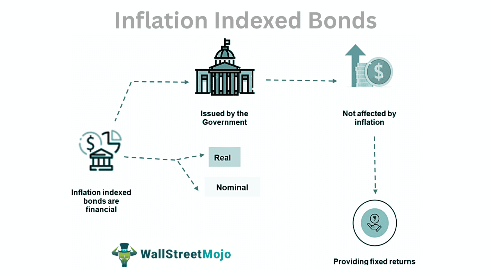

## Table of Contents

## What are inflation-indexed securities?

Inflation-indexed securities are a type of investment that helps protect your money from losing value because of inflation. Inflation is when the prices of things you buy go up over time, which means your money can buy less. These securities are special because their value goes up along with inflation. This means if the cost of living increases, the amount of money you get from these securities also increases.

These securities are often issued by governments, like the U.S. Treasury with its Treasury Inflation-Protected Securities (TIPS). When you buy these securities, the principal amount, which is the money you invest, is adjusted based on changes in the Consumer Price Index (CPI). The CPI measures the average change over time in the prices paid by urban consumers for a market basket of consumer goods and services. By adjusting the principal, the interest payments you receive also increase with inflation, helping to keep the purchasing power of your investment steady.

## How do inflation-indexed securities work?

Inflation-indexed securities are a type of investment that helps your money keep up with rising prices. When you buy these securities, the amount of money you invest, called the principal, can go up or down based on inflation. Inflation is measured by something called the Consumer Price Index (CPI), which looks at how much the prices of everyday things are changing. If the CPI goes up, the principal of your security goes up too. This means if things get more expensive, your investment grows to match that increase.

When you own inflation-indexed securities, you also get interest payments. These payments are based on the adjusted principal. So, if inflation causes the principal to increase, the interest you earn will be calculated on this higher amount. This way, the money you get from your investment keeps up with the cost of living. Governments, like the U.S. Treasury with its TIPS, often issue these securities to help people protect their savings from losing value over time due to inflation.

## What are the main types of inflation-indexed securities?

Inflation-indexed securities come in different types, but the main ones are Treasury Inflation-Protected Securities (TIPS) and inflation-linked bonds. TIPS are issued by the U.S. Treasury and are designed to protect investors from inflation. When you buy TIPS, the principal amount of your investment goes up or down with the Consumer Price Index (CPI). This means if prices go up, your investment grows to keep up with those prices. You also get interest payments twice a year, and these payments are based on the adjusted principal, so they increase with inflation too.

Inflation-linked bonds are similar but can be issued by other governments or corporations. Like TIPS, these bonds adjust their principal based on an inflation measure, but it might not always be the CPI. For example, in the UK, they use the Retail Prices Index (RPI). These bonds also pay interest, which is calculated on the inflation-adjusted principal. This helps protect your money from losing value over time because the bond's value and interest payments rise with inflation.

## Who typically invests in inflation-indexed securities?

People who want to keep their money safe from rising prices often invest in inflation-indexed securities. These investors might be retirees who need their savings to last longer and keep up with the cost of living. They might also be people saving for long-term goals, like buying a house or funding their children's education. By investing in these securities, they can protect their money from losing value over time.

Institutional investors, like pension funds and insurance companies, also often buy inflation-indexed securities. These organizations need to make sure they can pay out money to their clients in the future, even if prices go up. Inflation-indexed securities help them do this by adjusting the value of their investments to match inflation. This way, they can better plan for future expenses and keep their financial promises to their clients.

## What are the benefits of investing in inflation-indexed securities?

Investing in inflation-indexed securities helps protect your money from losing value because of rising prices. When you buy these securities, the amount of money you invest, called the principal, goes up with inflation. This means if things get more expensive, your investment grows to match that increase. This is really helpful for people who want their savings to last longer, like retirees, or anyone saving for big goals in the future.

These securities also give you interest payments that go up with inflation. So, not only does your investment grow, but the money you earn from it keeps up with the cost of living too. This makes inflation-indexed securities a good choice for anyone who wants to make sure their money keeps its value over time, even as prices rise.

## How do inflation-indexed securities protect against inflation?

Inflation-indexed securities help keep your money safe from rising prices. When you buy these securities, the amount of money you invest, called the principal, goes up if prices go up. This means your investment grows to match inflation. For example, if the cost of living increases by 2%, the value of your investment also increases by 2%. This way, your money doesn't lose value over time because it keeps up with the prices of things you need to buy.

These securities also pay you interest, and this interest is based on the new, higher principal after it's adjusted for inflation. So, if your investment grows because of inflation, the interest you earn grows too. This helps make sure that the money you get from your investment can still buy the same amount of stuff, even if prices go up. By doing this, inflation-indexed securities protect your savings from losing value and help you plan for the future.

## What are the risks associated with inflation-indexed securities?

Inflation-indexed securities can help protect your money from inflation, but they also come with some risks. One risk is that if there's deflation, which is when prices go down, the principal of your investment might go down too. This means you could end up with less money than you started with. Another risk is that these securities might not give you as high a return as other investments, like stocks or regular bonds. If you're looking to grow your money quickly, inflation-indexed securities might not be the best choice.

Another thing to think about is that inflation-indexed securities can be affected by changes in interest rates. If interest rates go up, the value of these securities might go down. This is because new securities issued at the higher interest rate would be more attractive to investors. Also, while these securities protect against inflation, they don't protect against other risks like the government or company that issued them running into financial trouble. If that happens, you might not get your money back.

## How do inflation-indexed securities compare to traditional bonds?

Inflation-indexed securities and traditional bonds both let you invest your money and earn interest over time, but they work a bit differently. Traditional bonds have a fixed interest rate, so you know exactly how much money you'll get back at the end. But, if prices go up because of inflation, the money you get from a traditional bond might not buy as much as it used to. Inflation-indexed securities, like TIPS, change their value based on inflation. If prices go up, the amount of money you invested, called the principal, goes up too. This means the interest you earn also goes up, helping your money keep its value even when prices rise.

Another difference is how these investments react to changes in the economy. Traditional bonds can lose value if interest rates go up, because new bonds with higher interest rates become more attractive. But inflation-indexed securities can also lose value if interest rates go up, and they have an extra risk if there's deflation, where prices go down. In that case, the principal of your inflation-indexed security could go down too. So, while inflation-indexed securities protect your money from rising prices, traditional bonds might be better if you're looking for a steady, predictable return and are okay with the risk that inflation might reduce the value of your money over time.

## What is the historical performance of inflation-indexed securities?

Inflation-indexed securities, like TIPS in the U.S., have been around since the late 1990s. Over the years, they have done a good job of protecting investors' money from losing value because of rising prices. When inflation goes up, the value of these securities also goes up. This means that if the cost of living increases, the amount of money you get from these securities grows to match that increase. During times when inflation was high, like in the early 2000s and again in the late 2000s, TIPS performed well because they kept up with the rising prices.

However, inflation-indexed securities don't always do better than other investments. When inflation is low or there's deflation, these securities might not grow as much or could even lose value. For example, during the 2008 financial crisis, when prices were falling, the principal of TIPS went down. Also, compared to stocks or regular bonds, inflation-indexed securities often give lower returns over the long term. So, while they are good at protecting against inflation, they might not be the best choice if you're looking to grow your money quickly.

## How are inflation-indexed securities taxed?

When you invest in inflation-indexed securities like TIPS, you need to know how they are taxed. The interest you earn from these securities is taxed as regular income each year. But there's something else to think about: the principal of your investment can go up because of inflation. This increase in principal is also taxed, but you don't get the money until the security matures or you sell it. This means you might have to pay taxes on money you haven't actually received yet, which is called phantom income.

If you hold onto your inflation-indexed securities until they mature, you'll get the final adjusted principal back. Any increase in the principal because of inflation is taxed as a capital gain. But if you sell your securities before they mature, any profit from selling them is also taxed as a capital gain. The tax rules can make inflation-indexed securities a bit tricky, so it's a good idea to talk to a tax advisor to understand how they might affect your taxes.

## What role do inflation-indexed securities play in a diversified investment portfolio?

Inflation-indexed securities can be a helpful part of a diversified investment portfolio. They help protect your money from losing value because of rising prices. When you have a mix of different investments, like stocks, bonds, and inflation-indexed securities, you spread out your risk. This means if one type of investment doesn't do well, the others might still be okay. Inflation-indexed securities can be especially useful if you're worried about inflation eating away at your savings, because they adjust their value to keep up with the cost of living.

Adding inflation-indexed securities to your portfolio can also make it more stable. While stocks and regular bonds can go up and down a lot, inflation-indexed securities tend to be more predictable. They might not grow as fast as stocks, but they help make sure your money keeps its value over time. This can be really important for people who are saving for the long term, like retirees or anyone planning for big future expenses. By including inflation-indexed securities, you can feel more secure knowing that part of your money is protected against inflation.

## How can investors effectively incorporate inflation-indexed securities into their investment strategy?

Investors can effectively incorporate inflation-indexed securities into their investment strategy by understanding their role in protecting against inflation. These securities, like TIPS, are a good choice if you want to make sure your money keeps its value over time, even as prices go up. You might want to include them in your portfolio if you're saving for the long term, like for retirement or big future expenses. By putting some of your money into inflation-indexed securities, you can balance out riskier investments like stocks, which can go up and down a lot. This way, you have a mix of investments that can help you feel more secure about your savings.

To decide how much to invest in inflation-indexed securities, think about your overall investment goals and how much risk you're comfortable with. If you're worried about inflation and want to protect your money, you might want to put a bigger part of your portfolio into these securities. But if you're looking to grow your money quickly and are okay with more risk, you might choose to invest less in them and more in stocks or other investments. Talking to a financial advisor can help you figure out the right balance for your needs, making sure your investment strategy works well with your long-term plans.

## What are Inflation-Indexed Securities and How Do They Work?

Inflation-indexed securities are specialized financial instruments designed to protect investors from the eroding effects of inflation. By adjusting returns in direct response to changes in inflation rates, these securities ensure that the purchasing power of the investor's capital is maintained over time. The primary goal of these instruments is to mitigate inflation risk, offering a more secure investment option compared to traditional fixed-income securities.

One prominent example of inflation-indexed securities is the U.S. Treasury Inflation-Protected Securities (TIPS). TIPS are linked to the Consumer Price Index (CPI), a widely used measure of inflation, which tracks changes in the prices consumers pay for goods and services. The principal value of TIPS is periodically adjusted based on changes in the CPI, ensuring that even if inflation rises, the real value of the investment does not diminish.

To illustrate how TIPS work, consider an initial investment in TIPS with a face value of $1,000 and a fixed [interest rate](/wiki/interest-rate-trading-strategies). If the CPI indicates an inflation rate of 2% over the next year, the principal amount of the TIPS would be adjusted to $1,020. Consequently, the interest payments, which are calculated based on the adjusted principal, also increase, providing a hedge against inflation.

Mathematically, the adjusted principal $P_{\text{adjusted}}$ can be expressed as:

$$
P_{\text{adjusted}} = P_{\text{initial}} \times (1 + \text{Inflation Rate})
$$

Where $P_{\text{initial}}$ is the initial principal investment and the Inflation Rate is derived from changes in the CPI.

The linkage of these securities to inflation indices like the CPI is pivotal. It guarantees that the returns on these investments outpace inflation, preserving the real value of money over time. This feature makes inflation-indexed securities particularly attractive during periods of high inflation, as they provide a reliable mechanism to maintain the purchasing power of the investor's income.

Overall, inflation-indexed securities offer a stable investment alternative for individuals and institutions seeking to protect their portfolios against inflation, ensuring that financial goals are met in real terms rather than nominal values.

## What are the benefits of inflation-indexed securities?

Inflation-indexed securities provide a robust mechanism for protecting against the erosive effects of inflation on investment returns. These securities are designed to guarantee a real return, meaning that the purchasing power of the invested capital is preserved, regardless of inflation fluctuations. A prominent example of this is the U.S. Treasury Inflation-Protected Securities (TIPS), which adjust their principal and interest payments according to changes in the Consumer Price Index (CPI). 

This mechanism ensures that investors, particularly those with a low risk tolerance, such as retirees or individuals on a fixed income, can safeguard their investments from inflationary pressures. As inflation increases, the principal value of the TIPS rises, providing an increased interest payment based on the inflation-adjusted principal. Conversely, if deflation occurs, the principal and thus the interest payment decrease, but TIPS ensure that the value does not fall below the original amount invested.

The appeal of inflation-indexed securities also lies in their comparative safety. These securities generally offer lower returns than high-risk investments like equities but promise protection against the unpredictability of inflation. This makes them an excellent choice for those prioritizing maintenance of buying power over high returns. By reducing inflation risk, these securities help maintain a predictable income stream.

Mathematically, the adjustment of principal in inflation-indexed securities can be expressed as:

$$
\text{Adjusted Principal} = \text{Principal} \times \left( 1 + \frac{\text{CPI}_\text{end} - \text{CPI}_\text{start}}{\text{CPI}_\text{start}} \right)
$$

Here, $\text{CPI}_\text{end}$ and $\text{CPI}_\text{start}$ are the Consumer Price Index values at the end and start of the period, respectively. This formula highlights the direct linkage between inflation indices and the value of the investment, ensuring returns that are proportionate to inflationary changes.

In summary, the balanced risk-reward tradeoff offered by inflation-indexed securities makes them a vital tool in managing inflation risk in investment portfolios, allowing for stable and predictable financial planning.

## References & Further Reading

[1]: Inflation-Protected Securities. (n.d.). U.S. Department of the Treasury. Retrieved from [https://www.treasurydirect.gov/indiv/research/articles/res_invest_articles_tips_glossary.htm](https://www.treasurydirect.gov/marketable-securities/tips/)

[2]: ["Investing Amid Low Inflation: Considerations for TIPS and Related Assets"](https://www.schwabassetmanagement.com/story/tips-and-inflation-what-to-know-now) by John Praveen and Donald Rissmiller, Advisor Perspectives

[3]: ["High-Frequency Trading: A Practical Guide to Algorithmic Strategies and Trading Systems"](https://www.amazon.com/High-Frequency-Trading-Practical-Algorithmic-Strategies/dp/0470563761) by Irene Aldridge

[4]: ["Algorithmic and High-Frequency Trading"](https://www.amazon.com/Algorithmic-High-Frequency-Trading-Mathematics-Finance/dp/1107091144) by Álvaro Cartea, Sebastian Jaimungal, and José Penalva

[5]: Inflation-Linked Bonds: A Growing Asset Class. (2013). International Monetary Fund. Retrieved from [https://www.imf.org/external/pubs/ft/fandd/2013/06/basics.htm](https://www.semanticscholar.org/paper/An-Introduction-to-Inflation-Linked-Bonds-Kr%C3%A4mer/bc3cfa6f2e4e20b56a87dfcf52eacf527432ec2f)