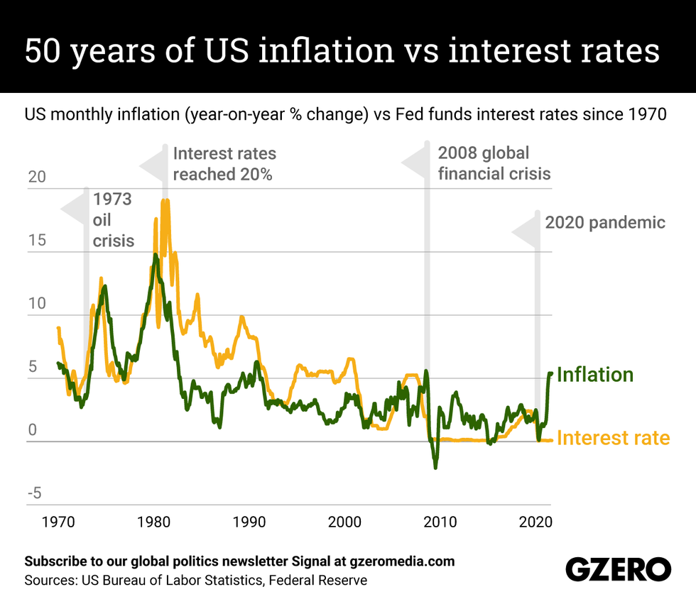

## Table of Contents

## What is inflation?

Inflation is when the prices of things we buy, like food and clothes, go up over time. It means that the money we have can buy less than it could before. For example, if a toy costs $10 now, and next year it costs $11, that's inflation. It happens because the amount of money in the economy grows faster than the number of goods and services available.

There are different reasons why inflation happens. Sometimes, it's because the cost of making things goes up, like when the price of oil increases. Other times, it's because people have more money to spend, so they're willing to pay more for things. Governments and central banks try to keep inflation at a level that's not too high or too low, usually around 2% a year, to help the economy stay stable.

## What are interest rates?

Interest rates are like the price you pay for borrowing money or the reward you get for saving it. When you take a loan from a bank, you have to pay back the money you borrowed plus a little extra. That extra is called interest, and the interest rate is the percentage of the loan amount that you have to pay as interest. For example, if you borrow $100 with an interest rate of 5%, you'll have to pay back $105.

On the other hand, when you put money into a savings account, the bank might give you some interest as a thank you for letting them use your money. The interest rate for savings is usually lower than for loans. So, if you save $100 in an account with a 1% interest rate, at the end of the year, you'll have $101. Interest rates are important because they affect how much it costs to borrow money and how much you can earn from saving it.

## How do central banks influence interest rates?

Central banks, like the Federal Reserve in the U.S., can change interest rates to help control the economy. They do this by setting a special interest rate called the "policy rate" or "benchmark rate." This rate affects the interest rates that banks charge each other for short-term loans. When the central bank raises its policy rate, it makes borrowing money more expensive for everyone. This can slow down spending and help control inflation. When they lower the rate, borrowing becomes cheaper, which can encourage people and businesses to spend more and help the economy grow.

Central banks also use other tools to influence interest rates. They can buy or sell government bonds in a process called "open market operations." When they buy bonds, they put more money into the economy, which can lower interest rates. When they sell bonds, they take money out of the economy, which can raise interest rates. Another tool is setting reserve requirements, which is the amount of money banks have to keep on hand. If the central bank lowers these requirements, banks have more money to lend, which can lower interest rates. If they raise the requirements, banks have less money to lend, which can raise interest rates.

## What is the basic relationship between inflation and interest rates?

Inflation and interest rates are closely connected. When inflation goes up, it means prices are rising, and the value of money is going down. To keep up with inflation, central banks might raise interest rates. This makes borrowing money more expensive, which can slow down spending and help control inflation. If interest rates are higher, people might be less likely to take out loans to buy things, which can help stop prices from rising too fast.

On the other hand, when inflation is low, central banks might lower interest rates to encourage people to borrow and spend more. Lower interest rates make loans cheaper, so people and businesses might be more willing to borrow money to buy things or invest. This can help the economy grow and might push inflation up a little. So, central banks try to balance interest rates to keep inflation at a healthy level, usually around 2% a year.

## How does inflation affect the purchasing power of money?

Inflation means that the prices of things we buy go up over time. When this happens, the money we have can buy less than it could before. For example, if you have $100 and a toy costs $10 now, you can buy 10 toys. But if inflation makes the toy cost $11 next year, your $100 will only buy about 9 toys. So, inflation reduces the purchasing power of your money, which means you can't buy as much with the same amount of money as you could in the past.

Governments and central banks try to keep inflation at a level that's not too high or too low, usually around 2% a year. This helps keep the economy stable. If inflation is too high, people's money loses value quickly, and it becomes hard to plan for the future. If inflation is too low or even negative, it can mean that the economy isn't growing, and people might hold onto their money instead of spending it. So, managing inflation is important for keeping the value of money steady and helping everyone in the economy.

## What role do interest rates play in controlling inflation?

Interest rates are like a tool that central banks use to control inflation. When inflation goes up, it means prices are rising and money is worth less. To slow down this price increase, central banks might raise interest rates. Higher interest rates make borrowing money more expensive. When borrowing is more expensive, people and businesses might spend less, which can help stop prices from going up too fast. So, raising interest rates is a way to cool down the economy and keep inflation in check.

On the other hand, if inflation is too low, central banks might lower interest rates. Lower interest rates make borrowing money cheaper, which can encourage people and businesses to spend more. When people spend more, it can help the economy grow and push inflation up a little. Central banks aim to keep inflation at a healthy level, usually around 2% a year. By adjusting interest rates, they try to balance the economy so that prices don't rise too quickly or too slowly.

## Can high inflation lead to changes in interest rates? How?

Yes, high inflation can lead to changes in interest rates. When prices go up a lot, it means inflation is high. Central banks don't like high inflation because it makes money worth less. To stop prices from going up too fast, central banks might raise interest rates. Higher interest rates make it more expensive for people to borrow money. When borrowing is expensive, people might spend less, and this can help slow down the rise in prices.

Central banks keep a close eye on inflation. If they see that prices are going up too quickly, they might decide to raise interest rates to cool things down. By making borrowing more expensive, they hope to get people to spend less and help keep inflation under control. It's like turning down the heat on a stove to stop the water from boiling over. This way, the central bank can help keep the economy stable and make sure that money keeps its value.

## How do expectations of inflation influence current interest rates?

When people think that prices will go up a lot in the future, it's called "inflation expectations." If everyone believes that prices will keep going up, they might start spending more money now to buy things before they get more expensive. This can make prices go up even faster, which is called high inflation. To stop this from happening, central banks might raise interest rates. By making borrowing money more expensive, they hope to slow down spending and keep prices from going up too quickly.

Central banks pay close attention to what people think about future inflation. If they see that people expect high inflation, they might decide to raise interest rates even before prices start to go up a lot. This is a way to get ahead of the problem and keep the economy stable. By adjusting interest rates based on what people expect, central banks try to make sure that inflation stays at a healthy level, usually around 2% a year, so that money keeps its value and the economy doesn't get out of control.

## What is the Fisher Effect and how does it relate to inflation and interest rates?

The Fisher Effect is a theory that says the interest rate on a loan should include the expected rate of inflation. If people think prices will go up by 2% next year, then the interest rate should be at least 2% higher than it would be if there was no inflation. This way, the person lending the money gets back the same amount of buying power they had when they lent it out. The Fisher Effect helps explain why interest rates change when inflation changes.

When inflation goes up, people expect prices to keep going up. According to the Fisher Effect, interest rates should go up too, to keep up with inflation. For example, if inflation is expected to be 3%, then interest rates might go up to 5% if they were 2% before. This makes sure that the money people get back from loans or savings keeps its value. Central banks use the Fisher Effect to help them decide on interest rates, trying to balance the economy so that money stays worth the same over time.

## How do real interest rates differ from nominal interest rates in the context of inflation?

Real interest rates and nominal interest rates are two ways to talk about the cost of borrowing money or the reward for saving it. Nominal interest rates are the ones you see on loan agreements or savings accounts. They are the actual percentage you pay or earn. For example, if you borrow $100 at a 5% nominal interest rate, you'll pay back $105. But, if there's inflation, the value of that money changes over time. 

Real interest rates take inflation into account. They show you how much you're really earning or paying after prices go up. To find the real interest rate, you subtract the inflation rate from the nominal interest rate. If the nominal rate is 5% and inflation is 3%, the real interest rate is 2%. This means that even though you pay back $105, the money is only worth $102 in terms of what it can buy. Real interest rates help you understand the true cost or benefit of borrowing or saving money when inflation is changing the value of money.

## What are the potential impacts of monetary policy on the inflation-interest rate dynamic?

Monetary policy is like the set of tools that central banks use to control the economy. One big part of monetary policy is changing interest rates. When central banks think prices are going up too fast, they might raise interest rates to make borrowing money more expensive. This can slow down how much people spend and help keep inflation from getting out of control. On the other hand, if prices aren't going up enough, central banks might lower interest rates to make borrowing cheaper. This can encourage people to spend more and help the economy grow a bit.

Another tool in monetary policy is something called "open market operations." This is when central banks buy or sell government bonds to change how much money is in the economy. If they buy bonds, they put more money into the economy, which can lower interest rates and make people spend more. If they sell bonds, they take money out, which can raise interest rates and make people spend less. By using these tools, central banks try to balance the economy so that inflation stays at a healthy level, usually around 2% a year. This helps keep the value of money stable and makes sure the economy doesn't grow too fast or too slow.

## How do global economic factors influence the relationship between inflation and interest rates in different countries?

Global economic factors can have a big impact on how inflation and interest rates work in different countries. For example, if the price of oil goes up a lot because of problems in oil-producing countries, it can make the cost of everything go up. This is because oil is used to make and move a lot of things. When costs go up everywhere, countries might see more inflation. To deal with this, central banks might raise interest rates to slow down spending and keep prices from going up too fast. But, if a country depends a lot on oil imports, it might have to raise interest rates more than others to control inflation.

Another way global factors affect inflation and interest rates is through trade. If a country exports a lot of goods, and the world wants to buy more of those goods, it can make prices go up in that country. This is because there's more demand for what they're selling. To keep inflation in check, the central bank might raise interest rates. But, if other countries are also raising their interest rates because of their own inflation problems, it can make borrowing money more expensive everywhere. This can slow down the global economy and affect how much people spend, which in turn can influence inflation and interest rates in different ways around the world.

## What is inflation and what are its types?

Inflation is a key economic concept that describes the sustained increase in the general price level of goods and services over a period of time. It reflects the reduction in purchasing power of a currency as prices rise. Inflation is measured as an annual percentage increase using various indices like the Consumer Price Index (CPI) or the Producer Price Index (PPI).

### Types of Inflation

Inflation can be categorized into three primary types, each driven by different economic factors. Understanding these types is essential for forming strategies to mitigate inflation risks in investments and trading.

1. **Demand-Pull Inflation**: This type of inflation occurs when the aggregate demand in an economy surpasses its aggregate supply. The increased demand for goods and services leads to higher prices. Factors contributing to demand-pull inflation include consumer confidence, fiscal stimulus, and increasing investment. A classic equation reflecting this inflation type is based on the aggregate demand formula:
$$
   AD = C + I + G + (X - M)

$$

   Where:
   - $AD$ is the aggregate demand.
   - $C$ is consumer spending.
   - $I$ is investment by businesses.
   - $G$ is government spending.
   - $X$ is exports and $M$ is imports.

   When aggregate demand ($AD$) exceeds the aggregate supply ($AS$), prices tend to rise, leading to demand-pull inflation.

2. **Cost-Push Inflation**: This form of inflation arises from an increase in the costs of production, leading to higher prices for final goods and services. Common causes include rising wages, increased prices for raw materials, and supply chain disruptions. Unlike demand-pull inflation, cost-push does not originate from increased demand but from reduced supply capacity.

3. **Built-In Inflation**: Built-in inflation, also known as wage-price inflation, is the result of adaptive expectations. As workers demand higher wages to cope with rising living costs, businesses often pass these increased costs onto consumers through higher prices, creating a wage-price spiral. This type of inflation is self-perpetuating, as expectations of future inflation influence wage and price-setting behaviors.

Understanding the different types of inflation is vital for developing strategies to protect investments. Traders and investors can use this knowledge to anticipate potential changes in economic policy or currency valuation, allowing them to adjust their portfolios accordingly and mitigate inflation-related risks. This comprehension also aids in [algorithmic trading](/wiki/algorithmic-trading), where macroeconomic indicators are integrated into algorithms to optimize trading strategies.

## What is the Role of Interest Rates?

Interest rates serve as the principal mechanism through which central banks regulate inflation. By manipulating interest rates, central banks can influence economic behaviors such as borrowing, spending, and saving. This, in turn, affects aggregate demand and the overall economic activity. When central banks perceive inflation to be rising persistently, they may increase interest rates. This action typically leads to higher borrowing costs, which can dampen consumer spending and business investments, ultimately leading to a slowdown in demand-driven inflation. Conversely, if inflation is deemed too low, central banks might reduce interest rates to encourage borrowing and spending, thus trying to spur economic activity.

The relationship between inflation and interest rates is closely knit. When inflation rates rise, eroding the purchasing power of money, individuals and businesses tend to adjust their financial strategies. In such scenarios, central banks may resort to raising interest rates to control inflationary pressures. This decision can have wide-ranging impacts on various economic sectors as higher interest rates increase the cost of borrowing. For individuals, this may mean higher mortgage rates and more expensive consumer loans, while for businesses, the cost of capital increases, potentially affecting profitability and investment decisions.

On the other hand, during periods of low inflation or deflation, central banks might lower interest rates. The objective here is to make borrowing cheaper, thus stimulating consumption and investment to induce economic growth. This dual approach forms the basis of monetary policy activities conducted by central banks, which continually assess inflationary trends and other macroeconomic indicators to modulate interest rates accordingly.

The intertwined nature of inflation and interest rates can be expressed through the Fisher equation, which relates nominal interest rates, real interest rates, and expected inflation:

$$
i = r + \pi e
$$

Where:
- $i$ is the nominal interest rate
- $r$ is the real interest rate
- $\pi e$ is the expected inflation rate

This equation illustrates how nominal interest rates are adjusted in anticipation of changes in inflation, impacting real interest rates and influencing economic decisions.

In algorithmic trading, understanding the relationship between inflation and interest rates is essential, as these factors can significantly influence financial market dynamics. By accurately predicting central bank actions on interest rates, traders can adjust their strategies to better capitalize on potential market movements and maintain a competitive edge.

## What are the dynamics between inflation and interest rates?

Inflation and [interest rate](/wiki/interest-rate-trading-strategies) dynamics constitute a fundamental element of monetary policy and economic management. When inflation rates rise, indicating an increase in the general price level of goods and services, central banks typically respond by raising interest rates. This measure is employed to curtail excessive spending by increasing the cost of borrowing. Higher interest rates make loans more expensive and savings more attractive, thereby reducing consumer demand and slowing down inflation. The Taylor Rule provides a mathematical framework often used to guide such decisions, relating to the formula:

$$
i_t = \pi_t + r_t^* + 0.5(\pi_t - \pi_t^*) + 0.5(y_t - \bar{y_t})
$$

where $i_t$ is the nominal interest rate, $\pi_t$ is the rate of inflation, $r_t^*$ is the real interest rate, and $y_t - \bar{y_t}$ is the output gap.

Conversely, when inflation is low, central banks may lower interest rates to stimulate economic activity. Decreased rates reduce the cost of borrowing, encouraging both consumers and businesses to take loans for consumption and investment purposes. Consequently, this can lead to increased spending and a boost in economic output, moving the inflation rate closer to the central bank's target.

The interplay between inflation and interest rates is critical for anticipating market movements. Traders often monitor central bank announcements and economic data to predict interest rate changes and adjust their investment strategies accordingly. Understanding these dynamics allows traders to make informed decisions regarding portfolio allocation, risk management, and strategic planning in the financial markets.

Monitoring inflation and interest rate trends is essential for traders to exploit market inefficiencies and optimize returns. By accurately anticipating shifts in these economic indicators, traders can position their portfolios to capitalize on expected changes in asset prices, thereby enhancing their potential for financial success.

## References & Further Reading

[1]: Blinder, A. S. (1998). "Central Banking in Theory and Practice." MIT Press.

[2]: ["Financial Markets and Institutions"](https://www.pearson.com/en-us/pearsonplus/p/9780138025465) by Frederic S. Mishkin

[3]: Friedman, M. (1968). "The Role of Monetary Policy." The American Economic Review, 58(1), 1-17.

[4]: ["Macroeconomics"](https://www.investopedia.com/terms/m/macroeconomics.asp) by Charles I. Jones

[5]: ["Principles of Econometrics"](http://principlesofeconometrics.com/) by R. Carter Hill, William E. Griffiths, and Guay C. Lim

[6]: ["The Econometrics of Financial Markets"](https://press.princeton.edu/books/hardcover/9780691043012/the-econometrics-of-financial-markets) by John Y. Campbell, Andrew W. Lo, and A. Craig MacKinlay

[7]: Taylor, J. B. (1993). "Discretion versus Policy Rules in Practice." Carnegie-Rochester Conference Series on Public Policy, 39, 195-214.

[8]: ["Trading Economics - Inflation Rate"](https://tradingeconomics.com/united-states/inflation-cpi) - Provides real-time data and historical statistics on inflation rates globally.