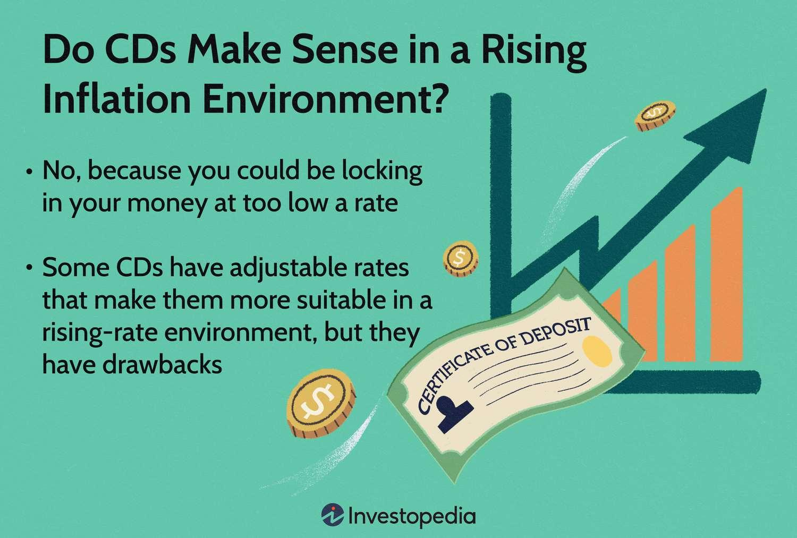

## Table of Contents

## What is an Inflation-Linked Certificate of Deposit (CD)?

An Inflation-Linked Certificate of Deposit (CD) is a type of savings account where the money you put in grows over time. What makes it special is that the interest rate it pays changes based on inflation. Inflation is when the price of things goes up, and this CD tries to keep up with those changes so your money doesn't lose value.

When you put your money into an Inflation-Linked CD, the bank promises to adjust the interest rate according to a measure of inflation, like the Consumer Price Index (CPI). This means if inflation goes up, the interest rate on your CD will also go up, helping your savings grow faster. It's a good choice if you want to protect your savings from losing value due to rising prices.

## How does an Inflation-Linked CD differ from a traditional CD?

An Inflation-Linked CD and a traditional CD are both savings accounts where you put money in for a set time, and you get interest on that money. The big difference is how the interest rate works. With a traditional CD, the interest rate stays the same the whole time your money is in the account. This means if you put your money in when the interest rate is 2%, it will stay at 2% until your CD matures, no matter what happens with inflation.

On the other hand, an Inflation-Linked CD changes its [interest rate](/wiki/interest-rate-trading-strategies) based on inflation. If inflation goes up, the interest rate on your CD will also go up. This helps your savings keep up with the rising cost of things. So, if prices are going up a lot, an Inflation-Linked CD can be better because it protects your money from losing value. But if inflation stays low, a traditional CD might be just as good or even better if it offers a higher fixed rate.

## What are the benefits of investing in Inflation-Linked CDs?

One of the main benefits of investing in Inflation-Linked CDs is that they help protect your money from losing value due to inflation. When prices go up, the interest rate on your CD goes up too. This means your savings can grow faster and keep up with the cost of living. It's a good way to make sure your money doesn't lose buying power over time.

Another benefit is that Inflation-Linked CDs are generally safe investments. They are usually offered by banks and are insured by the government up to a certain amount, which means your money is protected even if the bank has problems. This makes them a low-risk way to save money while still getting the advantage of an interest rate that adjusts to inflation.

## What are the potential risks associated with Inflation-Linked CDs?

One risk with Inflation-Linked CDs is that the interest rate might not go up as much as you expect. Even though the rate is supposed to follow inflation, there can be a delay or the increase might not be as big as the actual rise in prices. This means your money might not grow as fast as you need it to keep up with the cost of living.

Another risk is that you might miss out on better investment opportunities. If you put all your money into an Inflation-Linked CD, you might not be able to take advantage of other investments that could give you higher returns. Also, if inflation stays low, a traditional CD with a higher fixed rate might end up being a better choice for your savings.

## How is the interest rate on an Inflation-Linked CD calculated?

The interest rate on an Inflation-Linked CD is calculated by looking at a measure of inflation, like the Consumer Price Index (CPI). The CPI tracks how much the prices of things like food, gas, and rent go up. When the CPI goes up, the interest rate on your CD goes up too. This means if inflation is high, your CD will pay you more interest to help your savings keep up with the rising costs.

There's usually a starting interest rate when you first put your money into the Inflation-Linked CD. This starting rate can be adjusted each month, quarter, or year based on the latest CPI numbers. The bank will add the change in the CPI to the starting rate to figure out the new interest rate for your CD. This way, your savings can grow faster when prices are going up a lot.

## What is the typical term length for an Inflation-Linked CD?

The typical term length for an Inflation-Linked CD can vary, but they often come in terms similar to traditional CDs, ranging from a few months to several years. Common term lengths include 1 year, 2 years, and 5 years. The exact term you choose can depend on how long you want to keep your money in the CD and how much you want it to grow.

When you pick a term length for your Inflation-Linked CD, think about how long you can leave your money in the account without needing to take it out. If you take your money out before the term is up, you might have to pay a penalty. So, choosing a term that fits your savings goals and timeline is important.

## Can you provide an example of how inflation impacts the returns of an Inflation-Linked CD?

Let's say you put $10,000 into an Inflation-Linked CD with a starting interest rate of 1%. If inflation stays at 2% for the whole year, the interest rate on your CD would go up to 3% (the starting rate of 1% plus the 2% inflation). At the end of the year, your $10,000 would grow to $10,300 because of the 3% interest rate. This means your savings kept up with inflation and even grew a bit more.

Now, imagine inflation jumps to 5% the next year. The interest rate on your CD would then increase to 6% (the starting rate of 1% plus the 5% inflation). With this new rate, your $10,300 would grow to about $10,918 by the end of the second year. This shows how an Inflation-Linked CD helps your money grow faster when prices are going up a lot, protecting your savings from losing value due to inflation.

## How do Inflation-Linked CDs protect against inflation?

Inflation-Linked CDs help protect your money from losing value when prices go up. They do this by changing the interest rate based on inflation. If inflation goes up, the interest rate on your CD goes up too. This means your savings can grow faster to keep up with the rising cost of things. So, even if the price of food, gas, and other stuff goes up, your money in the CD can still buy the same amount of things because it's growing at the same rate.

For example, if you put $1,000 into an Inflation-Linked CD and inflation is 2%, the interest rate on your CD might go up to match that 2%. This way, your money grows enough to keep up with the higher prices. If inflation stays low, your money might not grow as much, but it will still be protected from losing value. This makes Inflation-Linked CDs a good choice if you want to make sure your savings don't lose buying power over time.

## What should investors consider before investing in Inflation-Linked CDs?

Before investing in Inflation-Linked CDs, investors should think about how long they can keep their money in the account. These CDs come with different term lengths, like 1 year or 5 years. If you take your money out early, you might have to pay a penalty. So, it's important to choose a term that fits your savings goals and how long you can leave your money in without needing it.

Also, investors should consider if they are okay with the interest rate changing. With Inflation-Linked CDs, the interest rate goes up or down based on inflation. This means if inflation is high, you'll earn more interest, but if it's low, you might not earn as much as you hoped. It's a good idea to think about other investment options too, because sometimes a traditional CD with a fixed rate might be better if inflation stays low.

## How do Inflation-Linked CDs compare to other inflation-protected investments like TIPS?

Inflation-Linked CDs and Treasury Inflation-Protected Securities (TIPS) both help protect your money from inflation, but they work a bit differently. With an Inflation-Linked CD, the interest rate changes based on inflation. If inflation goes up, the interest rate on your CD goes up too. This means your money can grow faster to keep up with rising prices. Inflation-Linked CDs are offered by banks and are usually insured by the government up to a certain amount, making them a safe choice.

TIPS, on the other hand, are bonds issued by the U.S. government. Instead of changing the interest rate, TIPS adjust the principal amount of the bond based on inflation. If inflation goes up, the principal value of your TIPS goes up too, and you earn interest on the new, higher principal. TIPS are also very safe because they are backed by the U.S. government. The main difference is that with TIPS, you get your interest payments twice a year, while with an Inflation-Linked CD, the interest might be paid at the end of the term.

Choosing between an Inflation-Linked CD and TIPS depends on what you want. If you like the idea of a changing interest rate and want your money to be in a bank account, an Inflation-Linked CD might be better for you. If you prefer getting regular interest payments and want a bond backed by the government, TIPS could be the way to go. Both options help protect your money from inflation, but they do it in different ways.

## What are the tax implications of investing in Inflation-Linked CDs?

When you invest in an Inflation-Linked CD, you need to think about taxes. The interest you earn from the CD is usually considered regular income. This means you have to pay taxes on it every year, even if you don't take the money out of the CD until it matures. The tax rate you pay depends on your income and the tax laws where you live.

If you're in a high tax bracket, the taxes on the interest from your Inflation-Linked CD could be a lot. It's a good idea to talk to a tax advisor to understand how much you might have to pay and how it fits into your overall tax situation. They can help you figure out the best way to handle the taxes on your investment.

## How have Inflation-Linked CDs performed historically in different economic environments?

Inflation-Linked CDs have done well when inflation is high. In times when prices are going up a lot, these CDs help your money grow faster because the interest rate goes up with inflation. For example, during periods of high inflation in the past, like the 1970s and early 1980s, people who had their money in Inflation-Linked CDs saw their savings keep up with the rising costs. This made their money more valuable compared to if they had it in a regular savings account or a traditional CD with a fixed rate.

In times when inflation is low, Inflation-Linked CDs might not be as exciting. If prices aren't going up much, the interest rate on these CDs won't go up much either. During the 2000s and 2010s, when inflation was pretty low, people with Inflation-Linked CDs didn't see their money grow as fast as they might have hoped. In these times, a traditional CD with a higher fixed rate could have been a better choice. So, the performance of Inflation-Linked CDs really depends on what's happening with inflation in the economy.

## References & Further Reading

[1]: ["Machine Learning for Asset Managers"](https://www.cambridge.org/core/elements/machine-learning-for-asset-managers/6D9211305EA2E425D33A9F38D0AE3545) by Marcos Lopez de Prado

[2]: ["Renaissance Technologies: The Making of the World's Most Successful Hedge Fund"](https://en.wikipedia.org/wiki/Renaissance_Technologies) by Gregory Zuckerman, Financial Times

[3]: Griffin, J. M., & Shams, A. (2020). ["Is Bitcoin Really Un-Tethered?"](https://onlinelibrary.wiley.com/doi/full/10.1111/jofi.12903) The Journal of Finance, 75(4), 1913-1964.

[4]: ["Fluctuations and Stagnation: The Importance of Inflation Modelling in Financial Innovation"](https://www.sciencedirect.com/science/article/pii/S0264999318304462) by Lynn Stout

[5]: ["Algorithmic Trading & DMA: An Introduction to Direct Access Trading Strategies"](https://www.amazon.com/Algorithmic-Trading-DMA-introduction-strategies/dp/0956399207) by Barry Johnson

[6]: ["Inflation and Investment: Evidence from the U.S."](https://www.researchgate.net/publication/355982722_Stock_Market_Investment_and_Inflation_Evidence_from_the_United_States_and_Canada) by Patrick Bolton, Nishant Dass, Lawrence H. Goulder, Ian A. MacKinnon

[7]: ["Adaptive Markets: Financial Evolution at the Speed of Thought"](https://www.jstor.org/stable/j.ctvc7778k) by Andrew W. Lo

[8]: ["Factor Investing and Inflation Regimes"](https://medium.com/@alphaarchitect/investing-in-deflation-inflation-and-stagflation-regimes-6654acf96041) by Gregg S. Fisher, Michele Mazzoleni, and Sílvia Leal