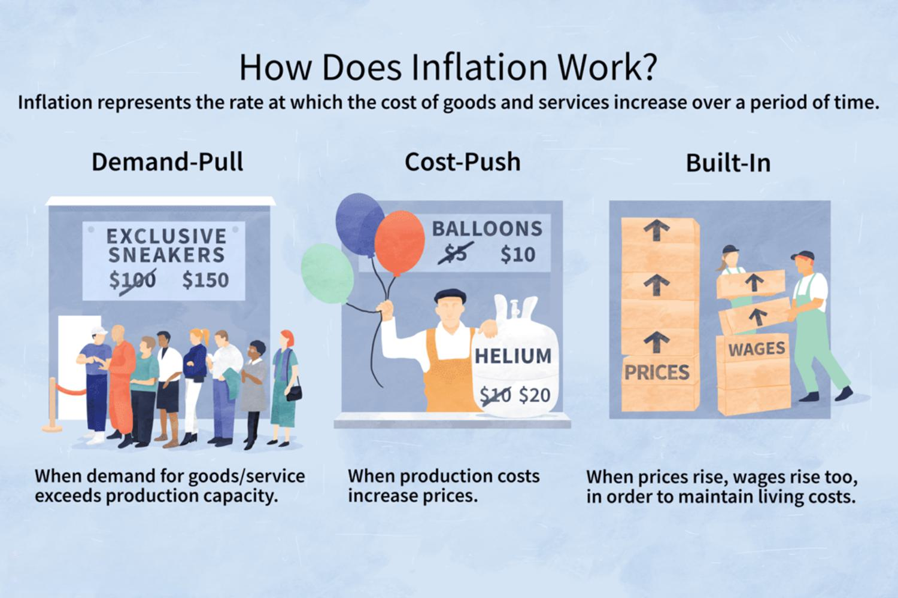

Inflation is a central concern in economics, impacting the purchasing power of money, influencing economic policies, and driving financial market dynamics. As it erodes the value of currency, inflation affects everyone, from individual consumers to major investors, by altering the cost of goods and services over time. For individuals, understanding inflation is key to managing personal finances, from budgeting to investment planning. For investors, inflation is a critical factor in portfolio management and strategy development, as it plays a significant role in determining real returns on investments.

This article provides a comprehensive examination of inflation, focusing on its types and the broader economic effects. By exploring the various forms that inflation can take—such as demand-pull, cost-push, and built-in inflation—we can better understand the pressures that lead to changes in price levels. Recognizing these can inform strategic decisions around monetary and fiscal policies aimed at controlling inflationary pressures, which is vital for maintaining economic stability and fostering sustainable growth.



In financial markets, inflation's influence is profound and multifaceted. It can sway stock market valuations, affect real returns on bonds, and drive currency fluctuations in foreign exchange markets. This interconnection highlights the importance of adopting tactical measures to mitigate inflation's disruptive impacts. One promising approach is algorithmic trading, which leverages automated systems to analyze vast datasets and execute trades. By incorporating real-time inflation data and machine learning algorithms, traders can improve predictive accuracy and adjust strategies to market changes induced by inflation.

As we dissect inflation and its impact on modern financial practices, this article aims to clarify the complexities that individuals, investors, and policymakers face. Understanding inflation is crucial for devising strategic responses, ensuring long-term financial stability, and enabling informed economic decision-making.

## Table of Contents

## Understanding Inflation

Inflation is a critical economic indicator that signifies the rate at which the price levels of goods and services in an economy rise, consequently diminishing the purchasing power of money. Fundamentally, inflation results from several key factors, including an increase in the money supply, heightened demand for goods and services, and rising costs of production inputs.

An increase in the money supply can be understood through the equation of exchange: 

$$
MV = PQ
$$

where $M$ represents the money supply, $V$ is the velocity of money, $P$ is the price level, and $Q$ is the output of goods and services. An excessive increase in $M$ without a corresponding increase in $Q$ typically leads to a rise in $P$, contributing to inflation.

Demand-pull inflation occurs when aggregate demand in an economy outpaces aggregate supply, causing price increases. Conversely, cost-push inflation arises when the costs of production, such as wages and raw materials, rise, forcing producers to increase prices to maintain profit margins.

Inflation measurement involves indices like the Consumer Price Index (CPI) and the Producer Price Index (PPI). The CPI tracks changes in the price level of a market basket of consumer goods and services purchased by households, while the PPI measures the average changes in selling prices received by domestic producers for their output. These indices are essential for assessing economic conditions and making informed policy decisions.

The impacts of inflation are widespread, affecting various aspects of the economy. Interest rates, for example, often move in line with inflation, as central banks adjust rates to control inflationary pressures. Higher inflation typically leads to higher interest rates, which can impact borrowing costs for consumers and businesses. Currency values may also be influenced, as inflation can decrease a currency's purchasing power relative to others, affecting exchange rates and international trade dynamics. Moreover, inflation erodes the real value of investment returns, as rising prices diminish the actual gains obtained from investments.

A thorough understanding of inflation's mechanisms is vital for developing strategies to mitigate its adverse effects. For instance, policymakers may employ monetary and fiscal tools to control inflation and stabilize the economy. Recognizing the causes and effects of inflation allows for more effective economic planning and risk management, ensuring economic stability and growth.

## Types of Inflation

Inflation, a pervasive economic phenomenon, manifests in several forms, each driven by distinct underlying factors. Understanding these forms is essential for the development of effective inflation control policies. 

**Demand-Pull Inflation** emerges when the aggregate demand for goods and services in an economy surpasses its productive capacity. This imbalance leads to upward pressure on prices as consumers compete for the limited supply of commodities. An example of demand-pull inflation can be seen during periods of economic expansion when increased consumer spending, often fueled by easy credit, pushes demand beyond sustainable levels. The economic principle underlying this form of inflation is the classical demand-supply equation, where prices rise when demand (D) exceeds supply (S): 
$$
\text{If } D > S, \text{ then prices increase.}
$$

**Cost-Push Inflation**, on the other hand, occurs when there is an increase in the costs of production. Key production inputs such as labor, raw materials, and energy become more expensive, prompting producers to pass these costs onto consumers in the form of higher prices. A notable cause can be supply chain disruptions, which may happen due to geopolitical events, natural disasters, or other constraints that limit the availability of essential inputs. For example, if a significant oil-producing region encounters political instability, oil prices may increase, subsequently driving up transportation and manufacturing costs globally.

**Built-In Inflation**, also known as wage-price inflation, is driven by adaptive expectations of inflation. It is a self-perpetuating cycle where workers demand higher wages in anticipation of rising prices, causing firms to raise their prices to offset the increased wage costs. This form of inflation can be particularly challenging to manage as it often requires policy measures to realign expectations, such as through credible commitment to inflation targets by central banks.

Each type of inflation presents unique challenges and necessitates specific policy interventions. Demand-pull inflation might be addressed through monetary policy measures such as [interest rate](/wiki/interest-rate-trading-strategies) hikes to temper consumer spending. In contrast, cost-push inflation may require a more nuanced approach, potentially involving negotiations to stabilize key input prices or enhancing supply chain resilience. Built-in inflation may call for stronger communication strategies to anchor inflation expectations effectively.

By distinguishing between these types of inflation, policymakers can tailor their strategies to address the root causes of price increases, thereby promoting economic stability. Understanding these dynamics is critical for both economic planning and the formulation of regulatory policies aimed at maintaining price stability.

## Controlling Inflation

Controlling inflation is a primary objective of economic policy, crucial for maintaining economic stability and ensuring sustainable growth. The central banks are at the forefront of this endeavor, primarily through the implementation of monetary policy. By adjusting interest rates, central banks influence borrowing costs, consumer spending, and ultimately the money supply. A common response to rising inflation is to increase interest rates, making borrowing more expensive and reducing spending and investment levels, thereby exerting downward pressure on prices. Conversely, lowering interest rates can stimulate economic activity in times of low inflation or deflationary pressures.

Alongside monetary policy, fiscal policy plays a significant role in managing inflation. Government spending and taxation policies are instrumental tools. During periods of excessive inflation, governments may reduce public expenditure or increase taxes to dampen demand. Conversely, during low inflationary periods, increased government spending or tax cuts can boost economic activity, preventing deflation and stimulating growth.

One prevalent strategy adopted by central banks is inflation targeting, where they set specific inflation rate objectives. By publicly announcing these targets, central banks aim to shape market expectations and behaviors, thereby stabilizing prices indirectly. This approach provides a transparent framework within which monetary policy operates, enhancing accountability and predictability for investors and consumers.

However, the effectiveness of these strategies is heavily dependent on the specific economic context of a country. Factors such as economic structure, external trade, and geopolitical conditions influence how policy measures translate into real-world impacts. Consequently, countries must tailor their inflation control strategies, balancing between monetary and fiscal interventions to suit their unique circumstances. For example, emerging economies with a high reliance on imports might face different challenges compared to advanced economies, requiring a customized policy mix.

Effective inflation control is vital for fostering economic stability, which is a cornerstone of investor confidence and economic planning. Stable prices encourage long-term contracts, investment in innovation, and predictable budgeting for both households and firms, thereby supporting sustainable economic advancement. By carefully integrating monetary and fiscal policies, along with clear inflation targets, countries can navigate the complexities of inflation, promoting a stable and prosperous economic environment.

## Impact of Inflation on Economic Sectors

Inflation exerts a profound influence on various economic sectors, each responding differently to changes in price levels. These varied responses have significant implications for earnings, costs, and overall economic dynamics.

The stock market's response to inflation is closely linked to investor expectations. As inflation rises, the anticipated purchasing power of future cash flows diminishes, which can lead to a reduction in corporate valuations. Investors adjust their expectations of future earnings growth and discount rates, affecting stock prices. Stocks of companies with significant pricing power, such as consumer staples, may fare better during inflationary periods, as they can pass on higher costs to consumers. Conversely, industries with rigid cost structures and competitive pricing pressures might experience squeezed profit margins.

In fixed-income markets, inflation erodes the real returns on investments. Bonds, which pay a fixed interest rate, become less attractive when inflation expectations rise, leading to higher nominal yields as markets demand greater compensation for inflation risk. This inverse relationship between bond prices and yields highlights the sensitivity of fixed-income securities to inflationary pressures.

Foreign exchange markets are also subject to the impacts of inflation. Currency values often adjust as investors seek to protect their purchasing power in an inflationary environment. Higher inflation in a country can lead to the depreciation of its currency as market participants anticipate reduced real returns, impacting international trade and investment. Central banks may respond with monetary policy adjustments, influencing currency valuation further.

Understanding these sector-specific impacts is crucial for strategic investment and risk management. Investors can potentially mitigate inflation risks by diversifying portfolios, including assets with inflation-hedging properties such as commodities or inflation-linked securities. By analyzing the nuanced effects of inflation across sectors, market participants can better navigate the challenges posed by fluctuating economic conditions, ensuring more informed investment decisions and robust risk management strategies.

## Algorithmic Trading and Inflation

Algorithmic trading utilizes automated systems to process extensive market data and execute transactions, a method that has gained increased prominence amidst inflation-related market instability. The core advantage of [algorithmic trading](/wiki/algorithmic-trading) lies in its capacity to rapidly respond to market signals that human traders might miss, offering enhanced agility in trading environments affected by inflation [volatility](/wiki/volatility-trading-strategies).

Inflation data plays a critical role in shaping algorithmic trading models. By incorporating real-time inflation metrics, these models can forecast market trends, adjusting trading strategies accordingly to leverage anticipated movements. This predictive feature is essential, as inflation levels directly influence interest rates, currency strength, and commodity prices, all of which are vital inputs for algorithmic trading.

A key aspect of developing robust trading algorithms involves [backtesting](/wiki/backtesting). By retrospectively testing algorithms against historical inflation scenarios, traders can refine their models to optimize performance across various economic conditions. This historical analysis provides insights into how different inflationary environments might impact asset prices and trading outcomes, allowing for the strategic adjustment of algorithmic logic before live deployment.

Furthermore, [machine learning](/wiki/machine-learning) techniques have become increasingly instrumental in enhancing the accuracy of predicting inflation's effects on asset prices. By training machine learning models on extensive datasets, including past inflation rates and associated market responses, traders can improve the predictive accuracy of their algorithms. This learning process enables algorithms to identify patterns and correlations that guide more informed decision-making during inflationary periods. For example, a machine learning model might identify that a particular stock tends to outperform the market during periods of rising inflation, prompting the trading system to increase its allocation to that stock in similar future conditions.

Integrating inflation considerations into algorithmic trading models not only enhances decision-making but also improves risk management in financial markets. For instance, consider a Python implementation that adjusts trading strategies based on inflation metrics:

```python
def adjust_strategy(inflation_rate):
    if inflation_rate > 2.0:  # Example threshold for high inflation
        increase_allocation('commodities')
    else:
        maintain_allocation()

def increase_allocation(asset_type):
    # Logic to adjust asset allocation
    pass

current_inflation = get_current_inflation()  # Hypothetical function to retrieve inflation data
adjust_strategy(current_inflation)
```

In this example, the function `adjust_strategy` modifies asset allocations based on the prevailing inflation rate, demonstrating a straightforward method by which algorithmic trading systems can incorporate inflation data into decision-making processes.

The amalgamation of inflation data and algorithmic trading technologies equips market participants with the tools necessary to navigate complex financial landscapes. This integration is crucial for adapting trading strategies to inflationary pressures, ultimately aiding in achieving resilience and profitability in an ever-evolving economic climate.

## Case Studies

Examining the approaches of renowned investment firms such as Renaissance Technologies and Bridgewater Associates provides a comprehensive understanding of how inflation-aware trading strategies are developed and executed. These firms are at the forefront of integrating advanced computing techniques with economic theory to enhance trading decisions amidst inflationary challenges.

Renaissance Technologies is recognized for its pioneering use of quantitative models to make investment decisions. The firm utilizes a variety of macroeconomic data, including inflation metrics, to refine its algorithmic trading strategies. By incorporating large datasets and employing machine learning techniques, Renaissance's algorithms can predict market fluctuations with considerable accuracy. Their approach often involves backtesting models against historical inflation scenarios to ensure robustness under different economic conditions. This iterative process of testing and refining models enables them to effectively manage inflation-induced market volatility.

Bridgewater Associates adopts a distinct strategy that emphasizes a deep understanding of macroeconomic principles. The firm leverages inflation data along with other economic indicators to inform its investment decisions. Bridgewater's strategy involves decomposing macroeconomic trends to anticipate shifts in inflation and adjust portfolio allocations accordingly. The utilization of a diversified set of asset classes helps in mitigating risks associated with inflation, allowing the firm to achieve stable returns even during volatile periods.

The methodologies employed by these firms illustrate the practical application of integrating economic theory with computational techniques. Renaissance Technologies and Bridgewater Associates demonstrate that a data-driven approach, combined with sophisticated analytical models, can significantly enhance the ability to respond to inflationary pressures.

Analyzing these case studies offers valuable insights for developing inflation-responsive trading systems. It underscores the importance of incorporating macroeconomic data into algorithmic models and highlights the effectiveness of machine learning in improving predictive capabilities. By understanding and adopting such strategies, investors can better navigate the complexities of financial markets in the face of inflation. This approach not only aids in risk management but also contributes to achieving sustained financial performance.

## Conclusion

Inflation continues to be a pivotal concern in economic policy and financial markets, demanding rigorous monitoring and strategic interventions. As inflation interlinks with various economic variables, individuals, investors, and policymakers must deploy informed strategies to navigate its complexities effectively. This dynamic environment underscores the importance of a comprehensive understanding of inflationary forces and their potential impacts on different economic sectors.

Algorithmic trading has emerged as a promising avenue in addressing inflationary pressures. By utilizing sophisticated algorithms and real-time data analysis, these systems offer innovative solutions for managing financial risks associated with inflation. The automation and precision of algorithmic trading enable market participants to adjust rapidly to changing economic indicators, making it a valuable tool in the contemporary economic landscape.

The integration of real-time data and advanced computational techniques facilitates a more nuanced approach to inflation management. By leveraging machine learning and predictive modeling, algorithmic trading systems can better anticipate market trends influenced by inflation. This capability is vital for investors seeking to optimize their strategies in an environment characterized by volatility and uncertainty.

A thorough understanding and integration of inflation considerations are essential for achieving long-term financial stability and growth. By adopting informed, data-driven strategies, market participants can more effectively mitigate the risks associated with inflation, thereby enhancing economic resilience and sustaining growth. As inflation continues to evolve, the ability to incorporate its effects into financial and economic decision-making will remain a crucial [factor](/wiki/factor-investing) in securing future economic prosperity.

## References & Further Reading

[1]: Gordon, R. J. (1975). ["The Demand for and Supply of Inflation."](https://www.journals.uchicago.edu/doi/10.1086/466845) Journal of Law and Economics, 18(3), 393-431.

[2]: Barsky, R. B., & Kilian, L. (2001). ["Do We Really Know that Oil Caused the Great Stagflation? A Monetary Alternative."](https://www.nber.org/papers/w8389) In NBER Macroeconomics Annual 2001, Volume 16 (pp. 137-183). MIT Press.

[3]: ["Advances in Financial Machine Learning"](https://www.amazon.com/Advances-Financial-Machine-Learning-Marcos/dp/1119482089) by Marcos Lopez de Prado

[4]: Friedman, M. (1968). ["The Role of Monetary Policy."](https://www.aeaweb.org/aer/top20/58.1.1-17.pdf) The American Economic Review, 58(1), 1-17.

[5]: ["Inflation Targeting: Lessons from the International Experience"](https://www.jstor.org/stable/j.ctv301gdr) by Ben S. Bernanke, Thomas Laubach, Frederic S. Mishkin, and Adam S. Posen

[6]: ["Machine Learning for Algorithmic Trading"](https://github.com/PacktPublishing/Machine-Learning-for-Algorithmic-Trading-Second-Edition) by Stefan Jansen

[7]: ["Quantitative Trading: How to Build Your Own Algorithmic Trading Business"](https://books.google.com/books/about/Quantitative_Trading.html?id=j70yEAAAQBAJ) by Ernest P. Chan

[8]: Samuelson, P. A., & Solow, R. M. (1960). ["Analytical Aspects of Anti-Inflation Policy."](https://www.jstor.org/stable/pdf/1815021.pdf) The American Economic Review, 50(2), 177-194.