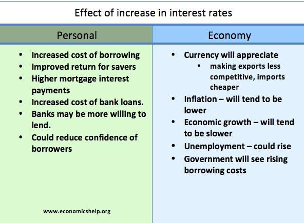

## Table of Contents

## What is inflation?

Inflation is when the prices of things we buy, like food and toys, go up over time. It means that the money we have can buy less stuff than before. Imagine if a candy bar cost $1 last year, but this year it costs $1.10. That's inflation happening.

Inflation can happen for many reasons. Sometimes, it's because there's more money around, so people can spend more, and prices go up. Other times, it's because it costs more to make things, like if the price of sugar goes up, then candy might cost more too. Governments and banks try to keep inflation steady so it doesn't get too high or too low.

## What are the main causes of inflation?

Inflation can happen because of something called "demand-pull inflation." This is when people want to buy more things than what's available. Imagine if everyone suddenly wanted to buy lots of toy cars, but there weren't enough toy cars to go around. The toy car makers might raise the price because they know people really want them. This can happen when the economy is doing well and people have more money to spend.

Another cause is "cost-push inflation." This happens when it costs more to make things. For example, if the price of rubber goes up, then the cost of making toy cars goes up too. The toy car makers might then raise the price of the toy cars to cover their higher costs. Things like higher wages for workers or more expensive materials can lead to this type of inflation.

Sometimes, inflation can also be caused by the government printing too much money. When there's more money around, people can spend more, and that can push prices up. This is called "monetary inflation." Governments and central banks try to manage how much money is in the economy to keep inflation under control.

## How is inflation measured?

Inflation is measured using something called a price index. The most common one is the Consumer Price Index, or CPI. The CPI looks at the prices of a bunch of things that people buy regularly, like food, clothes, and gas. People in charge collect this information every month and compare it to what it was last month or last year. If the prices have gone up, that's inflation.

Another way to measure inflation is with the Producer Price Index, or PPI. This one looks at the prices that businesses pay for things they need to make their products, like raw materials and energy. If these prices go up, it might mean that the prices of the things they sell will go up too, which can lead to inflation. Both the CPI and PPI help us understand how fast prices are changing and how much inflation is happening.

## What are the different types of inflation?

There are different types of inflation, and each one happens for a different reason. One type is called "demand-pull inflation." This happens when people want to buy more things than what's available. It's like when everyone wants the newest toy, but there aren't enough toys to go around, so the price goes up. This can happen when the economy is doing well and people have more money to spend.

Another type is "cost-push inflation." This happens when it costs more to make things. For example, if the price of rubber goes up, then making toy cars becomes more expensive. The people who make the toy cars might raise the price to cover their higher costs. Things like higher wages for workers or more expensive materials can lead to this type of inflation.

There's also "built-in inflation," which happens when people expect prices to keep going up. Workers might ask for higher wages because they think prices will be higher in the future. If businesses give them higher wages, they might raise their prices to cover the cost, which can lead to more inflation. Governments and banks try to keep an eye on all these types of inflation to make sure the economy stays stable.

## What are the effects of inflation on the economy?

Inflation can change how people and businesses act in the economy. When prices go up, the money people have can buy less stuff. This means people might have to spend more to get the same things they used to buy. If inflation is too high, it can make it hard for people to save money because the value of their savings goes down. Businesses might also raise their prices to keep up with higher costs, which can make things even more expensive for everyone. If inflation gets out of control, it can make the economy unstable and cause problems like people not wanting to spend money because they're worried about prices going up even more.

On the other hand, a little bit of inflation can be good for the economy. It can encourage people to spend money now instead of saving it, because they know prices might be higher later. This can help keep the economy moving. Also, if wages go up along with prices, people might feel like they're doing better even if things cost more. Governments and central banks try to keep inflation at a level that helps the economy grow without causing too many problems. They do this by controlling how much money is in the economy and setting interest rates to make borrowing money more or less expensive.

## What is the difference between inflation and hyperinflation?

Inflation is when prices go up over time, making things more expensive. It's a normal part of the economy and happens for different reasons, like when people want to buy more stuff than what's available or when it costs more to make things. Governments and banks try to keep inflation steady, usually aiming for a small increase each year, like 2% or 3%. This helps the economy grow without causing big problems.

Hyperinflation is when prices go up really, really fast, much faster than normal inflation. It's like inflation on steroids. Instead of prices going up a little bit each year, they might double or triple in just a few months. Hyperinflation can make money lose its value quickly, so people rush to spend it before it's worth even less. This can cause big problems in the economy, like making it hard for people to buy things they need and causing businesses to struggle. Hyperinflation is rare but can happen if the government prints too much money or if the economy is in big trouble.

## What are monetary policy tools used to control inflation?

Central banks use something called monetary policy to help control inflation. One of the main tools they use is changing interest rates. When the central bank raises interest rates, it makes borrowing money more expensive. This can slow down spending because people and businesses might not want to take out loans if they have to pay more interest. When spending slows down, it can help keep prices from going up too fast. On the other hand, if the central bank lowers interest rates, borrowing becomes cheaper, which can encourage spending and help the economy grow, but it might also lead to higher inflation if not managed carefully.

Another tool is called open market operations. This is when the central bank buys or sells government bonds. If they want to reduce inflation, they might sell bonds, which takes money out of the economy. When there's less money around, people might spend less, which can help keep prices stable. If they want to increase spending and maybe help the economy grow, they might buy bonds, putting more money into the economy. This can encourage spending but needs to be done carefully to avoid causing too much inflation.

Sometimes, central banks also use reserve requirements, which is how much money banks have to keep on hand. If the central bank raises the reserve requirement, banks have less money to lend out, which can slow down spending and help control inflation. If they lower it, banks can lend more, which can boost spending but might lead to higher inflation if not watched closely. By using these tools, central banks try to keep inflation at a level that helps the economy without causing big problems.

## How does fiscal policy help in managing inflation?

Fiscal policy is about how the government spends money and collects taxes. It can help manage inflation by changing how much money people have to spend. If the government thinks inflation is too high, it might decide to spend less money on things like building roads or giving out benefits. This can take money out of the economy, which means people might spend less, helping to slow down inflation. The government can also raise taxes, which takes more money out of people's pockets, making them spend less and helping to keep prices from going up too fast.

On the other hand, if the government wants to help the economy grow and isn't too worried about inflation, it might spend more money on things like schools or hospitals. This can put more money into the economy, encouraging people to spend more and helping businesses grow. But the government needs to be careful because spending too much can lead to higher inflation. By adjusting how much it spends and how much it taxes, the government can help keep inflation at a level that's good for everyone.

## What role do central banks play in controlling inflation?

Central banks are really important for keeping inflation under control. They do this by using something called monetary policy. One way they do this is by changing interest rates. If they think prices are going up too fast, they might raise interest rates to make borrowing money more expensive. When borrowing costs more, people and businesses might spend less, which can help slow down inflation. If the economy needs a boost and inflation isn't too high, they might lower interest rates to make borrowing cheaper, encouraging people to spend more.

Another thing central banks do is buy or sell government bonds, which is called open market operations. If they want to reduce inflation, they might sell bonds, which takes money out of the economy. With less money around, people might spend less, helping to keep prices stable. If they want to help the economy grow, they might buy bonds, putting more money into the economy and encouraging spending. Central banks also set rules for how much money banks have to keep on hand, called reserve requirements. By adjusting these rules, they can control how much money banks can lend out, which also helps manage inflation.

## What are the limitations of traditional inflation control methods?

Traditional ways to control inflation, like changing interest rates or how much money is in the economy, have some limits. One big problem is that these methods can take a long time to work. If a central bank raises interest rates to slow down inflation, it might take months or even years before people and businesses start spending less and prices stop going up so fast. This delay can make it hard for central banks to keep inflation just right because they have to guess what will happen in the future.

Another limit is that these methods can sometimes cause other problems. For example, if a central bank raises interest rates too much to fight inflation, it might slow down the economy too much and even cause a recession. People might lose their jobs, and businesses might struggle. Also, these methods don't always work the same way in every situation. What works well in one country or during one time might not work as well in another place or time. So, central banks have to be very careful and keep an eye on a lot of different things to make sure they're doing the right thing to control inflation.

## How do supply-side policies affect inflation?

Supply-side policies are about making it easier for businesses to make things and for workers to do their jobs. These policies can help control inflation by making sure there are enough things for people to buy. For example, if the government gives tax breaks to businesses that make toys, those businesses might be able to make more toys without raising prices. This can help keep inflation down because there are more toys to go around, so people don't have to pay more to get them. Also, if the government helps train workers to be better at their jobs, they can make more things faster, which can also help keep prices from going up too fast.

But supply-side policies don't always work the way we want them to. Sometimes, giving tax breaks to businesses can lead to more money being spent, which can actually push prices up if there's not enough stuff to buy. Also, if businesses use the tax breaks to pay their workers more, that can lead to higher wages, which might make things more expensive. So, while supply-side policies can help control inflation by increasing how much stuff is available, they need to be used carefully to make sure they don't end up making inflation worse instead.

## What are some advanced economic theories on inflation control?

One advanced theory on inflation control is called "inflation targeting." This is when a central bank sets a specific goal for inflation, like saying they want prices to go up by 2% each year. They then use tools like interest rates to try to hit that target. The idea is that by being clear about their goal, the central bank can help everyone in the economy expect prices to go up in a steady way. This can make it easier for businesses to plan and for people to make decisions about saving and spending. But it can be tricky because the central bank has to guess what will happen in the future and adjust their tools carefully to keep inflation just right.

Another theory is called "nominal GDP targeting." This one is a bit different because it focuses on the total amount of money spent in the economy instead of just looking at prices. The central bank sets a goal for how much they want the total spending to grow each year. If spending is growing too fast, it might lead to inflation, so the central bank can use tools like interest rates to slow it down. If spending is too slow, they might do the opposite to speed it up. This approach can help balance both inflation and economic growth, but it's harder to do because it involves keeping track of a lot more things than just prices.

## What is Understanding Inflation?

Inflation is a critical economic indicator that signifies the rate at which the price levels of goods and services in an economy rise, consequently diminishing the purchasing power of money. Fundamentally, inflation results from several key factors, including an increase in the money supply, heightened demand for goods and services, and rising costs of production inputs.

An increase in the money supply can be understood through the equation of exchange: 

$$
MV = PQ
$$

where $M$ represents the money supply, $V$ is the velocity of money, $P$ is the price level, and $Q$ is the output of goods and services. An excessive increase in $M$ without a corresponding increase in $Q$ typically leads to a rise in $P$, contributing to inflation.

Demand-pull inflation occurs when aggregate demand in an economy outpaces aggregate supply, causing price increases. Conversely, cost-push inflation arises when the costs of production, such as wages and raw materials, rise, forcing producers to increase prices to maintain profit margins.

Inflation measurement involves indices like the Consumer Price Index (CPI) and the Producer Price Index (PPI). The CPI tracks changes in the price level of a market basket of consumer goods and services purchased by households, while the PPI measures the average changes in selling prices received by domestic producers for their output. These indices are essential for assessing economic conditions and making informed policy decisions.

The impacts of inflation are widespread, affecting various aspects of the economy. Interest rates, for example, often move in line with inflation, as central banks adjust rates to control inflationary pressures. Higher inflation typically leads to higher interest rates, which can impact borrowing costs for consumers and businesses. Currency values may also be influenced, as inflation can decrease a currency's purchasing power relative to others, affecting exchange rates and international trade dynamics. Moreover, inflation erodes the real value of investment returns, as rising prices diminish the actual gains obtained from investments.

A thorough understanding of inflation's mechanisms is vital for developing strategies to mitigate its adverse effects. For instance, policymakers may employ monetary and fiscal tools to control inflation and stabilize the economy. Recognizing the causes and effects of inflation allows for more effective economic planning and risk management, ensuring economic stability and growth.

## References & Further Reading

[1]: Gordon, R. J. (1975). ["The Demand for and Supply of Inflation."](https://www.journals.uchicago.edu/doi/10.1086/466845) Journal of Law and Economics, 18(3), 393-431.

[2]: Barsky, R. B., & Kilian, L. (2001). ["Do We Really Know that Oil Caused the Great Stagflation? A Monetary Alternative."](https://www.nber.org/papers/w8389) In NBER Macroeconomics Annual 2001, Volume 16 (pp. 137-183). MIT Press.

[3]: ["Advances in Financial Machine Learning"](https://www.amazon.com/Advances-Financial-Machine-Learning-Marcos/dp/1119482089) by Marcos Lopez de Prado

[4]: Friedman, M. (1968). ["The Role of Monetary Policy."](https://www.aeaweb.org/aer/top20/58.1.1-17.pdf) The American Economic Review, 58(1), 1-17.

[5]: ["Inflation Targeting: Lessons from the International Experience"](https://www.jstor.org/stable/j.ctv301gdr) by Ben S. Bernanke, Thomas Laubach, Frederic S. Mishkin, and Adam S. Posen

[6]: ["Machine Learning for Algorithmic Trading"](https://github.com/PacktPublishing/Machine-Learning-for-Algorithmic-Trading-Second-Edition) by Stefan Jansen

[7]: ["Quantitative Trading: How to Build Your Own Algorithmic Trading Business"](https://books.google.com/books/about/Quantitative_Trading.html?id=j70yEAAAQBAJ) by Ernest P. Chan

[8]: Samuelson, P. A., & Solow, R. M. (1960). ["Analytical Aspects of Anti-Inflation Policy."](https://www.jstor.org/stable/pdf/1815021.pdf) The American Economic Review, 50(2), 177-194.