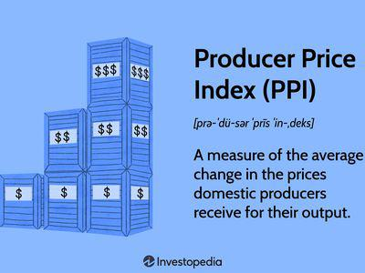

In today’s volatile financial markets, understanding inflation is crucial for investors and policymakers. One of the key metrics for assessing inflation is the Producer Price Index (PPI). As an economic indicator, the PPI offers valuable insights not only into the current state of inflation but also serves as a predictive tool for future inflationary trends. It captures the average changes over time in the selling prices received by domestic producers, reflecting wholesale inflation, which often precedes retail price adjustments.

Investors and policymakers recognize the importance of the PPI in predicting economic shifts. The data it provides helps in understanding the pricing dynamics at various stages of production before they reach the consumer level. This capability makes the PPI an essential tool for economic prediction, enabling stakeholders to make informed decisions. 



Moreover, the significance of the PPI extends to algorithmic trading, where traders use the index to anticipate market trends and craft strategies accordingly. By analyzing PPI trends, traders can forecast inflation and make strategic decisions in asset management and risk assessment. This underscores the PPI's role not only in economic analysis but also in enhancing the precision and effectiveness of trading algorithms. Overall, the PPI remains a cornerstone in the toolkit of economists and traders aiming to navigate and succeed in complex financial environments.

## Table of Contents

## What is the Producer Price Index (PPI)?

The Producer Price Index (PPI) is a pivotal economic indicator that quantifies the average change over time in the selling prices received by domestic producers for their output. This metric serves as a measure of wholesale inflation, capturing price variations at the producer level rather than at the retail level where consumer prices are evident. Unlike the Consumer Price Index (CPI), which tracks changes in prices from the consumer perspective, the PPI offers insights into price shifts that occur at earlier stages of production.

The PPI consists of a family of indexes that measure the average change in selling prices from the perspective of the producer. This comprehensive encapsulation allows for a more nuanced understanding of inflationary pressures. The measure focuses primarily on the initial transaction of goods and services, considering the prices producers charge to the market, whether to other businesses or consumers directly.

Covering a broad spectrum of the economy, the PPI is divided into three primary areas: industry-level classification, commodity grouping that organizes goods and services by similarity or material use, and the stage of processing, which tracks the flow of goods through production stages. This breakdown allows the PPI to provide a detailed view of inflation trends across different segments of the economy.

The PPI's focus on wholesale price changes makes it an essential tool for economic analysis and prediction. By observing PPI movements, analysts can infer about potential changes to consumer prices as costs incurred by producers often cascade down to the retail level. This anticipation of consumer price shifts reinforces the PPI's role not only in understanding current economic conditions but also in forecasting future inflation trends.

## How PPI is Calculated

The Producer Price Index (PPI) is calculated through a systematic approach undertaken by the U.S. Bureau of Labor Statistics (BLS), which involves collecting price data from a strategically selected sample of approximately 25,000 producers. This data curation is essential for constructing the PPI, which reflects the average change over time in the selling prices received by producers for their goods and services. The process starts with gathering comprehensive information from various sectors within the economy, representing a broad array of industries and commodities.

To ensure the PPI accurately reflects the economic landscape, it employs industry-specific and commodity-specific indexes. These indexes are designed to capture price movements within particular segments of the market, offering a nuanced portrayal of economic activities. Industry-specific indexes focus on price adjustments within particular sectors, while commodity-specific indexes track changes across different goods and materials.

A critical aspect of the PPI calculation involves assigning appropriate weights to different goods and services. These weights are based on their economic significance, reflecting their relative importance within the overall economy. The weighting process ensures that the PPI provides an accurate measure of inflationary trends by considering the contribution of each item to the economy's production structure. These weights are typically derived from input-output tables or other comprehensive economic data sources.

Mathematically, the PPI can be conceptualized as a weighted average of price changes. Suppose $P_{t,i}$ represents the price of a specific good or service $i$ at time $t$ and $w_i$ represents the weight assigned to it based on its economic importance. The PPI could be represented as:

$$
\text{PPI} = \frac{\sum_{i=1}^{n} (P_{t,i} \cdot w_i)}{\sum_{i=1}^{n} w_i}
$$

where $n$ is the total number of goods and services included in the index. This formula encapsulates how changes in producer prices are aggregated to provide a comprehensive overview of inflationary pressures from the producer perspective.

By leveraging this structured methodology, the PPI serves as a robust indicator of price trends, offering insights into the cost dynamics faced by producers and their potential impact on the broader economy.

## Understanding PPI as an Economic Indicator

The Producer Price Index (PPI) is a pivotal economic indicator, offering early warning signals of inflationary pressures. By measuring the average change in selling prices received by domestic producers, PPI acts as a harbinger of shifts that may eventually permeate consumer markets. The index captures price variations at the wholesale level, thereby providing crucial data for forecasting potential changes in consumer prices, often tracked by the Consumer Price Index (CPI). 

Economists frequently employ the PPI to predict adjustments in the CPI. The underlying rationale is straightforward: when the cost of production rises, these increased expenses tend to be transferred downstream, ultimately impacting consumer pricing. This pass-through effect is a critical pathway through which changes observed at the producer level can trickle down to influence retail prices and thereby consumer inflation. 

Through its focus on wholesale price changes, the PPI enhances our understanding of macroeconomic stability. It enables analysts to discern inflationary trends and market dynamics that might not be immediately apparent from consumer price data alone. A sudden rise in PPI suggests that upstream costs are increasing, a scenario likely to lead to higher retail prices unless counteracted by other economic factors. Consequently, PPI serves as a comprehensive tool, reflecting macroeconomic stability by tracking inflationary forces before they reach the consumer market.

In summary, the PPI is an invaluable indicator for economic analysis, offering insights into the broader inflationary landscape by spotlighting upstream price changes. This allows both policymakers and market participants to better predict potential shifts in consumer prices, thereby aiding in the formulation of informed economic strategies.

## Comparing PPI with CPI

Both the Producer Price Index (PPI) and the Consumer Price Index (CPI) are critical in the evaluation of inflation but address different stages within the price transformation chain. The PPI tracks price shifts in the wholesale domain, representing the average changes over time in the selling prices received by domestic producers for their output. As such, it emphasizes the price evolution at the initial stage of the commercialization process.

In contrast, the CPI concentrates on retail prices and the cost impact on consumers. It measures the average change over time in prices paid by urban consumers for a basket of goods and services, reflecting the end-point of the commercial process where goods and services reach the individual consumer. This distinct focus allows the CPI to provide insights into the cost of living and consumer purchasing power.

The interplay between PPI and CPI is pivotal for understanding inflationary trends. Since producer-level changes often trickle down to consumer prices, PPI can serve as an early indicator of future CPI movements. When the PPI rises, it suggests that producers are experiencing cost pressures, which might eventually pass on to consumers as higher retail prices, thereby influencing the CPI.

By using both indices, economists and policymakers gain a comprehensive picture of inflationary conditions across different stages of the economy. For instance, a simultaneous increase in both PPI and CPI suggests broad-based inflationary pressures affecting both producers and consumers. Conversely, if the PPI rises but the CPI remains stable, it may indicate cost absorption by producers or lagged transmission to retail prices.

Analyzing PPI alongside CPI can also aid in economic forecasting and policy formulation. A rise in PPI without an immediate effect on CPI might influence central banks to predict future inflation and adjust monetary policy accordingly. This interrelationship underscores the necessity of incorporating both indices in economic analysis for accurate inflation prediction and strategic decision-making.

## Algorithmic Trading and PPI

Algorithmic trading employs economic indicators such as the Producer Price Index (PPI) to enhance predictive analytics and trend forecasting. This quantitative approach leverages PPI data to interpret underlying economic conditions, offering traders a strategic advantage.

The PPI serves as a key indicator for anticipating significant monetary policy changes, particularly [interest rate](/wiki/interest-rate-trading-strategies) decisions. Central banks often react to inflation indicators like the PPI when determining monetary policy. By analyzing PPI trends, traders can predict potential interest rate hikes or cuts, enabling them to adjust their trading strategies accordingly.

Moreover, advanced trading algorithms use sophisticated models and [machine learning](/wiki/machine-learning) techniques to analyze PPI data. These algorithms can process vast amounts of historical and real-time PPI data to identify patterns and correlations with price movements in various asset classes. For instance, a significant increase in PPI might signal rising costs for producers, potentially leading to inflation that would prompt central banks to raise interest rates. Anticipating these moves, traders can position their portfolios to capitalize on expected changes in asset prices.

A typical model might employ a linear regression or time-series analysis to project future price changes based on historical PPI data. In Python, implementing a basic predictive model could involve using libraries such as Pandas for data manipulation and Scikit-learn for building machine learning models:

```python
import pandas as pd
from sklearn.model_selection import train_test_split
from sklearn.linear_model import LinearRegression

# Load PPI and market data
data = pd.read_csv('ppi_and_market_data.csv')
X = data[['PPI']]  # Feature set with PPI data
y = data['MarketIndex']  # Target variable, e.g., a market index

# Split data into training and testing sets
X_train, X_test, y_train, y_test = train_test_split(X, y, test_size=0.2, random_state=42)

# Create and train the linear regression model
model = LinearRegression()
model.fit(X_train, y_train)

# Predict future market index values based on PPI
predictions = model.predict(X_test)
```

Through this model, traders can estimate market index movements based on fluctuations in the PPI.

Furthermore, [algorithmic trading](/wiki/algorithmic-trading) systems integrate PPI data with other economic metrics and financial market information to manage asset allocation and assess risk. By continuously updating forecasts as new PPI data is released, these systems enable dynamic, data-driven investment decisions that optimize performance and minimize risks.

In summary, PPI data plays a crucial role in the algorithmic trading landscape, equipping traders with insights necessary for strategic trading and risk management. By harnessing advanced algorithms to analyze PPI trends, traders can make proactive and informed decisions in response to evolving economic conditions.

## The Role of PPI in Global Markets

The Producer Price Index (PPI) plays a critical role in global markets by providing essential insights into the competitive positioning of various economies. By reflecting producer trends, the PPI helps analysts and decision-makers evaluate how price changes influence global supply chains and trade competitiveness.

PPI data is indispensable for understanding shifts in producer prices, which often precede changes in consumer pricing. This tool allows stakeholders to anticipate the effects of inflation on international trade. For example, an increase in the PPI of a major exporting country may signal future higher costs for imported goods in the global market, affecting price competitiveness and trade balances.

In assessing the impact of PPI on global supply chains, it is crucial to recognize how fluctuations in producer prices affect production costs and, subsequently, the prices of intermediate and finished goods across borders. Multinational corporations monitoring PPI data can better manage procurement strategies, optimize inventory levels, and adjust pricing strategies to maintain competitive advantage.

Policymakers use PPI trends to craft sound economic strategies and negotiations in international forums. For instance, a consistent rise in PPI might prompt governments to reevaluate tariffs and trade policies to mitigate potential adverse effects on domestic producers and consumers. Furthermore, countries with declining PPI may attract investments as lower production costs can enhance the competitive appeal of their exports.

In conclusion, understanding PPI trends is crucial for investors and policymakers aiming to make informed decisions regarding international trade and economic strategies. The index serves as a barometer for assessing economic health and plays a pivotal role in guiding strategic directions in global markets.

## Conclusion

The Producer Price Index (PPI) is an essential tool in understanding inflation and forecasting market trends. By tracking price changes from the perspective of producers, PPI offers early insights into inflationary pressures that are crucial for developing economic strategies. This foresight is invaluable as producer costs often cascade down to consumer prices, impacting the broader economy.

Incorporating PPI data enables traders and economists to make informed decisions, harnessing it alongside other metrics for comprehensive economic forecasting. For traders, the PPI is particularly significant in anticipating shifts that can influence interest rates and market dynamics, thus informing strategic trading decisions. Economists benefit from understanding price trends at the wholesale level, which helps in crafting policies that stabilize the economy and guide international trade strategies.

Overall, the PPI stands out as a pivotal component in economic analysis and strategy. Its ability to offer preliminary indications of market trends ensures that stakeholders can respond proactively to emerging economic challenges. This preemptive approach, aided by the PPI, is fundamental to achieving robust economic forecasting and efficient decision-making in both domestic and global markets.

## References & Further Reading

[1]: ["Producer Price Index (PPI): What It Is & How It's Used"](https://www.investopedia.com/terms/p/ppi.asp) - Investopedia

[2]: ["The Producer Price Index: A Multifaceted Tool for Economic Analysis"](https://www.bls.gov/pPI/) by Brigitte C. Madrian, Monthly Labor Review, February 2007.

[3]: ["Understanding PPI as an Economic Indicator"](https://www.investopedia.com/terms/p/ppi.asp) - ResearchGate

[4]: ["Producer Price Index: Detailed Report"](https://www.bls.gov/ppi/detailed-report/) - U.S. Bureau of Labor Statistics

[5]: ["Quantitative Financial Analytics: Forecasting with Financial Indicators"](https://online.hbs.edu/blog/post/financial-forecasting-methods) by Christian L. Dunis, Peter W. Middleton, Andreas Karathanasopolous, Konstantinos Theofilatos

[6]: ["Algorithmic Trading and Data Science"](https://towardsdatascience.com/data-science-in-algorithmic-trading-d21a46d1565d) by Sourav Ghosh and Dipak Chaudhari