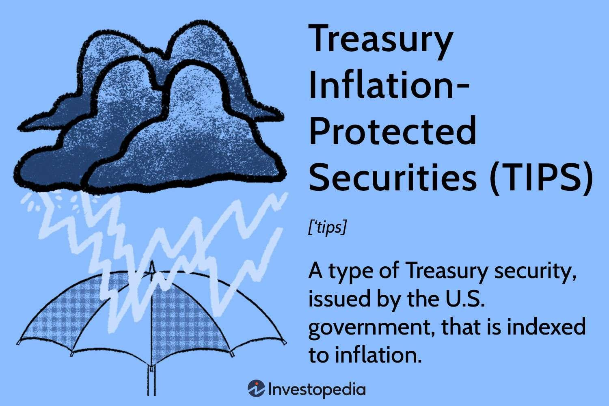

## Table of Contents

## What are inflation-protected securities?

Inflation-protected securities are special types of investments that help protect your money from losing value due to inflation. Inflation is when the prices of things like food, gas, and clothes go up over time. These securities are designed to increase in value as inflation rises, so the money you invest keeps up with the cost of living. This makes them a good choice for people who want to make sure their savings don't lose buying power over time.

One common type of inflation-protected security is called Treasury Inflation-Protected Securities (TIPS), which are issued by the U.S. government. TIPS adjust their value based on changes in the Consumer Price Index (CPI), which measures inflation. When the CPI goes up, the value of TIPS goes up too. This means that even if inflation rises, the amount of money you get back from your investment will be worth the same in terms of what you can buy with it. This makes TIPS a safe way to protect your money from the effects of inflation.

## How do inflation-protected securities work?

Inflation-protected securities are a type of investment that helps keep your money safe from losing value because of inflation. Inflation is when the prices of things like food and gas go up over time. These securities work by adjusting their value based on how much inflation there is. So, if the cost of living goes up, the value of these securities goes up too. This means the money you invested will still be able to buy the same amount of stuff, even if prices have increased.

A common example of inflation-protected securities is Treasury Inflation-Protected Securities (TIPS), which are issued by the U.S. government. TIPS use the Consumer Price Index (CPI) to measure inflation. The CPI tracks the average price changes for a bunch of different things people buy. When the CPI goes up, the value of TIPS also goes up. This way, the money you get back from your TIPS will be worth the same as when you invested it, even if inflation has made everything more expensive. This makes TIPS a good choice for people who want to make sure their savings keep up with the rising costs of living.

## What is the main purpose of investing in inflation-protected securities?

The main purpose of investing in inflation-protected securities is to keep your money safe from losing value because of inflation. Inflation is when the prices of things like food and gas go up over time. This means that the same amount of money can buy less stuff. By investing in inflation-protected securities, you can make sure that your money keeps up with these rising costs. This helps protect your savings so they can still buy the same amount of things, even if prices go up.

A common type of inflation-protected security is called Treasury Inflation-Protected Securities (TIPS). These are issued by the U.S. government and work by adjusting their value based on the Consumer Price Index (CPI), which measures inflation. When the CPI goes up, the value of TIPS goes up too. This means that even if everything gets more expensive, the money you get back from your TIPS will still be worth the same as when you invested it. So, the main goal of investing in TIPS or other inflation-protected securities is to make sure your money doesn't lose buying power over time.

## What are the different types of inflation-protected securities available?

Inflation-protected securities come in different types, but the most common one is called Treasury Inflation-Protected Securities (TIPS). TIPS are issued by the U.S. government and are designed to protect your money from losing value because of inflation. They do this by adjusting their value based on the Consumer Price Index (CPI), which measures how much prices are going up. So, if the CPI goes up, the value of your TIPS goes up too. This means your investment will be worth the same even if everything else gets more expensive.

Another type of inflation-protected security is called Inflation-Linked Bonds (ILBs). These are similar to TIPS but are issued by different countries or companies. Just like TIPS, ILBs adjust their value based on inflation rates, usually measured by a country's own inflation index. This helps make sure your money keeps up with the rising costs of living no matter where you are. Both TIPS and ILBs are good choices if you want to make sure your savings don't lose buying power over time.

## How are inflation-protected securities different from regular bonds?

Inflation-protected securities and regular bonds are both types of investments, but they work a bit differently. Regular bonds pay you a fixed amount of interest over time, and when they mature, you get your original investment back. The problem with regular bonds is that if inflation goes up, the money you get back might not be worth as much as when you first invested it. This means you could lose buying power because the same amount of money buys less stuff.

On the other hand, inflation-protected securities, like Treasury Inflation-Protected Securities (TIPS), are designed to protect your money from inflation. They do this by adjusting their value based on changes in the Consumer Price Index (CPI), which measures inflation. So, if the CPI goes up, the value of your TIPS goes up too. This means that even if everything gets more expensive, the money you get back from your TIPS will still be worth the same as when you first invested it. This makes inflation-protected securities a good choice if you want to make sure your savings keep up with the rising cost of living.

## What is the role of the Consumer Price Index (CPI) in inflation-protected securities?

The Consumer Price Index (CPI) plays a very important role in inflation-protected securities. The CPI measures how much the prices of things like food, gas, and clothes are going up. This is called inflation. Inflation-protected securities, like Treasury Inflation-Protected Securities (TIPS), use the CPI to adjust their value. When the CPI goes up, it means inflation is going up, so the value of TIPS goes up too. This helps make sure that the money you get back from your investment can still buy the same amount of stuff, even if prices have increased.

The way this works is simple. If the CPI shows that prices are rising, the principal value of TIPS is adjusted upward to match the inflation rate. This means that the interest payments you receive from TIPS also increase because they are based on the adjusted principal. By doing this, TIPS help protect your savings from losing buying power over time. So, the CPI is really important because it tells inflation-protected securities how much to adjust to keep up with the cost of living.

## How can inflation-protected securities be used in a diversified investment portfolio?

Inflation-protected securities, like TIPS, can be a smart addition to a diversified investment portfolio. They help protect your money from losing value because of inflation. Inflation is when the prices of things go up over time. By including inflation-protected securities in your portfolio, you make sure that part of your savings will keep up with the rising cost of living. This is especially useful if you're worried about inflation eating away at your money's buying power.

Adding inflation-protected securities to your portfolio can also balance out other types of investments. For example, if you have stocks or regular bonds, these might not do well if inflation goes up a lot. But inflation-protected securities will adjust their value to match inflation, so they can help keep your overall portfolio stable. This way, you're not putting all your eggs in one basket, and you're better prepared for different economic situations.

## What are the potential risks associated with investing in inflation-protected securities?

Investing in inflation-protected securities, like TIPS, has some risks you should know about. One risk is that if inflation turns out to be lower than expected, your investment might not grow as much as you hoped. This means you could miss out on higher returns from other types of investments that do better when inflation is low. Another risk is that if you need to sell your inflation-protected securities before they mature, their value might have gone down. This can happen if interest rates go up, making newer securities more attractive to buyers.

Another thing to consider is that while inflation-protected securities protect against inflation, they might not offer as high returns as other investments like stocks. This means you might be giving up the chance for bigger gains to have the safety of knowing your money will keep up with inflation. It's all about balancing the safety of your investment with the potential for growth. So, it's important to think about your overall investment goals and how inflation-protected securities fit into your plan.

## How do tax considerations affect the returns from inflation-protected securities?

When you invest in inflation-protected securities like TIPS, you need to think about taxes. The interest you earn from TIPS is taxable every year, even though you don't get the money until the security matures. Also, the increase in the value of your TIPS because of inflation is considered part of your income and is taxed too. This means you might have to pay taxes on money you haven't actually received yet, which can affect how much you end up with at the end.

Because of these tax rules, the actual returns from inflation-protected securities can be less than what you might expect. If you're in a higher tax bracket, the taxes on the inflation adjustments and interest can eat into your returns more. It's a good idea to think about these tax effects when deciding if inflation-protected securities are right for your investment plan. Talking to a tax advisor can help you understand how these taxes will impact your investment and plan accordingly.

## What historical performance data exists for inflation-protected securities?

Inflation-protected securities, like TIPS, have been around in the U.S. since 1997. Over the years, they have shown to be a good way to protect money from inflation. For example, during times when inflation was high, like in the early 2000s and again in the late 2000s, TIPS did well. They helped investors keep the value of their money even as prices went up. But when inflation was low, like in the 2010s, TIPS didn't grow as much because there wasn't much inflation to protect against.

Looking at specific numbers, from 1997 to 2020, TIPS had an average annual return of about 3-4%. This is lower than what you might get from stocks, but it's important to remember that TIPS are meant to protect against inflation, not to grow your money a lot. During the financial crisis of 2008, TIPS actually did better than many other types of investments because people were worried about inflation and wanted to protect their money. So, while TIPS might not always give the highest returns, they have a history of doing what they're supposed to do: keeping your money safe from inflation.

## How do global economic conditions impact the effectiveness of inflation-protected securities?

Global economic conditions can really affect how well inflation-protected securities, like TIPS, work. When the world economy is doing well, and inflation is going up, these securities do a good job of keeping your money safe. They adjust their value to match the rising prices, so your savings can still buy the same amount of stuff. But if the global economy is not doing so well, and inflation is low or even going down, inflation-protected securities might not grow as much. This is because there's less inflation to protect against, so the value of these securities doesn't go up as much.

Also, things like big economic events or changes in government policies around the world can shake things up. For example, if a big country like the U.S. or China changes its interest rates, it can affect inflation rates everywhere. This can make inflation-protected securities more or less valuable depending on what's happening. So, while these securities are designed to help with inflation, how well they work can depend a lot on what's going on in the global economy.

## What advanced strategies can investors use to maximize returns from inflation-protected securities?

Investors can use a strategy called laddering to maximize returns from inflation-protected securities like TIPS. Laddering means buying TIPS that mature at different times. For example, you might buy some TIPS that mature in one year, some in three years, and some in five years. This way, you can take advantage of different interest rates and inflation adjustments over time. If interest rates go up, you can reinvest the money from the TIPS that mature soon into new TIPS with higher rates. This helps you keep up with inflation better and possibly get better returns.

Another strategy is to use inflation swaps. An inflation swap is a deal between two parties where one pays a fixed rate and the other pays a rate based on inflation. By using inflation swaps, you can bet on what you think inflation will do in the future. If you think inflation will go up a lot, you can use swaps to make more money from your TIPS. This can be a bit more complicated, but it can help you make the most out of your inflation-protected securities. Just remember, using swaps adds more risk, so it's important to understand them well before trying this strategy.

## How can one evaluate long-term investment returns?

A 20-year investment horizon provides a robust framework for evaluating long-term financial returns, as it allows for the smoothing of short-term market [volatility](/wiki/volatility-trading-strategies) and provides insight into the resiliency of various asset classes. Within such a timeframe, the historical performance of Treasury Inflation-Protected Securities (TIPS) highlights their capacity to endure inflationary cycles. TIPS have consistently demonstrated resilience due to their structure, which includes adjustments based on the Consumer Price Index (CPI). This adjustment mechanism ensures that both the principal and interest payments of TIPS increase with inflation, thereby preserving the purchasing power of investors over time.

Historically, TIPS have outperformed other fixed-income securities during periods of rising inflation. This is because traditional bonds may suffer from negative real returns when inflation rates surpass the yield, whereas TIPS adjust for inflation, providing a hedge. For instance, during inflationary periods, the effective yield of TIPS can be calculated as:

$$
\text{Effective Yield} = \text{Nominal Yield} + \text{Inflation Rate}
$$

This formula underscores the importance of TIPS in hedging against inflation, as the adjustment [factor](/wiki/factor-investing) ensures that returns remain positive in real terms.

For investors focused on retirement and wealth-building strategies, TIPS are crucial. They offer stability and serve as a safeguard against eroding purchasing power, which is a pivotal component of financial plans aimed at preserving wealth over lengthy periods. In light of the cyclical nature of markets, assessing 20-year returns allows investors to identify assets like TIPS that can navigate various market environments, including high inflation periods, thus securing a stable financial future. 

This understanding reinforces the need for including TIPS in a diversified portfolio, particularly for those looking to offset the risks associated with traditional fixed-income securities in times of economic uncertainty. Overall, the integration of TIPS into long-term investment strategies serves as a prudent approach to achieving inflation-protected growth and stability.

## References & Further Reading

[1]: ["Advances in Financial Machine Learning"](https://www.amazon.com/Advances-Financial-Machine-Learning-Marcos/dp/1119482089) by Marcos Lopez de Prado

[2]: ["Quasi-Robust Multi-Period Portfolio Optimization with ETFs for Long-Horizon Investors"](https://papers.ssrn.com/sol3/papers.cfm?abstract_id=4078043) by Niklas Wagner

[3]: ["The Handbook of Inflation Hedging Investments"](https://www.amazon.com/Handbook-Inflation-Hedging-Investments-Performance/dp/0071460381) by Robert Greer

[4]: Campbell, J. Y., & Viceira, L. M. (2002). ["Strategic Asset Allocation: Portfolio Choice for Long-Term Investors."](https://academic.oup.com/book/6093) Oxford University Press.

[5]: ["Machine Learning for Algorithmic Trading"](https://www.amazon.com/Machine-Learning-Algorithmic-Trading-alternative/dp/1839217715) by Stefan Jansen