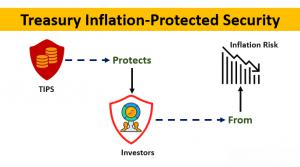

## Table of Contents

## What is inflation and why should we be concerned about it?

Inflation is when the prices of things we buy, like food and clothes, go up over time. It means that the money we have can buy less than it used to. For example, if a candy bar costs $1 now, in a few years it might cost $1.20 because of inflation. Inflation happens for many reasons, like when there's too much money chasing too few goods, or when the costs of making things go up.

We should be concerned about inflation because it can make life harder for people. If prices go up faster than our income, we might not be able to afford the things we need. This can be especially tough for people on fixed incomes, like retirees, who don't get raises. Also, if inflation is very high and unpredictable, it can make it hard for businesses to plan and for people to save money. Keeping inflation in check helps keep the economy stable and makes sure that our money keeps its value over time.

## How does inflation affect personal finances and savings?

Inflation can make your money worth less over time. If you have savings in a bank account that doesn't earn much interest, the money you saved might not be able to buy as much in the future as it can now. For example, if you save $100 today and inflation is 3% per year, in 10 years, that $100 might only be worth about $74 in today's dollars. This means you need to think about where to put your savings so they can grow faster than inflation.

Inflation also affects your everyday spending. When prices go up, you might need to spend more money just to buy the same things you always have. If your income doesn't go up as fast as prices, you might find it harder to pay for everything. This can force you to cut back on some things or look for ways to earn more money. Keeping an eye on inflation can help you plan better and make sure you can still afford what you need.

## What are some basic strategies for protecting against inflation?

One good way to protect against inflation is to invest your money in things that can grow faster than inflation. For example, instead of keeping all your money in a regular savings account where it doesn't earn much, you could put some of it into stocks, real estate, or even inflation-protected bonds. These types of investments have a better chance of keeping up with or beating inflation, which means your money could still buy as much in the future as it does now.

Another strategy is to keep an eye on your spending and make sure your income grows with inflation. If you have a job, you might want to ask for raises that match the rising prices. If you're retired or on a fixed income, you could look into ways to earn extra money, like part-time work or a small business. By keeping your income in line with inflation, you can better afford the things you need even as prices go up.

Lastly, it's a good idea to be smart about how you borrow money. If you have debts like credit cards or loans, try to pay them off quickly. When inflation goes up, the money you owe might become cheaper to pay back in the future because your income might grow. But high inflation can also make interest rates go up, so it's important to manage your debts carefully and not let them get out of control.

## Can investing in real estate help protect against inflation? How?

Yes, investing in real estate can help protect against inflation. When prices go up because of inflation, the value of real estate often goes up too. This means that if you own property, it might be worth more money in the future. Also, if you rent out your property, you can usually raise the rent when prices go up, which means your income from the property can keep up with inflation.

Another way real estate helps is through mortgages. If you have a fixed-rate mortgage, the amount you pay each month stays the same even if inflation makes everything else more expensive. This can make your home payments feel cheaper over time because your income might go up with inflation, but your mortgage payment doesn't. So, real estate can be a good way to keep your money's value safe when prices are rising.

## What role do stocks and equities play in an inflation protection strategy?

Stocks and equities can be a good way to protect your money from inflation. When prices go up, many companies can raise the prices of their products or services. This means they might make more money, and if you own their stocks, the value of your stocks could go up too. Also, some companies pay dividends, which are like little bonuses for owning their stock. If these dividends grow over time, they can help your money keep up with inflation.

But not all stocks are the same when it comes to inflation. Some companies, like those that sell things people always need, like food or medicine, might do better during inflation. These are called "defensive" stocks because they can help protect your money. On the other hand, companies that sell things people can stop buying when prices go up, like luxury items, might not do as well. So, when you're thinking about using stocks to protect against inflation, it's a good idea to pick the right kinds of stocks that can grow with rising prices.

## How can commodities be used as a hedge against inflation?

Commodities like gold, oil, and agricultural products can help protect your money from inflation. When prices go up because of inflation, the prices of commodities often go up too. This is because commodities are raw materials that people always need, no matter what the economy is doing. For example, if you invest in gold and inflation makes everything more expensive, the price of gold might go up too, which means your investment could be worth more money in the future.

Using commodities as a hedge against inflation is like betting that the price of these raw materials will keep up with or beat inflation. You can buy commodities directly or invest in commodity-focused funds or stocks of companies that produce these materials. By doing this, you're spreading out your money so that if inflation makes other investments less valuable, the value of your commodities might go up and help balance things out. This way, commodities can be a good way to keep your money's value safe when prices are rising.

## What are Treasury Inflation-Protected Securities (TIPS) and how do they work?

Treasury Inflation-Protected Securities, or TIPS, are special types of bonds from the U.S. government that help protect your money from inflation. When you buy a TIPS, the bond's value goes up or down based on the inflation rate. If inflation goes up, the value of your TIPS goes up too, which means you get more money back when the bond matures. This makes TIPS a good way to keep your money's value safe when prices are rising.

TIPS work by adjusting the bond's principal, which is the amount of money you get back when the bond matures. The adjustment is based on the Consumer Price Index (CPI), which measures inflation. If the CPI goes up, the principal of your TIPS goes up too. The interest you earn on a TIPS is also based on the adjusted principal, so if inflation goes up, you earn more interest. This way, TIPS can help make sure that the money you get back is worth as much in the future as it is now, even if prices go up.

## How can diversifying investments across different asset classes mitigate inflation risk?

Diversifying your investments across different types of assets can help protect your money from inflation. When you spread your money out over stocks, real estate, commodities, and bonds like TIPS, you're not putting all your eggs in one basket. If inflation makes one type of investment less valuable, the others might go up in value and help balance things out. For example, if inflation makes the prices of everyday things go up, commodities like gold or oil might become more valuable, helping to keep your overall investment safe.

Different assets react to inflation in different ways. Stocks can grow if companies raise their prices, real estate might become more valuable, and TIPS adjust their value to match inflation. By having a mix of these, you're more likely to have some investments that do well when inflation hits. This mix can help make sure that your money keeps its value over time, even when prices are rising. So, diversifying is a smart way to manage the risk of inflation and keep your finances stable.

## What advanced financial instruments can be used to protect against inflation?

One advanced financial instrument that can help protect against inflation is an inflation swap. An inflation swap is like a deal between two people where one agrees to pay the other based on how much inflation goes up. If inflation rises a lot, the person who agrees to pay based on inflation will owe more money, but the other person will get more money to help cover the higher prices. This can be a good way for businesses or investors to manage the risk of inflation without having to buy things like commodities or real estate.

Another tool is an inflation-linked derivative. These are like bets on what inflation will do in the future. For example, you might buy an option that pays out if inflation goes above a certain level. If inflation does go up a lot, you get money to help deal with the higher prices. These derivatives can be tricky and are usually used by big investors or financial experts, but they can be a powerful way to protect against inflation if you know how to use them right.

## How do inflation-linked bonds function and what are their benefits?

Inflation-linked bonds, like Treasury Inflation-Protected Securities (TIPS), are special bonds that change their value based on inflation. When you buy one, the bond's principal, which is the amount you get back when it matures, goes up or down with the inflation rate. This means if inflation goes up, the value of your bond goes up too. The interest you earn on the bond is also based on the new, higher principal, so you get more interest when inflation rises. This helps make sure that the money you get back at the end is worth as much as it was when you bought the bond, even if prices have gone up.

The main benefit of inflation-linked bonds is that they protect your money from losing value because of inflation. If you're worried about prices going up and making your savings worth less, these bonds can help. They adjust automatically to keep up with inflation, so you don't have to worry about your money not being able to buy as much in the future. This makes them a good choice for people who want a safe way to keep their money's value steady, especially during times when inflation might be high.

## What are the potential risks and limitations of various inflation protection strategies?

Using different ways to protect against inflation can have risks and limits. For example, investing in stocks might help your money grow faster than inflation, but stocks can go up and down a lot. If the stock market goes down, you could lose money, even if inflation is high. Real estate can also be a good way to protect against inflation, but buying property costs a lot of money and it's not easy to sell quickly if you need cash. Commodities like gold can go up in value when inflation rises, but they can also be very unpredictable and might not always keep up with inflation.

Another thing to think about is inflation-linked bonds like TIPS. They are safer because they adjust to inflation, but they usually don't give you as much interest as other bonds. This means you might not make as much money from them, even though they protect you from inflation. Advanced financial tools like inflation swaps and derivatives can be very helpful, but they are complicated and risky. If you don't understand them well, you could lose money instead of protecting it. So, while there are many ways to fight inflation, each one has its own risks and limits that you need to think about carefully.

## How should an inflation protection strategy be adjusted based on economic cycles and forecasts?

When you're trying to protect your money from inflation, it's important to think about what's happening in the economy and what might happen next. Economic cycles, which are the ups and downs in the economy, can change how well different ways of protecting against inflation work. For example, during a boom when the economy is doing well, stocks might be a good choice because companies can raise their prices and make more money. But if a recession is coming, where the economy slows down, you might want to put more money into safer things like TIPS or commodities, which can still do well even if the economy is struggling.

Forecasts about inflation can also help you decide what to do. If experts think inflation will go up a lot soon, you might want to invest more in things that do well when prices rise, like real estate or commodities. But if they think inflation will stay low, you might not need to change your strategy as much. Keeping an eye on these forecasts and adjusting your investments can help you stay ahead of inflation and make sure your money keeps its value no matter what the economy is doing.

## What are Traditional Financial Strategies for Inflation Protection?

Diversifying a portfolio across different asset classes is a traditional financial strategy to protect against inflation risks. This approach helps mitigate the impact of rising prices on investment returns by stabilizing purchasing power. A diversified portfolio typically includes Treasury Inflation-Protected Securities (TIPS), commodities such as precious metals, and real estate investments.

TIPS are government-issued bonds specifically designed to provide protection against inflation. The principal value of TIPS is adjusted periodically based on changes in the Consumer Price Index (CPI), effectively preserving their purchasing power. The formula for the adjusted principal is given by:

$$
\text{Adjusted Principal} = \text{Original Principal} \times \left(1 + \frac{\text{CPI Change}}{100}\right)
$$

This adjustment typically results in lower nominal yields compared to other fixed-income securities, but the real returns are stabilized against inflationary pressures. TIPS can be an attractive option for conservative investors seeking low-risk hedges against inflation.

Commodities, particularly precious metals like gold, provide another avenue for inflation protection. Historically, gold has been perceived as a store of value, often appreciating in times of currency devaluation and inflation. However, commodities are subject to higher [volatility](/wiki/volatility-trading-strategies) due to factors such as geopolitical events and changes in supply and demand. Despite this volatility, they are often included in portfolios as a counterbalance to traditional financial assets that may underperform during inflationary periods.

Real estate investment is another strategy for mitigating inflation risk. Property values and rent have a tendency to increase along with inflation, offering potential for capital appreciation and increased rental income. Investing in real estate can involve direct property ownership, Real Estate Investment Trusts (REITs), or real estate-focused mutual funds and ETFs. As properties appreciate in value and rental incomes adjust for inflation, they provide both income and growth potential, helping to offset the adverse effects of inflation on a portfolio.

The combined use of TIPS, commodities, and real estate forms a robust strategy for protecting financial assets against inflation. By spreading risk across various asset classes, investors can better preserve their wealth and maintain the purchasing power of their investments during periods of inflation.

## References & Further Reading

Refer to primary sources and industry expert interviews for detailed insights on inflation protection strategies. Notable publications like "When Money Dies" by Adam Fergusson and "The Great Inflation and Its Aftermath" by Robert J. Samuelson provide historical context and analysis on dealing with inflationary periods. These books highlight strategies employed in past economic environments, offering a backdrop against which current strategies can be evaluated.

Technical books and courses on algorithmic trading provide foundational knowledge to build effective strategies. "Algorithmic Trading: Winning Strategies and Their Rationale" by Ernie Chan and "Quantitative Trading" by the same author are essential reads. These resources explain the underpinnings of algorithmic trading, including backtesting methods and the application of statistical models. Online platforms like Coursera and edX offer courses that teach algorithmic trading from the ground up, focusing on practical implementation and the use of programming languages like Python.

Review reputable publications for ongoing developments in financial and economic policies impacting inflation. The Financial Times, The Wall Street Journal, and The Economist regularly publish articles that track inflation trends and economic policies globally. These sources provide up-to-date information on central bank policies, economic forecasts, and analyses of market reactions to inflationary pressures. Additionally, organizations such as the International Monetary Fund (IMF) and the World Economic Forum (WEF) offer reports and data that are invaluable for understanding macroeconomic trends.

By consulting these resources, investors can gain a comprehensive understanding of both traditional and innovative methods to protect against inflation, equipping themselves with the knowledge to make informed financial decisions.

