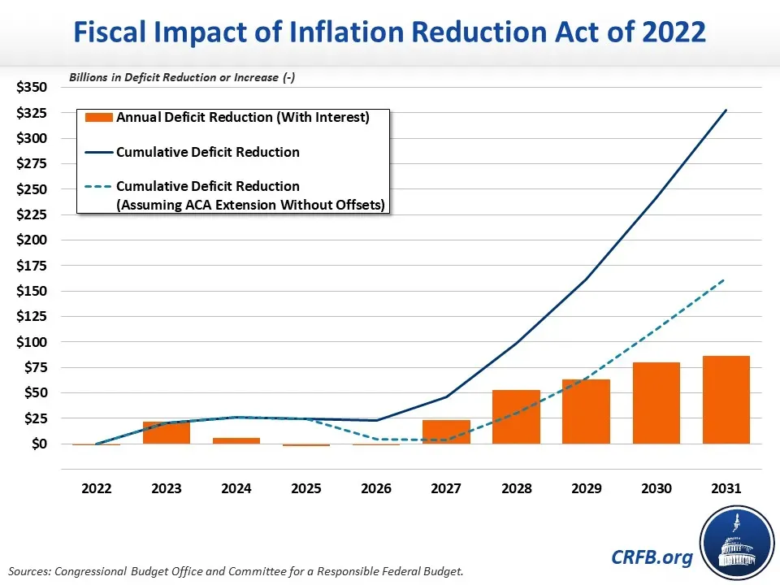

## Table of Contents

## What is the Inflation Reduction Act of 2022?

The Inflation Reduction Act of 2022 is a law passed by the United States government to help lower inflation and address climate change. It was signed into law by President Joe Biden on August 16, 2022. The main goal of the act is to reduce the cost of living for Americans by lowering the prices of things like healthcare and energy. It does this by allowing the government to negotiate drug prices and by providing tax credits for people who buy electric vehicles or make their homes more energy-efficient.

Another important part of the Inflation Reduction Act is its focus on fighting climate change. The law includes a lot of money to help move the country towards using more clean energy, like wind and solar power. It also helps farmers and rural communities by giving them money to use more sustainable farming practices. Overall, the act tries to make life more affordable for Americans while also helping to protect the environment for future generations.

## What are the main goals of the Inflation Reduction Act?

The main goals of the Inflation Reduction Act are to lower inflation and make life more affordable for Americans. The act aims to do this by reducing the cost of healthcare and energy. It allows the government to negotiate drug prices, which can help lower the price of medicine for people. The act also gives tax credits to people who buy electric vehicles or make their homes more energy-efficient, which can save them money on energy bills.

Another big goal of the Inflation Reduction Act is to fight climate change. The law provides a lot of money to help the country use more clean energy, like wind and solar power. This can help reduce the pollution that causes climate change. The act also helps farmers and rural communities by giving them money to use more sustainable farming practices. By doing these things, the Inflation Reduction Act tries to protect the environment for future generations while also making life more affordable right now.

## How does the Inflation Reduction Act aim to reduce inflation?

The Inflation Reduction Act aims to reduce inflation by making things like healthcare and energy cheaper for people. It does this by letting the government talk with drug companies to lower the prices of medicine. This can help people save money on their healthcare bills. The act also gives people tax credits if they buy electric cars or make their homes use less energy. This can help people spend less on gas and electricity, which can help lower inflation.

Another way the act tries to reduce inflation is by helping the country use more clean energy, like wind and solar power. By doing this, the act can help lower the cost of energy over time. When energy costs go down, it can make other things cheaper too, which can help fight inflation. Overall, the Inflation Reduction Act tries to make life more affordable for people by lowering the costs of important things like healthcare and energy.

## What are the key provisions of the Inflation Reduction Act?

The Inflation Reduction Act has several key provisions to help make life more affordable for people. One big part is about healthcare. The law lets the government talk with drug companies to lower the prices of medicine. This can help people save money on their healthcare bills. Another important provision is about energy. The act gives people tax credits if they buy electric cars or make their homes use less energy. This can help people spend less on gas and electricity.

Another key part of the act is about fighting climate change. The law gives a lot of money to help the country use more clean energy, like wind and solar power. This can help reduce the pollution that causes climate change. The act also helps farmers and rural communities by giving them money to use more sustainable farming practices. By doing these things, the Inflation Reduction Act tries to protect the environment for future generations while also making life more affordable right now.

## How does the Inflation Reduction Act impact energy policy?

The Inflation Reduction Act changes energy policy by giving people money to use clean energy. It gives tax credits to people who buy electric cars or make their homes use less energy. This can help people spend less on gas and electricity. The act also gives a lot of money to help the country use more clean energy, like wind and solar power. This can help reduce the pollution that causes climate change.

Another way the act impacts energy policy is by helping farmers and rural communities. It gives them money to use more sustainable farming practices. This can help make farming better for the environment. By doing these things, the Inflation Reduction Act tries to make energy cheaper and cleaner for everyone.

## What tax incentives are included in the Inflation Reduction Act?

The Inflation Reduction Act includes tax incentives to help people save money and use clean energy. One big tax incentive is for people who buy electric cars. If you buy an electric car, you can get a tax credit that makes it cheaper. Another tax incentive is for people who make their homes more energy-efficient. If you put in things like better insulation or solar panels, you can get a tax credit that helps you save money on your energy bills.

The act also has tax incentives for businesses. Companies that use clean energy or make their buildings more energy-efficient can get tax credits too. This can help businesses save money and be better for the environment. Overall, these tax incentives in the Inflation Reduction Act are meant to make life more affordable for people and help fight climate change by encouraging the use of clean energy.

## How does the Inflation Reduction Act address healthcare costs?

The Inflation Reduction Act helps lower healthcare costs by letting the government talk with drug companies about prices. This means the government can negotiate to make medicines cheaper for people. When medicine costs less, people don't have to spend as much money on healthcare, which can help them save money.

Another way the act addresses healthcare costs is by putting a limit on how much people have to pay for their medicines each year. This can help people who need a lot of medicine, like older people or those with chronic illnesses, to not spend too much money. By making medicine cheaper and limiting how much people pay, the Inflation Reduction Act tries to make healthcare more affordable for everyone.

## What are the environmental benefits of the Inflation Reduction Act?

The Inflation Reduction Act helps the environment by giving money to use more clean energy. It gives tax credits to people who buy electric cars or make their homes use less energy. This means more people will use wind and solar power instead of dirty energy like coal and oil. When more people use clean energy, there is less pollution that makes the air dirty and causes climate change.

The act also helps farmers and rural communities use better farming practices. It gives them money to farm in ways that are good for the environment. This can help keep the soil healthy and stop pollution from farming. By doing these things, the Inflation Reduction Act makes the environment better for everyone and helps fight climate change.

## How is the Inflation Reduction Act funded?

The Inflation Reduction Act is paid for by making big companies pay more taxes. The law makes sure that big companies can't use special ways to avoid paying taxes. This means they have to pay more money to the government. The act also makes rich people who earn a lot of money from things like stocks pay more taxes. This extra money from big companies and rich people helps pay for the things in the Inflation Reduction Act.

Another way the act is funded is by saving money in other parts of the government. The law looks for ways to spend less money on things that are not as important. By spending less in some areas, the government can use that money to help pay for the things in the Inflation Reduction Act. This helps make sure the act can do things like make medicine cheaper and help the environment without costing too much extra money.

## What are the potential economic impacts of the Inflation Reduction Act?

The Inflation Reduction Act is meant to help lower inflation by making things like medicine and energy cheaper for people. By letting the government talk with drug companies about prices, the act can make medicine cost less. This means people won't have to spend as much money on healthcare, which can help them save money and spend it on other things. The act also gives people tax credits for buying electric cars or making their homes use less energy. This can help people spend less on gas and electricity, which can also help lower inflation.

The act is also good for the environment because it helps the country use more clean energy like wind and solar power. When more people use clean energy, there is less pollution that causes climate change. This can help the economy in the long run because a healthier environment means fewer problems from things like bad weather and health issues. The act also helps farmers and rural communities by giving them money to use better farming practices, which can make farming more sustainable and help the economy grow in those areas. Overall, the Inflation Reduction Act tries to make life more affordable for people now and help the environment for the future, which can have good effects on the economy.

## How does the Inflation Reduction Act compare to previous economic legislation?

The Inflation Reduction Act is different from other economic laws because it tries to do two big things at once: lower inflation and help the environment. Many past laws focused on just one thing, like helping the economy grow or making healthcare cheaper. For example, the American Recovery and Reinvestment Act of 2009 was all about helping the economy after a big financial crisis. It gave money to build roads and bridges and helped people keep their jobs. The Inflation Reduction Act, on the other hand, gives money to make medicine and energy cheaper and also helps the country use more clean energy like wind and solar power.

Another way the Inflation Reduction Act is different is how it pays for itself. It makes big companies and rich people pay more taxes, which is different from some past laws that added to the national debt. For example, the Tax Cuts and Jobs Act of 2017 lowered taxes for many people and businesses, but it also made the government borrow more money. The Inflation Reduction Act tries to balance helping people now with making sure the government doesn't spend too much money in the future. By doing this, it hopes to make life more affordable for people and help the environment without causing big problems for the economy later on.

## What criticisms and controversies surround the Inflation Reduction Act?

Some people don't like the Inflation Reduction Act because they think it might not really lower inflation that much. They say it focuses too much on helping the environment and not enough on making things cheaper right away. For example, the act gives money for clean energy, but some people think this won't make a big difference in prices soon. They also worry that the new taxes on big companies and rich people might make them move their money or jobs to other countries. This could hurt the economy instead of helping it.

Another big controversy is about how the act was passed. Some people think it was rushed through Congress without enough talk or changes. They say this means the law might not be as good as it could be. There are also worries about how the government will pay for everything in the act. Some people think the new taxes won't bring in enough money, and the government might have to borrow more in the future. This could make the national debt bigger, which they see as a problem.

## References & Further Reading

[1]: ["The Inflation Reduction Act: Initial Analyses and Perspectives"](https://www.whitehouse.gov/briefing-room/statements-releases/2024/08/16/fact-sheet-two-years-in-the-inflation-reduction-act-is-lowering-costs-for-millions-of-americans-tackling-the-climate-crisis-and-creating-jobs/) by The Brookings Institution

[2]: ["The Inflation Reduction Act of 2022: Summary and Analysis"](https://www.forbes.com/advisor/personal-finance/inflation-reduction-act/) by Congressional Research Service

[3]: ["The Economic Impact of Algorithmic Trading"](https://www.researchgate.net/publication/381852135_THE_ECONOMIC_IMPACT_OF_ALGORITHMIC_TRADING_WITH_EVOLUTIONARY_STRATEGIES_A_COMPREHENSIVE_ANALYSIS) by Terrence Hendershott, Charles M. Jones, and Albert J. Menkveld, National Bureau of Economic Research

[4]: ["Foundations of Algorithmic Trading"](https://www.investopedia.com/articles/active-trading/101014/basics-algorithmic-trading-concepts-and-examples.asp) by Barry Johnson

[5]: ["Sustainable Investing: Revolutions in Theory and Practice"](https://www.taylorfrancis.com/books/edit/10.4324/9781315558837/sustainable-investing-cary-krosinsky-sophie-purdom) by Cary Krosinsky