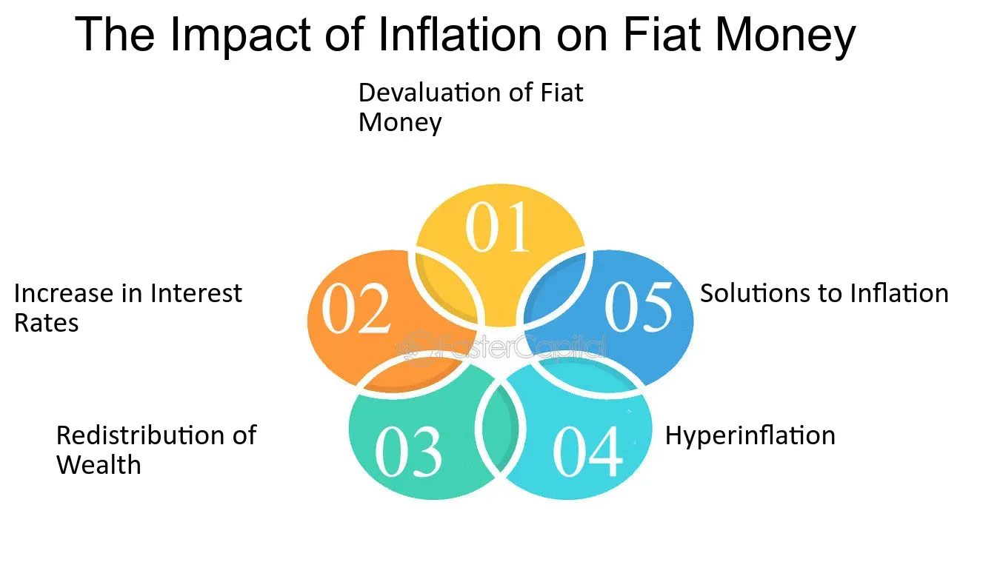

## Table of Contents

## What is fiat money?

Fiat money is a type of currency that a government declares to be legal tender, but it is not backed by a physical commodity like gold or silver. Instead, its value comes from the trust and faith people have in the government that issues it. This means that fiat money has value because people believe it can be used to buy goods and services.

The use of fiat money became widespread in the 20th century, as countries moved away from the gold standard. Before fiat money, currencies were often backed by gold, meaning you could exchange your money for a certain amount of gold. With fiat money, there is no such guarantee. The value of fiat money can change based on factors like inflation, economic policies, and the stability of the government issuing it. Despite these challenges, fiat money is used by most countries today because it allows governments more flexibility in managing their economies.

## What is commodity money?

Commodity money is money that has value because it is made from a valuable material. This material can be something like gold, silver, or even salt. People use commodity money because they know it is worth something on its own, not just because a government says it is. For example, if you have a gold coin, you can use it to buy things, but you can also melt it down and sell the gold if you need to.

In the past, many societies used commodity money. It was easy to understand because the money had real value. If you had a silver coin, you knew it was worth something because silver is valuable. But commodity money can have problems too. It can be heavy to [carry](/wiki/carry-trading) around, and if the value of the material changes, the value of the money changes too. Today, most countries use fiat money instead, but some people still like the idea of commodity money because it feels more secure.

## How does inflation affect the value of money?

Inflation means that prices for things like food, clothes, and houses go up over time. When inflation happens, the value of money goes down. This is because with the same amount of money, you can buy less stuff than before. For example, if a candy bar costs $1 now, and next year it costs $1.10 because of inflation, your dollar can't buy that candy bar anymore.

Inflation can happen for many reasons. Sometimes, it's because there's too much money in the economy, and not enough stuff to buy. Other times, it's because the costs of making things go up. When inflation is high, people might start to worry about their money losing value quickly. This can make them spend their money faster, which can make inflation even worse. Governments and central banks try to keep inflation at a level that's not too high and not too low, to keep the economy stable.

## What are the main differences between fiat and commodity money?

Fiat money and commodity money are different in how they get their value. Fiat money is money that a government says is worth something, even though it's not made from anything valuable like gold or silver. It's just paper or coins, but people use it because they trust the government. On the other hand, commodity money is made from things that are valuable on their own, like gold or salt. People use it because the material it's made from is worth something, not just because a government says so.

Another big difference is how their value can change. The value of fiat money can go up or down based on things like inflation, what the government does, and how people feel about the economy. If people start to not trust the government, the value of fiat money can drop a lot. Commodity money's value can change too, but it's more tied to the value of the material it's made from. If the price of gold goes up, then gold coins become more valuable. But if the price of gold goes down, so does the value of the coins.

## How does the supply of fiat money influence inflation?

When there's more fiat money in the economy, it can lead to inflation. This happens because if there's too much money, people have more money to spend. But if the amount of things to buy doesn't go up, prices can go up instead. It's like if everyone suddenly had twice as much money, but there were the same number of candy bars in the store. The price of each candy bar would probably go up because more people want to buy them.

Governments and central banks try to control how much money is in the economy to keep inflation from getting too high. They can print more money or take money out of circulation. If they print too much money, inflation can get out of control. But if they don't print enough, it can be hard for people to buy things they need. So, they try to find a balance to keep prices stable and the economy running smoothly.

## How does the supply of commodity money influence inflation?

The supply of commodity money can affect inflation, but it works a bit differently than with fiat money. Commodity money, like gold or silver coins, has value because of the material it's made from. If more of this material is found, like if people discover a new gold mine, there can be more commodity money. If there's more gold, and everyone starts using it as money, prices might go up because there's more money chasing the same amount of things to buy.

But, the supply of commodity money doesn't change as easily as fiat money. It takes time to find and mine more gold or silver. This means that the amount of commodity money usually doesn't change as quickly, so inflation might not happen as fast. If the supply of the commodity goes down, like if it becomes harder to mine gold, there could be less money around, which might make prices go down instead of up. So, the supply of commodity money can influence inflation, but it's more stable and slower to change than with fiat money.

## What historical examples illustrate the inflation susceptibility of fiat money?

One big example of how fiat money can lead to inflation is what happened in Germany after World War I. They had a lot of money to pay back from the war, so they started printing more money to pay their debts. But printing too much money made prices go up really fast. People had to carry wheelbarrows full of money just to buy a loaf of bread. This is called hyperinflation, and it shows how dangerous it can be when a government prints too much fiat money.

Another example is Zimbabwe in the early 2000s. The government there was having a hard time, and they started printing a lot of money to try and fix their problems. But this made prices go up so much that people's money became almost worthless. At one point, they had to print a 100 trillion dollar bill, but it still wasn't enough to buy much. This shows how quickly inflation can get out of control with fiat money if it's not managed carefully.

These examples show that fiat money can be very sensitive to inflation. When governments print too much money, it can lead to prices going up a lot, and people's savings can lose value very quickly. It's important for governments to be careful about how much money they print to keep the economy stable.

## What historical examples illustrate the inflation susceptibility of commodity money?

One example of inflation with commodity money happened in Spain during the 16th century. Spain found a lot of gold and silver in the Americas, which they brought back to Europe. With all this new gold and silver, there was more money around. People had more money to spend, but there weren't more things to buy. So, prices started to go up. This is called the "Price Revolution," and it shows how finding more of a commodity like gold can lead to inflation.

Another example is from the California Gold Rush in the 1800s. When people found a lot of gold in California, it made more gold money available. More people had gold to spend, but the amount of stuff to buy didn't increase as fast. This led to higher prices for things like food and tools. The increase in the supply of gold caused inflation, showing how commodity money can also lead to higher prices when its supply grows quickly.

## How do governments and central banks manage inflation in fiat money systems?

Governments and central banks manage inflation in fiat money systems by controlling how much money is in the economy. They do this by setting interest rates, which is the cost of borrowing money. If they want to slow down inflation, they can raise interest rates. This makes it more expensive to borrow money, so people and businesses might spend less. When people spend less, prices don't go up as fast. If inflation is too low, they can lower interest rates to make borrowing cheaper, so people spend more and help the economy grow.

Another way they manage inflation is by controlling the amount of money that banks have to keep in reserve. If banks have to keep more money in reserve, they can lend out less money. This can help slow down inflation because there's less money for people to spend. If they want to increase spending, they can let banks keep less money in reserve, so banks can lend out more money. Governments and central banks also watch the economy closely and might use other tools, like buying or selling government bonds, to keep inflation at a level that's good for the economy.

## What are the mechanisms that control the supply of commodity money and their impact on inflation?

The supply of commodity money, like gold or silver coins, is controlled mainly by how much of the commodity is available. If people find more gold or silver, there can be more money made from it. This can happen if new mines are discovered or if mining technology gets better. But it's not easy to change the supply quickly because it takes time to find and mine these materials. Governments can't just print more commodity money like they can with fiat money. They have to wait for more of the commodity to be found and turned into money.

When the supply of commodity money changes, it can affect inflation. If there's more gold or silver, people have more money to spend. But if there's not more stuff to buy, prices can go up. This is what happened during the Price Revolution in Spain and the California Gold Rush. On the other hand, if it becomes harder to find gold or silver, there might be less money around. This can make prices go down because people have less money to spend. So, the supply of commodity money can lead to inflation or deflation, but it changes more slowly than fiat money.

## How do economic theories explain the different inflation susceptibilities of fiat and commodity money?

Economic theories explain that fiat money is more susceptible to inflation because it's easier for governments to change how much money is in the economy. When a government prints more fiat money, it can lead to more money chasing the same amount of goods, which makes prices go up. This is called demand-pull inflation. Also, if people start to think that prices will keep going up, they might spend their money faster, which can make inflation even worse. This is why governments and central banks try to control how much money is in the economy to keep inflation stable.

Commodity money, like gold or silver coins, is less likely to cause sudden inflation because its supply doesn't change as quickly. The amount of commodity money depends on how much of the material is found and mined, which takes time. If more gold is found, there can be more money, and prices might go up, but this happens more slowly than with fiat money. Economic theories say that commodity money can still lead to inflation, but it's more stable and less likely to cause big, fast changes in prices like fiat money can.

## What are the long-term implications of inflation susceptibility for economies using fiat versus commodity money?

In the long run, economies using fiat money can face bigger problems with inflation because governments can print more money easily. If they print too much money, prices can go up a lot, and people's savings can lose value quickly. This can make people lose trust in the money and the government. To avoid this, governments and central banks need to be careful about how much money they put into the economy. They use tools like interest rates to keep inflation at a level that helps the economy grow without getting out of control. If they do this well, fiat money can help the economy be more flexible and grow faster.

Economies using commodity money, like gold or silver, might not face such big swings in inflation because the supply of the commodity doesn't change as fast. But this can also make the economy less flexible. If it's hard to find more gold or silver, there might not be enough money for the economy to grow. On the other hand, if a lot of new gold is found, prices can still go up, but it happens more slowly. So, while commodity money can be more stable, it might not be as good at helping the economy grow quickly. In the end, both types of money have their own challenges and benefits when it comes to managing inflation over the long term.

## What is the understanding of inflation and its economic effects?

Inflation refers to the rate at which the general level of prices for goods and services rises, subsequently eroding purchasing power over time. This economic phenomenon is a critical component of economic cycles and has been documented as far back as ancient Rome and China, where inflationary pressures were often tied to the debasement of currency or sudden surges in demand.

Historically, inflation has played a dual role in economic cycles—both as a symptom of economic overheating and as a catalyst for subsequent downturns. During periods of rapid economic growth, inflation tends to accelerate, driven by increased consumer spending and investment. Conversely, stagnation or recession typically involves disinflation or even deflation, although the interplay of these variables can be influenced by numerous factors.

Inflation can be caused by several factors, primarily categorized into demand-pull and cost-push factors. **Demand-pull inflation** occurs when the demand for goods and services exceeds supply, often due to economic expansion, resulting in upward pressure on prices. Mathematically, this can be expressed by the equation:

$$
\text{Inflation rate} = \frac{\text{Aggregate Demand} - \text{Aggregate Supply}}{\text{Aggregate Supply}} \times 100
$$

On the other hand, **cost-push inflation** arises when the costs of production inputs increase, leading to higher prices for final goods and services. This can result from factors such as rising wages, costlier raw materials, or supply chain disruptions.

The effects of inflation on purchasing power are straightforward yet profound. As inflation rises, each unit of currency buys fewer goods and services, diminishing the real value of money over time. For example, if wages do not increase proportionately with inflation, consumers experience a reduction in their standard of living. From an economic stability perspective, high and unpredictable inflation can deter investment, stifle long-term economic planning, and ultimately result in volatile economic conditions.

Central banks and governments typically deploy monetary and fiscal policy tools to manage inflationary pressures. Monetary interventions often involve adjusting interest rates to influence the money supply. If inflation is high, central banks may raise interest rates to curb spending and borrowing, leading to reduced demand in the economy. Conversely, fiscal policies might include altering tax rates or government spending to directly influence aggregate demand.

These interventions aim to maintain a delicate balance: curbing excessive inflation without stifling economic growth. Central banks, such as the U.S. Federal Reserve, often target specific inflation rates, commonly around 2%, as an ideal for economic health. However, these measures require precision, as overcorrection can lead to unintended recessionary consequences.

## References & Further Reading

[1]: Blanchard, O. J. (2021). ["Inflation and Inflation Expectations."](https://www.nber.org/papers/w31417) National Bureau of Economic Research.

[2]: Chaboud, A. P., Chiquoine, B., Hjalmarsson, E., & Vega, C. (2009). ["Rise of the Machines: Algorithmic Trading in the Foreign Exchange Market."](https://www.federalreserve.gov/pubs/ifdp/2009/980/ifdp980.pdf) International Finance Discussion Paper, Board of Governors of the Federal Reserve System.

[3]: Friedman, M. (1970). ["A Theoretical Framework for Monetary Analysis,"](https://msuweb.montclair.edu/~lebelp/FriedmanMonetaryAnalysisJPE1970March.pdf) National Bureau of Economic Research.

[4]: Hull, J. (2017). ["Options, Futures, and Other Derivatives"](https://www.semanticscholar.org/paper/Options%2C-Futures%2C-and-Other-Derivatives-Hull/89bdee500c8623864fc9eb7a471546aa713acc44). Pearson.

[5]: Lewis, M. (2015). ["Flash Boys: A Wall Street Revolt."](https://en.wikipedia.org/wiki/Flash_Boys) W. W. Norton & Company.

[6]: Schwartz, A. J., & Bordo, M. D. (1981). ["Monetary Theory and Policy."](https://www.nber.org/papers/w6201) Journal of Monetary Economics.

[7]: Shiller, R. J. (1997). ["Why Do People Dislike Inflation?"](https://www.nber.org/papers/w5539) Brookings Papers on Economic Activity.