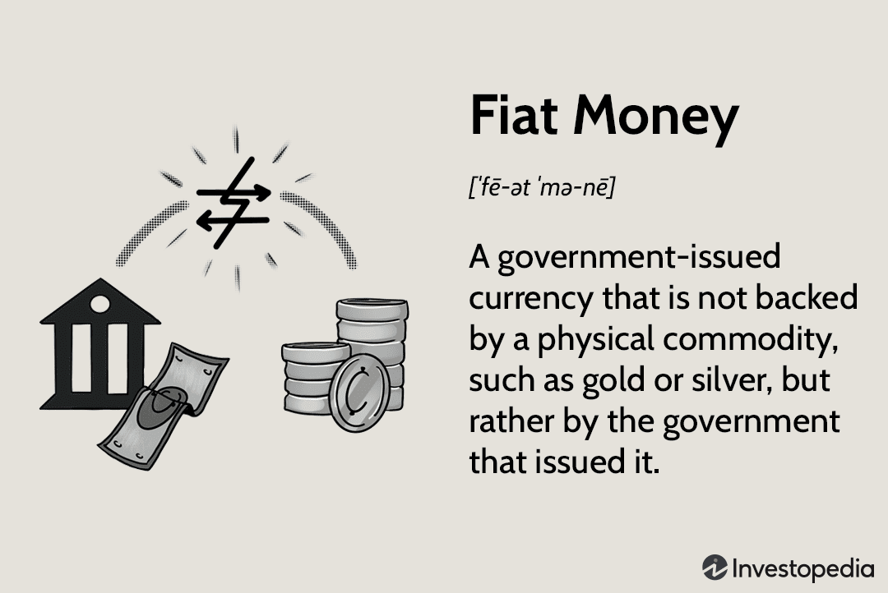

Inflation is a key economic concept that refers to the sustained increase in the general price level of goods and services in an economy over a period of time. As prices rise, the purchasing power of currency decreases, meaning that a unit of currency buys fewer goods and services than before. Inflation is usually expressed as an annual percentage rate, and central banks monitor it closely because it affects everything from interest rates to wage negotiations and retirement savings. Its impacts on the economy are profound, affecting various aspects of everyday life and economic stability.

There are several types of inflation, but two primary causes are demand-pull inflation and cost-push inflation. Demand-pull inflation occurs when the demand for goods and services exceeds supply, leading to a price increase. On the other hand, cost-push inflation happens when the prices of production inputs rise, leading producers to pass on the higher costs to consumers in the form of higher prices. Regardless of its cause, unchecked inflation can erode consumer purchasing power, distort spending and saving incentives, and destabilize economic conditions.

An important dimension of understanding inflation involves examining different types of money, particularly commodity money and fiat money. Commodity money is money that has intrinsic value; that is, its value comes from the material it is made of, such as gold or silver. Historically, economies heavily relied on commodity money, as its inherent value provided a stable and reliable medium of exchange. However, most modern economies have transitioned to fiat money—currency that a government declares to be legal tender, yet it has no intrinsic value. Fiat money is valuable because of government decree and public trust in the issuing authority.

Fiat money offers several advantages, such as greater flexibility for governments and central banks to manage monetary policy and influence economic growth. However, its lack of intrinsic value also presents risks, especially in times of inflation where the perception and trust in the currency's value might be challenged.

In recent decades, algorithmic trading (algo trading) has emerged as a significant force in financial markets. Algo trading involves the use of complex algorithms to execute trades at high speeds and volumes, often without human intervention. This method of trading can enhance market efficiency and liquidity but also poses certain risks, especially in volatile times influenced by inflationary pressures.

Understanding how these concepts interconnect is crucial in today's financial landscape. As economies face challenges from inflation, the role of different types of money, whether fiat or commodity, remains pertinent. Simultaneously, the rise of algorithmic trading continues to shape markets, offering both solutions and challenges in managing inflationary effects. Exploring these intersections reveals much about modern economic systems and their resilience in the face of persistent inflationary trends.

## Table of Contents

## Understanding Inflation and Its Economic Effects

Inflation refers to the rate at which the general level of prices for goods and services rises, subsequently eroding purchasing power over time. This economic phenomenon is a critical component of economic cycles and has been documented as far back as ancient Rome and China, where inflationary pressures were often tied to the debasement of currency or sudden surges in demand.

Historically, inflation has played a dual role in economic cycles—both as a symptom of economic overheating and as a catalyst for subsequent downturns. During periods of rapid economic growth, inflation tends to accelerate, driven by increased consumer spending and investment. Conversely, stagnation or recession typically involves disinflation or even deflation, although the interplay of these variables can be influenced by numerous factors.

Inflation can be caused by several factors, primarily categorized into demand-pull and cost-push factors. **Demand-pull inflation** occurs when the demand for goods and services exceeds supply, often due to economic expansion, resulting in upward pressure on prices. Mathematically, this can be expressed by the equation:

$$
\text{Inflation rate} = \frac{\text{Aggregate Demand} - \text{Aggregate Supply}}{\text{Aggregate Supply}} \times 100
$$

On the other hand, **cost-push inflation** arises when the costs of production inputs increase, leading to higher prices for final goods and services. This can result from factors such as rising wages, costlier raw materials, or supply chain disruptions.

The effects of inflation on purchasing power are straightforward yet profound. As inflation rises, each unit of currency buys fewer goods and services, diminishing the real value of money over time. For example, if wages do not increase proportionately with inflation, consumers experience a reduction in their standard of living. From an economic stability perspective, high and unpredictable inflation can deter investment, stifle long-term economic planning, and ultimately result in volatile economic conditions.

Central banks and governments typically deploy monetary and fiscal policy tools to manage inflationary pressures. Monetary interventions often involve adjusting interest rates to influence the money supply. If inflation is high, central banks may raise interest rates to curb spending and borrowing, leading to reduced demand in the economy. Conversely, fiscal policies might include altering tax rates or government spending to directly influence aggregate demand.

These interventions aim to maintain a delicate balance: curbing excessive inflation without stifling economic growth. Central banks, such as the U.S. Federal Reserve, often target specific inflation rates, commonly around 2%, as an ideal for economic health. However, these measures require precision, as overcorrection can lead to unintended recessionary consequences.

## The Role of Commodity Money in Historical Economies

Commodity money is a type of currency that derives its value from the material it is made of, in contrast to fiat money, which is backed by the government or regulatory authority and has value primarily because people in society have agreed to use it as such. Commodity money has intrinsic value, meaning that the material itself holds worth independently of its function as money. The most renowned examples of commodity money include precious metals such as gold and silver, which possess attributes that rendered them ideal for use in trade and commerce. These characteristics include durability, divisibility, portability, and uniformity. 

### Historical Examples of Commodity Money

**Gold and Silver**:
Gold and silver have been the predominant forms of commodity money throughout history. Gold coins have been used since ancient times, with the Roman Empire minting coins that circulated extensively. Similarly, silver has been widely used, with historical records showing its use in ancient Mesopotamia. These metals were favored for their luster, resistance to tarnish, and ability to be worked into coinage.

**Other Examples**:
In addition to metals, various cultures have used different commodities as money, including cattle, grains, and shells. For instance, cowrie shells were used as a form of money in several regions of Africa and Asia.

### Advantages of Commodity Money

1. **Intrinsic Value**: Unlike paper money, commodity money has inherent value due to the demand for the physical material it is made from. Gold and silver, for instance, are valued for their industrial applications and use in jewelry.

2. **Resistance to Inflation**: Because of their intrinsic value, commodity money is less susceptible to inflation than fiat money. If a government prints excessive amounts of fiat currency, it can lead to devaluation and inflation. However, the supply of commodity money is usually more stable and self-regulating.

3. **Universal Acceptance**: Historically, commodities such as gold and silver have been universally acknowledged and accepted. This wide acceptance facilitated trade across different regions and cultures.

### Disadvantages of Commodity Money

1. **Lack of Flexibility**: The supply of commodity money is limited by the availability of the resources, such as gold or silver. This can constrain economic growth, as the money supply cannot be easily expanded to meet increased demand for trade and commerce.

2. **Storage and Security**: Storing precious metals requires security measures to prevent theft. Additionally, the physical bulk of commodities can be cumbersome to transport.

3. **Discovery and Value Fluctuations**: The discovery of new deposits of gold or silver can flood the market, causing fluctuations in value. This was observed during the gold rushes, which often led to temporary devaluation of the metal.

### Transition Away from Commodity-Backed Systems

Most modern economies have moved away from commodity-backed systems due to the limitations associated with them. The gold standard, where a country's currency or paper money has a value directly linked to gold, was effectively abandoned in the 20th century. The main reasons for this transition include:

- **Economic Flexibility**: Fiat money, which is not tied to a physical commodity, allows for more flexible monetary policy. Governments and central banks can respond to economic challenges more effectively by adjusting interest rates, controlling inflation, and managing employment levels.

- **Growth and Stability**: A fiat system can expand the money supply as needed to support economic growth without being constrained by the physical limitations of commodities.

The abandonment of commodity money has led to a more dynamic global economic system, capable of supporting unprecedented levels of trade and commerce, albeit with new complexities and risks, such as inflationary pressures absent in commodity-based systems.

## Fiat Money: The Modern Economic Standard

Fiat money is a type of currency that lacks intrinsic value and is not backed by a physical commodity such as gold or silver. Its value is derived from the trust and confidence that people have in the issuing authority, typically a government or central bank. Unlike commodity money, which is valued based on the material it is made from, fiat money relies on the stability and creditworthiness of the issuer.

One of the primary benefits of fiat money is the increased control it grants to central banks and governments over monetary policy. Central banks, such as the Federal Reserve in the United States, can implement measures such as adjusting interest rates and conducting open market operations to influence money supply and demand. This ability allows them to respond effectively to economic conditions, aiming to promote growth and stabilize prices.

Fiat money plays a crucial role in facilitating economic growth and stability by enabling governments and central banks to implement countercyclical monetary policies. During periods of economic downturns, central banks can inject [liquidity](/wiki/liquidity-risk-premium) into the economy, lowering interest rates to stimulate borrowing and investment. Conversely, in times of rapid economic growth and potential inflation, they can tighten monetary policy to avert overheating. This flexibility is vital for maintaining economic stability and achieving sustainable growth.

Despite its advantages, fiat currencies are not without risks and challenges, especially concerning inflation. Since fiat money's value is not tied to a tangible commodity, excessive issuance can lead to a decrease in purchasing power, a phenomenon known as inflation. Historical examples, such as hyperinflation in Zimbabwe or the Weimar Republic, illustrate how mismanagement of fiat currency systems can lead to economic turmoil. Moreover, fiat money requires strong institutional frameworks and responsible fiscal policies to maintain trust and stability, making governance and oversight critical.

In summary, fiat money serves as the cornerstone of modern economies, providing tools for economic regulation and expansion. Its utility in managing economic variables is balanced by the necessity for careful oversight to prevent instability, highlighting the intricate dynamics central banks and governments navigate in the monetary landscape.

## Algorithmic Trading: A New Frontier in Financial Markets

Algorithmic trading refers to the use of computer algorithms to automate the process of trading financial securities. These algorithms follow predefined rules for initiating and executing trades, which are based on mathematical models and are usually implemented via sophisticated software. One of the key technological elements underpinning [algorithmic trading](/wiki/algorithmic-trading) is high-frequency trading ([HFT](/wiki/high-frequency-trading-strategies)), which involves executing a large number of orders at extremely high speeds, often measured in milliseconds or microseconds. This capability is facilitated by advances in technology infrastructure, including the use of co-location services that allow traders to place their servers in close proximity to exchange servers, thereby minimizing latency.

Algorithmic trading significantly impacts market efficiency and liquidity. By automating trades, algo trading can increase market liquidity as it often involves executing numerous small trades swiftly, making it easier for other traders to find counterparties. Moreover, it enhances market efficiency as algorithms can quickly identify and exploit price discrepancies and [arbitrage](/wiki/arbitrage) opportunities, thus aligning prices more closely with their true value. A study by Chaboud et al. (2009) suggests that the presence of algorithmic trading reduces spreads and decreases the [volatility](/wiki/volatility-trading-strategies) of asset prices, contributing to more stable markets.

Inflation trends may influence algorithmic trading strategies in various ways. During high inflation, traders might deploy algorithms that hedge against inflation risks, such as those programmed to buy inflation-linked securities or other commodities that traditionally rise in value under inflationary pressure. Conversely, during low inflation periods, algorithms might focus on [growth stocks](/wiki/growth-stocks) or interest-sensitive securities, capitalizing on low interest rates and stable economic growth prospects. The adaptability of algorithmic strategies to macroeconomic indicators like inflation allows traders to dynamically adjust their portfolios with precision and speed that manual trading cannot match.

Despite its advantages, algorithmic trading does pose ethical and regulatory challenges. One of the main ethical concerns is the risk of market manipulation, where algorithms might be deployed to engage in practices like spoofing — submitting fake orders to manipulate market prices — which can undermine market integrity. Regulators worldwide, including the U.S. Securities and Exchange Commission (SEC) and the European Securities and Markets Authority (ESMA), have implemented rules to curb such practices, but the fast-evolving nature of technology presents ongoing challenges. Furthermore, the ethical use of data, particularly non-public information, in algorithm decision-making processes is a subject of ongoing debate, necessitating stringent regulations to ensure fair markets.

Algorithmic trading represents a transformative force in financial markets, ushering in a new era of trading characterized by speed, efficiency, and complexity. However, balancing these benefits with robust ethical and regulatory frameworks remains key to safeguarding the integrity of global financial systems.

## Interconnections Between Inflation, Money Types, and Algo Trading

Inflationary trends have a profound impact on the valuation and perception of both fiat and commodity money. As inflation rises, the purchasing power of fiat money typically decreases, leading to a diminished confidence in currency stability. In contrast, commodity money, being intrinsically valuable, generally retains its value better during inflationary periods. Historically, investors have turned to commodities, such as gold, as a hedge against inflation, as these assets are perceived to hold their value over time.

Algorithmic trading plays an integral role in modern financial markets by using computer algorithms to execute trades at high speed and with precision. One significant function of algorithmic trading is its ability to hedge against inflationary risks. By analyzing large datasets in real-time, algorithms can identify trends and make trades that mitigate the impact of inflation on a portfolio. This can include shifting investments from fiat currencies, which may devalue during inflation, to commodities or other assets that are expected to appreciate.

Furthermore, algorithmic trading has the potential to influence inflation through rapid market adjustments. These systems can react instantaneously to news and data, creating a feedback loop between markets and inflation trends. For instance, if algorithms detect rising inflation, they may start reallocating resources into inflation-resistant assets, which can increase demand for these assets, further influencing their prices and potentially accelerating inflation in certain sectors.

Case studies reveal instances where the intersection of these elements has significantly impacted financial markets. During periods of hyperinflation, such as in Zimbabwe in the late 2000s, the rapid devaluation of fiat currency led to a surge in the demand for commodities as a store of value. Algorithmic trading systems might have, hypothetically, exacerbated such trends by quickly reallocating investments away from currency-denominated assets. Conversely, during the COVID-19 pandemic, algorithmic trading strategies quickly adapted to unprecedented fiscal policies and inflationary fears, showcasing their ability to navigate complex economic landscapes.

In conclusion, the interplay between inflation, types of money, and algorithmic trading creates a dynamic financial environment. By understanding these interactions, investors, policymakers, and technologists can better navigate and potentially stabilize economic uncertainties.

## Conclusion

The intricate web connecting inflation, different monetary systems, and algorithmic trading constitutes a crucial area of study within modern economics. Inflation, an ever-present force, affects both commodity and fiat money, while influencing trading strategies and policies within financial markets. Commodity money has evolved from a historical necessity into a modern backdrop against which fiat currencies thrive. However, the volatility and value stability of commodity-backed currencies present inherent limitations, which fiat money largely circumvents by affording centralized control and greater flexibility in monetary policy. This control, while beneficial, requires vigilant management to mitigate the risks of inflation, which can erode purchasing power and economic stability if left unchecked.

Algorithmic trading introduces a technological dimension that revolutionizes how markets respond to financial stimuli, including inflation. Such trading systems enhance market efficiency, yet they simultaneously pose ethical and regulatory challenges due to their capabilities for rapid, high-[volume](/wiki/volume-trading-strategy) transactions. The interaction between algorithmic trading and inflationary trends signifies an emerging field that demands further examination. How these advanced trading systems adapt to inflationary pressures—or even how they might exacerbate them—poses intriguing questions that beckon additional research.

Looking forward, it is essential for policymakers, economists, and traders to continue investigating these relationships and their implications for global financial stability. Future research should focus on developing robust policies that harmonize the beneficial aspects of fiat currencies and algorithmic trading with prudent regulatory oversight, ensuring these elements work together to stabilize and grow economies. Policymakers are encouraged to consider frameworks that harness the strengths of modern technologies while addressing their inherent risks, thereby fostering resilient economic systems. The ongoing analysis and exploration of these interconnected domains hold the potential to enhance our understanding and management of complex economic processes.

## References & Further Reading

[1]: Blanchard, O. J. (2021). ["Inflation and Inflation Expectations."](https://www.nber.org/papers/w31417) National Bureau of Economic Research.

[2]: Chaboud, A. P., Chiquoine, B., Hjalmarsson, E., & Vega, C. (2009). ["Rise of the Machines: Algorithmic Trading in the Foreign Exchange Market."](https://www.federalreserve.gov/pubs/ifdp/2009/980/ifdp980.pdf) International Finance Discussion Paper, Board of Governors of the Federal Reserve System.

[3]: Friedman, M. (1970). ["A Theoretical Framework for Monetary Analysis,"](https://msuweb.montclair.edu/~lebelp/FriedmanMonetaryAnalysisJPE1970March.pdf) National Bureau of Economic Research.

[4]: Hull, J. (2017). ["Options, Futures, and Other Derivatives"](https://www.semanticscholar.org/paper/Options%2C-Futures%2C-and-Other-Derivatives-Hull/89bdee500c8623864fc9eb7a471546aa713acc44). Pearson.

[5]: Lewis, M. (2015). ["Flash Boys: A Wall Street Revolt."](https://en.wikipedia.org/wiki/Flash_Boys) W. W. Norton & Company.

[6]: Schwartz, A. J., & Bordo, M. D. (1981). ["Monetary Theory and Policy."](https://www.nber.org/papers/w6201) Journal of Monetary Economics.

[7]: Shiller, R. J. (1997). ["Why Do People Dislike Inflation?"](https://www.nber.org/papers/w5539) Brookings Papers on Economic Activity.