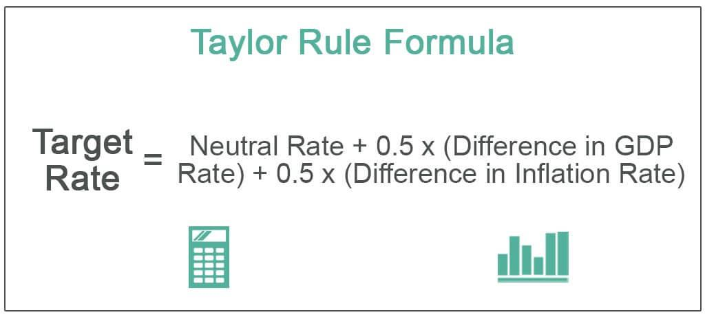

The exploration of the intertwined dynamics between inflation, monetary policy, economic strategy, and algorithmic trading unveils a complex web of interactions crucial for understanding modern financial ecosystems. Each of these components plays a significant role, influencing both microeconomic and macroeconomic conditions. Inflation, defined as the rate at which the general level of prices for goods and services rises, eroding purchasing power, serves as a critical economic indicator. The management of inflation is a primary concern for monetary authorities such as central banks, which employ monetary policy tools like interest rate adjustments and modifications in money supply to maintain price stability and foster economic growth.

Monetary policy, orchestrated by central banking systems, becomes a pivotal mechanism for guiding economic strategy. Strategies are thus crafted not only to spur economic growth but also to stabilize inflation rates, requiring a fine balance that influences investment and saving behaviors at both the individual and institutional levels. In this context, economic strategy becomes a deliberate effort to align fiscal measures with monetary policies to maintain equilibrium between growth aspirations and inflation control.



Algorithmic trading introduces a layer of technological sophistication, capturing and leveraging inflationary and economic data for strategic trade execution. By programming algorithms to interpret Consumer Price Index (CPI) data and other relevant metrics, traders can make informed decisions that are both timely and data-driven. This approach underscores the importance of integrating various economic indicators into trading strategies to optimize outcomes and mitigate risks.

The convergence of these elements—economic indicators, policy tools, strategic planning, and trading technologies—forms the bedrock of modern economic practices. The ability to synthesize and apply this integrated understanding leads to more robust and adaptable trading strategies, essential for navigating the complexities of today's financial markets. This lays the foundation for subsequent discussions on specific sectors of influence such as inflation control frameworks, economic strategies, and technical trading methodologies.

## Table of Contents

## Understanding Inflation and Monetary Policy

Inflation is a key economic indicator that directly influences the purchasing power of consumers and the pricing of goods and services within an economy. By definition, inflation signifies the rate at which the general level of prices for goods and services rises, subsequently eroding the purchasing power of currency. As a persistent concern in economic management, central banks often deploy monetary policy as a pivotal tool to mitigate the adverse effects of inflation. 

Monetary policy involves the regulation of money supply and adjustment of interest rates to achieve macroeconomic objectives such as controlling inflation, ensuring price stability, and encouraging employment. For instance, when inflation is high, central banks may increase interest rates, thereby discouraging borrowing and spending, which in turn can curb inflationary pressures. Conversely, lowering interest rates is typically employed to stimulate economic activity during periods of low inflation or deflation.

A prevalent strategy adopted by central banks is inflation targeting. This approach involves setting a specific inflation rate as the primary goal of monetary policy, thereby anchoring public expectations and enhancing economic stability. By focusing explicitly on achieving this target, central banks aim to foster a predictable economic environment conducive to growth. Renowned institutions like the Federal Reserve and the European Central Bank have implemented such frameworks—demonstrating varying degrees of flexibility and transparency to accommodate economic fluctuations.

Inflation's role in shaping economic strategy extends to influencing both investment and saving behaviors. As inflation reduces the real return on savings, individuals may be incentivized to invest in assets that potentially offer higher inflation-adjusted returns. Furthermore, inflationary expectations can lead to preemptive consumer spending and investment, aimed at circumventing anticipated future price increases.

Different approaches to inflation control can be observed across global economic policies. Some countries focus on targeting exchange rates to achieve price stability, pegging their currency to a stable reference like the U.S. dollar, while others consider nominal GDP targeting, thereby aligning monetary policy with output growth levels along with price stability.

In summary, understanding inflation and its implications for monetary policy is paramount in formulating effective economic strategies. By judiciously employing monetary tools such as interest rates and money supply control, central banks strive to maintain an equilibrium that supports sustainable economic growth while mitigating inflationary risks.

## Economic Strategy: Balancing Growth and Stability

Economic strategies must adeptly balance the pursuit of growth with the stability of inflation, navigating an intricate landscape marked by dynamic market conditions and policy shifts. The foundational challenge lies in fostering an environment where economic expansion can occur without triggering excessive inflationary pressures, which could erode purchasing power and destabilize markets.

**Approaches to Managing Economic Strategy Amid Inflationary Pressures**

Various strategies are employed by policymakers to manage economic growth while maintaining inflation stability. These approaches often involve the deployment of both monetary and fiscal measures:

1. **Monetary Policy:** Central banks commonly adjust interest rates to influence economic activity. Lowering interest rates tends to stimulate borrowing and investment, potentially boosting economic growth but also risking higher inflation. Conversely, raising interest rates can dampen economic activity, helping control inflation but at the expense of growth. A quantitative tool often used in assessing monetary policy impact is the Taylor Rule, which attempts to forecast target interest rates based on deviations of actual inflation from target levels and actual GDP from potential GDP.

2. **Fiscal Policy:** Governments can complement monetary measures through fiscal policies, such as adjusting tax rates and altering public spending. Expansionary fiscal policy, like increased government spending or tax cuts, can spur growth during economic downturns. However, it must be carefully calibrated to avoid overheating the economy and causing inflation to rise above desired levels. Conversely, contractionary fiscal policies may be implemented to curb inflation by reducing aggregate demand.

**Case Studies of Effective Economic Strategies**

Historical evidence provides a wealth of case studies where countries have successfully navigated the tightrope between growth and stability. For example, during the late 1990s and early 2000s, many economies faced inflationary challenges amid periods of strong global growth. Countries that managed to maintain robust economic expansions while holding inflation in check effectively utilized a mix of monetary and fiscal tools, tailored to their unique economic circumstances.

**Macro and Microeconomic Consequences of Inflation on Economic Planning**

Inflation impacts economic planning on both macro and microeconomic levels. At the macro level, persistent inflation can lead to uncertainty, affecting investment decisions, consumption patterns, and overall economic stability. Governments and central banks must remain vigilant, adapting policies to both anticipate and react to inflationary trends.

On a microeconomic scale, businesses face cost pressures from rising input prices, which can squeeze profit margins if not managed effectively. Firms might respond by passing costs onto consumers or through strategic operational adjustments, such as improving efficiency or seeking cost-effective supply chain solutions.

Strategically, inflation demands a comprehensive approach. Economic actors—governments, businesses, and individuals alike—must continuously adapt, leveraging available data and predictive tools to inform decision-making processes. Doing so not only helps to mitigate the adverse impacts of inflation but also contributes to a more stable and prosperous economic environment.

## Incorporating Inflation Data into Algorithmic Trading

Algorithmic trading leverages advanced computational algorithms to execute trades efficiently and swiftly, with inflation data playing a pivotal role in informing these strategies. One fundamental aspect of incorporating inflation data into such algorithms involves the integration of Consumer Price Index (CPI) data. The CPI, as a key indicator of inflation, provides insights into pricing trends across various sectors, facilitating informed trading decisions.

To integrate CPI data into trading algorithms, a multi-step approach can be adopted. Initially, real-time CPI data must be sourced from reliable financial databases or APIs. This data is then processed to identify potential market trends and patterns. Algorithms can be designed to interpret deviations from expected CPI values, triggering specific trading actions. For example, a Python snippet for fetching and pre-processing CPI data could resemble:

```python
import pandas as pd
import datetime
import requests

# Function to fetch CPI data from an API
def fetch_cpi_data(api_url):
    response = requests.get(api_url)
    data = response.json()
    return pd.DataFrame(data)

# Example URL for CPI data API
cpi_data = fetch_cpi_data('https://api.example.com/cpi')
cpi_data['date'] = pd.to_datetime(cpi_data['date'])
cpi_data.set_index('date', inplace=True)
```

Once the data is integrated, the efficacy of [algorithmic trading](/wiki/algorithmic-trading) in processing real-time inflation data lies in its ability to optimize trading outcomes. Algorithms can analyze CPI data to discern whether inflation is accelerating or decelerating, influencing decisions such as buying, selling, or holding assets. This capability allows traders to respond proactively to market shifts.

Algorithmic strategies like pairs trading and trend-following can be particularly influenced by inflation data. Pairs trading involves simultaneously buying and selling two correlated securities to exploit market inefficiencies. Inflation data can signal shifts in relative pricing, offering [arbitrage](/wiki/arbitrage) opportunities. Conversely, trend-following strategies focus on capitalizing on sustained market movements. By analyzing CPI trends, algorithms predict whether inflation-driven economic conditions will prolong a current trend.

An essential aspect of integrating CPI data into trading algorithms is [backtesting](/wiki/backtesting). Backtesting involves simulating a trading strategy on historical CPI data to evaluate its potential performance before deployment. This process helps refine algorithms, ensuring robustness against past inflationary cycles and [volatility](/wiki/volatility-trading-strategies). Employing libraries like `numpy` and `pandas`, one can backtest strategies efficiently:

```python
import numpy as np

# Simple backtest example for a trading strategy
def backtest_strategy(data, strategy_func):
    """Applies a trading strategy to historical data."""
    results = []
    for index, row in data.iterrows():
        decision = strategy_func(row)
        results.append(decision)
    return np.mean(results)  # Example metric: average return

# Placeholder for a strategy function
def example_strategy(row):
    return 1 if row['cpi_change'] > 0 else -1

# Backtesting the example strategy
performance = backtest_strategy(cpi_data, example_strategy)
```

By continually backtesting and refining these algorithms with historical CPI data, traders can enhance strategy accuracy and risk management. This iterative process of optimization allows traders to adapt to changing market conditions, driven by inflation dynamics, thereby maintaining a competitive edge.

## Backtesting and Risk Management in CPI-Based Trading

Backtesting is a critical process in evaluating the historical performance of Consumer Price Index (CPI)-based trading strategies. By simulating trades on past data, traders can assess the potential effectiveness and adjust strategies before applying them in live markets. This process involves several key methodologies. 

One widely used technique is the rolling window method, which involves repeatedly sampling data subsets over time to test the strategy's robustness. For instance, traders may use a one-year rolling window to evaluate how the strategy would have performed if implemented at different points in time. 

```python
import pandas as pd

def rolling_window_backtest(prices, strategy_function, window_size=252):
    results = []
    for start in range(len(prices) - window_size):
        end = start + window_size
        window_data = prices[start:end]
        result = strategy_function(window_data)
        results.append(result)
    return results
```

Risk management is vital in CPI news trading, particularly given the high-impact nature of this economic indicator. Diversification and stop-loss orders are crucial techniques. Diversification reduces risk by spreading investments across various assets, ensuring that poor performance in one area can potentially be offset by better performance in another. Stop-loss orders help limit potential losses by automatically closing positions when they reach a specified threshold.

The real-world risks associated with using high-impact CPI data in trading strategies include market volatility and data inaccuracies. Sudden CPI announcements can cause significant price swings, leading to slippage—the difference between expected and actual execution prices—which can adversely affect returns. Additionally, discrepancies in data quality can result from revisions or errors in reported CPI figures.

Successful risk mitigation tactics in volatile market conditions include scenario analysis and stress testing. Scenario analysis evaluates how a strategy would perform under different economic conditions, while stress testing assesses the potential impact of extreme market events. These methods help traders understand potential downsides and prepare contingency plans.

In summary, backtesting and risk management are indispensable components of CPI-based trading. Through systematic testing and robust risk management practices, traders can enhance their ability to make informed decisions and improve the resilience of their trading strategies in dynamic financial markets.

## Case Studies and Real-World Examples

Case studies provide insightful examples of how Consumer Price Index (CPI)-based algorithmic trading strategies have been successfully applied in real-world markets. Among the various strategies, trend-following and mean reversion have demonstrated adaptability to CPI fluctuations, offering traders potential avenues for optimizing their trading outcomes.

In trend-following strategies, trading decisions are based on identifying and capitalizing on market trends influenced by changes in CPI data. For instance, investors may observe that higher-than-expected CPI figures could indicate rising inflation, potentially signaling an upward trend in interest rates. This anticipation can prompt traders to take long positions in assets expected to perform well in an inflationary environment, such as commodities or inflation-protected securities. Conversely, lower-than-expected CPI figures might suggest a declining inflation trend, leading traders to adjust their positions accordingly.

Mean reversion strategies focus on the tendency of asset prices to revert to their historical averages. When CPI data reveals significant deviations from expected economic conditions, mean reversion algorithms can be programmed to exploit these conditions. For example, if CPI data significantly diverges from forecasted values, indicating an overreaction in asset prices, a mean reversion approach might involve taking positions anticipating a return to equilibrium.

The experiences from both successful and unsuccessful implementations reveal important lessons. Successful applications often emphasize the importance of integrating robust data analysis tools to accurately interpret CPI data and gauge market sentiment. Conversely, failures in strategy deployment frequently highlight the risks of over-reliance on singular data points or misinterpretations of economic signals.

One crucial aspect of these real-world examples is the need for continuous strategy refinement. As economic data evolves, so too must the algorithms driving trading decisions. Backtesting plays a critical role here; it allows traders to evaluate how their strategies would have performed under different historical CPI scenarios, facilitating enhancements that improve future performance.

Practical applications underscore the necessity for adaptive and flexible trading approaches. Given the dynamic nature of economic indicators like CPI, traders must remain vigilant and ready to modify their algorithms in response to new data or unexpected market movements. This adaptability ensures that trading strategies remain relevant and effective, even as the economic landscape shifts.

Ultimately, the strategic application of CPI-based algorithmic trading strategies offers valuable opportunities for traders to enhance their methodologies. By learning from past implementations, continually refining strategies, and staying attuned to the latest economic data, traders can better navigate the complexities of modern financial markets.

## Conclusion

The strategic integration of inflation data into trading frameworks remains a pivotal aspect of informed decision-making in financial markets. Inflation, measured through indicators like the Consumer Price Index (CPI), directly impacts market conditions and investor behavior. Therefore, incorporating this data allows traders to anticipate shifts in economic policy and market dynamics more accurately, thus optimizing their algorithmic trading strategies.

Continual learning and adaptation are necessary to maintain competitive trading strategies. As inflation trends evolve, traders must adapt their algorithms and models to reflect these changes, ensuring that they remain responsive to current market conditions. This process involves staying updated with the latest economic data releases, macroeconomic analyses, and central bank announcements that could signal changes in monetary policy.

Understanding the interplay between inflation, monetary policy, and economic strategies is essential for enhancing market analysis. Monetary policy decisions, primarily influenced by inflation rates, affect interest rates and money supply, which in turn impact asset prices and market volatility. By comprehending these relationships, traders can better predict market reactions to policy shifts and adjust their strategies accordingly.

Traders are encouraged to leverage CPI data effectively for optimizing trading algorithms. The integration of real-time CPI data can enhance algorithmic models, allowing for more accurate predictions of market movements. Using tools such as [machine learning](/wiki/machine-learning) algorithms and statistical models can further refine these predictions, offering a competitive edge in trading activities.

The examination of past strategies and real-world examples underscores the necessity for adaptive and flexible trading approaches. The successes and failures of historical implementations provide valuable lessons for current and future trading strategies.

In conclusion, the article calls for further exploration and study in this integrated economic space, emphasizing the importance of innovation and education in the continued evolution of trading frameworks. By fostering a deeper understanding of economic indicators and their influence on trading, market participants can enhance their decision-making capabilities and achieve sustainable success in a dynamic financial landscape.

## References & Further Reading

[1]: Benigno, P., & Woodford, M. (2004). ["Optimal Monetary and Fiscal Policy: A Linear-Quadratic Approach."](https://www.nber.org/papers/w9905) NBER Working Paper No. 9905.

[2]: ["Inflation Targeting: Lessons from the International Experience"](https://www.jstor.org/stable/j.ctv301gdr) by Ben S. Bernanke, Thomas Laubach, Frederic S. Mishkin, and Adam S. Posen.

[3]: Lopez de Prado, M. (2018). ["Advances in Financial Machine Learning."](https://www.amazon.com/Advances-Financial-Machine-Learning-Marcos/dp/1119482089) John Wiley & Sons.

[4]: Aronson, D. R. (2006). ["Evidence-Based Technical Analysis: Applying the Scientific Method and Statistical Inference to Trading Signals."](https://www.amazon.com/Evidence-Based-Technical-Analysis-Scientific-Statistical/dp/0470008741) John Wiley & Sons.

[5]: Taylor, J. B. (1993). ["Discretion versus Policy Rules in Practice."](https://web.stanford.edu/~johntayl/Onlinepaperscombinedbyyear/1993/Discretion_versus_Policy_Rules_in_Practice.pdf) Carnegie-Rochester Conference Series on Public Policy.

[6]: Jansen, S. (2020). ["Machine Learning for Algorithmic Trading."](https://github.com/stefan-jansen/machine-learning-for-trading) Packt Publishing.

[7]: Chan, E. P. (2009). ["Quantitative Trading: How to Build Your Own Algorithmic Trading Business."](https://github.com/ftvision/quant_trading_echan_book) John Wiley & Sons.

[8]: Obstfeld, M., & Rogoff, K. (1995). ["The Mirage of Fixed Exchange Rates."](https://www.jstor.org/stable/2138391) Journal of Economic Perspectives, 9(4), 73-96.