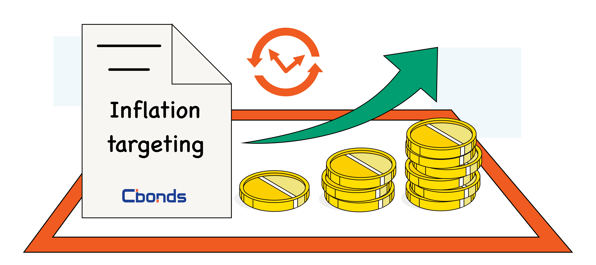

## Table of Contents

## What is inflation?

Inflation is when the prices of things we buy, like food and toys, go up over time. It means that the money we have can buy less than it used to. For example, if a toy cost $10 last year and now it costs $11, that's inflation. It happens because the amount of money in the economy grows faster than the number of goods and services available.

There are different reasons why inflation happens. Sometimes, it's because the cost of making things goes up, like when the price of oil increases. Other times, it's because people have more money to spend, so they are willing to pay more for things. Governments and banks try to control inflation by changing interest rates or the amount of money in circulation. If inflation is too high, it can make life harder for people because their money doesn't go as far.

## What is inflation targeting?

Inflation targeting is when a country's central bank sets a specific goal for how much prices should go up each year. They pick a number, like 2%, and try to keep inflation close to that number. This helps people know what to expect with prices and helps the economy stay stable. If inflation gets too high or too low, the central bank will change things like interest rates to bring it back to the target.

The central bank watches many things to see if they are hitting their inflation target. They look at the prices of things people buy every day, like food and clothes. They also look at how much people are spending and how many jobs there are. If they see that inflation is going to be higher than their target, they might raise interest rates to slow down spending. If inflation is too low, they might lower interest rates to encourage people to spend more. This way, they can keep prices growing at a steady pace.

## How does inflation targeting work?

Inflation targeting is when a country's central bank decides on a specific goal for how much prices should go up each year. They might choose a target like 2% and then work to keep inflation close to that number. This helps everyone know what to expect with prices and keeps the economy stable. If inflation starts to go above the target, the central bank will take steps to bring it back down. If it's too low, they'll do things to push it up a bit.

The central bank keeps an eye on lots of things to make sure they're hitting their inflation target. They look at the prices of everyday things like food and clothes, and they also watch how much people are spending and how many jobs there are. If they see that inflation is going to be higher than their target, they might raise interest rates. This makes borrowing money more expensive, so people spend less, and prices don't go up as fast. If inflation is too low, they might lower interest rates to make borrowing cheaper, encouraging people to spend more and helping prices to rise a bit. This way, they can keep prices growing at a steady pace.

## Why do countries adopt inflation targeting?

Countries adopt inflation targeting because it helps keep the economy stable. When people know that prices will go up by about the same amount each year, they can plan better. They know what to expect, so they can make good choices about saving and spending money. This makes the economy more predictable and helps businesses and people feel more secure.

Another reason is that inflation targeting gives the central bank a clear goal to work towards. It's like having a map to follow. If inflation starts to go too high or too low, the central bank knows exactly what to do to fix it. This can help prevent big problems like very high inflation or a bad recession. By keeping inflation steady, the central bank can help the whole country's economy run smoothly.

## What are the benefits of inflation targeting?

Inflation targeting helps keep the economy stable. When people know that prices will go up by about the same amount each year, they can plan better. They can make good choices about saving and spending money. This makes the economy more predictable and helps businesses and people feel more secure. It's like knowing the weather will be mostly the same, so you can decide what to wear without surprises.

Another benefit is that inflation targeting gives the central bank a clear goal to work towards. It's like having a map to follow. If inflation starts to go too high or too low, the central bank knows exactly what to do to fix it. This can help prevent big problems like very high inflation or a bad recession. By keeping inflation steady, the central bank can help the whole country's economy run smoothly and avoid big ups and downs.

## What are the potential drawbacks of inflation targeting?

Inflation targeting can sometimes make it hard for the central bank to focus on other important things. For example, if the central bank is only worried about keeping inflation at a certain number, they might not pay enough attention to jobs and growth in the economy. If lots of people are out of work, the central bank might still keep interest rates high to control inflation, even if it means more people stay jobless. This can make life harder for people who need jobs.

Another problem is that inflation targeting can be tricky if the economy changes a lot. Sometimes, things happen that make prices go up or down in ways that are hard to predict. If the central bank sticks too closely to their target, they might make big changes to interest rates that could cause more problems. For example, if a big storm makes food prices go up, the central bank might raise interest rates to fight inflation, but this could slow down the whole economy too much.

## How is the inflation target set?

The inflation target is set by the central bank and sometimes the government working together. They look at lots of things to decide what the target should be. They think about what has worked in the past, what other countries are doing, and what they think will help the economy grow in a healthy way. They usually pick a number that is low but not too low, like 2%, because this helps keep prices stable without causing too many problems.

Once they decide on the target, they tell everyone about it. They want people to know what to expect so they can plan their lives better. The central bank then watches the economy closely to make sure inflation stays close to the target. If it starts to go too high or too low, they will change things like interest rates to bring it back in line. This helps keep the economy running smoothly and makes life more predictable for everyone.

## What role do central banks play in inflation targeting?

Central banks are really important for inflation targeting. They are the ones who decide what the target should be, usually with help from the government. They look at lots of things like what has worked before, what other countries do, and what will help the economy grow in a good way. Once they pick a number, like 2%, they tell everyone about it so people know what to expect with prices.

After setting the target, central banks watch the economy closely to make sure inflation stays close to that number. They look at prices of things people buy every day, how much people are spending, and how many jobs there are. If inflation starts to go too high or too low, the central bank will change things like interest rates to bring it back to the target. This helps keep the economy stable and makes life more predictable for everyone.

## How does inflation targeting affect monetary policy?

Inflation targeting changes how central banks make decisions about money. When a central bank has a target for inflation, like 2%, they focus on keeping prices growing at that rate. They do this by changing interest rates. If inflation is going too high, they might raise interest rates to make borrowing money more expensive. This slows down spending and helps keep prices from going up too fast. If inflation is too low, they might lower interest rates to make borrowing cheaper, which encourages people to spend more and helps prices go up a bit.

This focus on inflation can sometimes make it hard for the central bank to pay attention to other important things, like jobs and economic growth. If the central bank is only worried about hitting their inflation target, they might not do enough to help people find work or keep the economy growing. But, having a clear target for inflation helps everyone know what to expect with prices, which can make the economy more stable and help people plan their lives better.

## Can you provide examples of countries that use inflation targeting?

Many countries use inflation targeting to keep their economies stable. One example is New Zealand, which was the first country to start using inflation targeting back in 1990. They set a target for how much prices should go up each year, and their central bank works to keep inflation close to that number. Another country is Canada, which started inflation targeting in 1991. They also have a target for inflation and adjust interest rates to keep prices growing at a steady pace.

Other countries that use inflation targeting include the United Kingdom, which began in 1992, and Sweden, which started in 1993. The UK's central bank, the Bank of England, aims to keep inflation at around 2%. Sweden's central bank, the Riksbank, also targets 2% inflation. These countries use inflation targeting to help people know what to expect with prices, making the economy more predictable and helping businesses and people feel more secure.

## How do external shocks impact inflation targeting?

External shocks, like big storms or sudden changes in oil prices, can make it hard for a country to stick to its inflation target. These shocks can cause prices to go up or down in ways that are hard to predict. For example, if a storm ruins a lot of crops, the price of food might go up a lot. The central bank might then need to raise interest rates to control inflation, but this could slow down the whole economy too much.

Central banks have to be careful when dealing with external shocks. They need to decide if the shock will be short or long-lasting. If it's short, they might not change interest rates too much because they know prices will go back to normal soon. But if the shock is going to last a long time, they might need to make bigger changes to keep inflation close to their target. It's a tricky balance to keep the economy stable while dealing with unexpected events.

## What are the latest developments and research in inflation targeting?

Recent research on inflation targeting has been looking at how well it works in different countries and situations. Some studies show that inflation targeting can help keep prices stable, but it might not be as good at helping the economy grow or creating jobs. Researchers are trying to figure out if central banks should focus more on other things, like employment, along with inflation. They're also studying how inflation targeting can be better at dealing with big surprises, like sudden changes in oil prices or natural disasters, which can make prices go up or down a lot.

Another big area of research is about how to set the right inflation target. Some experts think that maybe the target should be a bit higher than the usual 2%, like 3% or 4%, because it could help the economy grow more without causing too many problems. They're also looking at how to make sure everyone understands what the inflation target means and how it affects them. This way, people can plan better and feel more secure about the future.

## References & Further Reading

[1]: Benigno, P., & Woodford, M. (2004). ["Optimal Monetary and Fiscal Policy: A Linear-Quadratic Approach."](https://www.nber.org/papers/w9905) NBER Working Paper No. 9905.

[2]: ["Inflation Targeting: Lessons from the International Experience"](https://www.jstor.org/stable/j.ctv301gdr) by Ben S. Bernanke, Thomas Laubach, Frederic S. Mishkin, and Adam S. Posen.

[3]: Lopez de Prado, M. (2018). ["Advances in Financial Machine Learning."](https://www.amazon.com/Advances-Financial-Machine-Learning-Marcos/dp/1119482089) John Wiley & Sons.

[4]: Aronson, D. R. (2006). ["Evidence-Based Technical Analysis: Applying the Scientific Method and Statistical Inference to Trading Signals."](https://www.amazon.com/Evidence-Based-Technical-Analysis-Scientific-Statistical/dp/0470008741) John Wiley & Sons.

[5]: Taylor, J. B. (1993). ["Discretion versus Policy Rules in Practice."](https://web.stanford.edu/~johntayl/Onlinepaperscombinedbyyear/1993/Discretion_versus_Policy_Rules_in_Practice.pdf) Carnegie-Rochester Conference Series on Public Policy.

[6]: Jansen, S. (2020). ["Machine Learning for Algorithmic Trading."](https://github.com/stefan-jansen/machine-learning-for-trading) Packt Publishing.

[7]: Chan, E. P. (2009). ["Quantitative Trading: How to Build Your Own Algorithmic Trading Business."](https://github.com/ftvision/quant_trading_echan_book) John Wiley & Sons.

[8]: Obstfeld, M., & Rogoff, K. (1995). ["The Mirage of Fixed Exchange Rates."](https://www.jstor.org/stable/2138391) Journal of Economic Perspectives, 9(4), 73-96.