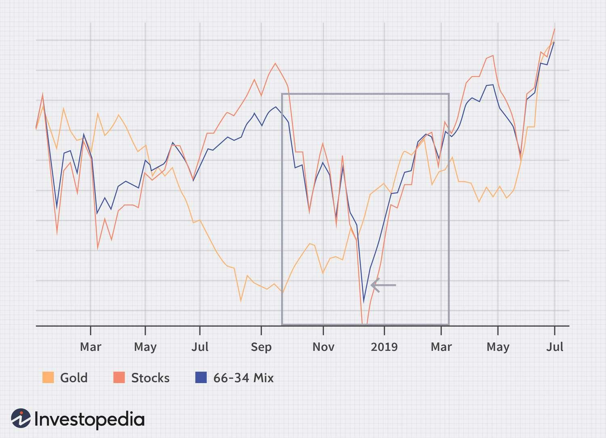

Economic inflation fundamentally influences financial markets and trading strategies by altering asset valuations, affecting purchasing power, and reshaping overall economic dynamics. Inflation, typically measured by indices such as the Consumer Price Index (CPI) and Producer Price Index (PPI), reflects the rate at which the general level of prices for goods and services rises, eroding the purchasing value of money. For investors and traders, understanding inflation is critical as it dictates market behavior and informs the development of trading strategies aimed at mitigating inflationary impacts.

The effects of inflation ripple through various components of the financial system. Investors must contend with the diminished purchasing power that inflation entails, which requires reevaluating asset allocations and strategies to preserve and increase real returns. Furthermore, inflation can lead to increased uncertainty and volatility in financial markets, influencing asset prices and creating opportunities for inflation trading. Strategies such as reallocating to inflation-protected securities and engaging in derivative trades are commonly employed to hedge against or profit from inflationary conditions.



Algorithmic trading, often abbreviated as algo trading, is increasingly utilized to navigate inflation-driven market fluctuations. By employing automated systems, traders can respond swiftly to market movements, optimizing financial outcomes through data-driven decisions. Inflation affects crucial elements such as asset prices, interest rates, and market volatility, necessitating constant monitoring and recalibration of algorithmic models. The integration of inflation data into these algorithms helps traders optimize their strategies, manage risks, and capitalize on inflation-induced market trends.

In this article, we explore how inflation impacts financial strategies, including those that specifically address inflation and those involving algorithmic trading. We examine the mechanisms through which inflation affects markets and the development of viable trading methodologies. Furthermore, we consider how inflation data can be integrated into trading algorithms to enhance their efficiency and effectiveness in optimizing financial returns. Understanding these dynamics is essential for maintaining a competitive edge in an economic landscape characterized by both challenges and opportunities presented by inflation.

## Table of Contents

## Understanding Economic Inflation

Economic inflation represents a sustained increase in the general price level of goods and services in an economy over a period of time. This phenomenon results in a reduction of the purchasing power of money. In essence, as prices rise, each unit of currency buys fewer goods and services. Economists typically measure inflation using indices such as the Consumer Price Index (CPI) and the Producer Price Index (PPI). CPI tracks the average change over time in prices paid by urban consumers for a market basket of consumer goods and services. Conversely, PPI measures the average change in selling prices received by domestic producers for their output.

The drivers of inflation are generally categorized into three broad types: demand-pull inflation, cost-push inflation, and built-in inflation. 

1. **Demand-pull inflation** occurs when the demand for goods and services exceeds supply. This scenario is often fueled by an increase in consumer wealth, government spending, or investment demand. Mathematically, this can be described as an increase in aggregate demand (AD), which shifts the AD curve to the right in the aggregate supply and demand model. 

2. **Cost-push inflation** arises when the costs of production increase, leading to a decrease in the aggregate supply of goods and services. This can be caused by rising wages, increased prices for raw materials, or supply chain disruptions.

3. **Built-in inflation** is linked to adaptive expectations, where past inflation leads to future inflationary behaviors. It often occurs when businesses and workers expect inflation to continue and adjust prices and wages accordingly, thus perpetuating the inflation cycle.

Monetary policy plays a significant role in managing inflation by influencing interest rates and the money supply. Central banks, such as the Federal Reserve in the United States, use tools like open market operations, discount rates, and reserve requirements to control inflation. A lowering of interest rates can stimulate borrowing and spending, thereby increasing inflation, while raising interest rates can cool an overheating economy and reduce inflationary pressures.

The implications of inflation are far-reaching, impacting various economic [agents](/wiki/agents). Consumers may experience reduced purchasing power, prompting changes in consumption patterns and savings behavior. Businesses face challenges in cost management and pricing strategies, which can affect profitability and investment decisions. Investors may shift their portfolios towards assets that traditionally offer protection against inflation, such as commodities or inflation-indexed bonds like Treasury Inflation-Protected Securities (TIPS).

In financial markets, inflation can lead to increased [volatility](/wiki/volatility-trading-strategies) and alter the valuation of assets. For instance, inflation expectations can impact the yield curve, influencing interest rates and bond prices. Furthermore, exchange rates may fluctuate as investors seek out currencies that offer better purchasing power protection. As a result, understanding and predicting inflation trends is crucial for developing effective financial strategies and maintaining economic stability. 

In summary, inflation is a multifaceted economic phenomenon affecting a wide array of financial behaviors and market dynamics. Accurately measuring and interpreting inflationary pressures is essential for economic policymakers, businesses, and investors alike.

## Inflation Trading Strategies

Inflation trading involves implementing strategies that take advantage of the changing economic environment caused by inflation. The objectives of these strategies are to protect investments from erosion due to rising prices and to capitalize on potential profit opportunities created by inflation-induced market shifts. The key components of inflation trading strategies include asset reallocation and derivative trades, providing a diversified approach to manage inflation risk.

Asset reallocation is a primary strategy employed to hedge against inflationary pressures. Investors can shift their portfolios towards commodity assets, which historically tend to increase in value during inflationary periods. Commodities such as oil, gold, and agricultural products exhibit a positive correlation with inflation, as their prices generally rise when inflation accelerates. The real asset value of these commodities often serves as a natural hedge against inflation.

In addition to commodities, Treasury Inflation-Protected Securities (TIPS) are another popular instrument used to safeguard capital from inflation. TIPS are government bonds specifically designed to protect investors from inflation by automatically adjusting their principal value in response to changes in the Consumer Price Index (CPI). As inflation increases, the bond's principal value rises, ensuring that the investor's purchasing power is maintained.

Derivative trades are another avenue through which investors can engage in inflation trading. Derivatives, such as options and futures, allow traders to speculate on the direction of inflation or hedge existing positions against inflationary risks. Options strategies like purchasing call options on commodities or indices offer a leveraged bet on rising prices. Futures contracts on commodities allow for locking in today's prices for future delivery, offering protection against price hikes triggered by inflation.

Arbitrage opportunities arise when inflation causes discrepancies in the pricing of financial instruments, creating potential for profitable trades. Such disparities might occur across different markets or asset classes, enabling traders to exploit differences in valuation. For instance, if inflation expectations lead to a divergence between the prices of commodities and commodity-linked securities, traders can execute [arbitrage](/wiki/arbitrage) strategies to capitalize on the mispricing.

In conclusion, inflation trading strategies involve a comprehensive approach combining asset reallocation, the use of inflation-linked securities, derivative trades, and arbitrage opportunities. These strategies aim not only to protect the value of investments against rising price levels but also to generate profit from market inefficiencies caused by inflation dynamics.

## Algorithmic Trading in Inflationary Environments

Algorithmic trading employs automated systems designed to execute trades based on predefined criteria, allowing them to respond swiftly to market changes. An inflationary environment can have pronounced effects on asset prices, interest rates, and market volatility, necessitating constant recalibration of [algorithmic trading](/wiki/algorithmic-trading) models to maintain their efficacy.

Inflation impacts the fundamental variables these algorithms rely on, such as asset pricing models and risk assessments. With inflation rising, bond prices tend to fall as interest rates rise, pushing algorithmic models to adjust their investment strategies to account for these shifts. Volatility, driven by market participants' reactions to inflation data and forecasts, further complicates these models, causing a need for enhanced precision in predictions and trade executions.

In recent years, [machine learning](/wiki/machine-learning) techniques have greatly improved algorithmic trading systems' ability to adapt to inflationary pressures. Machine learning models can process vast datasets, identifying patterns and trends that human traders might overlook. For instance, algorithms using supervised learning can be trained on historical market data, incorporating inflation metrics to identify potential future market movements.

The adaptation involves using advanced techniques such as [reinforcement learning](/wiki/reinforcement-learning), which allows models to learn optimal trading strategies by interacting with a market environment. These models simulate numerous trading scenarios, learning from the outcomes to make more informed decisions as inflation metrics oscillate.

Python, as a favored tool among quantitative analysts and researchers, provides a robust framework for building sophisticated algorithmic trading systems. Libraries such as NumPy for numerical computations, pandas for data manipulation, and scikit-learn for implementing machine learning models are integral. Below is a simple illustration of how machine learning might be integrated into an algorithmic trading strategy that accounts for inflation:

```python
import numpy as np
import pandas as pd
from sklearn.model_selection import train_test_split
from sklearn.linear_model import LinearRegression

# Sample dataset containing historical market data with inflation rates
data = pd.read_csv('market_data.csv')

# Feature selection including inflation rates
features = data[['interest_rates', 'inflation_rate', 'market_volatility']]
target = data['asset_price']

# Train-test split
X_train, X_test, y_train, y_test = train_test_split(features, target, test_size=0.2, random_state=42)

# Linear Regression model, can be replaced with more complex algorithms
model = LinearRegression()
model.fit(X_train, y_train)

# Predict future asset prices considering inflation
predictions = model.predict(X_test)

# Evaluate model performance
performance = model.score(X_test, y_test)
print(f'Model Performance: {performance}')
```

This code demonstrates how a basic regression model might use inflation rates as part of its feature set to predict asset prices. However, in practice, more sophisticated models like neural networks or ensemble methods might be used to capture complex, non-linear relationships in financial data influenced by inflation.

The integration of inflation data into algorithmic trading processes is not only about immediate adjustment but also about the continuous development of models to anticipate future inflationary trends, thus optimizing financial returns in a persistently volatile market landscape.

## Adapting Algorithms for Inflation

To effectively manage the dynamics of inflation within financial markets, it is crucial for trading algorithms to incorporate macroeconomic data and forecasts. By doing so, these algorithms can dynamically adapt to market movements, optimizing trading strategies under varying inflationary conditions. Macroeconomic indicators, such as inflation rates, GDP growth, and employment [statistics](/wiki/bayesian-statistics), play a pivotal role in shaping market sentiment and must be integrated into algorithmic models.

A key technique in refining these algorithms is [backtesting](/wiki/backtesting), a process that tests trading strategies against historical data. By simulating trades with historical inflation trends, traders can validate the robustness of their trading models. Backtesting allows for the analysis of how a strategy would have performed in past inflationary environments, highlighting potential weaknesses and areas for enhancement. It is essential to adjust the parameters of trading models based on insights gained from backtesting to ensure resilience in real-time trading scenarios.

Machine learning is increasingly employed in the development of trading algorithms to fine-tune the accuracy of inflation-adjusted financial strategies. Machine learning models can identify complex patterns and relationships in large datasets, learning from historical and real-time data to optimize trade decisions. Techniques such as supervised learning, where algorithms are trained on labeled datasets, can help predict inflationary trends and adjust trading strategies accordingly.

For instance, a simplistic implementation in Python could involve using a Random Forest model to predict future inflation rates based on historical data:

```python
from sklearn.ensemble import RandomForestRegressor
from sklearn.model_selection import train_test_split
import numpy as np

# Example macroeconomic data, X is features and y is the target inflation rate
X = np.array([[...], [...], ...])
y = np.array([...])

# Split data into training and test sets
X_train, X_test, y_train, y_test = train_test_split(X, y, test_size=0.2, random_state=42)

# Instantiate and train the model
model = RandomForestRegressor(n_estimators=100, random_state=42)
model.fit(X_train, y_train)

# Predict future inflation
predictions = model.predict(X_test)
```

By continuously developing machine learning models with real-time data and incorporating robust backtesting, trading algorithms can be adapted effectively to face inflation-induced market challenges. This integration of machine learning and macroeconomic data ensures that algorithms are not only responsive to current market conditions but also predictive of future trends, maintaining a competitive edge in trading environments.

## Successful Case Studies in Inflation Trading

Renaissance Technologies and Bridgewater Associates illustrate the effective use of inflation data in shaping their algorithmic trading strategies. These firms employ quantitative methods and macroeconomic insights to address inflation-related challenges and exploit market opportunities arising from inflation-induced changes.

Renaissance Technologies is renowned for its Medallion Fund, which leverages complex mathematical models and algorithms to execute trading decisions. The firm uses a wide array of data inputs, including inflation metrics, to refine its strategies. By incorporating inflation data, Renaissance can anticipate shifts in interest rates and adjust its asset allocations to optimize returns. This adaptability is underlined by its reliance on empirical data and machine learning techniques, enabling the firm to test various models under different inflationary conditions and recalibrate them as necessary.

Bridgewater Associates also exemplifies a robust approach to inflation trading. Its flagship fund, Pure Alpha, is known for actively incorporating macroeconomic indicators, including inflation rates, into its trading algorithms. Bridgewater employs a "risk parity" strategy that diversifies investments across asset classes based on risk rather than returns. This involves balancing exposures to inflation-sensitive assets, such as commodities and inflation-linked bonds, against other investments. The firm's emphasis on rigorous economic analysis and scenario planning allows it to test how different inflation scenarios might impact financial markets and adjust its strategies accordingly.

A key takeaway from these firms is the importance of maintaining dynamic and flexible trading models that can adapt to shifting economic circumstances, particularly those influenced by inflation. Both Renaissance and Bridgewater demonstrate how integrating comprehensive inflation data into trading algorithms can offer a competitive edge by enabling precise predictions and timely adjustments. Such strategies underscore the value of continuously updating models with current economic data and the integration of machine learning to process vast amounts of information efficiently.

These examples highlight the necessity of an agile approach in algorithmic trading, with algorithms designed to account for and swiftly react to inflationary pressures. The success of Renaissance Technologies and Bridgewater Associates in this domain underlines the critical role of innovation and adaptability in overcoming the complexities of inflationary environments.

## Conclusion

Inflation significantly impacts financial markets, presenting both challenges and opportunities. Trading strategies must continuously adapt to maintain efficiency and profitability amidst changing economic conditions. As inflation alters asset valuations and purchasing power, the need for dynamic financial strategies becomes increasingly evident.

Algorithmic trading provides a robust solution to inflation's complexities by utilizing technology to execute trades based on predefined criteria. These automated systems can quickly react to fluctuating market conditions influenced by inflation, thereby optimizing trading outcomes. The integration of macroeconomic data, including inflation metrics, into algorithmic models allows traders to respond effectively to economic shifts.

Continued research and development are crucial in refining these algorithmic strategies. By incorporating inflation data more precisely, trading models enhance their predictive capability, ensuring traders stay ahead in volatile economic landscapes. Innovations in machine learning further bolster algorithmic trading's efficacy, allowing for the tailored adjustment of strategies in response to inflationary pressures.

Ultimately, maintaining a competitive edge requires constant adaptation and improvement of trading algorithms, leveraging advances in technology and analytics. This adaptability ensures that traders can navigate the complexities posed by inflation, capitalizing on emerging opportunities while mitigating potential risks.

## References & Further Reading

[1]: ["CME Group's Introduction to Inflation and Inflation Derivatives"](https://www.cmegroup.com/education/featured-reports/what-higher-inflation-might-really-mean-for-investors.html) - Provides an understanding of inflation and products used for inflation trading.

[2]: ["Advances in Financial Machine Learning"](https://www.amazon.com/Advances-Financial-Machine-Learning-Marcos/dp/1119482089) by Marcos Lopez de Prado - Discusses the integration of machine learning techniques in financial strategies, including trading adjustments for inflation. 

[3]: ["Quantitative Trading: How to Build Your Own Algorithmic Trading Business"](https://www.amazon.com/Quantitative-Trading-Build-Algorithmic-Business/dp/1119800064) by Ernest P. Chan - Offers insights into developing algorithmic trading systems that can adapt to macroeconomic factors like inflation.

[4]: ["A Practitioner's Guide to Factor Models"](https://rpc.cfainstitute.org/research/foundation/1994/a-practitioners-guide-to-factor-models) by Thomas S. Coleman - Explores factor models in trading, which are also applicable in distinguishing strategies for inflation trading.

[5]: ["Inflation: Causes, Costs, and Current Status"](https://crsreports.congress.gov/product/pdf/RL/RL30344) by Alan S. Blinder - An academic paper providing an overview of inflation, crucial for understanding its impact on trading strategies.