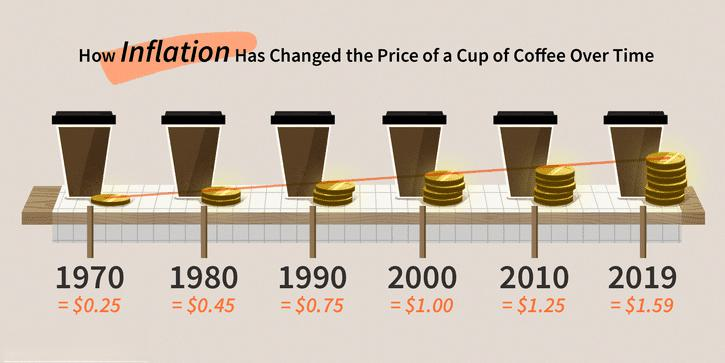

Inflation, a critical economic indicator, represents the rate at which the general level of prices for goods and services rises, subsequently eroding purchasing power. This phenomenon intricately links to broader economic dynamics, finance, and algorithmic trading, forming a complex web of interdependencies. In today's globalized financial markets, understanding these connections is vital for both traders and policymakers.

Economic dynamics, encompassing growth, employment, and fiscal policies, are significantly influenced by inflationary trends. High inflation often prompts central banks to implement monetary policies aimed at stabilizing prices, frequently involving interest rate adjustments. These actions, in turn, reverberate through financial markets, affecting stock valuations, bond yields, and foreign exchange rates.



In finance, inflation plays a pivotal role in shaping investment strategies and asset valuations. Investors and traders must incorporate inflation expectations into their decision-making processes to maintain portfolio value and achieve targeted returns. For example, inflation can lead to increased costs for companies, affecting their profitability and, by extension, their stock prices. Similarly, inflation expectations influence bond markets, given that rising inflation typically results in higher interest rates and lower bond prices.

Algorithmic trading, which relies on sophisticated mathematical models and automated systems, is particularly sensitive to inflationary pressures. Algorithms must account for various economic indicators, including inflation, to optimize trading strategies and manage risks effectively. As inflation fluctuates, algorithms require continuous adjustments to maintain their accuracy and relevance in predicting market movements.

To illustrate the multifaceted effects of inflation on financial strategies and algorithmic models, consider the following Python snippet that uses basic economic indicators to adjust trading algorithms dynamically:

```python
def adjust_for_inflation(inflation_rate, interest_rate, stock_prices):
    adjusted_prices = []
    for price in stock_prices:
        # Adjust stock prices based on inflation and interest rate adjustments
        adjusted_price = price / ((1 + inflation_rate) * (1 + interest_rate))
        adjusted_prices.append(adjusted_price)
    return adjusted_prices

inflation_rate = 0.03  # Example inflation rate
interest_rate = 0.02   # Example interest rate
stock_prices = [100, 150, 200]  # Example stock prices

adjusted_prices = adjust_for_inflation(inflation_rate, interest_rate, stock_prices)
print(adjusted_prices)
```

This interconnectedness underscores the importance for market participants to grasp how inflation affects various financial elements, allowing for better-informed decisions and robust algorithmic models. As the financial landscape continues to evolve, the integration of inflation data into trading strategies becomes increasingly crucial, warranting ongoing research and development in this domain. By maintaining a nuanced understanding of inflation and leveraging technological advancements in [algorithmic trading](/wiki/algorithmic-trading), financial professionals can navigate the complexities of modern markets more effectively.

## Table of Contents

## Understanding Inflation in Economics

Inflation refers to the general increase in prices of goods and services in an economy over a period of time, leading to a decline in the purchasing power of currency. Essentially, as inflation rises, each unit of currency buys fewer goods and services. Inflation is a critical [factor](/wiki/factor-investing) in economics because it influences consumer behavior, investment strategies, and monetary policies.

### Common Measures of Inflation

Two of the most widely used indicators for measuring inflation are the Consumer Price Index (CPI) and the Producer Price Index (PPI). 

- **Consumer Price Index (CPI):** CPI measures the average change over time in the prices paid by urban consumers for a market basket of consumer goods and services. It is a key indicator of the cost of living and reflects changes in the price level from a consumer perspective. 

- **Producer Price Index (PPI):** PPI measures the average change over time in the selling prices received by domestic producers for their output. It captures price changes from the perspective of the seller, differing from CPI by focusing on what the producers receive, rather than what consumers pay.

### Factors Contributing to Inflation

The causes of inflation are typically categorized into three main types: demand-pull inflation, cost-push inflation, and built-in inflation.

- **Demand-Pull Inflation:** This type arises when the aggregate demand for goods and services in an economy increases faster than the economy’s production capacity. A classic scenario is when increased consumer spending or investment outpaces supply. Mathematically, demand-pull inflation can be represented in the aggregate demand-aggregate supply (AD-AS) model, where a rightward shift in the AD curve results in a higher price level.

- **Cost-Push Inflation:** Occurs when rising costs of production, such as wages and raw materials, lead producers to increase prices to maintain profit margins. For example, a surge in oil prices can lead to higher transportation and manufacturing costs, subsequently elevating prices of goods.

- **Built-In Inflation:** Also known as wage-price inflation, built-in inflation is a cycle where workers demand higher wages to keep up with rising living costs, and businesses pass on these costs in the form of higher prices. This type of inflation is often embedded in the expectations of economic agents, perpetuating further inflationary pressures.

Understanding these concepts is crucial for policymakers as they determine the appropriate fiscal and monetary policies to manage price stability and sustain economic growth.

## The Financial Impact of Inflation

Inflation, a persistent increase in the general price level of goods and services in an economy, exerts profound influences on financial markets, specifically impacting stocks, bonds, and [forex](/wiki/forex-system) markets. Understanding these effects is crucial for investors and traders who need to adapt their strategies amid changing inflationary conditions.

### Effects on Financial Markets

**Stocks:**
Inflation can influence stock markets by affecting corporate earnings and consumer purchasing power. Companies facing higher operational costs due to inflation might pass these costs to consumers, potentially reducing sales if wages do not keep pace with inflation. On the other hand, firms that control significant pricing power may increase prices without a proportional decrease in sales, protecting their profit margins. Additionally, inflation can cloud future earnings forecasts, introducing greater uncertainty and potentially increasing the equity risk premium demanded by investors. This scenario can depress share prices as investors seek higher returns to compensate for increased risk.

**Bonds:**
Bonds typically suffer in inflationary environments. Since they offer fixed interest payments, the real value of these payments diminishes as inflation erodes purchasing power. Consequently, when inflation expectations rise, bond prices generally fall, leading to higher yields as investors demand compensation for this eroding purchasing power. Investors may prefer inflation-protected securities like Treasury Inflation-Protected Securities (TIPS), which adjust principal values according to inflation and provide a hedge against rising prices.

**Forex:**
In the forex market, inflation affects currency values through [interest rate](/wiki/interest-rate-trading-strategies) adjustments and economic expectations. High inflation in a country can lead to currency depreciation as it undermines the currency's purchasing power relative to other currencies. Moreover, investors might seek currencies from countries with lower inflation rates, perceived as more stable, thereby further pressuring the currency's value.

### Inflation and Interest Rates

The relationship between inflation and interest rates is central to how monetary policy influences economic conditions. Central banks, such as the Federal Reserve in the United States, adjust interest rates to control inflation. In periods of rising inflation, central banks may increase interest rates to temper spending and borrowing, thereby slowing down inflationary pressures. Conversely, if inflation is low or the economy is languishing, central banks might lower interest rates to stimulate economic activity by making borrowing more attractive and saving less so.

### Implications for Investors and Traders

Understanding the impact of inflation is vital for maintaining an effective asset valuation and portfolio management strategy. In terms of asset valuation, inflation directly affects the discount rate used to value future cash flows, influencing the present value of equities and bonds. This calls for models that can incorporate inflation expectations into valuation metrics effectively.

For portfolio management, diversification and hedging become critical under inflationary conditions. Investors might consider including assets traditionally seen as hedges against inflation, such as commodities or real estate, in their portfolios. Moreover, employing dynamic allocation strategies that adapt to changing inflation forecasts can be beneficial. This might involve reallocating assets based on inflation indicators or using derivatives to hedge inflation risk.

In summary, inflation significantly impacts various components of financial markets, challenging investors and traders to adjust their strategies and use tools that account for the changes in purchasing power, interest rate adjustments, and currency valuations.

## Algorithmic Trading and Inflation

Algorithmic trading has become an integral part of the modern financial landscape, leveraging sophisticated mathematical models and computational algorithms to execute trades at high speed and [volume](/wiki/volume-trading-strategy). The adoption of algorithmic trading is often driven by the quest for efficiency, cost-effectiveness, and the ability to process large sets of financial data rapidly. These systems, however, must account for various economic indicators, including inflation, which can significantly impact market conditions.

Inflation affects asset prices, interest rates, and market [volatility](/wiki/volatility-trading-strategies), all of which are critical inputs in algorithmic models. To integrate inflation into trading strategies, algorithms are designed to analyze inflation data and adjust their trading decisions accordingly. For example, an algorithm might incorporate Consumer Price Index (CPI) data to anticipate shifts in interest rates or sector-specific inflation rates to predict changes in commodity prices.

One central aspect of incorporating inflation into algorithmic trading involves the recalibration of models. Since economic conditions and inflation rates are dynamic, algorithmic systems require regular updates to maintain their efficacy. This is achieved through a process known as dynamic model recalibration, which refers to the adjustment of model parameters based on new data inputs. In practice, this might involve recalibrating volatility measures or the risk premiums used in pricing models as inflation expectations shift.

To facilitate these recalibrations, algorithms often employ techniques from the field of [machine learning](/wiki/machine-learning). Machine learning models can analyze historical data to understand the typical effects of inflation on different asset classes and adjust their future predictions accordingly. These models can be trained to identify patterns associated with inflationary pressures and adapt their trading strategies to mitigate risks or capitalize on expected market movements.

Python, commonly used in algorithmic trading, provides libraries such as scikit-learn and TensorFlow that support the implementation of machine learning techniques. An example code snippet for training a simple regression model to predict inflation-adjusted asset prices might look like this:

```python
from sklearn.model_selection import train_test_split
from sklearn.linear_model import LinearRegression
import pandas as pd

# Sample data loading
data = pd.read_csv('historical_data.csv')  # Historical dataset with inflation and asset prices
X = data[['CPI', 'InterestRates']]  # Features: CPI and Interest Rates
y = data['AssetPrice']  # Target: Asset price

# Split data into training and test sets
X_train, X_test, y_train, y_test = train_test_split(X, y, test_size=0.2, random_state=42)

# Initialize and train a linear regression model
model = LinearRegression()
model.fit(X_train, y_train)

# Predicting asset prices using the test data
predictions = model.predict(X_test)
```

The adaptability of algorithmic systems in the face of inflationary pressures is crucial for maintaining their competitive edge. This adaptability not only requires incorporating current data but also necessitates anticipating future inflation trends and their potential effects on financial markets. As a result, developing robust, inflation-sensitive trading algorithms is an ongoing process that demands constant innovation and refinement.

## Adapting Trading Algorithms for Inflation

Integrating macroeconomic data and inflation forecasts into algorithmic trading models involves leveraging a wide array of statistical and computational techniques to capture the complex dynamics of inflation and its effects on different asset classes. This process is critical for developing robust trading strategies in volatile markets.

### Integrating Macroeconomic Data and Inflation Forecasts

The integration of macroeconomic data into trading algorithms requires compiling data on various economic indicators, such as GDP, employment rates, and inflation indices like the Consumer Price Index (CPI) and Producer Price Index (PPI). Econometric models, such as Vector AutoRegressions (VAR) and Generalized Autoregressive Conditional Heteroskedasticity (GARCH), are commonly employed to forecast inflation and assess its potential impact on market prices.

For instance, a simplified econometric model might look like this:

$$
\text{Inflation}_t = \alpha + \beta_1 \times \text{CPI}_t + \beta_2 \times \text{PPI}_t + \epsilon_t
$$

Where:
- $\text{Inflation}_t$ is the inflation rate at time $t$,
- $\alpha$ is a constant term,
- $\beta_1$ and $\beta_2$ are coefficients for CPI and PPI,
- $\epsilon_t$ is the error term.

### Backtesting Against Historical Inflation Trends

Backtesting is a crucial step in the development of trading algorithms, allowing traders to test the viability and performance of their strategies using historical data. By evaluating how a model performs under past inflation trends, traders gain insights into potential future performance.

In practice, [backtesting](/wiki/backtesting) involves simulating trades over a historical dataset to assess the algorithm's profitability and risk profile. This process can be carried out using programming languages like Python with libraries such as pandas and [backtrader](/wiki/backtrader):

```python
import backtrader as bt
import pandas as pd

# Load historical data
data = pd.read_csv('historical_inflation_data.csv')
datafeed = bt.feeds.PandasData(dataname=data)

# Define a sample trading strategy
class InflationAdjustedStrategy(bt.Strategy):
    def __init__(self):
        self.inflation_data = self.datas[0].cpi

    def next(self):
        if self.inflation_data[0] > 2.0:  # Example threshold condition
            self.buy()
        elif self.inflation_data[0] < 1.5:
            self.sell()

# Instantiate Cerebro engine and run backtest
cerebro = bt.Cerebro()
cerebro.addstrategy(InflationAdjustedStrategy)
cerebro.adddata(datafeed)
cerebro.run()
```

### Machine Learning Enhancements in Inflationary Environments

Machine learning offers powerful tools to enhance algorithmic predictions, particularly in complex environments affected by inflation. Techniques such as regression trees, neural networks, and ensemble methods facilitate the extraction of patterns from large datasets, improving the accuracy of inflation forecasts and trading decisions.

For example, a Random Forest regression model can predict asset price movements based on input macroeconomic conditions:

```python
from sklearn.ensemble import RandomForestRegressor
from sklearn.model_selection import train_test_split

# Prepare feature matrix and target variable
features = data[['cpi', 'ppi', 'gdp_growth']]
target = data['asset_return']

# Split dataset
X_train, X_test, y_train, y_test = train_test_split(features, target, test_size=0.2)

# Train the model
model = RandomForestRegressor(n_estimators=100)
model.fit(X_train, y_train)

# Evaluate the model
predictions = model.predict(X_test)
```

These methods collectively provide a framework for adapting trading strategies to account for inflation, enhancing the resilience of algorithmic models amid economic fluctuations. By continuously integrating sophisticated data analysis techniques, traders can better understand and anticipate the impacts of inflation on financial markets, optimizing their strategies accordingly.

## Case Studies and Practical Applications

Renaissance Technologies and Bridgewater Associates are renowned for their advanced use of data and technology in algorithmic trading, particularly under high-inflation conditions. These firms have shown how dynamic strategies incorporating macroeconomic indicators, like inflation, are crucial for maintaining competitive advantages in volatile markets.

### Renaissance Technologies

Renaissance Technologies, particularly through its Medallion Fund, has been a pioneer in leveraging quantitative techniques in financial markets. The firm employs a vast array of quantitative models, incorporating diverse data sets, including macroeconomic indicators like inflation. By analyzing historical inflation trends, Renaissance adapts its trading algorithms to predict potential market movements. For instance, their models may integrate time-series analysis to forecast inflation rates and adjust positions accordingly. The success of these strategies during inflationary periods demonstrates the firm's capacity to manage inflation risks while capitalizing on trading opportunities.

### Bridgewater Associates

Bridgewater Associates, founded by Ray Dalio, is noted for its macroeconomic approach, which naturally incorporates considerations of inflation. The firm's "All Weather" strategy exemplifies how algorithmic trading can be adjusted to different economic scenarios, including high inflation. This strategy emphasizes diversification across different asset classes to hedge against inflationary pressures. By continuously adjusting its portfolio weights based on inflation forecasts, Bridgewater mitigates risk and strives for consistent performance. The firm employs machine learning algorithms to analyze economic indicators and refine its trading decisions, showcasing a proactive stance in navigating inflation.

### Successful Algorithmic Trading Strategies

Successful algorithmic trading strategies in high-inflation scenarios often revolve around adaptive hedging techniques and diversified asset allocations. Firms like Renaissance and Bridgewater use continuous model recalibration and backtesting against historical inflation data to ensure their strategies remain relevant. For instance, employing a mean-reversion strategy may become less effective in such periods, prompting these firms to shift towards [momentum](/wiki/momentum)-based approaches that capitalize on trending inflation-adjusted price movements.

### Lessons Learned and Best Practices

Key lessons from these industry leaders include the importance of robust data integration and the need for flexible algorithmic models that can adjust to inflationary environments. Best practices involve leveraging machine learning to enhance predictive accuracy and employing comprehensive backtesting to assess strategy resilience against historical inflation events. Additionally, these firms underscore the significance of diversification and risk management, ensuring that portfolios can withstand varying economic conditions.

In conclusion, the strategic incorporation of inflation data into algorithmic trading models is imperative for navigating today's complex financial landscapes. By learning from the practices of Renaissance Technologies and Bridgewater Associates, traders can develop more resilient and adaptive trading strategies that thrive amidst inflationary pressures.

## Conclusion

Understanding inflation is crucial for effective financial decision-making and algorithmic trading. Inflation influences asset prices, interest rates, and currency valuations, which are vital variables in financial algorithms. By grasping these impacts, traders and investors can better manage risks and optimize returns.

The integration of inflation data into trading algorithms requires continuous updates and adaptations. Traditional models may not account for real-time economic shifts, necessitating dynamic recalibrations. As central banks adjust monetary policies in response to inflation changes, algorithmic models must incorporate these adjustments to maintain their efficacy. This evolution is crucial to reflect the complexities of financial markets accurately.

Looking ahead, the fusion of machine learning with macroeconomic data presents promising advancements. Predictive models trained on historical inflation trends can enhance forecasting accuracy and trading performance. As computing power grows and data analytics become more sophisticated, algorithms will likely benefit from more nuanced understandings of inflationary dynamics.

Emerging technologies, such as blockchain and decentralized finance (DeFi), also present opportunities and challenges. These innovations may disrupt traditional economic relationships, necessitating further adaptations in algorithmic strategies. As global interconnectedness increases, algorithmic models will need to incorporate international inflationary trends to stay competitive.

In conclusion, comprehending inflation is paramount for developing and refining financial strategies. As financial markets continue to evolve, the successful incorporation of inflation data into algorithmic trading will be a decisive factor in maintaining a competitive edge. The future will likely see continued integration of advanced technologies to enhance how inflation data informs trading decisions, ensuring resilience in volatile economic landscapes.

## References & Further Reading

[1]: ["Advances in Financial Machine Learning"](https://www.amazon.com/Advances-Financial-Machine-Learning-Marcos/dp/1119482089) by Marcos Lopez de Prado

[2]: ["Quantitative Trading: How to Build Your Own Algorithmic Trading Business"](https://books.google.com/books/about/Quantitative_Trading.html?id=j70yEAAAQBAJ) by Ernest P. Chan

[3]: ["Machine Learning for Algorithmic Trading"](https://github.com/PacktPublishing/Machine-Learning-for-Algorithmic-Trading-Second-Edition) by Stefan Jansen

[4]: ["Machine Learning in Finance: From Theory to Practice"](https://link.springer.com/book/10.1007/978-3-030-41068-1) by Matthew F. Dixon, Igor Halperin, and Paul Bilokon

[5]: ["The Economic and Financial Impacts of Rising Inflation"](https://www.mckinsey.com/featured-insights/mckinsey-explainers/what-is-inflation), Journal of Economic Perspectives

[6]: ["The Role of Inflation in Financial Markets"](https://www.mckinsey.com/featured-insights/mckinsey-explainers/what-is-inflation) - An Investment Office report detailing inflation's impact on financial instruments.

[7]: ["Evidence-Based Technical Analysis: Applying the Scientific Method and Statistical Inference to Trading Signals"](https://www.amazon.com/Evidence-Based-Technical-Analysis-Scientific-Statistical/dp/0470008741) by David Aronson