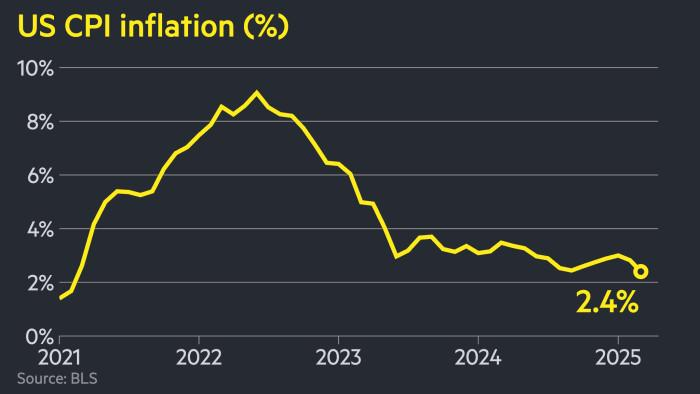

## Table of Contents

## What is inflation?

Inflation is when the prices of things we buy, like food and toys, go up over time. It means that the money we have can buy less stuff than before. Imagine if a toy car that cost $1 last year now costs $1.10. That's inflation. It happens because the amount of money in the world goes up, but the number of things to buy stays the same or doesn't go up as fast.

Inflation can be a problem because it makes things more expensive. If your allowance stays the same but the price of the toy car goes up, you can't buy as many toy cars. But a little bit of inflation is normal and can be good. It can make people spend money instead of saving it, which helps the economy grow. Governments and banks try to keep inflation at a good level, not too high and not too low.

## How is inflation measured?

Inflation is measured using something called a price index. The most common one is the Consumer Price Index, or CPI. The CPI looks at the prices of a bunch of different things that people buy, like food, clothes, and gas. Every month, people go out and check the prices of these things. They compare the prices to what they were last month and last year. If the prices are higher, then there's inflation.

The CPI is calculated by taking the average price of all the things in the basket and comparing it to the average price from a base year. If the average price this month is higher than the base year, the CPI goes up. For example, if the CPI goes up by 2%, that means things are 2% more expensive than they were in the base year. Governments and economists use this number to talk about how much inflation there is.

There are other ways to measure inflation too, like the Producer Price Index (PPI), which looks at the prices that businesses pay for things they use to make their products. But the CPI is the one most people hear about because it shows how inflation affects what we buy every day.

## What causes inflation?

Inflation can happen for a few reasons. One big reason is when there's too much money floating around. Imagine if everyone suddenly got a lot more money. People would start buying more things, and shops might raise their prices because they know people can pay more. This is called demand-pull inflation. It's like when everyone wants to buy the same toy, and the shop owner raises the price because they know people will still buy it.

Another reason for inflation is when it costs more to make things. This can happen if the price of things like oil or wheat goes up. If it costs more to make bread because wheat is more expensive, the price of bread goes up too. This is called cost-push inflation. It's like if the cost of making a toy car goes up because the plastic is more expensive, then the toy car will cost more at the store.

Sometimes, inflation can also happen because people expect it to happen. If everyone thinks prices will go up next month, they might buy things now before the prices go up. This can make prices go up even faster. It's a bit like a self-fulfilling prophecy. Governments and central banks try to manage these causes to keep inflation at a good level, not too high and not too low.

## What are the different types of inflation?

There are a few different types of inflation. One type is called demand-pull inflation. This happens when people want to buy more things than there are available. Imagine if everyone wanted to buy the same toy, but there weren't enough toys to go around. The shop might raise the price because they know people will still buy it. It's like when too many people want to buy something, and the price goes up because of the high demand.

Another type is cost-push inflation. This happens when it costs more to make things. For example, if the price of wheat goes up, it will cost more to make bread. So, the price of bread goes up too. It's like when the cost of making a toy car goes up because the plastic is more expensive, then the toy car will cost more at the store.

There's also something called built-in inflation. This happens when people expect prices to keep going up. If everyone thinks prices will be higher next month, they might buy things now before the prices go up. This can make prices go up even faster. It's a bit like a self-fulfilling prophecy. Governments and central banks try to manage these types of inflation to keep prices stable.

## What are the effects of inflation on the economy?

Inflation can have a big impact on the economy. When prices go up, it means that the money people have can buy less stuff than before. This can make life harder for people, especially if their wages don't go up at the same time. For example, if the price of bread goes up but your allowance stays the same, you can't buy as much bread. This can lead to people feeling poorer, even if they're making the same amount of money. Businesses might also find it harder to plan because they don't know if their costs will go up, which can make them less likely to invest in new things.

On the other hand, a little bit of inflation can be good for the economy. It can encourage people to spend money now instead of saving it, because they know their money will be worth less later. This can help keep the economy growing. Also, if prices are going up a bit, it can help businesses feel more confident about raising wages and investing in new projects. Governments and central banks try to keep inflation at a good level, not too high and not too low, to help the economy stay healthy.

## How does inflation affect personal finances?

Inflation can make things tougher for people's wallets. When prices go up, the money you have doesn't go as far. Imagine if the price of your favorite snack went up but your allowance stayed the same. You could buy less of it. This can be hard, especially if your income, like your allowance or your parents' salary, doesn't go up at the same time. Saving money becomes harder too, because the value of the money you save goes down over time. If you put $100 in a piggy bank and inflation is high, that $100 might not buy as much later.

But a little bit of inflation isn't all bad. It can encourage people to spend money now instead of saving it, because they know their money will be worth less later. This can help keep the economy moving. If you know the price of toys might go up next month, you might buy them now. Also, if prices are going up a bit, it can make businesses feel more confident about raising wages. This means you or your parents might get a bit more money, which can help keep up with the rising prices.

## What is hyperinflation and can you provide historical examples?

Hyperinflation is when prices go up really fast, like super fast, and money becomes almost worthless. It's like if the price of a candy bar went from $1 to $100 in just a few months. When this happens, people can't buy the things they need because their money doesn't work anymore. It's really bad for the economy and makes life very hard for everyone.

One famous example of hyperinflation happened in Germany after World War I, in the early 1920s. Prices were going up so quickly that people had to use wheelbarrows full of money just to buy a loaf of bread. Another example is in Zimbabwe in the late 2000s. At one point, they had to print a 100 trillion dollar bill because the money was worth so little. These examples show how bad hyperinflation can be and why it's important for governments to try to keep prices stable.

## How do governments and central banks combat inflation?

Governments and central banks use different ways to fight inflation. One big way is by changing interest rates. If the central bank thinks prices are going up too fast, they might raise interest rates. This makes it more expensive for people and businesses to borrow money. When borrowing is more expensive, people might spend less and save more, which can help slow down the economy and bring down prices. It's like putting on the brakes when a car is going too fast.

Another way is by controlling how much money is in the economy. If there's too much money, prices can go up because people have more to spend. So, the central bank might take some money out of the economy by selling government bonds. This means people and banks give their money to the government instead of spending it, which can help keep prices from going up too fast. It's like taking some water out of a bathtub that's getting too full. Governments and central banks have to be careful because they want to keep the economy growing, but not so fast that prices go crazy.

## What is the relationship between inflation and interest rates?

Inflation and interest rates are closely connected. When inflation goes up, it means prices are going up faster. To slow down this rise in prices, the central bank might raise interest rates. Higher interest rates make it more expensive for people and businesses to borrow money. When borrowing costs more, people might decide to spend less and save more, which can help slow down the economy and bring down inflation. It's like putting on the brakes when things are moving too fast.

On the other hand, if inflation is too low, the central bank might lower interest rates. Lower interest rates make it cheaper to borrow money. This can encourage people and businesses to spend more and invest in new things, which can help the economy grow faster. When the economy grows, prices might start to go up a bit more, which can help bring inflation back to a good level. It's like giving the economy a little push to get it moving.

## How does inflation impact international trade and currency value?

Inflation can affect international trade because it changes how much things cost in different countries. If one country has high inflation, its products become more expensive compared to other countries. This can make it harder for that country to sell things abroad because other countries might buy from places where things are cheaper. On the other hand, if a country has low inflation, its products might be cheaper and more attractive to buyers from other countries. This can help the country sell more things and make more money from trade.

Inflation also affects the value of a country's money, or its currency. When a country has high inflation, its currency usually becomes worth less compared to other countries' money. This means it takes more of that country's money to buy things from other countries. For example, if the U.S. has high inflation, it might take more dollars to buy something from Japan. On the flip side, if a country has low inflation, its currency might become worth more. This can make it cheaper for that country to buy things from other countries, but it might also make its own products more expensive for foreigners to buy.

## What are the theories behind inflation, such as the Quantity Theory of Money?

One famous theory about inflation is the Quantity Theory of Money. This theory says that the amount of money in an economy is a big reason why prices go up. Imagine if everyone suddenly got a lot more money. People would start buying more things, and shops might raise their prices because they know people can pay more. The theory uses a simple idea: if the amount of money grows faster than the number of things to buy, prices will go up. It's like if there are more dollars chasing the same number of toys, the price of toys will go up.

Another theory is called the Phillips Curve. This theory says there's a link between inflation and unemployment. It suggests that when unemployment is low, inflation might go up because more people have jobs and more money to spend. This can make prices go up because everyone is buying more. On the other hand, when unemployment is high, people might not have as much money to spend, so prices might not go up as fast. The Phillips Curve helps explain why governments and central banks try to balance unemployment and inflation to keep the economy stable.

## How do expectations of inflation influence economic behavior and policy?

Expectations of inflation can really change how people act and what they do with their money. If people think prices will go up a lot in the future, they might start spending their money now instead of saving it. They want to buy things before they get more expensive. This can make prices go up even faster because everyone is trying to buy things at the same time. It's like a self-fulfilling prophecy. Businesses might also raise their prices if they think everyone else will, and workers might ask for higher wages to keep up with the rising costs. All of this can make inflation worse.

Because of this, governments and central banks pay a lot of attention to what people think about inflation. They try to manage these expectations by talking about their plans and goals for inflation. For example, a central bank might say they want to keep inflation at a certain level, like 2%. If people believe the central bank will do this, they might feel more confident about the future and not rush to spend their money. This can help keep inflation under control. So, managing what people think about inflation is a big part of keeping the economy stable.

## How can trading algorithms be adapted for inflation?

Integrating macroeconomic data and inflation forecasts into [algorithmic trading](/wiki/algorithmic-trading) models involves leveraging a wide array of statistical and computational techniques to capture the complex dynamics of inflation and its effects on different asset classes. This process is critical for developing robust trading strategies in volatile markets.

### Integrating Macroeconomic Data and Inflation Forecasts

The integration of macroeconomic data into trading algorithms requires compiling data on various economic indicators, such as GDP, employment rates, and inflation indices like the Consumer Price Index (CPI) and Producer Price Index (PPI). Econometric models, such as Vector AutoRegressions (VAR) and Generalized Autoregressive Conditional Heteroskedasticity (GARCH), are commonly employed to forecast inflation and assess its potential impact on market prices.

For instance, a simplified econometric model might look like this:

$$
\text{Inflation}_t = \alpha + \beta_1 \times \text{CPI}_t + \beta_2 \times \text{PPI}_t + \epsilon_t
$$

Where:
- $\text{Inflation}_t$ is the inflation rate at time $t$,
- $\alpha$ is a constant term,
- $\beta_1$ and $\beta_2$ are coefficients for CPI and PPI,
- $\epsilon_t$ is the error term.

### Backtesting Against Historical Inflation Trends

Backtesting is a crucial step in the development of trading algorithms, allowing traders to test the viability and performance of their strategies using historical data. By evaluating how a model performs under past inflation trends, traders gain insights into potential future performance.

In practice, [backtesting](/wiki/backtesting) involves simulating trades over a historical dataset to assess the algorithm's profitability and risk profile. This process can be carried out using programming languages like Python with libraries such as pandas and [backtrader](/wiki/backtrader):

```python
import backtrader as bt
import pandas as pd

# Load historical data
data = pd.read_csv('historical_inflation_data.csv')
datafeed = bt.feeds.PandasData(dataname=data)

# Define a sample trading strategy
class InflationAdjustedStrategy(bt.Strategy):
    def __init__(self):
        self.inflation_data = self.datas[0].cpi

    def next(self):
        if self.inflation_data[0] > 2.0:  # Example threshold condition
            self.buy()
        elif self.inflation_data[0] < 1.5:
            self.sell()

# Instantiate Cerebro engine and run backtest
cerebro = bt.Cerebro()
cerebro.addstrategy(InflationAdjustedStrategy)
cerebro.adddata(datafeed)
cerebro.run()
```

### Machine Learning Enhancements in Inflationary Environments

Machine learning offers powerful tools to enhance algorithmic predictions, particularly in complex environments affected by inflation. Techniques such as regression trees, neural networks, and ensemble methods facilitate the extraction of patterns from large datasets, improving the accuracy of inflation forecasts and trading decisions.

For example, a Random Forest regression model can predict asset price movements based on input macroeconomic conditions:

```python
from sklearn.ensemble import RandomForestRegressor
from sklearn.model_selection import train_test_split

# Prepare feature matrix and target variable
features = data[['cpi', 'ppi', 'gdp_growth']]
target = data['asset_return']

# Split dataset
X_train, X_test, y_train, y_test = train_test_split(features, target, test_size=0.2)

# Train the model
model = RandomForestRegressor(n_estimators=100)
model.fit(X_train, y_train)

# Evaluate the model
predictions = model.predict(X_test)
```

These methods collectively provide a framework for adapting trading strategies to account for inflation, enhancing the resilience of algorithmic models amid economic fluctuations. By continuously integrating sophisticated data analysis techniques, traders can better understand and anticipate the impacts of inflation on financial markets, optimizing their strategies accordingly.

## References & Further Reading

[1]: ["Advances in Financial Machine Learning"](https://www.amazon.com/Advances-Financial-Machine-Learning-Marcos/dp/1119482089) by Marcos Lopez de Prado

[2]: ["Quantitative Trading: How to Build Your Own Algorithmic Trading Business"](https://books.google.com/books/about/Quantitative_Trading.html?id=j70yEAAAQBAJ) by Ernest P. Chan

[3]: ["Machine Learning for Algorithmic Trading"](https://github.com/PacktPublishing/Machine-Learning-for-Algorithmic-Trading-Second-Edition) by Stefan Jansen

[4]: ["Machine Learning in Finance: From Theory to Practice"](https://link.springer.com/book/10.1007/978-3-030-41068-1) by Matthew F. Dixon, Igor Halperin, and Paul Bilokon

[5]: ["The Economic and Financial Impacts of Rising Inflation"](https://www.mckinsey.com/featured-insights/mckinsey-explainers/what-is-inflation), Journal of Economic Perspectives

[6]: ["The Role of Inflation in Financial Markets"](https://www.mckinsey.com/featured-insights/mckinsey-explainers/what-is-inflation) - An Investment Office report detailing inflation's impact on financial instruments.

[7]: ["Evidence-Based Technical Analysis: Applying the Scientific Method and Statistical Inference to Trading Signals"](https://www.amazon.com/Evidence-Based-Technical-Analysis-Scientific-Statistical/dp/0470008741) by David Aronson