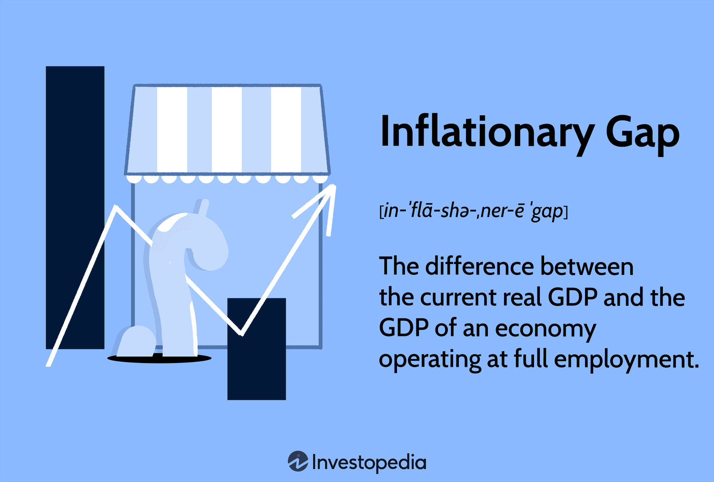

## Table of Contents

## What is an inflationary gap?

An inflationary gap happens when the demand for goods and services in an economy is higher than what the economy can produce at full employment. This means that people want to buy more than what businesses can make, even when everyone who wants a job has one. Because of this extra demand, prices start to go up, which leads to inflation.

To fix an inflationary gap, the government or central bank might use different tools. They could raise interest rates to make borrowing money more expensive, which would slow down spending. Or they might cut back on government spending or raise taxes to reduce the overall demand in the economy. The goal is to bring the demand back in line with what the economy can produce, so prices stop going up so fast.

## How does an inflationary gap occur?

An inflationary gap happens when people want to buy more stuff than the economy can make, even when everyone who wants a job has one. This extra demand comes from things like people earning more money, the government spending more, or even other countries buying more from us. When everyone is trying to buy more than what's available, businesses can't keep up with making enough products or providing enough services.

Because there's too much demand, businesses start to raise their prices. This is because they know people are willing to pay more to get what they want. As prices go up, we see inflation happening. This is why it's called an inflationary gap – the gap between what people want to buy and what the economy can actually produce leads to higher prices.

## What are the main causes of an inflationary gap?

An inflationary gap happens when people want to buy more things than what the economy can make. This extra demand can come from people [earning](/wiki/earning-announcement) more money. When people have more money, they spend more on stuff like cars, houses, and other things they want. The government can also cause an inflationary gap by spending a lot of money on things like building roads or helping people. When the government spends a lot, it puts more money into the economy, making people want to buy even more.

Another cause can be when other countries buy a lot from us. If other countries want our stuff, it can make demand go up a lot. Even things like low interest rates can cause an inflationary gap. When borrowing money is cheap, people and businesses take out loans to buy things or invest, which adds to the demand. All these things together can make people want to buy more than what businesses can make, causing prices to go up and leading to inflation.

## How is an inflationary gap different from a recessionary gap?

An inflationary gap and a recessionary gap are two different problems that can happen in an economy. An inflationary gap happens when people want to buy more stuff than what the economy can make, even when everyone who wants a job has one. This extra demand makes businesses raise their prices because they know people are willing to pay more to get what they want. As prices go up, we see inflation happening. The government or central bank might try to fix this by making borrowing money more expensive or by cutting back on their own spending to slow down the demand.

On the other hand, a recessionary gap happens when people aren't buying enough stuff, so businesses can't sell all that they make. This can happen when people lose their jobs or feel unsure about the future, so they spend less money. When businesses can't sell enough, they might have to lower their prices or even lay off workers, which can make the problem worse. To fix a recessionary gap, the government might try to help by spending more money or cutting taxes, so people have more money to spend and the demand goes up again.

## What are the economic effects of an inflationary gap?

When there's an inflationary gap, it means people want to buy more stuff than what the economy can make. This extra demand makes businesses raise their prices because they know people will pay more to get what they want. As prices go up, we see inflation happening. This can make life harder for people because their money doesn't go as far as it used to. If wages don't go up at the same time, people might struggle to buy the things they need. Also, if inflation gets too high, it can make the value of money go down, which can be bad for savings and investments.

The government and central bank might try to fix an inflationary gap by making borrowing money more expensive or by cutting back on their own spending. This can slow down the demand and help bring prices back down. But if they're not careful, they might slow down the economy too much, which could lead to a recession. It's a tricky balance because they need to cool down the economy without making it too cold. If they get it right, they can bring the demand back in line with what the economy can produce, so prices stop going up so fast.

## How can an inflationary gap be identified in an economy?

To spot an inflationary gap, you need to look at how much people want to buy compared to what the economy can make. If people are trying to buy more than what businesses can produce, even when everyone who wants a job has one, then there's an inflationary gap. Economists use something called the Gross Domestic Product (GDP) to measure this. They compare the actual GDP, which is what the economy is producing right now, to the potential GDP, which is what the economy could produce if it was working at full speed. If the actual GDP is higher than the potential GDP, that's a sign of an inflationary gap.

You can also look at other signs to see if there's an inflationary gap. One big sign is if prices are going up a lot. This happens because businesses raise their prices when there's too much demand for what they can make. Another thing to watch is if unemployment is very low. When almost everyone who wants a job has one, it means the economy is working at full capacity. If you see high inflation and very low unemployment at the same time, it's a good clue that there might be an inflationary gap.

## What are the common indicators used to measure an inflationary gap?

To figure out if there's an inflationary gap, economists look at how much stuff people want to buy compared to what the economy can make. They do this by comparing the actual Gross Domestic Product (GDP), which is what the economy is producing now, to the potential GDP, which is what it could produce if everything was working at full speed. If the actual GDP is higher than the potential GDP, that's a sign of an inflationary gap. It means people are trying to buy more than what businesses can make, even when everyone who wants a job has one.

Another way to spot an inflationary gap is by looking at prices. If prices are going up a lot, it's a big sign that there might be an inflationary gap. This happens because businesses raise their prices when there's too much demand for what they can produce. Also, if unemployment is very low, it can be another clue. When almost everyone who wants a job has one, it means the economy is working at full capacity. So, if you see high inflation and very low unemployment happening at the same time, it's a good hint that there might be an inflationary gap.

## What policies can governments and central banks use to address an inflationary gap?

Governments and central banks have different ways to deal with an inflationary gap. One way is by making borrowing money more expensive. They do this by raising interest rates. When it costs more to borrow money, people and businesses might borrow less and spend less, which can help slow down the demand. Another way is by cutting back on government spending. When the government spends less money, it takes less money out of the economy, which can also help slow down the demand. They might also raise taxes, which means people have less money to spend, helping to bring the demand back in line with what the economy can produce.

Sometimes, the central bank might use something called open market operations. This means they sell government bonds to take money out of the economy. When there's less money around, people can't spend as much, which helps to cool down the demand. The government can also use something called fiscal policy, which means they change how much they spend or how much they tax. By doing this, they can control how much money people have to spend, which can help fix an inflationary gap. The goal is always to bring the demand back to a level where it matches what the economy can make, so prices stop going up so fast.

## How effective are monetary policies in closing an inflationary gap?

Monetary policies can be pretty good at closing an inflationary gap. One way they do this is by raising interest rates. When borrowing money becomes more expensive, people and businesses might borrow less and spend less. This helps slow down the demand for stuff, which can bring it back in line with what the economy can make. Another way is through open market operations, where the central bank sells government bonds to take money out of the economy. When there's less money around, people can't spend as much, which helps to cool down the demand and stop prices from going up so fast.

However, monetary policies don't always work perfectly. Sometimes, raising interest rates can slow down the economy too much, which might lead to a recession if it's not done carefully. Also, if people expect prices to keep going up, they might keep spending even if borrowing gets more expensive. This means the central bank has to be careful and make sure they're not doing too much or too little. If they get it right, they can help close the inflationary gap without causing other problems, but it's a tricky balance to strike.

## What are the potential drawbacks of using fiscal policy to manage an inflationary gap?

Using fiscal policy to manage an inflationary gap can have some downsides. One big problem is that it can take a long time to see the effects of changes in government spending or taxes. For example, if the government decides to cut spending to slow down the economy, it might take months or even years for this to really make a difference. This delay can make it hard to fix the inflationary gap quickly, and by the time the changes start working, the economy might have already moved on to a different problem.

Another issue is that fiscal policy can be hard to reverse. If the government raises taxes or cuts spending to cool down the economy, it can be tough to put things back the way they were if the economy starts to slow down too much. People might get used to the new tax rates or lower government spending, and changing them back can cause a lot of upset. This can make it tricky for the government to respond flexibly to changing economic conditions, which is important for managing an inflationary gap effectively.

## How do different economic theories explain the persistence of an inflationary gap?

Some economic theories say that an inflationary gap can stick around because people start expecting prices to keep going up. When people think prices will rise, they might spend more money now to avoid paying more later. This extra spending keeps the demand high, which keeps the inflationary gap going. Also, if workers expect prices to go up, they might ask for higher wages. When businesses give them higher wages, they might raise their prices to cover the extra cost, which makes the inflation even worse. This cycle of expecting higher prices and then seeing them happen can make an inflationary gap last longer.

Other theories focus on how the economy works at full capacity. If the economy is already making as much stuff as it can, any extra demand will just push prices up instead of making more stuff. This can happen if businesses can't easily add more workers or machines to make more products. Also, if the government keeps spending a lot of money or if interest rates stay low, it can keep the demand high and the inflationary gap going. These theories suggest that to fix an inflationary gap, you need to find ways to either increase what the economy can produce or reduce the demand, which can be tough to do without causing other problems.

## What are the long-term implications of failing to address an inflationary gap?

If an inflationary gap isn't fixed, it can cause big problems over time. Prices keep going up because people want to buy more than what businesses can make. This means that money doesn't go as far as it used to, making it harder for people to afford things they need. If wages don't go up at the same time, people might struggle even more. Also, if inflation keeps getting worse, it can make the value of money go down. This is bad for savings because the money people put away loses its value. It can also hurt investments because the returns might not keep up with the rising prices.

In the long run, not dealing with an inflationary gap can mess up the whole economy. If prices keep going up a lot, people might start expecting that to happen all the time. This can make them spend more money now to avoid paying more later, which keeps the demand high and the inflationary gap going. It can also lead to a cycle where workers ask for higher wages to keep up with the rising prices, and businesses raise their prices to cover the higher wages, making the inflation even worse. If the government or central bank doesn't step in to fix the problem, it can lead to a situation where the economy is always trying to catch up, which can be really hard to fix once it gets out of control.

## What is the Inflationary Gap and How Can We Understand It?

An inflationary gap emerges when the current real GDP surpasses the GDP level that would be realized if an economy were functioning at full employment. This situation transpires when aggregate demand (AD) outpaces aggregate supply (AS) at the potential output, leading to upward pressure on prices and, consequently, inflation. The aggregate demand curve may shift to the right due to various factors such as increased consumer confidence, booming export demands, or government interventions aimed at stimulating the economy.

The aggregate demand and supply framework is pivotal in understanding the underpinnings and repercussions of an inflationary gap. Aggregate demand (AD) is composed of consumer spending, investment by businesses, government expenditure, and net exports. An increase in any of these components, without a corresponding increase in aggregate supply, can shift the AD curve to the right, fostering an inflationary environment. Mathematically, the equilibrium GDP can be illustrated by the equation:

$$
Y = C + I + G + (X - M)
$$

where:
- $Y$ is the national income or GDP,
- $C$ stands for consumer expenditure,
- $I$ denotes investment spending,
- $G$ is government spending,
- $X$ represents exports,
- $M$ signifies imports.

An inflationary gap indicates that the equilibrium point of aggregate demand and aggregate supply occurs at a higher GDP than the full employment level GDP, causing overheating in the economy. This overheating results in increased competition for resources, driving up wages and production costs, which in turn, contributes to a wage-price spiral that further entrenches inflation.

Several key factors can precipitate an inflationary gap. Excessive consumer spending, often fueled by low interest rates or a surge in disposable income, can increase aggregate demand beyond sustainable levels. Furthermore, expansionary fiscal policies, such as tax cuts or increased government spending, can also drive demand excessively, widening the inflationary gap. Likewise, accommodating monetary policies that lower interest rates make borrowing cheaper, thus encouraging both consumer and business spending, which can again push real GDP past its potential limits.

To conceptualize these dynamics, a Python simulation could model the shifts in aggregate demand and supply curves, analyzing how different fiscal and monetary scenarios affect the GDP equilibrium and price levels. This understanding of the inflationary gap underscores its significance within macroeconomic planning, particularly in crafting policies that strive to attain balance between stimulating growth and curtailing inflation.

## References & Further Reading

[1]: Keynes, J. M. (1936). ["The General Theory of Employment, Interest, and Money"](https://link.springer.com/book/10.1007/978-3-319-70344-2). Macmillan.

[2]: Samuelson, P. A., & Nordhaus, W. D. (2009). ["Economics,"](https://archive.org/details/economics0000samu). McGraw-Hill Education.

[3]: Mishkin, F. S. (2015). ["The Economics of Money, Banking, and Financial Markets."](https://www.pearsonhighered.com/assets/preface/0/1/3/4/0134855388.pdf) Pearson.

[4]: Fama, E. F. (1970). ["Efficient Capital Markets: A Review of Theory and Empirical Work."](https://www.jstor.org/stable/2325486) The Journal of Finance, 25(2), 383-417.

[5]: Hull, J. C. (2018). ["Risk Management and Financial Institutions."](https://books.google.com/books/about/Risk_Management_and_Financial_Institutio.html?id=1J1QDwAAQBAJ) Wiley.

[6]: Sloman, J., Garratt, D., & Guest, J. (2018). ["Economics,"](https://research.aston.ac.uk/en/publications/economics-for-business) Pearson Education Limited.

[7]: Hull, J. (2017). ["Options, Futures, and Other Derivatives."](https://books.google.com/books/about/Options_Futures_and_Other_Derivatives_eB.html?id=2iopDwAAQBAJ) Pearson.