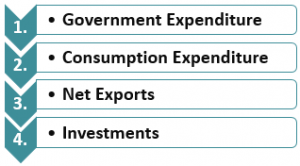

The interplay between psychology and economics is critical in understanding how inflation affects consumer behavior and economic dynamics. Inflation, the rate at which the general level of prices for goods and services rises, subsequently erodes purchasing power. This economic phenomenon is not solely driven by empirical data and fiscal policies but is significantly influenced by psychological elements, such as consumer expectations and emotional responses. Inflationary psychology, a term denoting how individuals' and businesses' anticipations of inflation affect their financial decisions, plays a vital role in shaping economic behavior.

Inflationary psychology can create a self-fulfilling prophecy. When consumers expect prices to rise, they are more likely to make purchases sooner rather than later, thereby driving up demand and, consequentially, prices. Such behavior inherently relies on economic theories of rational and adaptive expectations, where individuals form future inflation expectations based on past experiences and available information. However, psychological biases often lead to deviations from these theories, affecting consumers' expectations and actions.



In parallel, algorithmic trading, a method that employs complex algorithms to execute trades at high speed and volume, has become increasingly relevant in understanding market behaviors during inflation. Algorithmic trading can respond to both economic indicators and psychological triggers. These automated systems are designed to detect patterns and react to shifts in sentiment that may signal inflationary trends. The rapid decision-making capability of algorithmic trading systems can either stabilize or destabilize markets during inflationary periods, depending on their programming and the data they utilize.

The interface of behavioral economics and psychological influences is enriched by cognitive biases and emotions that affect economic decision-making. Behavioral economics highlights how these biases, such as loss aversion or the anchor effect, skew rational thought, leading to decisions that might exacerbate inflation. Emotional aspects, including feelings of fear or optimism, significantly impact consumer and investor confidence, influencing both spending and saving behaviors.

This discussion sets the stage for a detailed examination of how cognitive biases and emotional factors contribute to economic decision-making, particularly in the context of inflation. Understanding these dynamics is pivotal for policymakers and economists as they devise strategies to manage and stabilize inflation expectations within an economy predominantly shaped by human behavior and technological advancements.

## Table of Contents

## Understanding Inflationary Psychology

Inflationary psychology refers to the mindset and behavioral patterns of consumers and businesses in response to the anticipation or experience of rising prices. This concept shapes economic behavior significantly, influencing spending, saving, and investment decisions, which in turn affect the broader economic landscape. Inflationary psychology becomes crucial as it relates to the expectations that individuals and firms form about future inflation rates. These expectations can drive actual economic outcomes, making understanding them essential for both policymakers and economists.

The significance of inflationary psychology lies in its potential to become a self-fulfilling prophecy. This occurs when consumers expect prices to rise and, consequently, increase their current purchases to avoid paying higher prices later. Such behavior boosts demand, putting upward pressure on prices and contributing to the very inflation consumers feared, thereby validating their expectations. This cycle highlights the pivotal role of expectations in economic theory and practice.

Several economic theories address inflationary psychology, notably rational expectations, adaptive expectations, and behavioral biases. The rational expectations theory posits that individuals and firms make forecasts about future economic conditions using all available information and a model of the economy's structure [Muth, J. F. (1961). Rational expectations and the theory of price movements. Econometrica]. In the context of inflation, this would mean that people form expectations based on all known economic indicators and trends.

In contrast, adaptive expectations theory suggests that people form their expectations about future inflation based on past experiences and gradually adjust these expectations as they encounter new information. This can often lead to lagged responses to new economic data because expectations are anchored on historical price trends rather than current or predicted future trends.

Behavioral economics adds another layer to understanding inflationary psychology by introducing the concept of biases that might skew rational decision-making. Cognitive biases such as anchoring—the tendency to rely heavily on the first piece of information encountered (the "anchor")—can significantly influence inflation expectations. For instance, if consumers anchor their inflation expectations to past hyperinflation experiences, they may overestimate future inflation, regardless of current indicators suggesting stabilization.

Furthermore, the availability heuristic, which involves relying on immediate examples that come to mind when evaluating a topic, can also play a role. If people often hear news about rising inflation, they might anticipate inflation to continue rising, even if the actual economic indicators suggest otherwise.

In summary, understanding inflationary psychology involves examining the expectations and behaviors of consumers and firms in response to inflation. It incorporates rational and adaptive expectations complemented by insights into cognitive and behavioral biases. Together, these theories provide a comprehensive framework for assessing how inflationary psychology can influence economic outcomes and potentially create self-reinforcing cycles of inflation.

## The Psychological Impact of Inflation

Inflation plays a critical role in shaping economic landscapes and significantly influences psychological behaviors and decision-making processes. An understanding of cognitive biases such as anchoring and availability heuristic is essential in grasping how individuals and markets form inflation expectations.

Anchoring, a cognitive bias, refers to the human tendency to rely heavily on the first piece of information encountered (the anchor) when making decisions. During inflationary periods, individuals may anchor their expectations on recent data points, such as a previous month’s inflation rate, without fully accounting for dynamic economic factors. This bias can lead to sticky inflation expectations, where changes in actual inflation rates are slow to alter the anchor. For instance, if consumers are anchored to an inflation expectation of 5%, even a new report indicating a decrease may not quickly change their expectations, thereby affecting their consumption and savings behavior.

The availability heuristic is another cognitive bias that affects inflation expectations. This heuristic involves judging the probability of an event based on how easily examples come to mind. During times of rising inflation, frequent coverage and anecdotal reports of price hikes can increase the perceived likelihood of continued inflation, irrespective of data suggesting otherwise. Historical case studies exemplify this phenomenon; for example, the hyperinflation in Zimbabwe during the late 2000s led to exaggerated perceptions of inflation among consumers and businesses, driven by widespread media narratives and personal stories.

Emotions also play a pivotal role in economic decisions and inflationary expectations. Fear and trust are particularly influential. Fear of further inflation can lead to pre-emptive buying, stockpiling, or currency hoarding, behaviors that exacerbate inflation by increasing demand and reducing [liquidity](/wiki/liquidity-risk-premium). Conversely, a lack of trust in financial institutions or government entities responsible for managing the economy can undermine confidence and stabilize inflationary expectations. Emotional responses can thus compound traditional economic factors, leading to a more volatile economic environment.

Understanding these psychological dimensions is crucial for economists and policymakers. By recognizing the impact of cognitive biases and emotions, there can be better anticipation and management of economic behaviors in response to inflation. This insight is not only critical for formulating effective monetary policies but also for designing communication strategies that address public perceptions and stabilize economic expectations.

## Economic Behavior in Response to Inflation

Social norms and herding behavior significantly influence consumer activities during inflationary periods. Social norms dictate acceptable economic behaviors, shaping individuals' spending, saving, and investment decisions. Herding behavior, where individuals mimic the actions of a larger group, often exacerbates economic [volatility](/wiki/volatility-trading-strategies) during inflation. This phenomenon occurs because people assume the collective wisdom of the group outweighs personal judgment, leading to widespread shifts in consumption and investment patterns that can intensify inflationary pressures.

Social factors, including cultural attitudes toward money, perceived economic stability, and trust in financial institutions, affect how inflation expectations are formed. For instance, in cultures with strong saving norms, people might reduce consumption and increase savings in anticipation of price increases, further affecting demand and inflation dynamics. Conversely, in cultures where consumption is prioritized, spending may remain robust despite rising prices, potentially exacerbating inflation.

Media narratives also play a critical role in shaping public perception of inflation. Media coverage can amplify or mitigate inflationary expectations by influencing how individuals interpret economic indicators and policy announcements. Sensationalist reporting can lead to panic buying and stockpiling, as consumers rush to purchase goods before prices rise further. Conversely, media focused on stabilizing messages can help anchor expectations, reducing the likelihood of irrational economic behavior.

Policy measures and economic strategies can mitigate these behavioral effects. Central banks often use forward guidance to manage expectations, communicating future policy intentions to stabilize inflation expectations. Transparent and consistent messaging can prevent panic and reassure markets, reducing the influence of herding behavior. Additionally, implementing educational programs that enhance financial literacy can help individuals make informed decisions, reducing reliance on social cues and media narratives.

Governments may also engage in direct interventions to stabilize markets, such as price controls or subsidies, although these measures can have mixed results. It's crucial to strike a balance between mitigating immediate inflationary impacts and allowing market mechanisms to function properly. Policies focusing on structural reforms, such as improving supply chains or enhancing productivity, can address underlying inflation drivers.

Overall, understanding the impact of social norms and herding behavior on economic behavior during inflationary periods is critical for developing effective policy measures. By addressing these behavioral factors, policymakers can mitigate excessive market volatility and stabilize inflation expectations, ultimately maintaining economic stability.

## Algorithmic Trading and Inflationary Markets

Algorithmic trading has emerged as a significant force in financial markets, leveraging sophisticated algorithms to execute trades at speeds and efficiencies unattainable by human traders. During periods of inflation, the dynamics of [algorithmic trading](/wiki/algorithmic-trading) can considerably impact market behavior, influencing liquidity, volatility, and price discovery mechanisms.

Algorithmic trading systems are designed to respond intelligently to market stimuli using pre-determined rules and data-driven insights. Typically, these algorithms analyze vast datasets to identify trading opportunities, executing trades based on criteria such as price, timing, and [volume](/wiki/volume-trading-strategy). In inflationary environments, these algorithms must consider additional complexities, as inflation can lead to rapid shifts in economic expectations and market sentiment.

One critical aspect is how these automated systems interpret inflation signals. Inflation impacts various economic variables, including interest rates, currency values, and corporate earnings, all of which can trigger significant algorithmic activity. For instance, a sudden increase in inflation expectations may lead algorithms to adjust [interest rate](/wiki/interest-rate-trading-strategies) futures positions, influencing yield curves and compressing spreads. The speed and volume of such trades can amplify market movements, potentially leading to increased volatility.

Psychological biases, such as anchoring or herd behavior, can also manifest within algorithmic trading. Although algorithms are devoid of human emotions, they can inadvertently perpetuate market biases if their design incorporates historical data reflecting such biases. For example, an algorithmic strategy anchored to historical inflation trends may misjudge the market's current direction if those trends are no longer applicable due to structural changes in the economy.

Furthermore, algorithmic trading presents both opportunities and risks in managing inflationary pressures. One potential benefit is the enhancement of market liquidity. By facilitating rapid execution and tighter spreads, algorithmic trading can ensure that markets remain efficient, even during volatile inflationary periods. This increased liquidity can aid in stabilizing markets by allowing for smoother adjustments to new economic information.

However, there are also inherent risks. High-frequency trading and other algorithmic strategies can exacerbate market volatility if not properly managed. During times of economic uncertainty, rapid algorithmic responses to inflation news can lead to abrupt market corrections, potentially destabilizing sectors or entire markets. Moreover, reliance on algorithmic trading can sometimes result in systemic issues, such as "flash crashes," which occur when algorithms react to market anomalies in unforeseen ways.

To mitigate these risks, algorithm developers are increasingly incorporating more sophisticated predictive analytics and [machine learning](/wiki/machine-learning) techniques into their models. By learning from vast datasets and adapting to changing market conditions, these advanced algorithms aim to improve their forecasting abilities and reduce susceptibility to inflation-induced shocks.

In conclusion, while algorithmic trading introduces efficiencies and liquidity to markets during inflationary periods, it also requires careful management to prevent unintended consequences. Understanding the interaction between algorithms and economic signals is crucial for investors and policymakers aiming to harness the benefits of automated trading in inflationary markets.

## Strategies for Improving Inflation Forecasting

Cognitive biases significantly affect the accuracy of inflation forecasting. Biases such as overconfidence, anchoring, and confirmation bias can lead to systematic errors in predicting future inflation trends. For forecasters, overconfidence might manifest as unjustified certainty in their predictions, potentially dismissing external variables or novel information that could alter inflation trajectories. Similarly, anchoring may cause forecasters to rely too heavily on initial predictions, even when new, relevant data emerges.

To mitigate these biases, integrating behavioral insights into economic models is crucial. Behavioral economics provides frameworks that account for irrational and predictable patterns in human behavior, which traditional economic models might overlook. For instance, adapting models to consider how consumer sentiment affects spending patterns during inflationary periods can yield more robust forecasts.

Incorporating real-time data into economic models is another strategy to improve forecasting accuracy. The dynamic nature of economies means that static models can quickly become outdated. By continuously updating models with the latest data, forecasters can validate assumptions and adjust predictions accordingly. This real-time data analysis can be facilitated by advanced computational techniques and machine learning algorithms that can process vast amounts of information efficiently.

Consider a simple Python example that uses historical and real-time data to update inflation forecasts:

```python
import pandas as pd
from sklearn.linear_model import LinearRegression
from sklearn.model_selection import train_test_split

# Load historical data
historical_data = pd.read_csv('historical_inflation_data.csv')
real_time_data = pd.read_csv('real_time_inflation_data.csv')

# Prepare data
X = historical_data.drop('inflation_rate', axis=1)
y = historical_data['inflation_rate']

# Split data into training and testing sets
X_train, X_test, y_train, y_test = train_test_split(X, y, test_size=0.2, random_state=42)

# Initialize and train the model
model = LinearRegression()
model.fit(X_train, y_train)

# Update the model with real-time data
X_real_time = real_time_data.drop('inflation_rate', axis=1)
y_real_time = real_time_data['inflation_rate']
model.fit(X_real_time, y_real_time)

# Predict future inflation
future_inflation = model.predict(X_test)

# Output updated forecast
print(f"Updated Inflation Forecast: {future_inflation}")
```

This example demonstrates how continuous model updates, integrating current data, can potentially refine inflation predictions. The goal is to enhance forecast precision by aligning economic models with the non-linear and often unpredictable realities of behavioral economic actions.

Policymakers need to leverage these improved forecasting strategies to craft timely and effective economic policies. By understanding how cognitive biases influence predictions and adapting models to accommodate real-time insights, policymakers can better anticipate economic challenges and respond more flexibly to the evolving economic landscape.

## Conclusion

The psychological aspects of inflationary behaviors significantly shape the economic landscape. Inflationary psychology, characterized by consumer expectations of rising prices, can become a self-fulfilling prophecy. When individuals anticipate inflation, they often increase spending to avoid future price increases, consequently driving up demand and contributing to actual inflation. This interplay underscores the critical role of cognitive biases, such as anchoring and availability heuristic, in forming those inflation expectations. Anchoring refers to the human tendency to rely on the first piece of information encountered (the "anchor") when making decisions, which can skew perceptions of inflation rates. Similarly, availability heuristic—a cognitive shortcut that relies on immediate examples that come to mind—can lead to overemphasis on recent or memorable economic events when predicting inflation.

Emotions also play an essential role. Fear and trust influence economic decisions, as heightened fear of inflation can accelerate spending and destabilize markets, while trust in economic policies can moderate such reactions. Addressing these psychological dimensions is crucial for policymakers aiming to manage inflation expectations effectively.

The intersection of psychology, economic behavior, and technology presents both challenges and opportunities for understanding and addressing inflation. Algorithmic trading is an example of technological advancements impacting market dynamics during inflationary periods. While it can enhance market efficiency by quickly processing and reacting to inflation signals, it can also amplify volatility if those algorithms are influenced by psychological biases embedded in the data.

For policymakers and economists, leveraging psychological insights offers a path to stabilizing inflationary expectations. This could involve crafting communication strategies that address cognitive biases directly, fostering public trust through transparent and consistent policy actions, and employing behavioral economics in policy design. Further, integrating behavioral insights into economic models can enhance the accuracy of inflation forecasts, assisting in the creation of more effective economic strategies. By acknowledging and addressing the psychological elements at play, policymakers can better navigate the complexities of inflation and contribute to a more stable economic environment.

## References

Here is a curated list of literature and studies addressing inflationary psychology, economic behavior, and algorithmic trading:

1. **Akerlof, G. A., & Shiller, R. J. (2010). "Animal Spirits: How Human Psychology Drives the Economy, and Why It Matters for Global Capitalism." Princeton University Press.**
   - This book explores the influence of psychological factors on economic dynamics, including the concepts of confidence and narratives that play a crucial role in inflationary psychology.

2. **Kahneman, D., & Tversky, A. (1974). "Judgment under Uncertainty: Heuristics and Biases." Science, 185(4157), 1124-1131.**
   - The foundational study on cognitive biases, discussing heuristics such as anchoring and availability that impact inflation expectations and economic decision-making.

3. **Tirole, J. (1982). "On the Possibility of Speculation under Rational Expectations." Econometrica, 50(5), 1163-1181.**
   - This paper examines the role of rational and adaptive expectations in economic behavior, providing insights into how these theories relate to inflationary psychology.

4. **Wärneryd, K. E. (1999). "The Psychology of Saving: A Study on Economic Psychology." Edward Elgar Publishing.**
   - Offers a psychological perspective on consumer saving behaviors, which are significantly influenced by inflationary expectations and economic uncertainties.

5. **Lo, A. W. (2004). "The Adaptive Markets Hypothesis: Market Efficiency from an Evolutionary Perspective." Journal of Portfolio Management, 30(5), 15-29.**
   - Discusses the impact of adaptive expectations in financial markets and the role of psychological adaptability in response to inflationary pressures.

6. **Choe, H., Kho, B.-C., & Stulz, R. M. (1999). "Do Foreign Investors Destabilize Stock Markets? The Korean Experience in 1997." Journal of Financial Economics, 54(2), 227-264.**
   - Analyzes the effects of herding behavior and social norms in financial markets during periods of economic stress, including inflationary times.

7. **Bartels, L. M. (2008). "Unequal Democracy: The Political Economy of the New Gilded Age." Princeton University Press.**
   - Explores the psychological and economic impacts of policy decisions, highlighting how public perceptions of inflation can influence electoral behavior and economic policy.

8. **Bishop, C. M. (2006). "Pattern Recognition and Machine Learning." Springer.**
   - Provides insights into algorithmic trading, with methodologies applicable to understanding market dynamics and psychological influences during inflationary periods.

9. **Fama, E. F. (1965). "The Behavior of Stock-Market Prices." Journal of Business, 38(1), 34-105.**
   - A classic study in the field of financial economics, examining market behaviors that are relevant for understanding algorithmic responses to economic signals, including inflation.

10. **Thaler, R. H., & Sunstein, C. R. (2008). "Nudge: Improving Decisions about Health, Wealth, and Happiness." Yale University Press.**
    - Discusses behavioral economics and the use of nudges to counteract cognitive biases, relevant for policymakers dealing with inflationary expectations.

This list provides a foundational understanding and various perspectives on how psychological factors, economic behaviors, and advanced trading technologies interplay, impacting inflation and market dynamics.

## References & Further Reading

[1]: Barberis, N., & Thaler, R. (2003). ["A Survey of Behavioral Finance."](https://www.nber.org/papers/w9222) Handbook of the Economics of Finance, Vol. 1, Part 2, 1053-1128.

[2]: Kahneman, D., & Tversky, A. (1979). ["Prospect Theory: An Analysis of Decision under Risk."](https://www.jstor.org/stable/1914185) Econometrica, 47(2), 263-291.

[3]: Shiller, R. J. (2000). ["Irrational Exuberance."](https://press.princeton.edu/books/paperback/9780691173122/irrational-exuberance) Princeton University Press.

[4]: Muth, J. F. (1961). ["Rational Expectations and the Theory of Price Movements."](https://extranet.parisschoolofeconomics.eu/docs/guesnerie-roger/muth61.pdf) Econometrica, 29(3), 315-335.

[5]: Lo, A. W. (2004). ["The Adaptive Markets Hypothesis: Market Efficiency from an Evolutionary Perspective."](https://papers.ssrn.com/sol3/papers.cfm?abstract_id=602222) Journal of Portfolio Management, 30(5), 15-29.

[6]: Thaler, R. H., & Sunstein, C. R. (2008). ["Nudge: Improving Decisions about Health, Wealth, and Happiness."](https://www.researchgate.net/publication/257178709_Nudge_Improving_Decisions_About_Health_Wealth_and_Happiness_RH_Thaler_CR_Sunstein_Yale_University_Press_New_Haven_2008_293_pp) Yale University Press.

[7]: Akerlof, G. A., & Shiller, R. J. (2009). ["Animal Spirits: How Human Psychology Drives the Economy, and Why It Matters for Global Capitalism."](https://psycnet.apa.org/record/2009-01285-000) Princeton University Press.

[8]: Fama, E. F. (1965). ["The Behavior of Stock-Market Prices."](https://extranet.parisschoolofeconomics.eu/docs/ferriere-nathalie/fama1965.pdf) Journal of Business, 38(1), 34-105.