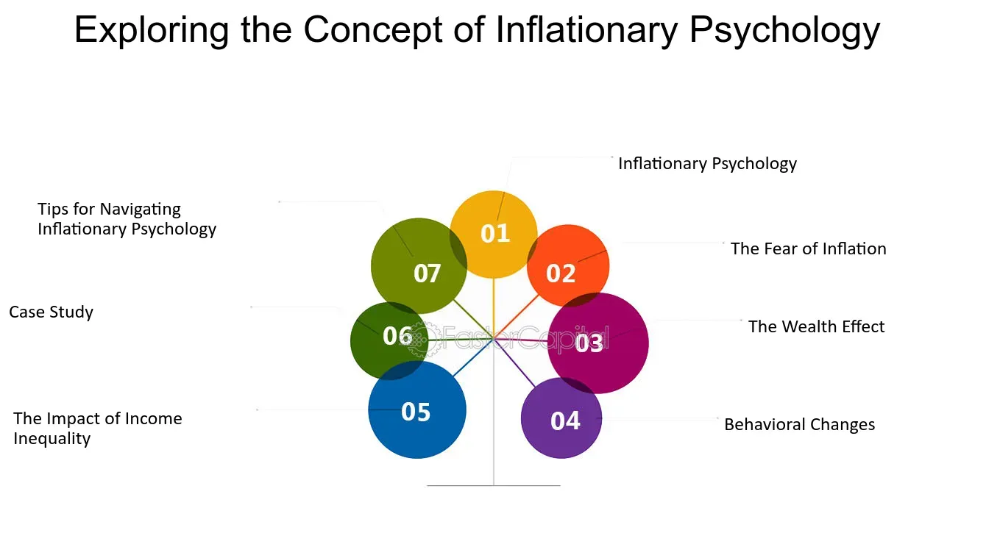

## Table of Contents

## What is inflationary psychology?

Inflationary psychology is when people start to think that prices will keep going up. Because of this, they might start buying things now instead of waiting, thinking that things will be more expensive later. This behavior can actually make inflation worse. When everyone starts buying more, it can increase demand, which can push prices up even more.

This kind of thinking can become a cycle. If people see prices going up, they might expect them to keep rising. So, they buy more, which makes prices go up even more. This cycle can be hard to stop once it starts. Governments and central banks often try to manage this by controlling interest rates and using other tools to keep inflation in check.

## How does inflationary psychology differ from actual inflation?

Inflationary psychology is when people believe that prices will keep going up in the future. This belief makes them want to buy things right away, instead of waiting. They think that if they wait, they will have to pay more later. This behavior can push prices up even more because when a lot of people start buying, it increases the demand for things.

Actual inflation, on the other hand, is when the prices of goods and services actually go up over time. It's measured by looking at the average price changes of a basket of goods and services. Inflation can happen for many reasons, like when there's too much money chasing too few goods, or when costs for businesses go up. While inflationary psychology can make inflation worse, actual inflation is the real increase in prices that people experience.

## What are the common causes of inflationary psychology?

Inflationary psychology often starts when people see prices going up a lot. They might hear about inflation in the news or see it in their daily lives, like when the price of gas or food goes up. When this happens, people start to think that prices will keep going up. This makes them want to buy things now instead of waiting, because they think it will be more expensive later.

Another cause of inflationary psychology can be when people hear others talking about inflation. If friends, family, or people on social media keep saying that prices are going up, it can make others believe it too. This belief can spread quickly and make more people want to buy things right away. When a lot of people start doing this, it can actually make prices go up even more, which feeds into the cycle of inflationary psychology.

## Can you provide historical examples of inflationary psychology?

One famous example of inflationary psychology happened in Germany in the 1920s. After World War I, Germany had a lot of debt and printed more money to pay it off. This made prices go up a lot, and people saw this happening. They started to think that prices would keep going up, so they rushed to buy things. This made prices go up even more, and it turned into a big problem called hyperinflation. People were carrying wheelbarrows full of money just to buy a loaf of bread.

Another example is from the United States in the 1970s. During this time, oil prices went up a lot because of problems in the Middle East. This made the cost of everything go up, and people started to think that prices would keep rising. They began buying things right away, which made inflation even worse. The government and the Federal Reserve had to work hard to control this by raising interest rates and using other ways to slow down the economy and bring inflation down.

## How does inflationary psychology affect consumer behavior?

When people start thinking that prices will keep going up, it changes how they act. They might rush to buy things right away instead of waiting. They think if they wait, they'll have to pay more later. This can make them buy more than they need right now. For example, they might fill up their gas tank even if it's not empty, or buy extra food to stock up.

This behavior can make inflation worse. When a lot of people start buying more, it can push prices up even more. This can start a cycle where people see prices going up, so they buy more, which makes prices go up even more. It can be hard to stop this cycle once it starts. Governments and central banks often try to manage this by changing interest rates or using other tools to calm things down.

## What role does media play in shaping inflationary psychology?

The media plays a big role in shaping how people think about inflation. When the media talks a lot about prices going up, it can make people worry that prices will keep rising. This can make them want to buy things right away instead of waiting. If the news is full of stories about inflation, it can spread the idea that prices will keep going up, which can make more people start buying things.

This can start a cycle where people see prices going up, and then the media talks about it even more. This makes people think that prices will keep going up, so they buy more, which can make prices go up even more. The media can make this problem worse by focusing a lot on inflation and making it seem like a bigger problem than it might be. This can make people feel like they need to act quickly, which can feed into inflationary psychology.

## How can inflationary psychology influence economic policy?

When people start thinking that prices will keep going up, it can make them buy things right away. This can make inflation worse. Governments and central banks watch this closely because they need to decide what to do about it. If they see that people are buying a lot because they think prices will go up, they might change their economic policies to try to calm things down. They might raise interest rates to make borrowing money more expensive, which can slow down how much people spend and help control inflation.

The way people think about inflation can also affect how the government talks about the economy. If everyone is worried about prices going up, the government might talk more about what they are doing to stop inflation. They might use the media to tell people that they are working on it and to try to calm people down. This can help change how people think and act, which can make a big difference in how well their economic policies work.

## What are the potential impacts of inflationary psychology on the stock market?

Inflationary psychology can make the stock market go up and down a lot. When people think prices will keep going up, they might start buying more things right away. This can make companies sell more stuff, which can make their stock prices go up. Investors might see this and think it's a good time to buy stocks, hoping to make money as prices keep going up. But if too many people start buying stocks because they think prices will keep rising, it can make the stock market grow too fast and become a bubble.

On the other hand, if people start worrying a lot about inflation, it can make them scared. They might start selling their stocks because they think the economy will get worse. This can make stock prices go down. If a lot of people start selling at the same time, it can cause a big drop in the stock market. So, how people think about inflation can make the stock market move in big ways, either going up a lot or going down a lot.

## How do central banks respond to inflationary psychology?

Central banks watch how people think about inflation very closely. When they see that people are buying a lot of things because they think prices will keep going up, central banks might raise interest rates. This makes it more expensive for people to borrow money. When borrowing money costs more, people might spend less, which can help slow down inflation. Central banks do this to try to stop the cycle where people buy more because they think prices will go up, which makes prices go up even more.

Central banks also use other tools to manage how people think about inflation. They might talk to the public and the media to explain what they are doing to control inflation. By telling people that they are working on it, central banks hope to calm people down and make them less worried about prices going up. This can help change how people think and act, which can make a big difference in controlling inflation.

## What are the long-term effects of sustained inflationary psychology on an economy?

If people keep thinking that prices will go up all the time, it can cause big problems for the economy. When everyone believes prices will keep rising, they might keep buying things right away instead of saving money. This can make inflation even worse because when a lot of people buy stuff, it can push prices up even more. Over time, this can lead to a cycle where prices keep going up and up, which can be hard to stop. It can also make people lose trust in their money because it doesn't buy as much as it used to.

In the long run, this kind of thinking can hurt the economy in other ways too. If prices keep going up, it can make it hard for businesses to plan for the future. They might not know how much to charge for their products or how much to pay their workers. This can slow down the economy because businesses might not want to invest in new things if they're not sure about prices. Also, if people keep spending all their money because they think prices will go up, they might not save enough for the future. This can make the whole economy less stable over time.

## How can businesses adapt to the challenges posed by inflationary psychology?

When people think prices will keep going up, businesses need to be smart about how they handle it. They can start by watching their prices closely. If they see that people are buying a lot because they think prices will go up, businesses might need to raise their prices a little bit. But they have to be careful not to raise them too much, or people might stop buying. Businesses can also try to find ways to make their products cheaper to make, so they don't have to raise prices as much. This can help them keep selling even when people are worried about inflation.

Another way businesses can adapt is by talking to their customers. They can explain why prices might go up and let people know that they are trying to keep costs down. This can help calm people down and make them feel better about buying things. Businesses can also look at how they sell their products. They might offer deals or discounts to get people to buy now, instead of waiting. By doing these things, businesses can keep selling their products even when people are worried about prices going up.

## What are the latest research findings on the psychological aspects of inflation?

Recent research on the psychological aspects of inflation shows that how people think about inflation can really affect what they do. Studies have found that when people hear a lot about inflation in the news or from friends, they start to think prices will keep going up. This makes them want to buy things right away instead of waiting. They think if they wait, they'll have to pay more later. This behavior can actually make inflation worse because when a lot of people start buying, it can push prices up even more. Researchers call this "inflationary psychology," and it can start a cycle where people see prices going up, so they buy more, which makes prices go up even more.

Another important finding is that people's trust in the economy and the government can change how they react to inflation. If people trust that the government and central banks are working to control inflation, they might not worry as much and might not rush to buy things. But if they don't trust the government, they might get more worried and start buying more right away. This shows that how the government talks about inflation and what they do to control it can make a big difference in how people think and act. Understanding these psychological aspects can help policymakers and businesses find better ways to manage inflation and keep the economy stable.

## References & Further Reading

[1]: Barberis, N., & Thaler, R. (2003). ["A Survey of Behavioral Finance."](https://www.nber.org/papers/w9222) Handbook of the Economics of Finance, Vol. 1, Part 2, 1053-1128.

[2]: Kahneman, D., & Tversky, A. (1979). ["Prospect Theory: An Analysis of Decision under Risk."](https://www.jstor.org/stable/1914185) Econometrica, 47(2), 263-291.

[3]: Shiller, R. J. (2000). ["Irrational Exuberance."](https://press.princeton.edu/books/paperback/9780691173122/irrational-exuberance) Princeton University Press.

[4]: Muth, J. F. (1961). ["Rational Expectations and the Theory of Price Movements."](https://extranet.parisschoolofeconomics.eu/docs/guesnerie-roger/muth61.pdf) Econometrica, 29(3), 315-335.

[5]: Lo, A. W. (2004). ["The Adaptive Markets Hypothesis: Market Efficiency from an Evolutionary Perspective."](https://papers.ssrn.com/sol3/papers.cfm?abstract_id=602222) Journal of Portfolio Management, 30(5), 15-29.

[6]: Thaler, R. H., & Sunstein, C. R. (2008). ["Nudge: Improving Decisions about Health, Wealth, and Happiness."](https://www.researchgate.net/publication/257178709_Nudge_Improving_Decisions_About_Health_Wealth_and_Happiness_RH_Thaler_CR_Sunstein_Yale_University_Press_New_Haven_2008_293_pp) Yale University Press.

[7]: Akerlof, G. A., & Shiller, R. J. (2009). ["Animal Spirits: How Human Psychology Drives the Economy, and Why It Matters for Global Capitalism."](https://psycnet.apa.org/record/2009-01285-000) Princeton University Press.

[8]: Fama, E. F. (1965). ["The Behavior of Stock-Market Prices."](https://extranet.parisschoolofeconomics.eu/docs/ferriere-nathalie/fama1965.pdf) Journal of Business, 38(1), 34-105.