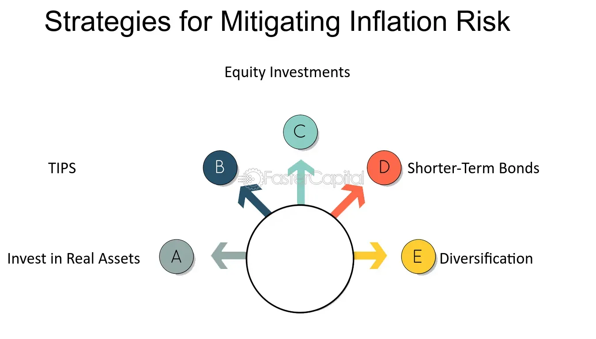

## Table of Contents

## What is inflationary risk?

Inflationary risk is the chance that the value of money will go down because prices for things like food, gas, and clothes go up. This means that over time, the same amount of money will buy less stuff. For example, if you have $100 now, and prices go up, that $100 might only buy what $90 buys today. This can be a problem for people saving money because their savings won't be worth as much in the future.

Inflationary risk affects everyone, but it can be especially tough on people living on a fixed income, like retirees. If their income doesn't go up with inflation, they might find it hard to pay for the same things they used to. Businesses also have to deal with inflationary risk because it can make their costs go up, which might mean they have to raise prices or find ways to cut costs. Governments and central banks try to manage inflation to keep it from getting too high, but it's a tricky balance to maintain.

## How does inflation affect everyday life?

Inflation changes how much things cost every day. When prices go up, the money in your pocket doesn't go as far. For example, if a loaf of bread used to cost $2 and now it costs $2.50, you need more money to buy the same amount of bread. This means you might have to spend more on groceries, gas, and other things you need, which can make it harder to save money or buy things you want.

Inflation can also affect big decisions like buying a house or a car. If prices are going up, you might want to buy these things sooner rather than later because they could cost more in the future. But if you're saving for these big purchases, inflation can make it harder to reach your savings goals because your money isn't worth as much over time. This can lead to stress and the need to adjust your budget and spending habits.

## What are the common causes of inflation?

Inflation can happen for many reasons. One big reason is when there's too much money chasing too few goods. This can happen when the government prints more money or when people have more money to spend because of low interest rates or tax cuts. When everyone has more money, they want to buy more things, but if there aren't enough things to buy, prices go up.

Another reason for inflation is when the cost of making things goes up. This can happen because of higher wages, more expensive raw materials, or higher energy costs. When it costs more to make things, businesses often raise their prices to cover these costs. This kind of inflation is called cost-push inflation.

Sometimes, inflation happens because people expect it to happen. If people think prices will go up, they might buy things now instead of waiting, which can push prices up even more. This is called inflation expectation. Governments and central banks watch these causes closely and try to control inflation by adjusting interest rates, money supply, and other economic policies.

## Can you explain the difference between inflation and hyperinflation?

Inflation is when prices go up over time, making things more expensive. It's a normal part of the economy and usually happens slowly. For example, if inflation is 2% a year, that means prices go up by about 2% every year. This kind of inflation is manageable and expected, so people and businesses can plan for it. Governments and central banks try to keep inflation at a low and steady rate to help the economy grow without causing too many problems.

Hyperinflation is a much more extreme version of inflation. It happens when prices start to go up very quickly, sometimes doubling or even tripling in a very short time. This can make money lose its value very fast, so people rush to spend it before it's worth even less. Hyperinflation can cause big problems for a country's economy, like making it hard for people to buy basic things they need. It's usually a sign that something is very wrong with the economy, often because the government is printing too much money or there are other big economic issues.

## What are some historical examples of high inflation?

One big example of high inflation happened in Germany in the 1920s. After World War I, Germany had a lot of money problems. They started printing more money to pay for things, but this made prices go up really fast. At one point, people needed wheelbarrows full of money just to buy a loaf of bread. This time is known as the Weimar Hyperinflation, and it caused a lot of trouble for people in Germany.

Another example is Zimbabwe in the late 2000s. The government printed a lot of money to try and fix their problems, but it made things worse. Prices went up so fast that people had to use huge amounts of money for everyday things. At one point, they even had to make a 100 trillion dollar bill because the regular money wasn't worth enough anymore. This high inflation made life very hard for people in Zimbabwe.

In the United States, there was a time in the late 1970s and early 1980s when inflation was very high. It wasn't as bad as in Germany or Zimbabwe, but prices were going up a lot. This made it hard for people to keep up with their bills and led to a lot of economic problems. The government had to take strong actions to bring inflation back under control.

## How do central banks manage inflationary risk?

Central banks manage inflationary risk by controlling the amount of money in the economy. They do this mainly by changing interest rates. When they think inflation is getting too high, they might raise interest rates. This makes it more expensive for people and businesses to borrow money, so they spend less. When people spend less, there's less demand for things, which can help slow down price increases. On the other hand, if inflation is too low, central banks might lower interest rates to encourage more spending and help the economy grow.

Central banks also use other tools to manage inflation. One way is by controlling the money supply directly. They can do this by buying or selling government bonds. When they buy bonds, they put more money into the economy, which can help if inflation is too low. When they sell bonds, they take money out of the economy, which can help if inflation is too high. Central banks also keep an eye on inflation expectations. If people expect prices to go up a lot, they might start spending more now, which can make inflation worse. So, central banks try to keep inflation expectations stable by being clear about their goals and actions.

## What are the impacts of inflation on investments?

Inflation can change how much money you make from your investments. When prices go up, the money you get from your investments might not be worth as much as before. For example, if you have money in a savings account that gives you 1% interest every year, but inflation is 2%, your savings are actually losing value. This means you need to think about inflation when you decide where to put your money. Some investments, like stocks or real estate, can go up in value faster than inflation, which can help protect your money.

Inflation can also make some investments riskier. If prices are going up a lot, companies might have to pay more for things they need to make their products. This can make it harder for them to make money, which can make their stock prices go down. On the other hand, some companies might do better during inflation if they can raise their prices without losing customers. So, it's important to look at how inflation might affect different kinds of investments and pick ones that can handle higher prices.

## What are some personal finance strategies to mitigate inflationary risk?

One way to protect your money from inflation is to invest in things that can grow faster than inflation. For example, stocks or real estate often go up in value over time, which can help your money keep its worth. Another good idea is to put some of your money into things like Treasury Inflation-Protected Securities (TIPS). These are special bonds that adjust their value based on inflation, so they can help your savings keep up with rising prices.

Another strategy is to keep your money moving. Instead of keeping all your savings in a regular savings account where it might lose value, consider putting some of it into investments that can earn more than the inflation rate. Also, try to pay off debts with variable interest rates quickly, because inflation can make these debts more expensive over time. By staying flexible and adjusting your financial plans, you can better handle the effects of inflation on your money.

Lastly, it's smart to keep an eye on your budget and spending. When prices go up, you might need to spend less on things you want so you can still afford the things you need. Making a budget and sticking to it can help you manage your money better during times of inflation. Remember, the key is to be proactive and make changes to your financial habits as needed to protect your money from losing value.

## How can businesses protect themselves from the effects of inflation?

Businesses can protect themselves from inflation by adjusting their prices. When the cost of making things goes up because of inflation, businesses can raise their prices to cover these costs. This way, they don't lose money. It's important for businesses to keep an eye on what their competitors are doing, though. If they raise prices too much, they might lose customers. So, they need to find a balance that keeps them profitable without scaring people away.

Another way businesses can handle inflation is by finding ways to cut costs. They can do this by looking for cheaper suppliers or using technology to make things more efficiently. Sometimes, businesses can also lock in prices with suppliers for a longer time, so they don't have to worry about costs going up suddenly. By planning ahead and being smart about how they spend money, businesses can keep running smoothly even when prices are going up.

## What role do government policies play in controlling inflation?

Government policies are really important for controlling inflation. One way they do this is by changing how much money is in the economy. If prices are going up too fast, the government might decide to take some money out of the economy. They can do this by raising taxes or by having the central bank sell bonds. This makes people and businesses have less money to spend, which can help slow down inflation. On the other hand, if prices aren't going up enough, the government might put more money into the economy by cutting taxes or having the central bank buy bonds. This gives people and businesses more money to spend, which can help the economy grow.

Another way governments control inflation is by setting interest rates. If inflation is too high, the government might tell the central bank to raise interest rates. This makes it more expensive for people and businesses to borrow money, so they spend less. When people spend less, there's less demand for things, which can help bring prices down. If inflation is too low, the government might lower interest rates to make borrowing cheaper, so people spend more. This can help the economy grow and push prices up a little. By using these tools, governments try to keep inflation at a level that's good for everyone.

## How do inflation-linked bonds work as a mitigation strategy?

Inflation-linked bonds, like Treasury Inflation-Protected Securities (TIPS) in the U.S., are special kinds of bonds that help protect your money from losing value because of inflation. When you buy these bonds, the amount of money you get back changes based on how much prices go up. So, if inflation goes up by 2%, the value of your bond goes up by 2% too. This means that even if prices are going up, the money you get from the bond keeps its worth.

These bonds are a good way to make sure your savings don't lose value over time. They're especially helpful for people who want to keep their money safe from inflation without taking big risks. By investing in inflation-linked bonds, you can feel more secure knowing that your money will grow along with prices, helping you keep up with the cost of living.

## What advanced economic theories explain the dynamics of inflation and its control?

One advanced economic theory that helps explain inflation is the Phillips Curve. This theory says there's a trade-off between inflation and unemployment. When unemployment is low, people have more money to spend, which can push prices up. But if the government tries to control inflation by raising interest rates, it might make it harder for businesses to borrow money, leading to higher unemployment. Economists use the Phillips Curve to understand how changes in unemployment might affect inflation and to guide policy decisions. However, this theory isn't perfect because sometimes inflation and unemployment can go up or down together, which doesn't fit the model.

Another important theory is the Quantity Theory of Money, which says that inflation happens when there's too much money chasing too few goods. This theory is often summed up by the equation MV = PQ, where M is the money supply, V is the velocity of money (how fast money changes hands), P is the price level, and Q is the amount of goods and services. If the government prints more money (increasing M) without more goods and services (Q staying the same), prices (P) will go up. Central banks use this theory to control the money supply and keep inflation in check. By adjusting the amount of money in the economy, they can influence how fast prices rise.

A third theory to consider is the Rational Expectations Theory. This theory suggests that people make decisions based on their predictions about the future, including inflation. If people expect higher inflation, they might ask for higher wages or raise prices sooner, which can actually cause inflation to go up. Central banks try to manage these expectations by being clear about their goals and actions. If people trust that the central bank will keep inflation low, they might not expect prices to rise as much, which can help keep inflation under control. This theory shows how important it is for central banks to communicate well and for people to trust their policies.

## What is Understanding Inflationary Risk?

Inflationary risk is the potential decrease in the real value of an investment due to rising inflation. When inflation rates rise, the purchasing power of currency declines, leading to a reduction in the real value of returns from investments. This is particularly pertinent for fixed-income investments, such as bonds, where returns are predetermined and do not adjust for inflation. The fixed payments from these assets lose purchasing power as inflation increases, effectively lowering the real income generated from the investment. 

For example, consider a bond that pays a nominal return of 5% annually. If the inflation rate is 2%, the real return is approximately 3%. However, if inflation rises to 4%, the real return drops to only 1%. This demonstrates how inflationary risk can erode the real returns that investors receive. Mathematically, the real return can be calculated using the formula:

$$
\text{Real Return} = \frac{1 + \text{Nominal Return}}{1 + \text{Inflation Rate}} - 1
$$

Grasping the concept of inflationary risk is essential for investors looking to safeguard their financial future. By understanding how inflation impacts investments and recognizing which assets are most vulnerable, investors can better position their portfolios to withstand the detrimental effects of inflation. This involves analyzing economic indicators that signal rising inflation, such as increases in the Consumer Price Index (CPI) or Producer Price Index (PPI), and making informed decisions based on these insights. Protecting against inflationary risk is a critical component of strategic portfolio management, ensuring that the real value of investments is not diminished over time.

## What are effective financial strategies for mitigating inflationary risk?

Diversifying investment portfolios is a critical strategy to mitigate inflationary risk. By spreading investments across various asset classes, investors can reduce their exposure to inflation-related losses. Real assets such as real estate and commodities are particularly effective in this regard. These assets typically increase in value as inflation rises, thereby preserving purchasing power. For instance, real estate often appreciates over time due to the limited supply of land and which can adjust rents upwards in line with inflation. Similarly, commodities like gold and oil serve as a hedge, as their prices tend to increase during inflationary periods, reflecting the higher costs of production and market demand.

Additionally, Treasury Inflation-Protected Securities (TIPS) are a valuable tool for safeguarding against inflation. Issued by the U.S. government, TIPS offer a guarantee against inflation by indexing the bond's principal to the Consumer Price Index (CPI). As a result, both the principal value and interest payments of TIPS adjust with inflation, ensuring that investors maintain their purchasing power. For example, the formula to calculate the adjusted principal of TIPS is:

$$
\text{Adjusted Principal} = \text{Original Principal} \times \frac{\text{CPI at Maturity}}{\text{CPI at Issue}}
$$

This adjustment mechanism allows investors to benefit directly from the changes in the inflation rate, making TIPS an attractive choice for those seeking stable returns amidst rising prices.

In conclusion, incorporating a mix of real assets and inflation-protected securities can provide a robust defense against inflationary pressures, helping investors maintain the real value of their portfolios over time.

## References & Further Reading

[1]: ["Advances in Financial Machine Learning"](https://www.amazon.com/Advances-Financial-Machine-Learning-Marcos/dp/1119482089) by Marcos Lopez de Prado

[2]: ["Machine Learning for Algorithmic Trading"](https://github.com/stefan-jansen/machine-learning-for-trading) by Stefan Jansen

[3]: ["Quantitative Trading: How to Build Your Own Algorithmic Trading Business"](https://github.com/LucindaYa/quant-resources/blob/master/Quantitative%20Trading%20How%20to%20Build%20Your%20Own%20Algorithmic%20Trading%20Business.pdf) by Ernest P. Chan

[4]: ["Evidence-Based Technical Analysis: Applying the Scientific Method and Statistical Inference to Trading Signals"](https://www.amazon.com/Evidence-Based-Technical-Analysis-Scientific-Statistical/dp/0470008741) by David Aronson

[5]: Fabozzi, F. J., Focardi, S. M., & Kolm, P. N. (2010). ["Quantitative Equity Investing: Techniques and Strategies."](https://www.semanticscholar.org/paper/Quantitative-Equity-Investing%3A-Techniques-and-Fabozzi-Focardi/1c49a2a53919f7e65cb96f16691b8ff726fd3cd7) John Wiley & Sons.

[6]: ["Treasury Inflation-Protected Securities (TIPS) Overview."](https://www.investopedia.com/terms/t/tips.asp) U.S. Department of the Treasury.