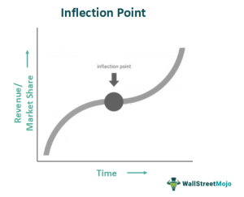

In today's rapidly evolving business landscape, strategic decisions often pivot around critical moments known as inflection points. An inflection point represents a transformative event that profoundly alters the direction or nature of a business or market condition. These moments can dictate the future trajectory of a business, necessitating adaptations in strategy. Failure to recognize and respond to these shifts can lead to missed opportunities or even business decline.

In the financial markets, algorithmic trading has experienced its formidable inflection points, significantly influencing trading strategies. Algorithmic trading, which uses computer algorithms to execute trades at high speed and frequency, relies heavily on data-driven strategies. The ability to identify and respond to inflection points can determine success or failure in these markets. Notable macroeconomic events, technological advances, and regulatory changes often serve as such points, prompting shifts in market behavior and trading practices.



As businesses and traders navigate these critical junctures, the capacity to interpret inflection points becomes a vital component of maintaining a competitive edge. This article seeks to explore the concept of inflection points, highlighting their importance in business strategy and algorithmic trading, and emphasizing the need for adaptive strategies to harness the potential these moments offer.

## Table of Contents

## Understanding Inflection Points

An inflection point represents a critical juncture where a significant change occurs in the trajectory of a company or industry. These points serve as pivotal transitions, influencing whether an organization embarks on a path of growth or experiences decline. In business contexts, inflection points necessitate a strategic overhaul, compelling companies to adapt to emerging challenges and seize new opportunities.

Historically, inflection points are identifiable by periods of substantial change. For example, the shift from traditional retail to e-commerce has transformed customer engagement and sales strategies, compelling companies to innovate or risk obsolescence. In these scenarios, inflection points act as catalysts for companies to reassess their positions, rethink their competitive strategies, and redirect resources towards sustainable growth avenues.

In financial markets, inflection points are crucial indicators of trend reversals or the onset of new market behavior phases. These points might stem from macroeconomic events, changes in consumer sentiment, or advancements in technology that influence market dynamics. Recognizing these moments is crucial for financial analysts and traders, as they often signify potential shifts in market trends, enabling strategic adjustments to optimize investment returns.

Understanding inflection points involves a blend of historical analysis and predictive modeling. Analysts examine past data to spot patterns or anomalies that resemble past inflection points, aiding in forecasting similar occurrences. For instance, sudden changes in economic indicators or shifts in consumer demand patterns might signal an impending inflection point.

Moreover, the advent of sophisticated analytical tools has enhanced the ability to detect these points more accurately. Techniques such as moving averages, trend lines, and [momentum](/wiki/momentum) indicators are commonly employed to identify potential inflection points in financial markets. These tools help in visualizing data trends and making more informed strategic decisions.

In summary, inflection points are transformative events that demand strategic reconsideration and adaptation. Whether in business strategy or financial markets, these points provide a critical lens through which companies and investors can anticipate change, mitigate risks, and capitalize on new opportunities for a sustainable competitive advantage.

## Examples of Business Inflection Points

The rise of the internet has served as a monumental inflection point, radically transforming business models across various sectors. One of the industries most adversely affected by failing to adapt was photography, where Kodak serves as a prime example. Kodak, once a dominant force in the photographic film market, experienced a negative inflection point when digital photography emerged. Despite pioneering the first digital camera in the 1970s, Kodak was slow to transition from its profitable film business to digital technology, ultimately leading to a significant loss of market share and its eventual bankruptcy in 2012. This illustrates how inflection points necessitate not only technological adaptation but also strategic foresight and an agile response to industry shifts.

In contrast, Amazon exemplifies a business that successfully seized its inflection point. The company capitalized on the e-commerce boom of the late 1990s and early 2000s, which marked a shift in consumer behavior towards online shopping. By adopting a customer-centric approach and continuously innovating its logistics and cloud computing infrastructure, Amazon transformed from an online bookstore to a global leader in e-commerce and cloud services. This strategic navigation through the e-commerce inflection point positioned Amazon as a formidable force in the digital economy.

The dichotomy between Kodak and Amazon highlights the impact of inflection points on businesses, underscoring the necessity for organizations to adapt their strategies in anticipation of or in response to these critical moments. By recognizing the potential for significant industry shifts and being prepared to alter business models accordingly, companies can either mitigate the risks of disruptive challenges or leverage opportunities for substantial growth.

## Algorithmic Trading and Inflection Points

Algorithmic trading significantly benefits from identifying inflection points, which serve as key signals for optimizing trading strategies and enhancing decision-making processes. These inflection points can emerge from a variety of sources that impact financial markets. Macroeconomic events, such as fluctuations in interest rates or unexpected geopolitical developments, often lead to shifts in market sentiment and behavior. Regulatory changes, including amendments to trading laws or financial policies, can alter the landscape in which traders operate, providing new challenges or opportunities for algorithmic systems. Additionally, technological advancements such as improvements in data processing capabilities or the introduction of faster network infrastructures can introduce new dynamics that trading algorithms must account for.

For traders utilizing algorithmic strategies, successfully identifying inflection points is crucial for timing market entries and exits effectively. Algorithms often embed quantitative tools to spot these shifts, enabling traders to capitalize on short-lived opportunities before they dissipate. For instance, when an algorithm detects a macroeconomic inflection point like a sudden [interest rate](/wiki/interest-rate-trading-strategies) cut, it might trigger a sequence of trades aimed at exploiting anticipated [volatility](/wiki/volatility-trading-strategies) in currency or bond markets.

To illustrate, consider a trading algorithm that relies on economic indicators. Suppose it tracks key metrics like the Consumer Price Index (CPI), Gross Domestic Product (GDP), and the Federal Funds Rate. The algorithm might be programmed to interpret a confluence of signals—such as a sharp rise in CPI accompanied by a stagnant GDP and an unchanged Federal Funds Rate—as an inflection point suggesting potential stagflation. In response, the algorithm could adjust its trading positions to hedge against inflation while preparing for a possible downturn in economic growth.

Moreover, advancements in data science have enhanced the ability of algorithms to detect inflection points through [machine learning](/wiki/machine-learning) techniques. These models can analyze vast amounts of data to uncover subtle patterns not easily detected by traditional methods. For instance, a [neural network](/wiki/neural-network) might be trained to identify historical patterns that precede significant market movements, learning to recognize complex combinations of factors that collectively signal an impending inflection point.

By employing such sophisticated tools, traders can better navigate the evolving landscapes of financial markets. The identification and response to inflection points provide a strategic edge, enabling traders to adapt swiftly to both predictable and unforeseen changes in market conditions. Ultimately, the capability to discern these pivotal moments can distinguish successful [algorithmic trading](/wiki/algorithmic-trading) strategies, allowing traders to optimize their portfolios and improve overall performance.

## Detecting Inflection Points in Algorithmic Trading

Technical analysis tools play a pivotal role in identifying inflection points within algorithmic trading, functioning as essential instruments for traders seeking to optimize entry and [exit](/wiki/exit-strategy) strategies. Moving averages, including simple moving averages (SMA) and exponential moving averages (EMA), are widely employed to smooth out price data and identify potential trend reversals. For example, the crossing of a shorter-term moving average above a longer-term moving average is often interpreted as a bullish signal, indicative of a potential inflection point in the market trajectory.

Bollinger Bands, another technical analysis tool, surround a moving average with upper and lower bands that are typically two standard deviations away. These bands dynamically adjust to market volatility, and price movements outside the bands may suggest overbought or oversold conditions, pointing to possible inflection points. The Relative Strength Index (RSI), a momentum oscillator, gauges the speed and change of price movements. RSI values above 70 generally indicate overbought conditions, while values below 30 suggest oversold conditions, assisting traders in identifying inflection points where price reversals might occur.

Beyond traditional technical analysis, advancements in machine learning and [artificial intelligence](/wiki/ai-artificial-intelligence) have significantly enhanced the capacity to predict inflection points by processing and analyzing vast datasets. Machine learning models, such as neural networks and decision trees, discern intricate patterns within market data that are often imperceptible to human analysts. These models can be trained on historical data to recognize patterns associated with previous inflection points, thereby improving predictive accuracy.

Implementing machine learning in algorithmic trading involves the development of algorithms that continuously learn and adapt to evolving market conditions. Consider a Python example using a basic machine learning framework:

```python
import numpy as np
from sklearn.model_selection import train_test_split
from sklearn.ensemble import RandomForestClassifier
from sklearn.metrics import accuracy_score

# Simulated dataset
X = np.random.rand(1000, 10)  # Features representing market indicators
y = np.random.randint(2, size=1000)  # Binary labels indicating inflection points

# Train-test split
X_train, X_test, y_train, y_test = train_test_split(X, y, test_size=0.2, random_state=42)

# Random forest classifier
clf = RandomForestClassifier(n_estimators=100, random_state=42)
clf.fit(X_train, y_train)

# Predictions and accuracy
y_pred = clf.predict(X_test)
accuracy = accuracy_score(y_test, y_pred)

print(f"Model accuracy: {accuracy:.2f}")
```

In this example, a Random Forest Classifier is trained to predict inflection points based on simulated market data. Once trained, the model can be incorporated into trading algorithms to automatically adjust strategies in response to identified inflection points, thus minimizing risk and maximizing returns.

Despite these technological advancements, traders must remain vigilant of challenges such as overfitting, where a model learns noise rather than signal, and the pervasive effect of market noise, which can obscure genuine inflection points. Hence, the successful detection and utilization of inflection points necessitate a balanced integration of advanced quantitative methods with strategic foresight and market intuition.

## Challenges and Considerations

Despite advancements in data analysis and algorithmic sophistication, detecting inflection points remains fraught with distinct challenges that can significantly affect trading accuracy and strategy execution. One of the primary obstacles is distinguishing genuine inflection points from false positives, which can often occur due to market noise—random price movements that do not correspond to trend shifts or changes in underlying fundamentals.

Market noise can obscure the detection of true inflection points, leading analysts and automated systems to mistakenly interpret these random fluctuations as signals of significant change. This misinterpretation can trigger unwarranted trading actions, resulting in potential losses. To mitigate this, traders often employ robust filtering techniques, but complete elimination of false signals remains a complex issue.

Algorithmic models are susceptible to overfitting, a condition where a model learns patterns specific to the historical data it was trained on, rather than generalizable trends. Overfitting can lead to a model that performs exceptionally well on past data but fails to predict future market behavior accurately. To address overfitting, traders use methods such as cross-validation and regularization, and they may choose simpler models to maintain interpretability and robustness. In Python, tools like scikit-learn can be used for such purposes:

```python
from sklearn.model_selection import cross_val_score
from sklearn.linear_model import Ridge

# Assuming X_train, y_train are our features and target variable
model = Ridge(alpha=1.0)  # Regularization parameter
scores = cross_val_score(model, X_train, y_train, cv=5)
print("Cross-validated scores:", scores)
```

Furthermore, the successful identification and utilization of inflection points necessitate more than just quantitative analysis. It requires a blend of strategic foresight and market intuition. Traders must remain vigilant to contextual nuances that algorithms may find difficult to quantify, such as geopolitical developments or sudden shifts in market sentiment. This requires continuous learning and adaptation, as well as a strategic approach that aligns quantitative models with broader market dynamics.

In sum, while algorithmic trading tools provide powerful capabilities to identify potential inflection points, the dynamic complexities of financial markets demand an integrated approach. Combining quantitative analysis with intuitive insights and strategic foresight can help traders better navigate these pivotal moments, leveraging them effectively to achieve competitive advantages.

## Conclusion

Inflection points represent pivotal moments of change that can determine the long-term success or failure of a business or trading strategy. These critical junctures compel organizations and market participants to adapt swiftly to new dynamics to maintain relevance and achieve goals. In business strategy, recognizing and responding to inflection points can spell the difference between enduring growth and decline. Companies that effectively leverage these moments are often able to reinvent themselves, capitalize on emerging opportunities, and ensure their continued success.

In the fast-paced environment of algorithmic trading, understanding and exploiting inflection points is essential for retaining a competitive edge. Advanced analytical techniques, including machine learning and artificial intelligence, play a crucial role in identifying these points within complex market data. By doing so, traders are equipped to optimize entry and exit strategies, thus minimizing risk and enhancing potential returns. However, the process is not without challenges, as market noise and the risk of model overfitting require a careful balance of quantitative analysis and strategic foresight.

Successfully navigating these critical junctures is an objective for both businesses and traders striving for continued success. By understanding the underlying factors of inflection points and integrating this knowledge into strategic decision-making, they can position themselves favorably in an ever-changing landscape, ensuring they capitalize on new trends and opportunities for growth.

## References & Further Reading

[1]: Bergstra, J., Bardenet, R., Bengio, Y., & Kégl, B. (2011). ["Algorithms for Hyper-Parameter Optimization."](https://dl.acm.org/doi/10.5555/2986459.2986743) Advances in Neural Information Processing Systems 24.

[2]: ["Advances in Financial Machine Learning"](https://www.amazon.com/Advances-Financial-Machine-Learning-Marcos/dp/1119482089) by Marcos Lopez de Prado

[3]: ["Evidence-Based Technical Analysis: Applying the Scientific Method and Statistical Inference to Trading Signals"](https://www.amazon.com/Evidence-Based-Technical-Analysis-Scientific-Statistical/dp/0470008741) by David Aronson

[4]: ["Machine Learning for Algorithmic Trading"](https://github.com/stefan-jansen/machine-learning-for-trading) by Stefan Jansen

[5]: ["Quantitative Trading: How to Build Your Own Algorithmic Trading Business"](https://www.amazon.com/Quantitative-Trading-Build-Algorithmic-Business/dp/1119800064) by Ernest P. Chan