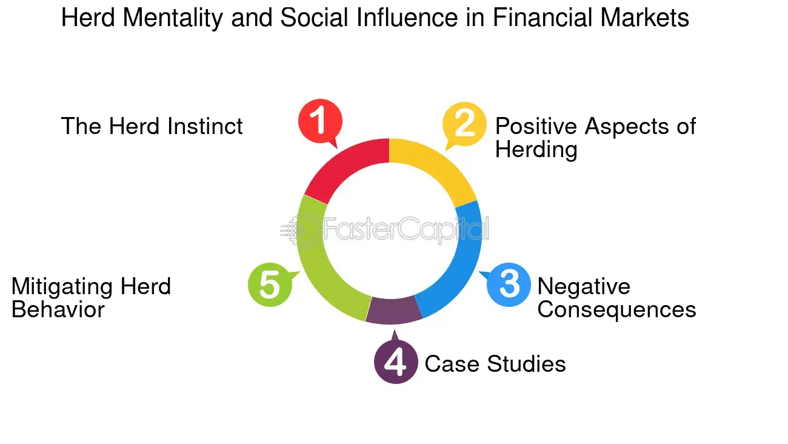

## Table of Contents

## What is collective behavior in the context of financial markets?

Collective behavior in financial markets refers to how groups of people, like investors and traders, act together in ways that affect the market. It's like when a lot of people decide to buy or sell certain stocks at the same time, which can cause big changes in stock prices. This can happen because of news, rumors, or even social media trends. When everyone starts doing the same thing, it can create a kind of group movement that pushes the market in a certain direction.

Sometimes, collective behavior can lead to what's called a "bubble" or a "crash." A bubble happens when lots of people keep buying a stock because they think its price will keep going up, even if it's not worth that much. Eventually, the bubble can burst, and the price falls quickly. On the other hand, a crash happens when everyone starts selling at the same time, causing prices to drop sharply. Understanding collective behavior is important for investors because it helps them see why the market might be moving in a certain way and make better decisions.

## How does collective behavior influence stock prices?

Collective behavior can really change stock prices. When a lot of people decide to buy a certain stock at the same time, the demand for that stock goes up. This makes the price go up too. It's like when everyone wants the newest toy, and the price of that toy goes up because everyone is trying to buy it. In the stock market, if people think a company is going to do well, they'll buy its stock, and the price will go up because of all the buying.

On the other hand, if a lot of people start selling a stock at the same time, the price can go down. This happens because there are more people wanting to sell than people wanting to buy. It's like a big sale where everyone is trying to get rid of something. When everyone is selling, the price drops because there's too much of the stock and not enough people wanting to buy it. This can happen if people hear bad news about a company or if they just think the stock is not going to do well anymore.

## Can you explain the concept of herd behavior in financial markets?

Herd behavior in financial markets is when a lot of people start doing the same thing with their money, like buying or selling certain stocks, just because they see others doing it. It's like when sheep follow each other without really knowing where they're going. In the stock market, if people see others buying a stock, they might think it's a good idea and buy it too, even if they don't know much about the company. This can make the stock's price go up really fast because so many people are buying it.

Sometimes, herd behavior can lead to big problems. For example, if everyone starts buying a stock and its price goes way up, it might create a "bubble." A bubble is when the price of a stock is much higher than what it's really worth. If the bubble bursts, the price can fall really fast, and people who bought the stock at the high price can lose a lot of money. Herd behavior can also cause a "crash" if everyone starts selling at the same time, making the stock's price drop quickly. So, while following the crowd might seem safe, it can sometimes lead to big risks in the stock market.

## What role do social media and news play in shaping collective behavior in financial markets?

Social media and news have a big impact on how people act in the stock market. When people see news about a company doing well, they might want to buy its stock. If a lot of people see the same news and start buying, it can make the stock's price go up. Social media makes this even faster because news can spread to a lot of people in just a few seconds. If someone famous on social media talks about a stock, a lot of their followers might start buying it too, just because they trust what the famous person says.

Sometimes, the news or social media can also make people scared. If there's bad news about a company, people might start selling its stock to avoid losing money. If a lot of people see the same bad news and start selling, the stock's price can go down fast. Social media can make this worse because rumors and fake news can spread quickly, making people act without knowing all the facts. So, news and social media can really change how people behave in the stock market, making prices go up or down based on what everyone is thinking and doing.

## How do market trends and collective behavior interact?

Market trends and collective behavior are closely linked. A market trend is like a direction that the market is moving in, like when stock prices are going up or down over time. Collective behavior is when a lot of people start doing the same thing, like buying or selling stocks. When people see a trend, they might start following it, which can make the trend even stronger. For example, if a stock's price is going up, more people might want to buy it because they think it will keep going up. This buying can make the price go up even more, creating a bigger trend.

But sometimes, collective behavior can also start a new trend. If a lot of people suddenly start buying a stock because of news or something they saw on social media, it can make the stock's price go up quickly. This can start a new trend where more and more people want to buy the stock. On the other hand, if a lot of people start selling a stock at the same time, it can make the price go down and start a downward trend. So, collective behavior can both follow and create market trends, making them important to watch for anyone interested in the stock market.

## What are some historical examples where collective behavior significantly impacted financial markets?

One big example of collective behavior affecting financial markets was the dot-com bubble in the late 1990s and early 2000s. A lot of people got excited about internet companies and started buying their stocks, thinking they would make a lot of money. This made the prices of these stocks go way up, even though many of the companies weren't making any profit yet. But then, people started realizing that these companies might not be worth as much as they thought. So, everyone started selling their stocks at the same time, and the prices crashed. This showed how collective behavior can create a bubble and then make it burst.

Another example is the 2008 financial crisis. A lot of people were buying houses with loans they couldn't really afford, and banks were giving out these loans because they thought they could sell them to other investors. When people started realizing that a lot of these loans wouldn't be paid back, everyone got scared and started selling their investments. This caused a big drop in the stock market and led to a lot of banks failing. It was a clear case of how collective behavior, like everyone buying and then selling at the same time, can lead to a big crash in the financial markets.

A more recent example is the GameStop stock surge in early 2021. A lot of people on social media, especially on Reddit, started talking about buying GameStop stock because they thought it was undervalued. This led to a lot of people buying the stock, making its price go up really fast. It showed how social media can make collective behavior happen even faster and affect stock prices in a big way. But it also showed how risky it can be when everyone follows the same trend without thinking about the real value of the stock.

## How can investors identify and possibly benefit from patterns of collective behavior?

Investors can identify patterns of collective behavior by watching what a lot of people are doing in the market. They can look at things like how much a stock is being bought or sold, and if there's a lot of talk about it on social media or in the news. If they see that a lot of people are buying a certain stock, it might be a sign of a trend starting. They can also use tools like stock charts and trading volumes to see if there's a pattern in how people are acting. By keeping an eye on these signs, investors can spot when collective behavior is happening and maybe even predict where the market might go next.

To benefit from these patterns, investors can try to get in on the trend early. If they see a lot of people buying a stock and they think the price will keep going up, they can buy the stock too and maybe make money when the price goes up. But they have to be careful because following the crowd can be risky. Sometimes, the price can go down just as fast as it went up if everyone starts selling at the same time. So, investors should do their own research and not just follow what everyone else is doing. By understanding collective behavior and using it wisely, investors can make better choices and maybe even make some money from the trends they see.

## What are the psychological factors driving collective behavior in financial markets?

One big psychological [factor](/wiki/factor-investing) driving collective behavior in financial markets is the fear of missing out, or FOMO. When people see others making money from a stock, they don't want to be left behind. They think, "If everyone else is buying this stock and making money, I should too!" This can make a lot of people buy the same stock at the same time, pushing its price up. But it's not just about wanting to make money; it's also about not wanting to feel left out or regret not taking a chance when everyone else did.

Another factor is the fear of losing money. If people hear bad news about a company or see its stock price starting to drop, they might get scared and start selling their stocks. When a lot of people do this at the same time, it can make the price drop even more. This fear can spread quickly, especially with social media, where bad news can go viral in seconds. So, both the fear of missing out and the fear of losing money can make people act in big groups, creating trends in the stock market that can be hard to stop once they start.

## How do regulatory bodies respond to the effects of collective behavior on financial markets?

Regulatory bodies, like the SEC in the United States, watch the stock market to make sure it's fair and safe for everyone. When they see a lot of people acting the same way, like buying or selling a stock at the same time, they might worry that it could cause big problems. They might look into what's happening to make sure no one is cheating or spreading false information. They can also make new rules to help stop big groups of people from causing the market to go up or down too fast.

Sometimes, regulatory bodies will step in if they think collective behavior is getting out of control. They might stop trading for a little while to calm things down, or they might warn people to be careful. They do this to protect investors and keep the market stable. By keeping an eye on collective behavior, regulatory bodies try to make sure that the stock market stays a fair place where people can invest without too much risk from everyone acting the same way at the same time.

## What advanced metrics or models are used to analyze collective behavior in financial markets?

To understand how people act together in the stock market, experts use special ways to measure and study things. One way is by looking at trading volumes, which is just counting how many stocks are being bought and sold. If a lot of stocks are being traded at the same time, it might mean that a lot of people are acting the same way. Another way is by using something called sentiment analysis. This is when computers read what people are saying on social media or in the news to see if they feel good or bad about a stock. If a lot of people are saying the same thing, it can show that they're acting together.

There are also more complicated models that try to predict what will happen next in the market. One of these is called agent-based modeling. This model uses pretend people, or "[agents](/wiki/agents)," to see how they might act if they all start doing the same thing. By playing out different situations, these models can help experts guess what might happen if a lot of real people start buying or selling at the same time. These advanced tools help investors and regulators understand and maybe even get ready for big changes in the stock market caused by everyone acting together.

## How does collective behavior affect market volatility and liquidity?

Collective behavior can make the stock market go up and down a lot, which is called market volatility. When a lot of people start buying or selling the same stock at the same time, it can make the price change really fast. For example, if everyone starts buying a stock, the price goes up quickly. But if everyone then starts selling, the price can drop just as fast. This quick up and down movement can make the market feel like a roller coaster, which can be scary for investors. They might not know if the price will keep going up or if it will suddenly fall, so they might make quick decisions to buy or sell, making the market even more volatile.

Collective behavior also affects how easy it is to buy or sell stocks, which is called liquidity. When a lot of people want to buy a stock, it's usually easy to sell it because there are plenty of buyers. But if everyone suddenly wants to sell the same stock, it can be hard to find someone to buy it, making the stock less liquid. This can lead to big drops in price because sellers might have to lower their price a lot just to find someone to buy. On the other hand, if everyone is buying, the price might go up a lot because there aren't enough stocks to go around. So, collective behavior can make it harder or easier to trade stocks, depending on what everyone is doing.

## What are the potential future developments in understanding and managing collective behavior in financial markets?

In the future, we might see new tools and technologies that help us understand collective behavior in financial markets even better. One big thing could be using [artificial intelligence](/wiki/ai-artificial-intelligence) (AI) to look at huge amounts of data from the internet and social media. AI can find patterns in what people are saying and doing, which can help predict when a lot of people might start buying or selling a stock at the same time. This could make it easier for investors to see trends before they happen and make smarter choices. Also, better ways of measuring how people feel about stocks, called sentiment analysis, could get even more accurate, giving us a clearer picture of what might happen next in the market.

Regulators and financial experts might also use these new tools to manage collective behavior better. They could make new rules that help stop big swings in the market caused by everyone acting the same way. For example, they might use AI to spot when a bubble is forming and step in to calm things down before it bursts. They could also find ways to keep the market more stable, like making it easier for people to buy and sell stocks during times when everyone is doing the same thing. By understanding and managing collective behavior better, we could make the stock market a safer place for everyone to invest.

## What is the impact of algorithmic trading?

Algorithmic trading has become a cornerstone of contemporary financial markets, utilizing sophisticated computer algorithms to execute trades with precision and speed. These systems operate by adhering to an array of pre-established criteria, which can include timing, price points, or even complex mathematical models. One of the primary advantages of [algorithmic trading](/wiki/algorithmic-trading) is its ability to substantially enhance market [liquidity](/wiki/liquidity-risk-premium). By facilitating a higher [volume](/wiki/volume-trading-strategy) of trades with reduced transaction times, algorithmic trading aids in creating a more robust and fluid market environment.

Moreover, algorithmic trading plays a pivotal role in amplifying market dynamics. The integration of Artificial Intelligence (AI) systems into trading algorithms has further advanced this impact. AI-driven algorithms can analyze vast datasets to identify patterns that may indicate future price movements, effectively perpetuating trends such as mean reversion and [momentum](/wiki/momentum). Mean reversion is based on the assumption that asset prices tend to revert to their historical mean, while momentum strategies capitalize on the continuation of existing trends.

High-frequency trading ([HFT](/wiki/high-frequency-trading-strategies)) represents a specialized subset of algorithmic trading, characterized by extremely rapid trade execution and high order-to-trade ratios. HFT algorithms are designed to exploit minute price discrepancies that can exist for mere fractions of a second, generating profits by executing numerous trades in quick succession. These trades often occur on a millisecond or microsecond scale, requiring advanced infrastructure and technology to achieve minimal latency and optimal performance.

The formula that underpins a basic trading algorithm may involve operations such as:

$$
\text{Signal} = \text{f}(P_t, M_t, \alpha)
$$

where $P_t$ is the current market price, $M_t$ is a market indicator (like moving average), and $\alpha$ represents specific thresholds or parameters to trigger buy/sell decisions. The signal generated by the function $f$ informs whether to undertake a transaction.

In a Python context, this might be implemented as follows:

```python
def trading_signal(current_price, moving_average, threshold):
    if current_price > moving_average * (1 + threshold):
        return "Sell"
    elif current_price < moving_average * (1 - threshold):
        return "Buy"
    else:
        return "Hold"

# Example usage
print(trading_signal(105, 100, 0.05))  # Output: "Sell"
```

While algorithmic trading offers remarkable opportunities for enhancing trading efficiency and market effectiveness, it is not without challenges. The complexity of these systems and their propensity to contribute to market [volatility](/wiki/volatility-trading-strategies) must be carefully managed. As algorithms proliferate, they can precipitate significant price fluctuations by reacting simultaneously to market stimuli, underscoring the need for vigilant oversight and adaptive regulatory frameworks to mitigate systemic risks.

## References & Further Reading

[1]: Lux, T. (1995). ["Herd Behaviour, Bubbles and Crashes."](https://academic.oup.com/ej/article-abstract/105/431/881/5158595) The Economic Journal, 105(431), 881-896.

[2]: Sornette, D. (2003). ["Why Stock Markets Crash: Critical Events in Complex Financial Systems."](https://www.jstor.org/stable/j.ctt1h1htkg) Princeton University Press.

[3]: Farmer, J. D., & Lo, A. W. (1999). ["Frontiers of Finance: Evolution and Efficient Markets."](https://www.pnas.org/doi/10.1073/pnas.96.18.9991) Proceedings of the National Academy of Sciences, 96(18), 9991-9992.

[4]: Aldridge, I. (2013). ["High-Frequency Trading: A Practical Guide to Algorithmic Strategies and Trading Systems."](https://onlinelibrary.wiley.com/doi/pdf/10.1002/9781119203803.fmatter) Wiley.

[5]: Barberis, N., Shleifer, A., & Vishny, R. (1998). ["A Model of Investor Sentiment."](https://www.sciencedirect.com/science/article/pii/S0304405X98000270) Journal of Financial Economics, 49(3), 307-343.