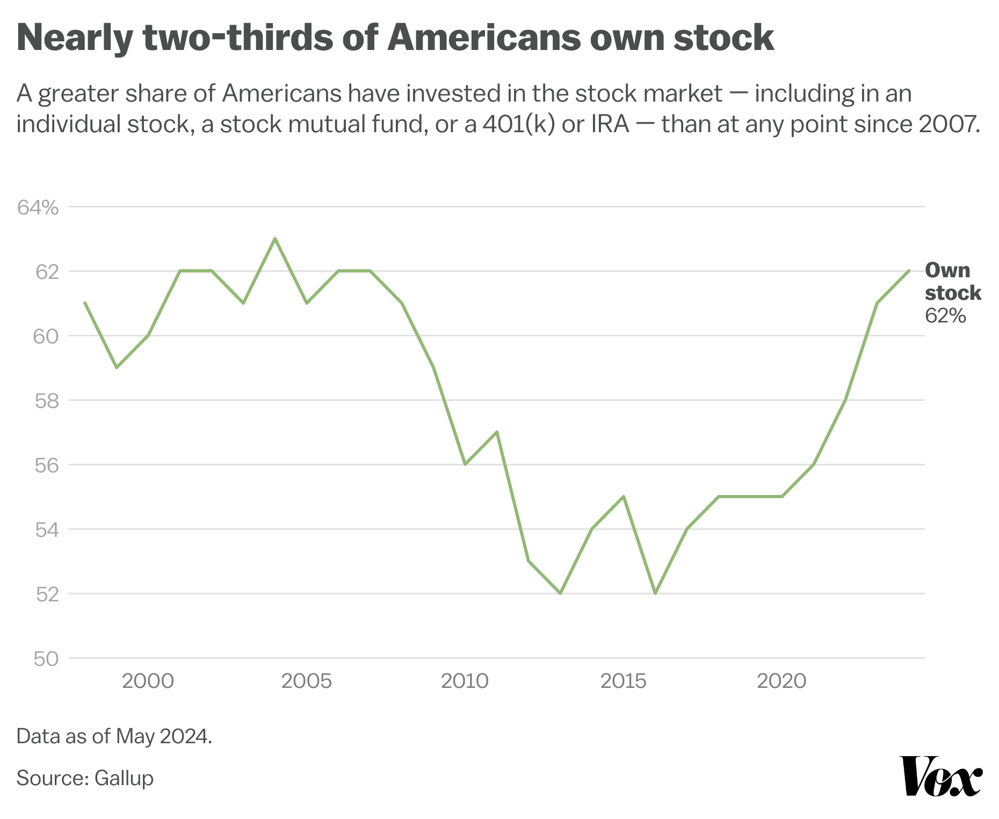

Disposable income, a pivotal financial concept, represents the amount of money individuals or households have available for spending and saving after accounting for taxes. It serves as a critical indicator of economic well-being and consumer confidence, underpinning the engine of economic growth through its influence on consumption patterns. An increase in disposable income typically empowers consumers to spend more, subsequently fueling business revenues and facilitating economic expansion. Conversely, a decline in disposable income can curb consumer spending, slow down business growth, and potentially trigger market contractions.

In the context of the stock market, disposable income holds significant sway over stock valuations. Changes in consumer spending, directly influenced by disposable income levels, can lead to fluctuations in corporate earnings. As consumer spending forms a substantial part of the economic output, a rise in disposable income often translates to increased consumer activity, bolstering corporate profits and driving up stock prices. Conversely, a decrease can suppress market enthusiasm and lead to depreciation in stock valuations. Historically, periods of substantial growth in disposable income have often coincided with robust bull markets, whereas downturns have seen markets flounder.



Simultaneously, the advent of algorithmic trading has transformed stock market dynamics. Algorithmic trading involves the use of complex algorithms to execute trades at speeds and frequencies that are impossible for human traders. This mode of trading has grown increasingly prevalent in modern exchanges due to its potential for reducing transactional costs and enhancing execution performance. Algorithms respond to a multitude of factors, including historical price data and economic indicators.

Understanding the intricate relationships between disposable income, stock market performance, and algorithmic trading is crucial in today's financial landscape. As algorithmic trading systems incorporate macroeconomic data into their decision-making processes, they may aggressively react to news about changes in disposable income and consumer behavior, potentially amplifying market trends. This intersection of human financial behavior and machine-led trading poses both challenges and opportunities, prompting a need for continued analysis and adaptation by investors and regulators alike.

## Table of Contents

## Understanding Disposable Income

Disposable income is a fundamental economic measure that reflects the amount of money available to households after accounting for taxes. It is an essential component of economic analysis and is regarded as a primary determinant of consumer spending and saving behavior. In formal terms, disposable income can be calculated using the formula:

$$
\text{Disposable Income} = \text{Gross Income} - \text{Taxes}
$$

Where "Gross Income" represents the total income received by a household from all sources, and "Taxes" include all mandatory financial charges imposed by the government. This measure plays a critical role in shaping household consumption patterns, as the portion of income retained after taxes dictates the capacity for expenditure on goods and services. 

The economic significance of disposable income stems from its direct influence on consumer spending, a major driver of economic growth. Higher levels of disposable income typically lead to increased consumer spending, as households are more likely to purchase goods and services, contributing to business revenues and potentially boosting economic activity. Conversely, lower disposable income can restrain spending, leading to slower economic growth. Disposable income also impacts savings, enabling households to buffer against economic uncertainties, invest in future opportunities, or prepare for retirement.

Statistical data on disposable income trends provide insights into the broader economic health. For instance, during periods of economic expansion, disposable income generally rises, reflecting increased employment and wage growth. According to data from the U.S. Bureau of Economic Analysis (BEA), disposable personal income in the United States showed a steady increase over the past decade, aligning with broader economic growth trends. During times of recession, disposable income may stagnate or even decrease, owing to higher unemployment rates and subdued wage increases. These trends have significant implications for economic policy, as governments may introduce tax cuts or fiscal stimulus to increase disposable income and, by extension, consumption and investment activities during downturns.

Overall, understanding disposable income is vital for assessing economic conditions, informing public policy, and guiding investment strategies. By observing changes in disposable income levels, economists and policymakers can gauge consumer confidence and predict potential shifts in economic activity, providing a basis for informed decision-making and strategic planning.

## The Role of Disposable Income in the Stock Market

An increase in disposable income can have a significant impact on stock market valuations. When individuals have more disposable income, they are likely to increase their levels of consumer spending. This, in turn, leads to higher demand for goods and services, which can boost corporate earnings. When companies report higher earnings, their stock prices often rise, reflecting the improved financial health and profitability.

### Increased Consumer Spending and Stock Valuations

The process by which increased consumer spending impacts stock valuations begins with the basic economic principle of demand and supply. As disposable income rises, consumers spend more on products and services, stimulating economic growth. This uptick in consumption leads to higher revenue for businesses, which can result in increased profits. Publicly traded companies, in particular, may see their stock prices increase as investors anticipate stronger financial performance and potential dividend payouts.

For example, during periods of economic expansion, such as after tax cuts or direct government stimulus measures, households often experience a rise in disposable income. This additional income can spur spending in sectors like retail, automotive, and hospitality. As companies in these sectors report improved earnings, confidence among investors grows, which can push stock prices higher.

### Historical Patterns and Case Studies

Historically, patterns have shown that shifts in disposable income can correlate with stock market movements. A notable example occurred during the mid-2000s housing boom in the United States. As property values increased, many homeowners experienced a rise in home equity, effectively increasing their disposable income. This led to higher consumer spending and contributed to economic growth, which in turn was reflected in rising stock market indices.

Another case study can be observed during the COVID-19 pandemic, particularly after the implementation of stimulus checks in various countries. In the United States, stimulus payments increased household disposable income, resulting in a surge in consumer spending and a notable rally in stock markets. Many retail investors used these funds to invest directly in stocks, further buoying market indices.

In both cases, the link between disposable income and stock market valuations was evident, with increased income leading to enhanced consumer spending, subsequently driving corporate earnings and stock prices higher.

Understanding this relationship is crucial for investors and analysts, as tracking trends in disposable income can serve as an indicator for potential stock market performance. Analyzing these patterns helps in making informed investment decisions and recognizing the broader economic implications.

## Algorithmic Trading in Today's Stock Market

Algorithmic trading, also known as algo trading, involves the use of computer algorithms to automate the process of trading financial securities. This practice has become increasingly prevalent in modern stock exchanges, accounting for a significant portion of trading [volume](/wiki/volume-trading-strategy) globally. The automation and speed of [algorithmic trading](/wiki/algorithmic-trading) allow for rapid execution of trades, often within milliseconds, which human traders cannot match.

### Advantages of Algorithmic Trading

1. **Speed and Efficiency**: Algorithms can process large volumes of data in real-time and execute trades faster than any human trader. This speed provides a competitive edge in markets where price discrepancies can vanish quickly.

2. **Reduced Transaction Costs**: Automation minimizes the need for manual intervention, which can decrease transaction costs by reducing labor expenses and improving the efficiency of order execution.

3. **Precision and Discipline**: Algorithms operate on predefined criteria and rules, allowing for precise execution without the influence of emotional decision-making. This leads to disciplined trading practices that adhere strictly to the strategy's logic.

4. **Diversification and Scalability**: Algorithms can manage multiple portfolios simultaneously, applying different strategies across various markets and assets. This capability offers diversification benefits and scalability in trading operations.

### Challenges of Algorithmic Trading

1. **Market Volatility**: Algorithms are highly sensitive to market conditions. During periods of high volatility, the rapidity with which algorithms execute trades can exacerbate market swings, leading to increased instability. 

2. **Systematic Risks**: Technology failures, such as software bugs or hardware malfunctions, can lead to unintended trades or financial losses. Moreover, algorithms can sometimes misinterpret market conditions due to lack of contextual understanding.

3. **Regulatory Concerns**: As algorithmic trading grows, so does its scrutiny by regulators. Ensuring compliance with financial regulations while maintaining the competitive advantage of speed is a constant challenge.

4. **Overfitting**: Developing an algorithm based on historical data can result in overfitting, where the model performs well on past data but poorly in real-world scenarios.

### Impact on Liquidity, Market Efficiency, and Price Discovery

Algorithmic trading significantly impacts [liquidity](/wiki/liquidity-risk-premium), market efficiency, and price discovery in the stock market. 

- **Liquidity**: Algorithms can provide substantial liquidity by enabling high-frequency trading and market-making activities. This means that buy and sell orders are more readily matched, leading to tighter bid-ask spreads and improved market depth.

- **Market Efficiency**: By continuously analyzing market data and executing trades based on identified opportunities, algorithms contribute to market efficiency. They help quickly arbitrage away small pricing inefficiencies, ensuring that securities' prices more accurately reflect all available information.

- **Price Discovery**: The presence of algorithmic traders increases the volume and frequency of trades, which can enhance price discovery processes. With more trades occurring instantaneously, the market can more rapidly process new information and incorporate it into asset prices.

In conclusion, algorithmic trading plays a critical role in modern financial markets, providing various advantages while posing notable challenges. Its influence on liquidity, market efficiency, and price discovery underscores its significance in the stock market's dynamics. As technology evolves, the scope and complexity of algorithmic trading are likely to expand, emphasizing the need for balanced regulatory oversight to mitigate risks without stifling innovation.

## Interplay Between Disposable Income, Stock Markets, and Algorithmic Trading

Algorithmic trading, which involves the use of computer algorithms to execute trades at optimal speeds and prices, is increasingly attuned to macroeconomic indicators such as disposable income levels. These algorithms often incorporate various economic signals to make informed trading decisions, and disposable income is a key [factor](/wiki/factor-investing) that reflects the financial health and spending potential of consumers.

### Influence of Macroeconomic Indicators on Algorithmic Trading Strategies

Algorithmic trading systems analyze vast amounts of data to identify trends and patterns. Macroeconomic indicators, including disposable income, serve as essential inputs in these analyses. For instance, a rise in disposable income generally signals increased consumer spending capacity, which can result in heightened corporate revenues and profitability. Such changes could prompt algorithms to adjust trading strategies, potentially favoring stock purchases in consumer-focused sectors.

### Scenario Analysis: Algorithmic Reactions to Changes in Disposable Income

Consider a scenario where national statistical agencies report an increase in disposable income due to recent tax cuts. Algorithms programmed to respond to such news might execute a series of trades favoring equities in sectors like retail or consumer electronics, which stand to benefit from increased consumer spending. Conversely, a decrease in disposable income could trigger selling pressures, especially in non-essential goods sectors, as algorithms anticipate reduced consumer expenditures.

```python
def calculate_expected_spending_change(disposable_income, marginal_propensity_to_consume):
    """
    Estimate the change in consumer spending based on disposable income change and the marginal propensity to consume.

    Parameters:
    disposable_income (float): The change in disposable income.
    marginal_propensity_to_consume (float): The fraction of additional income that a household spends on consumption.

    Returns:
    float: The expected change in consumer spending.
    """
    return disposable_income * marginal_propensity_to_consume

# Example usage:
change_in_income = 500  # Change in disposable income
mpc = 0.8  # Marginal propensity to consume
expected_spending_change = calculate_expected_spending_change(change_in_income, mpc)
print(f"Expected change in spending: {expected_spending_change}")
```

### Amplification of Market Trends

Algorithmic trading can amplify market trends initiated by shifts in disposable income. If a significant number of algorithms detect a positive disposable income trend and initiate buy orders, this can lead to increased demand and higher stock prices. This effect is often accelerated due to high-frequency trading, where algorithms execute numerous trades in fractions of a second, potentially leading to rapid market movements.

However, the amplification effect also poses risks. In scenarios of declining disposable income, algorithm-driven sell-offs can exacerbate market downturns. These rapid reactions can lead to sharp price swings, contributing to market [volatility](/wiki/volatility-trading-strategies). Policymakers and regulators are therefore focused on creating frameworks to manage these dynamics effectively.

The interplay between disposable income, stock markets, and algorithmic trading illustrates the complex interdependencies of modern financial systems. As algorithms become more sophisticated in analyzing macroeconomic indicators, their impact on market dynamics is likely to increase, necessitating careful monitoring and regulation to ensure balanced market conditions.

## Challenges and Opportunities

Investors and policymakers face numerous challenges due to disparities in disposable income levels, a crucial factor in economic stability and individual financial health. Variations in disposable income across different population segments can create uneven consumer spending patterns, making it difficult for investors to predict market movements accurately. This disparity often leads to skewed demand for goods and services, affecting corporate earnings and, subsequently, stock valuations. For policymakers, addressing these disparities is essential for ensuring equitable economic growth and stability. Inadequate measures can result in economic inefficiencies and social discontent, potentially destabilizing financial markets.

Algorithmic trading, while offering significant advantages in speed and efficiency, presents potential risks if relied upon excessively. One major concern is the volatility introduced by these trading systems, particularly during economic events that impact disposable income. Algorithms can exacerbate market swings through rapid execution of large volumes of trades based on programmed strategies that may not fully account for broader economic contexts. Thus, creating robust regulatory frameworks to oversee algorithmic trading is vital. Such regulations can help mitigate risks by ensuring that algorithms are transparent and that there are safeguards against excessive market manipulation.

Despite the challenges, there are opportunities for investors to capitalize on changes in disposable income through informed decision-making. By integrating macroeconomic indicators such as disposable income levels into algorithmic trading strategies, investors can better anticipate market trends and adjust their portfolios accordingly. This approach requires combining quantitative data analysis with qualitative insights into consumer behavior and economic policy shifts. Machine learning algorithms can be particularly useful in this regard, processing large datasets to uncover patterns that human analysts might overlook. Implementing these strategies effectively can offer competitive advantages and improve investment outcomes in a dynamic market environment.

## Conclusion

The analysis of disposable income reveals its significant impact on the stock market, primarily through its influence on consumer spending and corporate earnings. As disposable income rises, individuals tend to increase their consumption, which directly boosts the revenues of companies and, consequently, their stock prices. This relationship underscores the dynamic interplay between economic health indicators and market performance.

Algorithmic trading has become a pivotal component in the stock market's response to economic changes. These advanced trading systems leverage macroeconomic indicators, such as changes in disposable income, to inform trading strategies rapidly and efficiently. Algorithmic trading increases market liquidity and price discovery, enabling quicker reactions to shifts in economic conditions. However, it also poses challenges, such as potential market volatility and systemic risks, which necessitate robust regulatory frameworks.

Looking forward, the integration of disposable income data into algorithmic trading strategies is expected to evolve, driven by advancements in [machine learning](/wiki/machine-learning) and data analytics. Investors and regulators must remain vigilant, balancing the opportunities presented by these technologies with the need for market stability and fairness. Future trends may include more sophisticated predictive models that anticipate shifts in consumer behavior and broader economic trends, fostering a financial landscape that is both innovative and resilient. Adaptation and foresight will be crucial for all market participants navigating this evolving landscape.

## References & Further Reading

[1]: Greenspan, A. (1996). ["The Role of Disposable Income in Stock Market Performance."](https://www.federalreserve.gov/boarddocs/speeches/1996/19961205.htm) Federal Reserve Board.

[2]: Brosen, J. S. (2020). ["Algorithmic Trading: Winning Strategies and Their Rationale."](https://www.wiley.com/en-us/Algorithmic+Trading%3A+Winning+Strategies+and+Their+Rationale-p-9781118460146) John Wiley & Sons.

[3]: Farmer, J. D., & Skouras, S. (2013). ["An ecological perspective on the future of computer trading."](https://www.tandfonline.com/doi/full/10.1080/14697688.2012.757636) The Future of Computer Trading in Financial Markets.

[4]: Bureau of Economic Analysis (BEA). ["Disposable Personal Income and Its Impact on Economic Growth."](https://www.bea.gov/data/income-saving/disposable-personal-income) U.S. Department of Commerce.

[5]: Hasbrouck, J., & Saar, G. (2013). ["Low Latency Trading."](https://www.sciencedirect.com/science/article/abs/pii/S1386418113000165) Journal of Financial Markets, 16(4), 646–679.