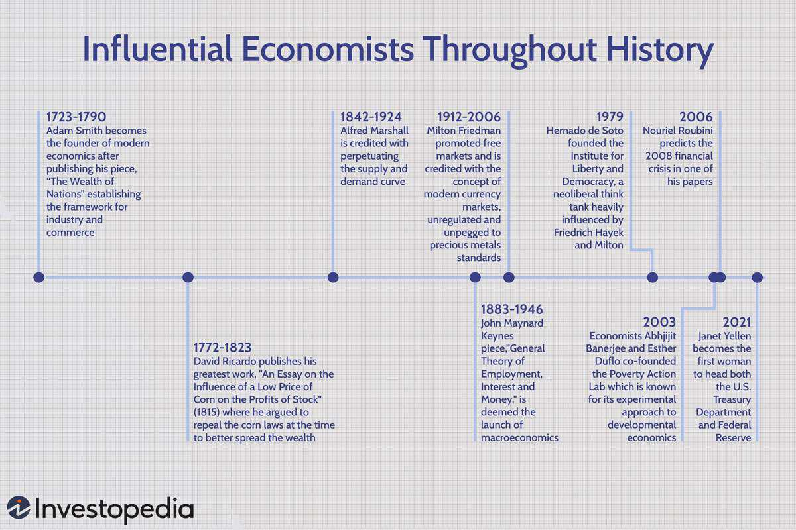

The U.S. economy has long been intertwined with the concept of the American Dream, a vision that has driven countless individuals to seek prosperity and success. This enduring ethos, characterized by the belief that anyone, regardless of their background, can achieve economic success through hard work and determination, plays a significant role in shaping the nation's economic landscape. The ideals embodied in the American Dream have historically fostered an environment conducive to growth, innovation, and opportunity.

The American Dream has significantly influenced the economy by encouraging immigration, which contributes to a diverse and dynamic workforce. Immigrants bring new perspectives, drive entrepreneurial ventures, and have been crucial in establishing some of the country's most successful companies. In fact, a substantial proportion of Fortune 500 companies have been founded by immigrants or their descendants, highlighting their pivotal role in economic development.

Moreover, innovation acts as a key driver of economic evolution in the United States. The open and inclusive nature of American society encourages the influx of international talent, which, in turn, strengthens the nation's position as a leader in technological advancements. These advancements not only fuel economic growth but also reshape industries and markets, ensuring the U.S. remains at the forefront of global economic leadership.

In recent years, a new frontier has emerged in the form of algorithmic trading. The incorporation of artificial intelligence and machine learning into financial transactions is shifting how markets operate, presenting both opportunities and challenges. While algorithmic trading has the potential to enhance market efficiency and offer economic benefits, it also poses risks such as market manipulation and the ethical implications of AI-driven decisions.

As the U.S. continues to navigate economic challenges, it is imperative that policies evolve to sustain the American Dream's promise. This includes fostering inclusivity, supporting technological advancement, and adopting measures that ensure equitable access to economic opportunities. By doing so, the American Dream can remain a vibrant and driving force behind the nation's economic prosperity for future generations.

## Table of Contents

## The Founders' Vision and Its Economic Impact

The founding of the United States was heavily influenced by the Enlightenment ideals of equal opportunity and the pursuit of happiness, enshrined in the Declaration of Independence and the Constitution. These principles laid the groundwork for a robust, free-market economy by promoting individual liberty, entrepreneurship, and innovation. The founders envisioned a society where individuals could succeed based on merit and effort rather than birthright, creating a level playing field for all citizens.

The focus on individual rights and freedom of enterprise encouraged the development of a capitalist economy characterized by minimal government intervention. This economic system enabled the U.S. to become a fertile ground for entrepreneurs and innovators, setting the stage for rapid industrialization and economic expansion. The emphasis on property rights and the rule of law provided the security needed for both domestic and foreign investors, which contributed significantly to the nation’s economic dynamism.

These founding ideals also helped attract people from across the globe, who were drawn by the promise of freedom and prosperity. This influx of immigrants contributed to the nation's rich cultural diversity and fueled economic growth by providing a steady stream of labor and talent. Immigrants brought new ideas, skills, and perspectives, which enhanced the U.S.'s capacity for innovation and economic productivity.

As a result of these founding principles, the U.S. quickly emerged as a dominant economic force by the 19th century. The combination of an open society, abundant natural resources, and a commitment to economic freedom provided a fertile environment for growth and prosperity. This confluence of factors allowed the American economy to evolve into one of the largest and most diverse in the world, continually attracting individuals seeking to achieve their version of the American Dream.

In summary, the founders' vision for the United States established a foundation of economic and social systems that have proven resilient and attractive to individuals worldwide. The pursuit of happiness and equal opportunity remains deeply embedded in the American socioeconomic fabric, driving continued innovation and prosperity.

## Immigrants: Fueling the American Economy

Immigrants have played a pivotal role in the evolution and expansion of the U.S. economy, making significant contributions across various sectors and enriching the nation’s cultural tapestry. Historically, the United States has attracted individuals seeking better opportunities, resulting in a melting pot of creativity and entrepreneurial spirit. This influx of diverse talent has not only transformed the social landscape but has also been instrumental in the establishment of numerous successful companies that form the backbone of the U.S. economy.

Immigrants or their descendants are credited with the founding of almost half of all Fortune 500 companies, including major names like Apple, Google, and IBM. This statistic underscores the critical role they have in driving economic development and innovation. The innovative spirit brought by immigrants is often attributed to their unique perspectives and resilience, qualities that are vital for entrepreneurship and business success.

The impact of immigrant entrepreneurs extends beyond mere company formation. They are also known for job creation, with immigrant-founded firms generating millions of jobs for U.S. citizens. For instance, a report by the National Foundation for American Policy indicated that 44.8% of the 2017 Fortune 500 companies were founded by immigrants or their children, collectively generating $5.3 trillion in revenue annually and employing millions of people globally.

Furthermore, immigrants significantly contribute to the economy through high levels of participation in the labor market, particularly in key sectors such as technology, healthcare, and agriculture. These sectors, in particular, benefit from the diverse skill sets and perspectives immigrants bring, fostering environments that encourage innovation and adaptation.

In addition to economic contributions, immigrants enhance the cultural diversity of the United States, which in turn stimulates creativity and varied consumer preferences, leading to the development of new products and services. This cultural vibrancy attracts global talent and investments, strengthening the economy's competitive advantage on the world stage.

The economic contributions of immigrants highlight the importance of policies that support immigration and the integration of newcomers into the economic framework. Ensuring that immigrants have the resources and opportunities to thrive is essential for maintaining the economic robustness associated with the American Dream. As the U.S. continues to navigate demographic changes, recognizing and harnessing the potential of immigrant populations will be vital to sustained economic growth and innovation.

## Innovation: The Lifeblood of Economic Evolution

The United States has long been recognized as a global leader in technological innovation, a status it maintains through a combination of open borders and the active encouragement of diverse talent. The influx of individuals from varied backgrounds has enriched the American technological landscape, fostering an environment where creativity and invention can flourish. This capacity for innovation has been particularly prominent in key sectors such as technology, where immigrant founders and leaders have played a pivotal role in driving both progress and economic growth.

Immigrants have historically contributed disproportionately to technological advancements in the U.S., bringing fresh perspectives that often lead to groundbreaking innovations. High-profile companies like Google, Tesla, and Intel, founded or co-founded by immigrants, have become household names and symbols of American innovation. For instance, Sergey Brin, a co-founder of Google, was born in Russia, while Elon Musk of Tesla hailed from South Africa, and Intel's Andy Grove emigrated from Hungary. These leaders have not only propelled their respective companies to the forefront of global technology but have also helped solidify the U.S.'s position as a hub for cutting-edge developments in computing, automotive technology, and semiconductor manufacturing.

The technology sector relies heavily on research and development (R&D) as a driver of innovation, and immigrants contribute significantly to this area. According to the National Science Foundation, foreign-born workers constitute a substantial portion of America's STEM (Science, Technology, Engineering, and Mathematics) workforce. This diversity within the workforce is crucial, as varied perspectives encourage a broader range of ideas and solutions, addressing complex challenges in innovative ways.

Moreover, the policy environment in the U.S. has historically supported a framework conducive to innovation. Patent regulations, tax incentives for R&D, and government-funded research initiatives create a fertile ground for new technologies to blossom. The synergy between policies and a diverse talent pool catalyzes advancements that have a far-reaching impact on economic growth.

The significance of innovation to the U.S. economy extends beyond the immediate financial rewards of technological advancements. It encompasses a reshaping of societal dynamics, affecting everything from communication to healthcare, transportation, and entertainment. As the U.S. continues to attract and harness diverse talent from across the globe, the sustenance of its innovation-driven economy relies on maintaining policies that favor openness and diversity, thereby ensuring continued prosperity. The perpetual cycle of innovation and economic evolution underscores the enduring vitality of the American Dream in shaping both national and global landscapes.

## Algorithmic Trading: A New Frontier in Economic Influence

The advent of [algorithmic trading](/wiki/algorithmic-trading) marks a significant transformation in the financial landscape, driven by advancements in [artificial intelligence](/wiki/ai-artificial-intelligence) (AI) and [machine learning](/wiki/machine-learning) (ML). These technologies are refashioning the way financial transactions are executed and how markets behave, leading to both potential benefits and challenges for the U.S. economy.

Algorithmic trading involves the use of complex algorithms to make high-speed trading decisions based on a variety of market indicators. These algorithms can process vast amounts of data far faster than human traders, executing trades in mere milliseconds. This capability allows for more efficient markets, where price discrepancies are quickly corrected.

The benefits of algorithmic trading are manifold. First, it contributes to increased market [liquidity](/wiki/liquidity-risk-premium), facilitating smoother transactions and reducing the bid-ask spread. The presence of algorithmic traders, who are willing to buy and sell shares in large volumes, enhances the depth of the market. Furthermore, algorithmic trading often leads to lower transaction costs, as the efficiency of automation and the reduction in human error contribute to cost savings.

Another key advantage is the enhancement of market efficiency. Algorithmic trading helps in ensuring that asset prices more accurately reflect all available information due to the rapid response of AI-driven systems to new data. This reflects the efficient market hypothesis, which suggests that asset prices fully incorporate and reflect all available information.

However, the rise of algorithmic trading also presents several challenges. One of the primary concerns is the risk of market manipulation. Algorithms can be designed to execute fraudulent strategies such as spoofing, where false orders are placed to manipulate asset prices to the advantage of the trader. This creates a potential for unethical practices that can destabilize market integrity.

Moreover, the complexity and speed of algorithmic transactions pose significant risks of flash crashes. These are steep and rapid drops in asset prices, typically followed by a swift recovery, often caused by malfunctioning algorithms or misjudgments in trading logic. The 2010 Flash Crash is an example where the Dow Jones Industrial Average lost and then recovered roughly 1,000 points within minutes, highlighting the potential systemic risks involved.

Collusion risk also emerges as a vital concern, where multiple algorithmic traders or trading systems might synchronously or deliberately create collusive effects in the markets, distorting fair competition and price discovery.

Regulatory bodies, such as the Securities and Exchange Commission (SEC) and the Commodity Futures Trading Commission (CFTC), have been increasingly focused on monitoring algorithmic trading activities to mitigate these risks. Policies are being developed to ensure transparency and accountability in the deployment of algorithmic trading strategies, aiming to prevent market manipulation and promote stability.

As AI and ML technology continue to evolve, algorithmic trading is expected to further develop, encompassing more sophisticated strategies and handling diverse datasets. This advancement necessitates the need for robust ethical frameworks and regulatory measures to preserve market integrity while harnessing the transformative benefits of these technologies. This ongoing balance will be crucial in maintaining the confidence of market participants and ensuring the continued contribution of algorithmic trading to the U.S. economy.

## The American Dream and Economic Policy

The concept of the American Dream has historically been intertwined with economic growth, rooted in the ideals of opportunity and prosperity. However, to ensure that this vision remains attainable amidst evolving economic landscapes, U.S. policymakers must adapt and refine their approaches. This involves tackling contemporary challenges such as income inequality, access to education, and healthcare, which directly affect social mobility and economic progress.

Recent policy changes have sought to address these issues with varying degrees of success. For instance, tax reforms aimed at reducing income inequality have been central to economic policy decisions. The introduction of progressive tax measures seeks to redistribute wealth more equitably, though debates continue regarding the optimal balance between taxation and economic growth. These discussions are crucial, as the aim is to foster an environment where economic success is accessible to a broader spectrum of society.

Education policy also plays a critical role in keeping the American Dream alive. Initiatives to improve access to quality education and training are vital for enhancing social mobility and preparing the workforce for a rapidly changing job market. Policies promoting affordable higher education and vocational training programs contribute to a more skilled workforce, which is essential for sustaining economic competitiveness on a global scale.

Moreover, healthcare policies significantly impact economic stability and individual well-being. Ensuring that all citizens have access to affordable healthcare reduces economic vulnerability and enhances productivity. Healthcare reforms focusing on universal coverage and cost reduction can significantly alleviate financial burdens on families, allowing them to invest in other areas such as education and homeownership.

At the intersection of technology and policy, regulatory measures on emerging financial methods, including algorithmic trading, highlight another dimension of maintaining economic equity. As algorithmic trading becomes more prevalent, measures that ensure transparency and fairness in financial markets are crucial. Ensuring that advancements in technology do not disproportionately benefit a select few aligns with the broader efforts to sustain the economic inclusivity that is central to the American Dream.

In summary, contemporary U.S. economic policies must address multiple facets, including taxation, education, healthcare, and technology regulation, to ensure that the American Dream remains viable for future generations. By continually adapting policies to the changing dynamics of the economic landscape, the nation can work towards a society where economic growth is inclusive, equitable, and sustainable.

## Conclusion: The Continual Evolution of the American Dream

The American Dream, historically characterized by the pursuit of prosperity and success, continues to be a pivotal force in driving economic progress and innovation within the United States. This enduring vision has been a catalyst for attracting global talent, fostering entrepreneurship, and promoting a culture of ingenuity. However, the dynamic landscape of the modern economy presents challenges that must be navigated with strategic foresight.

Inclusivity remains a cornerstone of sustaining the American Dream. Ensuring that opportunities for economic advancement are accessible to all individuals, regardless of their background, is crucial. Policies that promote diversity in the workforce and remove barriers to entry in various sectors are essential in cultivating an environment where innovation thrives. As the U.S. population becomes increasingly diverse, leveraging this diversity is not only a moral imperative but also a strategic advantage.

Technological advancement continues to reshape the way industries operate and economies function. The United States, with its history of technological leadership, must maintain its commitment to research and development. Investment in education and infrastructure is critical in equipping the next generation with the skills required in a rapidly changing economy. Encouraging STEM (Science, Technology, Engineering, and Mathematics) education and fostering environments where creativity and collaboration are encouraged will pave the way for future breakthroughs.

Equitable policy measures are instrumental in ensuring that the benefits of economic growth are shared widely. Addressing income inequality, enhancing social mobility, and providing a safety net for the most vulnerable segments of society are vital components of a sustainable economic model. Policymakers must remain vigilant in their efforts to balance economic growth with social equity, creating policies that support both innovation and fairness.

Challenges such as economic inequality, technological displacement, and global competition require careful navigation. However, by prioritizing inclusivity, embracing technological progression, and advocating for equitable policies, the American Dream can continue to serve as a beacon of hope and a driver of economic prosperity for future generations. The pursuit of this dream not only fuels individual aspirations but also fortifies the nation's economic fabric, ensuring that the United States remains a land where opportunities abound.

## References & Further Reading

[1]: Anderson, S. (2018). ["Immigrants and Billion Dollar Startups."](https://www.immigrationresearch.org/node/2597) National Foundation for American Policy.

[2]: Portes, A., & Rumbaut, R. G. (2014). ["Immigrant America: A Portrait"](https://papers.ssrn.com/sol3/papers.cfm?abstract_id=2780751). University of California Press.

[3]: Saxenian, A. (2006). ["The New Argonauts: Regional Advantage in a Global Economy"](https://www.jstor.org/stable/j.ctv1dp0ttd). Harvard University Press.

[4]: National Academies of Sciences, Engineering, and Medicine. (2015). ["The Integration of Immigrants into American Society."](https://nap.nationalacademies.org/catalog/21746/the-integration-of-immigrants-into-american-society) The National Academies Press.

[5]: National Science Board. (2018). ["Science & Engineering Indicators 2018."](https://www.nsf.gov/statistics/2018/nsb20181/) National Science Foundation.

[6]: Patterson, S. W. (2020). ["Navigating the New Landscape of Algorithmic and AI-based Trading."](https://psycnet.apa.org/record/2020-54982-006) CFA Institute Research Foundation.

[7]: Millsap, C. (2019). ["Algorithmic Trading: Winning Strategies and Their Rationale"](https://www.wiley.com/en-us/Algorithmic+Trading%3A+Winning+Strategies+and+Their+Rationale-p-9781118746912) by Ernie P. Chan.

[8]: Federal Reserve Bank of San Francisco. (2017). ["What Drives U.S. Immigration?"](https://www.federalreserve.gov/aboutthefed/files/sanfranciscofinstmt2017.pdf) Economic Research.

These references provide deeper insights into the components of the American Dream influencing the U.S. economy, particularly concerning immigration, innovation, and the rise of algorithmic trading.