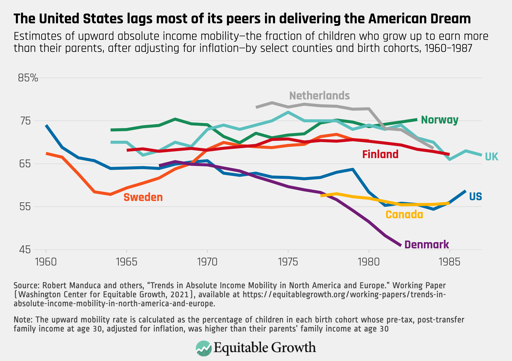

## Table of Contents

## What is the American Dream?

The American Dream is the idea that anyone can achieve success and happiness through hard work. It means that no matter where you come from or what your background is, you can have a good life in America if you try hard.

This idea started a long time ago when people came to America hoping for a better life. They believed that in America, they could own a home, get a good job, and provide for their families. Over time, the American Dream has changed, but the main idea is still the same: everyone has the chance to succeed if they work hard.

## How has the concept of the American Dream evolved over time?

The American Dream started in the early days of the United States when people came to America looking for freedom and a better life. They wanted to own land, have a stable job, and raise a family without the restrictions they faced in their home countries. This dream was about having the opportunity to succeed through hard work and determination. It was a powerful idea that attracted millions of immigrants to America, promising them a chance to build a prosperous life.

Over time, the American Dream has changed to reflect new hopes and challenges. In the mid-20th century, it became closely tied to owning a home and achieving financial stability. The idea of the "white picket fence" became a symbol of success. However, as society evolved, so did the dream. Today, it includes not just material success but also personal fulfillment, education, and equality. People now see the American Dream as having the freedom to pursue their passions and live a meaningful life, while still valuing the opportunities for economic advancement.

Despite these changes, the core of the American Dream remains the same: the belief that anyone can achieve success through hard work. Yet, many people feel that achieving this dream has become harder due to rising costs of living, economic inequality, and other challenges. This has led to ongoing discussions about what the American Dream means today and how it can be made accessible to everyone.

## What are the key components of the American Dream?

The American Dream is made up of a few main ideas. One big part is the chance to get ahead through hard work. This means anyone can work hard and become successful, no matter where they start. Another key part is having the freedom to live the life you want. This includes being able to speak your mind, practice your religion, and chase your dreams without anyone stopping you.

Another important piece of the American Dream is owning a home. For many people, having a place of their own is a big sign of success and stability. It's also about being able to support your family and give them a good life. This includes having enough money for food, clothes, and education.

Lastly, the American Dream today also includes the idea of personal fulfillment. People want to feel happy and satisfied with their lives, not just have money or things. This means having good relationships, doing work you enjoy, and feeling like you're making a difference. While the dream has changed over time, these core ideas are what many people still hope for when they think of the American Dream.

## How does the American Dream influence consumer behavior in the U.S.?

The American Dream influences how people in the U.S. spend their money. Many people want to achieve the dream of owning a home, having a good job, and providing for their family. This desire can lead them to buy things that they think will help them reach these goals. For example, people might buy a bigger house or a nicer car because they believe it shows they are successful. This can lead to more spending on big items that are seen as symbols of success.

The American Dream also pushes people to spend money on education and self-improvement. Many believe that getting a good education or learning new skills will help them get better jobs and move up in life. So, they might spend money on college, training courses, or [books](/wiki/algo-trading-books). This focus on personal growth and achievement can drive a lot of consumer spending in areas like education and self-help. Overall, the American Dream shapes what people buy and how they spend their money, as they try to live up to the idea of success and happiness through hard work.

## What role does the American Dream play in the U.S. labor market?

The American Dream plays a big part in the U.S. labor market. It makes people want to work hard because they believe that hard work can lead to success. Many people go to school and get jobs they might not like at first, hoping that it will help them get better jobs later. This belief pushes people to take on extra work or learn new skills, which keeps the labor market active and growing.

Also, the American Dream affects the kinds of jobs people look for. Many want jobs that can help them move up in their careers and earn more money. This desire for upward mobility means that people often switch jobs to find better opportunities. Companies know this, so they offer training programs and promotions to keep workers motivated and to attract new talent. In this way, the American Dream helps drive the labor market by encouraging people to keep striving for more.

## How has the American Dream affected housing markets and urban development in the U.S.?

The American Dream has had a big impact on housing markets in the U.S. Many people want to own a home because they see it as a sign of success and stability. This desire has driven up demand for houses, especially in cities and suburbs. When lots of people want to buy homes, prices go up. This has led to housing booms in some areas, where people buy and sell homes quickly to make money. But it has also made it hard for some people to afford a home, especially in places where there are not enough houses for everyone who wants one.

The American Dream has also shaped how cities grow and develop. People want to live in nice neighborhoods with good schools and safe streets. This has led to the building of new homes and communities in the suburbs, where people can have more space and a quieter life. Cities have also changed to meet the needs of people chasing the American Dream. They build new roads, shopping centers, and other things to make life easier and more comfortable. But this growth can also cause problems, like traffic and pollution, as more people move into these areas looking for a better life.

## In what ways does the pursuit of the American Dream impact income inequality in the U.S.?

The pursuit of the American Dream can make income inequality worse in the U.S. The dream tells people that if they work hard, they can become successful. But not everyone starts at the same place. Some people have more money and better chances from the beginning. This means that even if everyone works hard, those who start with more advantages can get ahead easier. They can go to better schools, get better jobs, and earn more money. This creates a bigger gap between the rich and the poor because the rich keep getting richer while the poor struggle to catch up.

On the other hand, the American Dream can also help reduce income inequality. It encourages people to work hard and try to improve their lives. Some people do move up from lower income levels to higher ones. They might start a business, get a better education, or find a good job. When this happens, it can help close the income gap a little bit. But overall, the dream can be hard to reach for many people because of things like high costs of living, lack of good jobs, and other barriers. So, while the American Dream inspires people to try to do better, it doesn't always make income inequality smaller.

## How does the American Dream influence entrepreneurial activities and business startups in the U.S.?

The American Dream has a big impact on people starting businesses in the U.S. It tells people that if they work hard, they can achieve success and become their own boss. This belief encourages many to take the risk of starting a business. They see it as a way to make money, create jobs, and build something they can be proud of. This dream of success drives a lot of entrepreneurial activity, making the U.S. a place where new businesses are always popping up.

But starting a business is not easy. The American Dream pushes people to try, even when it's hard. Some people start businesses because they want to chase their dreams and do something they love. Others do it because they want to make more money and have a better life. Either way, the idea of the American Dream keeps people motivated to keep going, even when they face challenges. This drive helps keep the spirit of entrepreneurship alive in the U.S.

## What are the economic policies that have been influenced by the concept of the American Dream?

The American Dream has shaped many economic policies in the U.S. One big way is through policies that help people buy homes. The government has made it easier for people to get loans to buy houses. They believe that owning a home is a key part of the American Dream. So, they create programs to help people afford homes, like lower interest rates and tax breaks. This is meant to give more people the chance to own a home and feel successful.

Another way the American Dream influences economic policy is through education. The government knows that education is important for people to get good jobs and move up in life. So, they have policies that make it easier for people to go to college or get training. This includes student loans, grants, and scholarships. The idea is that if more people can get a good education, they can work hard and achieve the American Dream.

Overall, the American Dream pushes the government to make policies that help people work hard and succeed. This includes not just housing and education, but also policies that support small businesses and entrepreneurship. The goal is to give everyone the chance to chase their dreams and build a better life.

## How does the American Dream affect savings and investment patterns among U.S. citizens?

The American Dream makes people in the U.S. want to save and invest their money. They believe that by saving, they can buy a home, start a business, or send their kids to college. These are big parts of the American Dream. So, people try to put money aside for these goals. They might save in a bank account or invest in things like stocks or real estate, hoping that their money will grow over time and help them reach their dreams.

But the American Dream can also make people take risks with their money. Some people might invest in a new business or buy a bigger house, thinking it will help them get ahead. They believe that taking these risks can lead to big rewards and help them live the life they want. However, not all risks pay off, and sometimes people can lose money. Still, the hope of achieving the American Dream keeps many people saving and investing, even when it's hard.

## What are the criticisms of the American Dream in terms of its economic impact?

Some people say the American Dream is not fair because it makes income inequality worse. They think it's a nice idea, but it's hard for everyone to reach it. People who start with more money and better chances can get ahead easier. They can go to better schools, get better jobs, and earn more money. But people who start with less have a harder time. Even if they work hard, they might not be able to catch up. This makes the gap between rich and poor bigger, and it can make life harder for those at the bottom.

Another criticism is that the American Dream can make people spend too much money. They might buy big houses or nice cars because they think it shows they are successful. But this can lead to debt and money problems. People might also take big risks with their money, like starting a business or investing in the stock market, hoping to get rich quick. Sometimes these risks don't pay off, and people can lose a lot of money. So, while the American Dream can inspire people to work hard, it can also lead to bad money choices and more economic problems.

## How can the American Dream be sustainably integrated into future economic planning and policy-making?

The American Dream can be part of future economic plans and policies by focusing on making it fair for everyone. This means creating policies that help people from all backgrounds have a real chance to succeed. Governments can do this by making sure everyone has access to good education and healthcare. They can also support small businesses and make it easier for people to buy homes. By doing these things, the American Dream can be a goal that more people can reach, not just those who start with more advantages.

Another way to include the American Dream in economic planning is by encouraging people to save and invest wisely. Policies can help people learn about money and make smart choices. This includes teaching people about saving for the future and investing in things that can help them grow their wealth over time. By making these resources available to everyone, people can work towards their dreams without taking big risks that might not pay off. This way, the American Dream can be a part of a strong and fair economy that works for everyone.

## References & Further Reading

[1]: Anderson, S. (2018). ["Immigrants and Billion Dollar Startups."](https://www.immigrationresearch.org/node/2597) National Foundation for American Policy.

[2]: Portes, A., & Rumbaut, R. G. (2014). ["Immigrant America: A Portrait"](https://papers.ssrn.com/sol3/papers.cfm?abstract_id=2780751). University of California Press.

[3]: Saxenian, A. (2006). ["The New Argonauts: Regional Advantage in a Global Economy"](https://www.jstor.org/stable/j.ctv1dp0ttd). Harvard University Press.

[4]: National Academies of Sciences, Engineering, and Medicine. (2015). ["The Integration of Immigrants into American Society."](https://nap.nationalacademies.org/catalog/21746/the-integration-of-immigrants-into-american-society) The National Academies Press.

[5]: National Science Board. (2018). ["Science & Engineering Indicators 2018."](https://www.nsf.gov/statistics/2018/nsb20181/) National Science Foundation.

[6]: Patterson, S. W. (2020). ["Navigating the New Landscape of Algorithmic and AI-based Trading."](https://psycnet.apa.org/record/2020-54982-006) CFA Institute Research Foundation.

[7]: Millsap, C. (2019). ["Algorithmic Trading: Winning Strategies and Their Rationale"](https://www.wiley.com/en-us/Algorithmic+Trading%3A+Winning+Strategies+and+Their+Rationale-p-9781118746912) by Ernie P. Chan.

[8]: Federal Reserve Bank of San Francisco. (2017). ["What Drives U.S. Immigration?"](https://www.federalreserve.gov/aboutthefed/files/sanfranciscofinstmt2017.pdf) Economic Research.

These references provide deeper insights into the components of the American Dream influencing the U.S. economy, particularly concerning immigration, innovation, and the rise of [algorithmic trading](/wiki/algorithmic-trading).