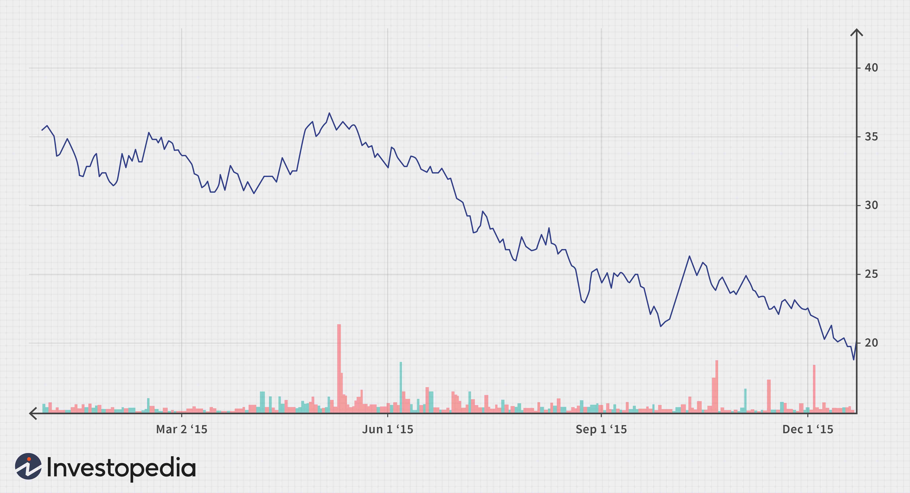

The global steel industry plays an indispensable role in modern economies, supplying essential materials for key sectors such as infrastructure, transportation, and manufacturing. Steel's versatility and strength make it a critical component in constructing buildings, bridges, and transportation networks, providing the backbone for economic development and growth worldwide. Among the countries involved in the steel market, China stands at the forefront, not only as the largest producer but also as the most significant consumer of steel. This elevated position gives China a substantial influence over global steel markets, affecting production levels, pricing, and trade flows across the globe.

In recent decades, China has consistently produced more than half of the world's steel output, with production figures surpassing one billion tons annually. This dominance allows China to exert considerable impact on global steel markets, shaping the landscape through both its extensive production capacity and its significant export volumes. However, this influence is accompanied by challenges, as China faces increased scrutiny over its environmental impact and must balance these concerns with its ongoing production demands.



The complexities of steel trading necessitate innovative approaches to optimize transactions in such a dynamic environment. Algorithmic trading has emerged as a pivotal tool in this context, offering novel methods for navigating the complexities inherent in the steel market. By leveraging sophisticated data analysis and automated processes, algorithmic trading enables market participants to manage risks more efficiently and make informed trading decisions swiftly. The adoption of such technology represents a shift towards more sophisticated and strategic engagement in steel trading, as firms seek to maximize efficiency and adapt to market fluctuations.

## Table of Contents

## China's Dominance in Steel Production

China produces over half of the world's steel, with its production consistently exceeding a billion tons annually. This vast output solidifies China's position as not only the largest producer but also the largest consumer of steel globally. According to data from the World Steel Association, China accounted for approximately 57% of global steel production in recent years, a figure that underscores its central role in the steel industry.

Despite facing regulatory and economic challenges, China maintains its dominant influence on global steel markets through its substantial production capacity and export volumes. The Chinese government has implemented a range of policies aimed at regulating production to mitigate overcapacity and improve environmental performance in the steel industry. Even with these regulatory pressures, Chinese steel exports remain significant, supplying a variety of international markets at competitive prices. 

Recent initiatives in China have increasingly focused on sustainability and environmental impact, in line with global trends towards greener industrial practices. The government's commitment to reducing carbon emissions has led to the implementation of stricter environmental regulations within the steel industry. Efforts include modernizing production facilities to enhance energy efficiency and reduce pollution. This is part of China’s broader goal to peak carbon emissions before 2030 and achieve carbon neutrality by 2060.

Technological advancements and policy initiatives indicate that China is striving to balance its role as a steel titan with its environmental commitments. The adoption of cleaner technologies and improved regulatory frameworks showcases China's strategic approach to sustain its steel production leadership while contributing to global sustainability efforts.

## Global Steel Market Dynamics

The global steel market plays an instrumental role in accelerating economic development by providing core materials for essential sectors, including housing, infrastructure, and the automotive industry. Steel's utility in these sectors underscores its importance as a fundamental driver of global economic [momentum](/wiki/momentum).

Regionally, the global steel market exhibits diverse trends shaped by economic, regulatory, and technological factors. Africa, for instance, is experiencing rapid growth in its steel industry. This expansion is largely attributed to increasing infrastructure development projects and urbanization trends across the continent. As countries within Africa embark on ambitious projects to modernize their cities and expand transportation networks, the demand for steel is expected to continue its upward trajectory.

In contrast, Asia's steel industry faces significant regulatory challenges that could impede growth. For instance, China, the world's largest steel producer, must now balance its immense production capacity with stringent environmental regulations aimed at reducing carbon emissions. This regulatory environment could lead to alterations in production strategies and impact the overall supply chain dynamics in the region.

Nations across the globe are following distinct paths in their steel market strategies, influenced by their unique resource endowments, varying economic conditions, and levels of technological advancement. Countries with abundant raw materials and advanced manufacturing capabilities can pursue aggressive expansion in steel production and export. In contrast, those with limited resources or facing economic constraints may focus on optimizing their existing production processes or seek technological collaborations to enhance efficiency.

Technological advancements are also pivotal in shaping global steel market dynamics. Innovations in steel manufacturing processes, such as the adoption of electric arc furnaces and developments in high-strength, lightweight steel alloys, have the potential to revolutionize production methods and broaden steel's applications. These advancements aim to not only improve energy efficiency but also reduce production costs, thereby maintaining competitiveness in the global market.

Overall, the interplay of these regional and technological factors contributes to a complex and evolving global steel market landscape. Industry participants must remain adaptable and cognizant of these dynamics to effectively navigate the challenges and opportunities that arise.

## Impact of Tariffs and Trade Policies

Tariffs and trade policies have carved a significant niche in shaping the global steel market, profoundly affecting both pricing dynamics and supply chains. One of the most notable interactions has been the tariff exchange between the United States and China. The imposition of tariffs by the U.S. on Chinese steel imports has been a pivotal [factor](/wiki/factor-investing), primarily aimed at protecting domestic steel manufacturers from a flood of cheaper foreign steel. These tariffs escalate the cost of imported steel, making domestic alternatives more economically appealing. Consequently, steel prices in the U.S. have experienced [volatility](/wiki/volatility-trading-strategies), often marked by spikes following tariff announcements.

Protectionist trade policies continue to gain traction globally. Countries are increasingly resorting to these measures to shield their domestic industries from the adverse effects of foreign overproduction and excess supply. By imposing tariffs and non-tariff barriers, governments aim to curb the influx of imported steel, thereby supporting local production and safeguarding jobs. This protectionist approach can foster domestic industry growth, yet it may also lead to retaliatory measures, triggering trade disputes and further instability in global steel markets.

The implications of these trade policies extend beyond simple price adjustments. Global trade flows are being reshaped as countries reassess their trade relationships in light of these protective measures. For market players, this necessitates a strategic recalibration. Companies must navigate an increasingly complex landscape, balancing the benefits of accessing foreign markets against the risk of tariff-imposed costs. This involves exploring alternative supply chains, renegotiating trade terms, and leveraging technology to forecast market trends and prices.

The reliance on tariffs as a strategic tool underscores the interconnectedness of global economies and the challenges of unilateral policy maneuvers. As nations strive to protect their industries, they also risk invoking negative repercussions that may counterbalance the intended economic benefits. Hence, market participants must remain agile, ready to adjust their strategies to capitalize on emerging opportunities while mitigating risks posed by an evolving trade policy landscape.

## Algorithmic Trading in the Steel Industry

The integration of [algorithmic trading](/wiki/algorithmic-trading) into the steel market represents a significant shift in how companies approach risk management and execute trades. By leveraging advanced computational techniques, market participants can process large volumes of data with precision, facilitating quicker and more informed trading decisions. This efficiency stems from the capacity of algorithms to analyze intricate patterns and trends in steel prices that may elude manual analysis.

Algorithmic trading systems utilize a variety of strategies, including [trend following](/wiki/trend-following), [arbitrage](/wiki/arbitrage), and mean reversion, to optimize trading outcomes. For example, trend following algorithms might identify a persistent upward or downward movement in steel prices, positioning trades to capitalize on these trends. Arbitrage strategies, on the other hand, exploit price discrepancies across different markets or trading venues, allowing traders to lock in profits with minimal risk. Meanwhile, mean reversion strategies operate under the assumption that prices will revert to their historical average over time, providing opportunities to buy low and sell high.

A simple example of an algorithmic trading strategy is a moving average crossover, which can be implemented in Python as follows:

```python
import pandas as pd
import numpy as np

# Sample steel price data
data = {'Date': ['2023-01-01', '2023-01-02', '2023-01-03', '2023-01-04', '2023-01-05'],
        'Price': [1200, 1220, 1215, 1230, 1240]}
df = pd.DataFrame(data)
df['Date'] = pd.to_datetime(df['Date'])
df.set_index('Date', inplace=True)

# Calculate moving averages
short_window = 2
long_window = 3

df['Short_MA'] = df['Price'].rolling(window=short_window, min_periods=1).mean()
df['Long_MA'] = df['Price'].rolling(window=long_window, min_periods=1).mean()

# Generate signals
df['Signal'] = 0
df['Signal'][short_window:] = np.where(df['Short_MA'][short_window:] > df['Long_MA'][short_window:], 1, -1)

# Output the DataFrame with signals
print(df)
```

In this code snippet, a basic strategy is developed where a buy signal is generated when a short-term moving average crosses above a long-term moving average, and a sell signal is indicated by the opposite condition. Although simplistic, this method highlights the potential for algorithmic trading to automate decision-making based on predefined criteria.

The proliferation of algorithmic trading is driven by the growing demand for better risk management and improved profitability. As steel prices are subject to volatility triggered by geopolitical events, supply chain disruptions, and economic shifts, algorithmic tools enable traders to swiftly adapt to changing market conditions, thus safeguarding investments.

As algorithmic trading becomes more widespread, its impact on market dynamics cannot be overstated. Enhanced [liquidity](/wiki/liquidity-risk-premium), reduced transaction costs, and minimized human error are among the benefits that make this technology appealing to firms seeking to exploit market volatility. Despite these advantages, challenges such as the need for substantial technological infrastructure and expertise remain significant considerations for companies aiming to harness the full potential of algorithmic trading in the steel industry.

## Future Outlook and Challenges

The global steel industry is anticipating several key challenges as it moves forward. Among them, environmental concerns are paramount. Steel production is highly energy-intensive and contributes significantly to carbon emissions. As such, governments and industry leaders are pressing for the adoption of green technologies to reduce the carbon footprint. This transition involves considerable investment in research and development, aiming to develop and implement technologies such as hydrogen-based steelmaking, which promises to lower emissions compared to traditional blast furnace methods.

Market volatility continues to pose challenges, driven by fluctuating demand and supply. Current trends indicate an increase in demand for steel used in infrastructure and renewable energy projects, yet this is countered by the unpredictability of raw material costs and production bottlenecks. The industry must employ sophisticated forecasting models and flexible supply chains to manage this volatility effectively.

Geopolitical tensions also impact steel markets, particularly through the imposition of tariffs and trade barriers that can alter competitive dynamics and market access. These tensions necessitate strategic planning by companies to navigate potential disruptions in global supply chains.

China remains a pivotal player, producing over half the world's steel. Its domestic policies and market strategies have global repercussions. Recent emphasis on cutting production capacity for environmental reasons, as well as shifting towards higher-value products, indicates a shift in strategy. Consequently, industry stakeholders must monitor China’s policy changes closely, as they will impact global prices and trade flows.

Adaptation and innovation are crucial for the steel industry's sustainable growth. There is an increasing focus on adopting digital technologies and advanced data analytics to enhance operational efficiency and decision-making processes. The utilization of algorithmic trading, for example, allows companies to analyze complex data and swiftly adjust to market shifts, reinforcing resilience against uncertainties.

Overall, the future of the steel industry hinges on successfully addressing these challenges through innovation and strategic agility, with China's policies playing a central role in shaping the global industry landscape.

## Conclusion

The global steel industry remains a dynamic and complex sector, characterized by significant challenges and transformative opportunities. China's unparalleled dominance, producing over half of the world's steel, positions it as a central player influencing the broader market dynamics. This influence is sustained through its vast production capacities, export competencies, and ongoing policy adjustments aimed at balancing industrial growth with environmental sustainability.

The emergence of algorithmic trading introduces a novel dimension to steel markets. These advanced trading systems leverage sophisticated algorithms to process complex data patterns, optimize transaction speeds, and enhance decision-making precision. This technological innovation provides a framework for companies to manage risks more effectively and capitalize on market volatility, potentially boosting profit margins and improving competitive advantage.

However, the future landscape of the steel industry is fraught with uncertainties that necessitate a responsive and strategic approach from industry stakeholders. Environmental challenges, particularly relating to carbon emissions and sustainable practices, demand innovative solutions and technological adoption, such as green steel production. Additionally, geopolitical tensions and market volatility remain persistent pressures that could disrupt global supply chains and necessitate agile responses.

To navigate these uncertainties successfully, adaptability and forward-thinking strategies are imperative. Industry participants must not only embrace technological advancements like algorithmic trading but also remain vigilant to shifts in regulatory environments and global economic conditions. By doing so, the steel industry can continue to forge a path toward sustainable growth and resilience in an evolving global landscape.

## References & Further Reading

[1]: ["World Steel Association - Statistics Archive"](https://worldsteel.org/data/), World Steel Association.

[2]: Jung, J. S., & Lim, H. T. (2021). ["China's Environmental Policy and the Global Steel Industry."](https://link.springer.com/article/10.1007/s10661-024-13601-2) Journal of Environmental Management.

[3]: ["Steel Exports Report: China."](https://legacy.trade.gov/steel/countries/pdfs/exports-china.pdf) International Trade Administration.

[4]: Zhang, Y., & Liu, H. (2020). ["The Impact of Environmental Regulations on the Chinese Steel Industry."](https://www.sciencedirect.com/science/article/pii/S0048969720372752) Journal of Cleaner Production.

[5]: Fry, J. M., & Vogt, S. (2012). ["Algorithmic Trading: The Basics and the Practice."](https://psycnet.apa.org/record/2011-22896-001) Elsevier.

[6]: ["Advances in Financial Machine Learning"](https://www.amazon.com/Advances-Financial-Machine-Learning-Marcos/dp/1119482089) by Marcos Lopez de Prado

[7]: McKay, H. (2014). ["The Steel Sector in China: Domestic Conditions and Stakeholder Interactions."](https://link.springer.com/referenceworkentry/10.1007/978-3-642-40871-7_80-1) East Asia Forum.

[8]: ["Algorithmic Trading and DMA: An Introduction to Direct Access Trading Strategies"](https://archive.org/details/algorithmictradi0000john) by Barry Johnson