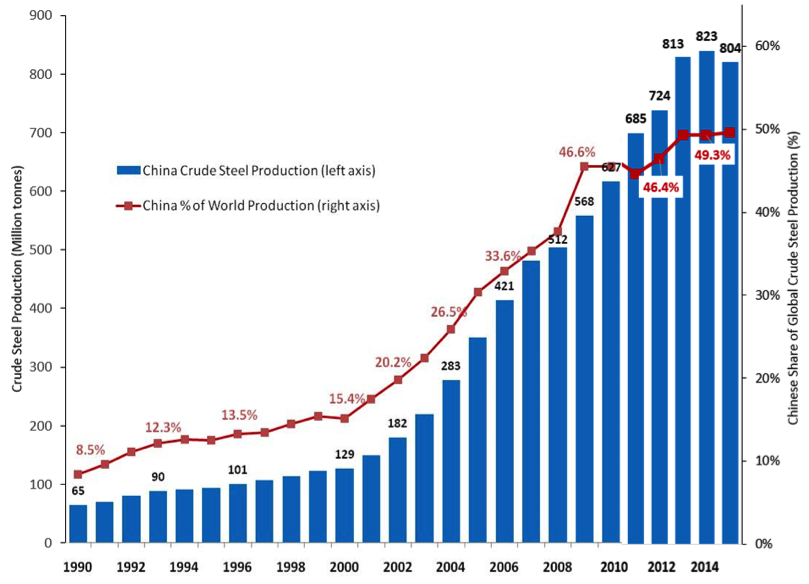

## Table of Contents

## What is the steel industry and why is it important globally?

The steel industry involves making steel, which is a strong metal used in many things around us. Steel is made from iron and other elements, and it's used to build cars, buildings, bridges, and many other things. The industry includes mining for iron ore, turning it into steel in big factories, and then selling the steel to companies that use it to make their products.

The steel industry is very important around the world because it helps countries grow and develop. When a country makes a lot of steel, it can build more things and create jobs for people. Steel is also important for making things that we use every day, like appliances and tools. Without steel, many things we rely on would be harder to make or would not be as strong. So, the steel industry plays a big role in making our lives better and helping the world's economy.

## How has China's steel production capacity grown over the past few decades?

Over the past few decades, China's steel production capacity has grown a lot. In the 1980s, China was making much less steel than countries like Japan and the United States. But then, China started building more steel factories and using new technology to make steel faster and cheaper. By the early 2000s, China had become the biggest steel producer in the world. Now, China makes more steel than any other country, and it keeps making more and more every year.

This big growth in steel production has helped China build a lot of things, like skyscrapers, trains, and roads. It has also created many jobs for people in China. But it has also caused some problems, like pollution and using a lot of energy. Other countries sometimes worry that China makes so much steel that it can sell it cheaper than they can, which can hurt their own steel industries. Even with these challenges, China's steel production keeps growing, and it plays a big role in the world's steel market.

## What percentage of global steel production does China account for?

China makes a lot of the world's steel. Right now, China makes about 50% of all the steel in the world. That means half of all the steel made everywhere comes from China.

This big amount of steel production started growing a lot in the early 2000s. Before that, other countries like Japan and the United States made more steel. But China built more factories and used new ways to make steel faster and cheaper. Now, China is the biggest steel maker in the world, and it keeps making more steel every year.

## How does China's steel production affect global steel prices?

China's big steel production affects the prices of steel all around the world. When China makes a lot of steel, it can sell it for less money because it has so much. This can make the price of steel go down everywhere. Other countries might find it hard to sell their steel because they can't match China's low prices.

But sometimes, if China needs more steel for its own projects, it might not sell as much to other countries. This can make the price of steel go up because there is less steel to buy. So, what China does with its steel can change how much people have to pay for steel all over the world.

## What are the environmental impacts of China's steel industry?

China's steel industry has a big impact on the environment. Making steel uses a lot of energy, and most of that energy comes from burning coal. Burning coal makes a lot of pollution, like carbon dioxide, which is bad for the air and causes climate change. The steel factories also make other kinds of pollution, like dust and chemicals, that can make the air and water dirty. This pollution can make people sick and harm plants and animals.

The steel industry also uses a lot of water. When they use water to cool down the steel, it can get dirty and then be put back into rivers or lakes. This dirty water can hurt fish and other animals that live in the water. Also, making steel creates a lot of waste, like slag, which can take up a lot of space and be hard to get rid of. All these things together make the steel industry a big problem for the environment in China.

## How does China's steel industry influence global trade policies?

China's steel industry affects global trade policies a lot. Because China makes so much steel and can sell it at low prices, other countries worry about their own steel industries. They might put up trade rules to stop too much cheap steel from coming in. These rules can be things like tariffs, which are extra fees on imports, or quotas, which limit how much steel can come into a country. Countries do this to protect their own steel companies and keep them from losing too much money.

Sometimes, these trade rules cause fights between countries. Other countries might say that China is not playing fair because it gives its steel companies money or other help, which lets them sell steel cheaper. This can lead to big arguments at places like the World Trade Organization, where countries try to agree on what is fair in trade. So, China's big steel industry can make countries change their trade rules and can cause a lot of disagreements about how to trade fairly.

## What are the major steel-consuming sectors in China and how do they impact global demand?

In China, the biggest users of steel are the construction and infrastructure sectors. They use a lot of steel to build things like skyscrapers, bridges, and roads. The car industry also uses a lot of steel to make cars and trucks. Because China makes and builds so much, it needs a lot of steel all the time. This big need for steel in China makes the whole world pay attention because China's demand can change how much steel is made and sold everywhere.

When China uses a lot of steel for its own projects, it can affect the global demand for steel. If China builds a lot of new buildings or roads, it might need more steel and buy it from other countries. This can make the price of steel go up because there is less steel to go around. But if China slows down its building and doesn't need as much steel, it might not buy as much from other countries. This can make the price of steel go down because there is more steel available. So, what China does with its steel can change how much steel is needed and how much it costs all over the world.

## How have technological advancements in China's steel industry affected global steel production techniques?

Technological advancements in China's steel industry have had a big impact on how steel is made around the world. China has been using new ways to make steel that are faster and cheaper. They use big machines and computers to control the steel-making process, which helps them make more steel with less work. They also use new ways to recycle old steel, which saves energy and helps the environment. These new technologies have made China's steel industry very strong and have shown other countries how to make steel better.

Because of these advancements, other countries have started to use some of the same technologies that China uses. They see that China can make a lot of steel quickly and cheaply, so they want to do the same. This has led to changes in how steel is made all over the world. Countries are now using more automation and recycling in their steel factories, just like China does. This has made the global steel industry more efficient and has helped it grow.

## What role does China play in the global steel market through its state-owned enterprises?

China's state-owned enterprises (SOEs) play a big role in the global steel market. These are companies that the Chinese government owns and controls. They make a lot of the steel in China, and because China makes half of the world's steel, these SOEs have a lot of power. They can decide how much steel to make and sell, and they can also get help from the government, like money or special rules, that let them sell steel cheaper than other countries. This can make it hard for steel companies in other countries to compete.

Because of this, China's SOEs can affect the prices of steel all over the world. When they make a lot of steel and sell it at low prices, it can make the price of steel go down everywhere. Other countries might not like this and might put up trade rules to stop too much cheap steel from coming in. This can cause fights between countries about what is fair in trade. So, what China's SOEs do with their steel can change how the whole world buys and sells steel.

## How does China's steel export strategy impact other steel-producing countries?

China's steel export strategy can make things hard for other countries that make steel. China makes a lot of steel and can sell it for less money because it has so much. When China sends a lot of this cheap steel to other countries, it can make it tough for those countries' steel companies to sell their own steel. They might not be able to match China's low prices, so they lose money and might have to close down or lay off workers. This is why some countries put up trade rules, like extra fees on imports, to stop too much cheap steel from coming in.

These trade rules can cause fights between countries. Other countries might say that China is not playing fair because it helps its steel companies with money or special rules. This can lead to big arguments at places like the World Trade Organization, where countries try to agree on what is fair in trade. So, China's way of selling steel can change how other countries make and sell their steel, and it can cause a lot of disagreements about trade rules.

## What are the geopolitical implications of China's dominance in the steel industry?

China's big role in the steel industry affects how countries work together and sometimes causes tension. Because China makes so much steel, it can sell it cheaper than other countries. This can make it hard for other countries to sell their own steel, so they might put up trade rules to stop too much cheap steel from coming in. These rules can cause fights between countries. Other countries might say China is not playing fair because it helps its steel companies with money or special rules. This can lead to big arguments at places like the World Trade Organization, where countries try to agree on what is fair in trade.

Also, China's steel industry can affect how countries work together on other things. When China builds a lot of things like roads and buildings, it needs a lot of steel. This can change how much steel is made and sold all over the world. Other countries might want to work with China to get some of this steel, but they might also worry about depending too much on China. This can make countries think carefully about how they want to work with China, not just in steel but in other areas too. So, China's big steel industry can change how countries get along and work together.

## What future trends can we expect in China's steel industry and their potential global impacts?

In the future, China's steel industry might focus more on making steel in a way that is better for the environment. They might use more clean energy like wind or solar power instead of coal, which makes a lot of pollution. They might also recycle more old steel to save energy and make less waste. This could help the environment a lot, not just in China but all over the world. If China can show other countries how to make steel in a cleaner way, it could change how steel is made everywhere.

China's steel industry might also keep growing, but maybe not as fast as before. They might start making more high-quality steel for things like cars and machines instead of just making a lot of regular steel. This could change what kind of steel other countries need to buy from China. If China makes more high-quality steel, other countries might want to buy more of it, which could affect the prices of steel all over the world. So, what China does with its steel in the future could have a big impact on the global steel market and the environment.

## References & Further Reading

[1]: ["World Steel Association - Statistics Archive"](https://worldsteel.org/data/), World Steel Association.

[2]: Jung, J. S., & Lim, H. T. (2021). ["China's Environmental Policy and the Global Steel Industry."](https://link.springer.com/article/10.1007/s10661-024-13601-2) Journal of Environmental Management.

[3]: ["Steel Exports Report: China."](https://legacy.trade.gov/steel/countries/pdfs/exports-china.pdf) International Trade Administration.

[4]: Zhang, Y., & Liu, H. (2020). ["The Impact of Environmental Regulations on the Chinese Steel Industry."](https://www.sciencedirect.com/science/article/pii/S0048969720372752) Journal of Cleaner Production.

[5]: Fry, J. M., & Vogt, S. (2012). ["Algorithmic Trading: The Basics and the Practice."](https://psycnet.apa.org/record/2011-22896-001) Elsevier.

[6]: ["Advances in Financial Machine Learning"](https://www.amazon.com/Advances-Financial-Machine-Learning-Marcos/dp/1119482089) by Marcos Lopez de Prado

[7]: McKay, H. (2014). ["The Steel Sector in China: Domestic Conditions and Stakeholder Interactions."](https://link.springer.com/referenceworkentry/10.1007/978-3-642-40871-7_80-1) East Asia Forum.

[8]: ["Algorithmic Trading and DMA: An Introduction to Direct Access Trading Strategies"](https://archive.org/details/algorithmictradi0000john) by Barry Johnson