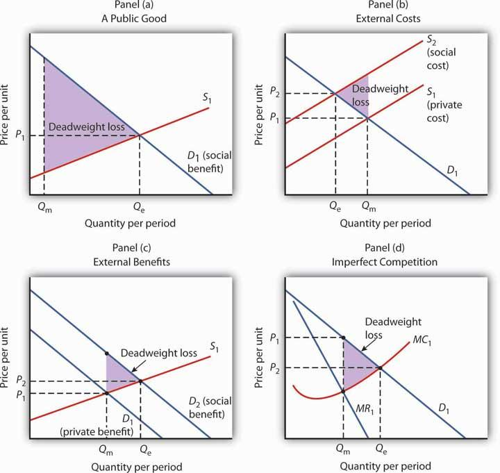

The intricate interplay between microeconomics, government policy, and algorithmic trading can significantly influence economic outcomes. Microeconomics focuses on individual and firm-level decision-making processes, examining how limited resources affect prices, supply, and demand in specific markets. It serves as the foundation for understanding how economic agents optimize their activities and how these behaviors aggregate to shape broader economic phenomena.

Government policy plays a pivotal role in shaping these microeconomic activities, employing mechanisms such as taxes, subsidies, and regulations to guide economic behavior towards desirable outcomes. Through fiscal policy (government spending and taxation) and monetary policy (control of the money supply and interest rates), governments can influence economic stability, consumer confidence, and investment climates. The effects of these policies resonate through microeconomic structures, affecting everything from consumer purchasing power to corporate pricing strategies.

In recent years, algorithmic trading has emerged as a transformative force in financial markets. Leveraging complex algorithms, this form of trading executes orders at speeds and efficiencies unattainable by human traders. Algorithmic trading's impact extends beyond transactional efficiency, affecting market liquidity, price discovery, and even regulatory approaches to securities trading.

This article explores these dynamic components, examining the unique and collective economic impacts they wield on the market landscape. By gaining insights into how government policies shape microeconomic activities and how algorithmic trading fits into this matrix, stakeholders can better navigate and optimize their roles in the economic arena. Understanding these elements is crucial for making informed decisions, whether setting policy, devising business strategies, or investing in the market, thus contributing to more stable and efficient economic systems.

## Table of Contents

## Microeconomics and Its Role in the Economy

Microeconomics is a branch of economics that focuses on the actions of individuals and firms in making decisions regarding the allocation of limited resources. It is concerned with understanding the mechanisms of supply and demand as well as the structure of individual markets. Microeconomics is pivotal as it provides a framework for analyzing how entities respond to changes in prices and incentives, influencing their production, consumption, and investment choices.

At the heart of microeconomic theory lies the principle of supply and demand, which posits that in a competitive market, the price for a particular good or service is determined by the relationship between the quantity supplied by producers and the quantity demanded by consumers. The law of demand, for instance, states that all else being equal, an increase in the price of a good or service will lead to a decrease in the quantity demanded, whereas the law of supply suggests that the quantity of a good supplied by producers increases as the market price rises.

The intersection of these two laws determines the market equilibrium, where the quantity supplied matches the quantity demanded. This equilibrium concept is fundamental in predicting how market dynamics will react to external changes, such as shifts in consumer preferences or production technology.

The behavior of consumers, pricing strategies, and the structure of markets are profoundly influenced by microeconomic factors. Consumer behavior is typically analyzed using the concept of utility, which refers to the satisfaction or benefit derived by consumers from consuming goods and services. The utility maximization problem, a cornerstone of consumer theory, involves determining the combination of goods and services that maximizes a consumer's utility subject to their budget constraint. Mathematically, this is expressed as:

$$

\max_{x} \, U(x) \quad \text{subject to} \quad p \cdot x \leq I 
$$

where $U(x)$ represents the utility function, $x$ is a vector of goods, $p$ is the price vector, and $I$ is the consumer's income.

Pricing strategies employed by firms are also dictated by microeconomic fundamentals. Firms aim to set prices in a manner that maximizes their profit, which is the difference between total revenue and total cost. The concept of elasticity of demand is crucial here, as it measures how sensitive the quantity demanded is to changes in price. A product with elastic demand will see a significant change in demand in response to price changes, while inelastic demand indicates that demand is relatively unaffected by price changes.

Market structures, ranging from perfect competition to monopolies, further illustrate the diverse contexts under which microeconomic principles operate. In perfectly competitive markets, numerous small firms compete with one another such that no single firm can influence the market price. Conversely, a monopoly entails a single firm with significant market power, allowing it to set prices above marginal costs, which can lead to economic inefficiencies and reduced consumer welfare.

In summary, microeconomics plays a critical role in shaping how consumers, firms, and markets operate. It provides essential insights into decision-making processes at the individual and firm level, influences pricing behaviors, and highlights the diverse market structures within an economy. Understanding these microeconomic foundations is essential for analyzing broader economic phenomena and devising informed strategies in economic planning and policy.

## Government Policy and Microeconomic Effects

Government policy plays a pivotal role in shaping microeconomic activities through various instruments, such as tax reforms, regulations, fiscal policies, and monetary measures. These tools influence how individuals and businesses operate within the economy, impacting decision-making processes, resource allocation, and overall economic dynamics.

### Tax Reforms and Regulations
Tax policies are fundamental to microeconomic outcomes as they directly affect disposable income, consumption patterns, and investment decisions. For instance, a reduction in personal income taxes increases disposable income for consumers, potentially boosting consumption and stimulating economic activity. Conversely, increasing corporate taxes might deter investment by reducing after-tax profitability.

Regulations, whether in the form of market-entry barriers or compliance requirements, can influence microeconomic behavior by altering cost structures and competitive dynamics. For example, stringent environmental regulations may increase operational costs for certain industries, thereby influencing pricing strategies and market competitiveness.

### Fiscal Policies
Fiscal policies encompass government spending and taxation strategies designed to influence macroeconomic conditions such as employment, inflation, and growth. These policies have significant microeconomic implications:

1. **Government Spending:** Investment in public infrastructure can enhance productivity by reducing costs associated with transportation and communication for businesses, thereby encouraging economic growth. For example, improved infrastructure reduces logistics costs for companies, allowing them to price more competitively.

2. **Social Welfare Programs:** These programs, funded through fiscal budgets, affect consumer spending habits by altering disposable income levels. Enhanced welfare benefits may increase purchasing power among lower-income households, shifting demand curves for certain goods.

### Monetary Policies
Monetary policy, primarily conducted through [interest rate](/wiki/interest-rate-trading-strategies) adjustments and open market operations, significantly affects microeconomic activities by influencing borrowing costs and [liquidity](/wiki/liquidity-risk-premium) in the economy.

1. **Interest Rates:** Lower interest rates reduce the cost of borrowing, encouraging both consumers and businesses to increase spending and investment. This stimulates economic growth but can also lead to inflationary pressures.

2. **Money Supply Management:** By controlling the money supply, central banks can influence inflation rates and economic stability. An increase in the money supply can prompt more spending, while a decrease can stabilize inflation but possibly constrain growth.

### Subsidies, Tariffs, and Public Services
These government interventions directly impact resource allocation and microeconomic landscapes:

- **Subsidies:** Financial aid provided to industries or consumers lowers the cost of goods or services, thereby encouraging consumption or production. Agricultural subsidies, for example, can lower food prices for consumers while ensuring farmers’ profitability.

- **Tariffs:** Imposed on imported goods, tariffs protect domestic industries from foreign competition by making imports more expensive. This can lead to a shift in consumer preference towards domestically produced goods, affecting domestic market dynamics.

- **Public Services:** Investments in public goods such as education and healthcare can enhance labor productivity by improving the workforce's skill set and health, ultimately influencing wage structures and employment rates.

In conclusion, government policies via taxation, fiscal and monetary strategies, subsidies, tariffs, and public services are crucial in shaping the microeconomic environment. These policies determine how resources are allocated, how markets function, and how individuals and firms operate within the economy. Understanding these effects enables stakeholders to make informed decisions and adapt to policy changes effectively.

## Algorithmic Trading: An Overview

Algorithmic trading, a modern innovation in the financial markets, refers to the use of complex algorithms to automate trading decisions. This technology-driven approach has gained significant traction due to its ability to process large volumes of market data at speeds far beyond human capability. By employing mathematical models and algorithms, traders can analyze market conditions and execute trades rapidly, often without the need for human intervention.

At its core, [algorithmic trading](/wiki/algorithmic-trading) involves the use of computer programs that follow a pre-defined set of rules. These rules are based on timing, price, quantity, or any mathematical model. In practice, the algorithm identifies trading opportunities by scanning various market indicators and executing trades to take advantage of these opportunities. For instance, an algorithm might be programmed to buy assets when a certain technical indicator reaches a specified threshold or to sell when another condition is met.

One of the primary benefits of algorithmic trading is its ability to execute orders at optimal conditions. Algorithms can monitor a multitude of trading venues simultaneously, thereby selecting those that offer the best prices. This advantage is compounded by the speed of execution, which mitigates the impact of short-term market fluctuations and latency. The precision of algorithmic trading reduces costs and minimizes market impact by optimizing the timing and size of trades.

However, algorithmic trading is not without its risks. Market [volatility](/wiki/volatility-trading-strategies), for instance, can be exacerbated by high-frequency trading strategies that rely on executing thousands of trades in fractions of a second. The reliance on algorithms can also introduce systemic risk if the underlying models are flawed or if there is a malfunction in the software. Such incidents have occasionally led to significant market dislocations, as seen in the "Flash Crash" of 2010, where markets sharply plunged and rebounded within minutes.

Another concern is liquidity. While algorithmic trading enhances liquidity by providing continuous market presence, it can also withdraw liquidity if the markets become too volatile, leading to wider bid-ask spreads and reduced market depth. This dynamic highlights the importance of robust risk management frameworks and regulatory oversight to ensure market stability.

In summary, algorithmic trading is a double-edged sword. It offers the potential for increased efficiency and reduced costs in financial markets while posing challenges related to volatility and liquidity management. As technology continues to evolve, the role of algorithms in trading is likely to expand further, necessitating a nuanced approach to harnessing their benefits while mitigating associated risks.

## Economic Impact of Algorithmic Trading

Algorithmic trading has considerably reshaped financial markets by introducing a high level of automation and speed in trade execution. By leveraging mathematical models and computational power, algorithmic trading optimizes trading strategies, often leading to significant impacts on market behavior and economic stability.

### Market Behavior and Stability

Algorithmic trading influences market behavior by enhancing price discovery and improving market efficiency. Through rapid execution of trades, it adjusts prices based on real-time information, thus acting as a catalyst for price discovery. This process ensures that asset prices reflect available information more accurately and promptly. The role of algorithms in continuously assessing market conditions and executing trades based on pre-set rules tends to reduce bid-ask spreads, increase liquidity, and enhance overall market stability.

However, this technological advancement is a double-edged sword. High-frequency trading ([HFT](/wiki/high-frequency-trading-strategies)), a subset of algorithmic trading, can contribute to market volatility. While HFT improves liquidity and narrows spreads in normal conditions, its impact during market stress might be destabilizing. Events like the "flash crash" of May 6, 2010, demonstrated how HFT can exacerbate price swings in already volatile markets.

### Implications on Microeconomic Indicators

Algorithmic trading impacts several microeconomic indicators:

1. **Price Discovery:** Algorithms continuously analyze and incorporate new information into asset prices, speeding up the price discovery process. However, in scenarios where algorithms react simultaneously to market movements, price distortions can occur.

2. **Market Efficiency:** By minimizing informational inefficiencies and adjusting prices in real-time, algorithmic trading contributes to more efficient markets. The efficient market hypothesis suggests that security prices reflect all available information; algorithms accelerate this process.

3. **Liquidity and Spreads:** With algorithms executing trades in fractions of a second, liquidity in the market increases. This added liquidity results in narrower bid-ask spreads, benefiting individual and institutional investors by reducing transaction costs.

### Technological Advancements and Microeconomic Strategies

As technology progresses, advancements in algorithmic trading such as [machine learning](/wiki/machine-learning) and [artificial intelligence](/wiki/ai-artificial-intelligence) are transforming trading strategies. These technologies allow for predictive analytics and adaptive learning, enabling algorithms to adjust to changing market conditions autonomously.

For investors, these advancements mean developing more sophisticated strategies that balance risk and reward effectively. Investment firms increasingly rely on data scientists and quantitative analysts to construct algorithms that can exploit market inefficiencies.

Regulators face challenges as well. The speed and complexity of algorithmic trading require updated regulatory frameworks to prevent systemic risk and ensure fair trading practices. Ensuring transparency in algorithmic strategies and preventing manipulative practices like spoofing and layering are pivotal regulatory concerns.

### Conclusion

Algorithmic trading has indelibly transformed market operations, influencing key aspects of market behavior and economic stability. While its benefits in enhancing efficiency and liquidity are clear, the associated risks of increased volatility and market manipulation necessitate balanced regulatory oversight. As technology continues to evolve, both investors and regulators must adapt to the changing microeconomic landscape to maintain market integrity and stability.

## Synthesis: Interactions Between Government Policy, Microeconomics, and Algorithmic Trading

The intersection of government policy, microeconomics, and algorithmic trading is a complex and evolving space with significant implications for economic environments. Government policies shape the microeconomic landscape through regulations, fiscal measures, and monetary interventions, providing the structural foundation upon which economic activities operate. Simultaneously, algorithmic trading plays an increasingly pivotal role in financial markets, influencing microeconomic indicators through rapid and automated transactions.

Government policies, such as tax reforms and monetary regulations, have a direct impact on economic activities by altering the incentives and constraints faced by individuals and businesses. For example, changes in tax rates can affect consumer spending and saving decisions, influencing aggregate demand and supply at the market level. Likewise, monetary policy adjustments, such as interest rate changes, can impact borrowing and investment behaviors among firms, reshaping market dynamics and economic growth patterns.

Algorithmic trading, characterized by the use of sophisticated algorithms to execute trades at high speed, significantly affects market behavior. Unlike traditional trading, algorithmic trading can process vast amounts of data and execute trades based on set parameters, such as price fluctuations and market trends. This capability leads to enhanced market efficiency and liquidity, as algorithms facilitate optimal trading conditions. However, the rapid execution of transactions can also introduce market volatility and systemic risk, challenging traditional microeconomic stability.

A relevant case study is the [cryptocurrency](/wiki/cryptocurrency) market, where government regulations and algorithmic trading intersect noticeably. Cryptocurrencies operate within a highly dynamic and speculative environment, with regulatory bodies across the globe attempting to balance innovation with risk management. For instance, regulatory actions like the imposition of restrictions on cryptocurrency exchanges or the introduction of taxes on digital asset transactions can influence trading algorithms. These algorithms need to adapt to new regulations to optimize trading strategies and ensure compliance, impacting price volatility and trading volumes.

The intricate relationship between government policy and algorithmic trading necessitates a nuanced approach to regulation that promotes market efficiency while ensuring fairness and economic stability. Policymakers are tasked with developing a balanced regulatory framework that accommodates technological advancements without stifling innovation. This could involve instituting policies that enhance transparency in algorithmic trading, safeguard against market manipulation, and protect consumer interests.

To achieve sustainable economic growth, it is crucial for regulators to foster an environment that supports the healthy interaction between microeconomic activities and algorithmic trading. As technology continues to evolve, so must regulatory practices, ensuring they remain relevant and effective in promoting a stable and efficient economic landscape. Exploring this interplay further will provide invaluable insights for policy formulation, contributing to a resilient and adaptive economic system.

## Conclusion

The intricate interplay between microeconomics, government policy, and algorithmic trading can significantly influence economic outcomes. Throughout this analysis, we have explored how microeconomic principles, such as supply and demand, guide individual and firm decision-making. Microeconomic factors, including consumer behavior and market structures, are central to facilitating efficient markets. Meanwhile, government policies profoundly shape these activities through fiscal measures, regulations, and subsidies that affect resource allocation and economic behavior.

Algorithmic trading has emerged as a pivotal force in modern financial markets, executing trades with precision and speed. While it enhances market liquidity and efficiency, it also introduces challenges of market volatility and regulatory scrutiny. Its influence on price discovery and economic stability is notable, making it a critical [factor](/wiki/factor-investing) in today's economic landscape. 

The synthesis of these elements reveals a complex ecosystem where government policy and algorithmic trading collectively impact microeconomic conditions. As observed in case studies, such as those in the burgeoning cryptocurrency market, regulations influence trading algorithms, demonstrating the dynamic interaction between policy and technology.

Looking ahead, the convergence of these components promises to drive novel trends in the economic landscape. Innovations in algorithmic trading technologies will likely challenge existing regulatory frameworks, necessitating adaptive policies that promote both growth and fairness. It is essential for policymakers, traders, and economists to continuously explore and understand these interactions to make informed economic decisions. This ongoing exploration will ensure that regulatory practices evolve in pace with market innovations, ultimately fostering a balanced and equitable economic environment.

## References & Further Reading

[1]: Bergstra, J., Bardenet, R., Bengio, Y., & Kégl, B. (2011). ["Algorithms for Hyper-Parameter Optimization."](https://papers.nips.cc/paper/4443-algorithms-for-hyper-parameter-optimization) Advances in Neural Information Processing Systems 24.

[2]: ["Advances in Financial Machine Learning"](https://www.amazon.com/Advances-Financial-Machine-Learning-Marcos/dp/1119482089) by Marcos Lopez de Prado

[3]: ["Evidence-Based Technical Analysis: Applying the Scientific Method and Statistical Inference to Trading Signals"](https://www.amazon.com/Evidence-Based-Technical-Analysis-Scientific-Statistical/dp/0470008741) by David Aronson

[4]: ["Machine Learning for Algorithmic Trading"](https://github.com/stefan-jansen/machine-learning-for-trading) by Stefan Jansen

[5]: ["Quantitative Trading: How to Build Your Own Algorithmic Trading Business"](https://www.amazon.com/Quantitative-Trading-Build-Algorithmic-Business/dp/1119800064) by Ernest P. Chan