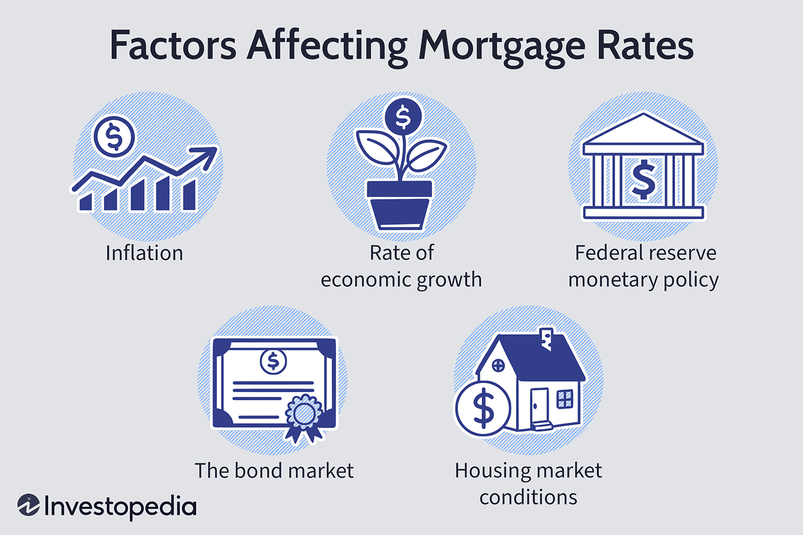

In the complex world of finance, four elements frequently come to the forefront: mortgage rates, financial markets, ETFs, and algorithmic trading. Understanding the interplay among these can provide deeper insights into investment strategies. This article explores how these components interact and influence the broader financial ecosystem. We will examine each element and highlight key impacts on investors and market participants. By the end, readers will have a comprehensive understanding of these essential finance components. 

Mortgage rates, determined by factors such as the Federal Reserve's monetary policy and prevailing economic conditions, significantly affect consumer borrowing costs and, consequently, the housing market and related sectors. Similarly, the dynamics of financial markets—encompassing assets such as stocks, bonds, and commodities—are shaped by interest rates, geopolitical events, and economic indicators. These variables can lead to significant shifts in market conditions, impacting investment strategies and outcomes.



Exchange-Traded Funds (ETFs) have gained popularity in modern investing due to their ability to provide diversified exposure to various asset classes while offering liquidity and cost-effectiveness. They modify how investors approach portfolio construction and risk management. Algorithmic trading, leveraging advanced computational algorithms, has revolutionized how trades are executed by enhancing speed and efficiency. This transformation influences market behavior, presenting both opportunities and challenges to market participants.

The relationship between these elements is deeply interconnected. Shifts in mortgage rates can influence real estate investments, thereby impacting certain ETFs, which in turn affects trading dynamics in financial markets. Algorithmic trading processes might respond to these shifts at unprecedented speeds, exemplifying the intricate dependencies among these elements. Understanding these interconnections is crucial for developing robust and adaptable investment strategies. This synergy underscores the collective impact of these components on global finance, emphasizing the importance of staying informed in an ever-evolving financial landscape.

## Table of Contents

## Understanding Mortgage Rates

Mortgage rates are a pivotal aspect of the financial landscape, principally influencing the cost of borrowing for homebuyers. These rates determine the monthly payment obligations for consumers and, consequently, their purchasing power in the real estate market. The determination of mortgage rates is multifaceted, with key influencers being the Federal Reserve's monetary policy, prevailing economic conditions, and market demand.

The Federal Reserve plays a significant role through its monetary policy, primarily by setting the federal funds rate, which indirectly affects longer-term interest rates, including those for mortgages. When the Federal Reserve adjusts the federal funds rate in response to economic conditions, mortgage rates often follow suit. For instance, an increase in the federal funds rate typically leads to higher borrowing costs, resulting in raised mortgage rates. Conversely, a reduction in the federal funds rate aims to stimulate borrowing and spending by decreasing the costs of loans, thereby leading to lower mortgage rates.

Economic conditions, encompassing factors such as inflation, unemployment rates, and overall economic growth, further influence mortgage rates. In periods of economic growth, heightened consumer confidence and increased spending may lead to higher demand for mortgages, potentially raising interest rates. On the other hand, during economic downturns, reduced demand for borrowing and increased caution among consumers may contribute to lower mortgage rates.

Recent trends in mortgage rates have illustrated these dynamics. For example, in times of economic uncertainty or global health crises, central banks might lower interest rates significantly to support economic stability, thereby causing mortgage rates to drop. This decrease can spur activity in the real estate market as lower borrowing costs make homeownership more accessible, potentially leading to a surge in housing demand and price appreciation.

Fluctuations in mortgage rates hold substantial sway over consumer confidence and spending habits. High mortgage rates can deter potential homebuyers, impacting their financial stability and reducing discretionary spending. In contrast, low mortgage rates generally enhance consumer confidence, encouraging spending and investment in real estate, which can have positive spillover effects on the broader economy.

For investors, monitoring mortgage rates is crucial for assessing potential impacts on housing markets and related stocks. Changes in rates can directly influence the profitability of real estate investment trusts (REITs), home builder stocks, and the financial sector. Furthermore, trends in mortgage rates may indicate broader economic shifts that could affect investment strategies across various asset classes.

In conclusion, understanding mortgage rates requires an appreciation of the complex interplay between monetary policy, economic conditions, and consumer behavior. As integral components of the financial ecosystem, mortgage rates not only affect individual homebuyers but also have far-reaching implications for investors and the real estate market at large.

## The Dynamics of Financial Markets

Financial markets serve as a fundamental platform for trading various types of assets including stocks, bonds, and commodities. They function as a barometer for economic health and are influenced by different external factors. One of the most significant influences on financial markets is interest rates. Changes in interest rates can directly affect the cost of borrowing and lending, thereby impacting corporate profits and consumer spending. When interest rates are low, borrowing is generally more attractive, potentially leading to higher corporate earnings and ultimately boosting stock prices.

Geopolitical events also play a critical role in the dynamics of financial markets. Events such as political instability, international conflicts, or trade tensions can lead to market uncertainty, prompting investors to shift their strategies towards safer assets like bonds or gold. These events often result in increased market [volatility](/wiki/volatility-trading-strategies), requiring investors to remain vigilant and adaptive in their approach.

The influence of economic indicators cannot be overlooked in examining financial market dynamics. Key economic data such as gross domestic product (GDP) growth, unemployment rates, and inflation figures provide insights into the health of an economy. Positive economic indicators often lead to market optimism, driving prices upward, whereas negative indicators can cause market downturns.

Market volatility, characterized by rapid price movements, is an inherent feature of financial markets. Understanding volatility is vital for investors to minimize risks and maximize returns. A common measure used to quantify market volatility is the standard deviation of asset prices. By calculating the volatility of an investment portfolio, investors can gauge the level of risk associated with their investment strategies and adjust accordingly.

Navigating the complexities of financial markets requires a comprehensive understanding of these external influencing factors. Investors must consider not only the individual performance of assets but also how broader economic and geopolitical contexts can impact asset prices. By analyzing these factors, investors can develop robust investment strategies that optimize returns while minimizing risks.

In scientific applications, Python can be used to model and predict market trends and volatility. With libraries such as NumPy and Pandas for data manipulation, and Matplotlib for data visualization, Python offers a powerful toolkit for financial analysis. Here's a simple Python code snippet that calculates the standard deviation of stock prices to estimate volatility:

```python
import numpy as np

def calculate_volatility(prices):
    returns = np.diff(prices) / prices[:-1]
    volatility = np.std(returns)
    return volatility

stock_prices = [100, 101, 102, 101, 100, 99, 101, 103]
volatility = calculate_volatility(stock_prices)
print(f"Estimated Volatility: {volatility:.2%}")
```

This code calculates the daily returns from a list of stock prices and then computes the standard deviation of those returns, providing an estimate of volatility. Understanding and implementing such analytical methods are crucial for investors seeking to navigate the dynamic and complex financial markets.

## The Role of ETFs in Modern Investing

Exchange-Traded Funds (ETFs) have emerged as a cornerstone of the modern investment landscape, providing investors with myriad opportunities for diversification and [liquidity](/wiki/liquidity-risk-premium). ETFs are investment funds traded on stock exchanges, much like stocks, and they hold assets such as stocks, commodities, or bonds. One of the key attractions of ETFs is their ability to offer exposure to a broad range of asset classes, enabling investors to access diversified portfolios without the need to purchase individual securities.

ETFs have experienced significant growth over the past few decades, largely due to their versatility and cost-effectiveness. According to Statista, the global [ETF](/wiki/etf-trading-strategies) market reached approximately $10 trillion in assets under management (AUM) by 2021, a figure that has continued to rise as investors increasingly opt for these instruments over traditional mutual funds. The growth of ETFs can be attributed to several factors, including low expense ratios, tax efficiency, and the ability to trade throughout the day at market prices.

For investors, understanding how to effectively utilize ETFs is crucial for balancing risk and return. Because ETFs can track virtually any index or basket of assets, investors can tailor their portfolios to align with specific investment goals, such as maximizing growth, stabilizing income, or hedging against inflation. For instance, an investor seeking equity exposure with a focus on technology might invest in a technology sector ETF, while one interested in minimizing volatility could choose a total market bond ETF.

ETFs also enhance portfolio efficiency by allowing investors to execute a single trade rather than multiple transactions to achieve a diversified position. This efficiency can lead to reduced transaction costs and simplified portfolio management, especially for those employing strategies like dollar-cost averaging or tactical asset allocation.

Moreover, the strategic use of ETFs provides a cost-effective means of gaining market exposure. With continued innovation, ETFs have expanded to cover a wide range of investment themes, strategies, and geographies, enabling retail and institutional investors alike to construct portfolios that reflect their strategic views on market trends and economic conditions.

In summary, ETFs play a pivotal role in contemporary investing by offering diversification, liquidity, and cost efficiency. As the ETF market continues to evolve, investors equipped with a deep understanding of these instruments can enhance their investment strategies, manage risks effectively, and optimize returns.

## Algorithmic Trading: The New Frontier

Algorithmic trading leverages the power of computer algorithms to execute trades with remarkable speed and precision. By employing complex mathematical models, these algorithms can analyze vast amounts of market data in microseconds, identifying trends and executing trades far beyond the human capability. Algorithmic trading is characterized by its ability to process large volumes of transactions rapidly, which can lead to enhanced market efficiency and reduced transaction costs.

**Advantages of Algorithmic Trading**

The main advantages of [algorithmic trading](/wiki/algorithmic-trading) lie in its efficiency and precision. By automating trade execution, it minimizes human error and reduces slippage caused by manual trade delays. The speed of execution ensures that trading opportunities are capitalized on before market conditions can change, providing competitive advantages. Additionally, the ability to backtest strategies with historical data allows traders to refine algorithms, optimizing performance and profitability.

Algorithmic trading also facilitates optimal timing through strategies such as [arbitrage](/wiki/arbitrage), where small price differences across markets are exploited for profit. This contributes to market efficiency by maintaining price consistency across different platforms. Moreover, the use of algorithms can lower the costs associated with trading by optimizing order placement and reducing the market impact of large trades.

**Challenges of Algorithmic Trading**

Despite its advantages, algorithmic trading presents several challenges. The development and maintenance of trading algorithms require significant technical expertise and resources. These systems, while powerful, are sensitive to market anomalies, and unexpected volatility can lead to significant losses. Moreover, the reliance on technology means that system failures or glitches can have catastrophic consequences, as famously illustrated by events like the "Flash Crash" of 2010.

Another challenge is regulatory scrutiny. As algorithmic trading grows in prevalence, concerns over market manipulation and fairness have resulted in stringent regulatory requirements. Traders must ensure compliance with various financial regulations, which can be complex and may differ across jurisdictions.

**Transformation of Trading Strategies and Market Behavior**

Algorithmic trading has fundamentally transformed trading strategies. Traditional investment approaches are increasingly integrated with algorithmic models, enhancing decision-making processes. Strategies such as pairs trading, [market making](/wiki/market-making), and [momentum](/wiki/momentum) strategies are now often algorithmically driven. For instance, high-frequency trading ([HFT](/wiki/high-frequency-trading-strategies)), a subset of algorithmic trading, takes advantage of small price discrepancies that may exist only for fractions of a second, significantly influencing market behavior and liquidity.

The use of [machine learning](/wiki/machine-learning) and [artificial intelligence](/wiki/ai-artificial-intelligence) further augments algorithmic trading strategies. Machine learning models can adapt and evolve with changing market conditions, offering a dynamic and responsive approach to trading. These technologies allow for the continuous improvement of algorithms, leading to more sophisticated and adaptive trading strategies.

**Implications for Competitiveness in Financial Markets**

Understanding the implications of algorithmic trading is vital for competitiveness in today’s financial markets. As the landscape becomes increasingly digital, traders who leverage algorithmic strategies are poised to benefit from enhanced processing capabilities and strategic insights. The ability to execute trades at high speeds with minimal discrepancies provides a distinct advantage, facilitating more informed and agile investment decisions.

Competitiveness now hinges on the ability to integrate advanced technological solutions within trading frameworks. Organizations that prioritize the development and refinement of algorithmic trading systems are more likely to thrive amidst the fast-evolving financial environment. As such, continuous education and investment in technological infrastructure remain crucial for market participants aiming to sustain a competitive edge.

## Interconnections and Their Implications

The interconnections among mortgage rates, financial markets, ETFs, and algorithmic trading form a complex web that significantly impacts investment decisions. Each element influences the others, creating ripple effects across the financial landscape. Understanding these relationships is crucial for developing robust and adaptable investment strategies.

Mortgage rates, for example, are heavily influenced by the broader economic environment and the monetary policies set by central banks. A rise in mortgage rates typically signals tighter monetary policy, which can dampen consumer spending and slow down economic growth. This has a direct impact on financial markets as lower consumer confidence can lead to decreased corporate revenues, thereby affecting stock prices.

In financial markets, shifts in interest rates can lead to volatility. Rising rates can make bonds more attractive compared to stocks, prompting a reshuffle of investment portfolios. This reallocation affects market dynamics and can lead to fluctuations in stock indices. Moreover, changes in interest rates influence the cost of borrowing for businesses and consumers, further affecting market health and consumer behavior.

ETFs offer a versatile tool for investors to manage risk and return balance. They provide exposure to a diverse range of asset classes and react rapidly to changes in the market environment. In a situation where interest rates are rising, ETF managers might shift their focus to sectors or geographical regions that offer better returns under the new conditions. This flexibility makes ETFs an attractive option for investors looking to navigate volatile markets efficiently.

Algorithmic trading, with its capacity for executing trades at high speed and [volume](/wiki/volume-trading-strategy), often acts as a catalyst for market reactions to macroeconomic events, including changes in mortgage rates and financial market conditions. Algorithms are designed to follow specific instructions based on various variables, including asset pricing, historical trends, and economic indicators. Hence, a shift in one of these factors could trigger a change in trading strategies, amplifying market movements.

The interplay of these elements can be seen in scenarios such as the 2008 financial crisis, where the burst of the housing bubble led to widespread mortgage defaults. This contributed to a severe downturn in financial markets, prompting ETFs to adjust their holdings to minimize losses. Algorithmic trading strategies had to be recalibrated in response to the rapid changes in market conditions, illustrating the cascading effect of interconnected financial components.

In summary, recognizing the interdependencies between mortgage rates, financial markets, ETFs, and algorithmic trading is vital for investors to anticipate changes and formulate effective strategies. This understanding aids in crafting investment approaches that are both resilient and adaptable, ensuring that portfolios can withstand the challenges of a constantly evolving global financial ecosystem.

## Conclusion

The intricate dance between mortgage rates, financial markets, ETFs, and algorithmic trading shapes the investment landscape in profound ways. Each of these components plays a significant role in influencing market behavior and investor decisions. Understanding their dynamics is essential for making informed financial decisions and optimizing investment outcomes. 

Mortgage rates, by determining the cost of borrowing, can influence real estate markets and consumer spending. Financial markets, with their complex interplay of assets like stocks and bonds, are influenced by external factors such as interest rates and geopolitical events. ETFs offer investors a versatile tool for diversification and risk management, while algorithmic trading brings speed and precision to market transactions, potentially increasing market efficiency.

Investors who understand and anticipate these dynamics stand to benefit in an ever-evolving marketplace. By analyzing how these elements interact and interdepend, investors can develop robust strategies that are adaptable to changing conditions. The article has outlined key aspects of each component and highlighted their interdependencies, emphasizing the importance of staying informed and agile. 

As the financial world continues to evolve, embracing new technologies and adapting to shifting economic landscapes are paramount for success. By keeping abreast of developments in mortgage rates, market dynamics, ETF trends, and advances in algorithmic trading, investors can navigate financial challenges and seize emerging opportunities with confidence.

## References & Further Reading

[1]: ["Interest Rates, Discount, and Intra-Industry Competitive Strategy"](https://www.sciencedirect.com/science/article/pii/S0304405X20303536) in The Journal of Financial and Quantitative Analysis, by Eugene F. Fama

[2]: ["The Little Book of Common Sense Investing: The Only Way to Guarantee Your Fair Share of Stock Market Returns"](https://www.amazon.com/Little-Book-Common-Sense-Investing/dp/1119404509) by John C. Bogle

[3]: ["Algorithmic Trading: Winning Strategies and Their Rationale"](https://www.wiley.com/en-us/Algorithmic+Trading%3A+Winning+Strategies+and+Their+Rationale-p-9781118460146) by Ernie Chan

[4]: ["The Journal of Portfolio Management Special Issue on ETFs: Structure, Trading, and Liquidity"](https://jpm.pm-research.com/front) by various authors

[5]: ["The Economics of the Mortgage Market: Perspectives on Household Decision Making"](https://archive.org/details/economicsofmortg0000leec) by David Miles

[6]: ["High-Frequency Trading: A Practical Guide to Algorithmic Strategies and Trading Systems"](https://www.ahmetbeyefendi.com/wp-content/uploads/2020/07/High-Frequency-Trading-Irene-Aldridge.pdf) by Irene Aldridge