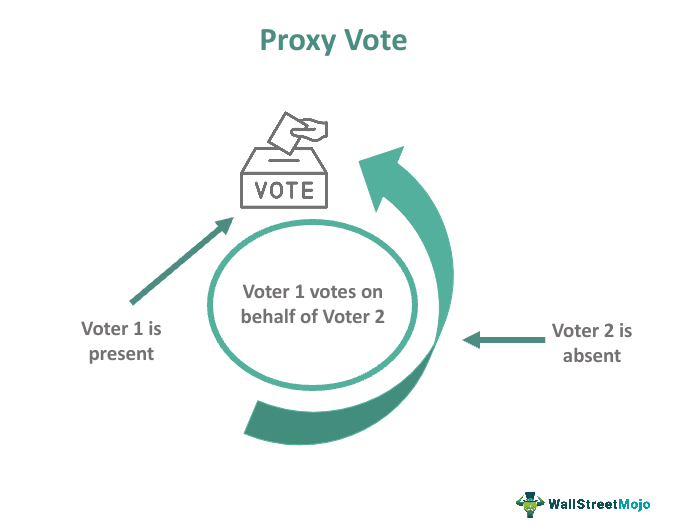

Proxy voting is a mechanism that enables shareholders to exert influence over corporate policies and decisions through designated representatives without physically attending shareholder meetings. This system is critical as it ensures that investors can maintain a degree of control and ensure their interests are represented in the governance of companies in which they hold shares. The significance of proxy voting is underscored by its role in enhancing shareholder democracy, whereby the governance of a corporation is more accountable to its owners.

This article will discuss the evolving dynamics of proxy voting and its importance in enhancing shareholder participation, influencing corporate governance structures, and adapting to emerging trends such as algorithmic trading. The interplay between proxy voting and corporate governance is significant as it serves as a mechanism through which shareholders can influence the management and strategic direction of a company, thereby affecting everything from executive compensation to environmental policies.

The integration of technology, particularly through algorithmic trading, shapes modern investment strategies and decisions. Algorithmic trading leverages computational algorithms to make asset trading decisions, offering speed and efficiency that traditional trading methods cannot match. As these technologies evolve, they intersect with proxy voting by introducing new methods for decision-making and engagement, sometimes raising questions about regulatory compliance and ethical considerations. 

Given that regulatory frameworks around proxy voting are continually evolving, it is imperative for shareholders to understand these changes to fully leverage their voting rights. Regulatory bodies, such as the Securities and Exchange Commission (SEC) in the United States, provide the necessary legal scaffolding to ensure that proxy voting remains a fair and transparent process, protecting both individual and institutional investors' interests.

The interplay between regulatory evolution and technological advancement suggests an active and dynamic landscape for proxy voting. Shareholders and stakeholders must remain informed and engaged to effectively navigate this space, ensuring their interests are adequately represented and that they are capable of effecting meaningful change within the corporations they invest in.

## Table of Contents

## Understanding Proxy Voting

Proxy voting is a mechanism that enables shareholders, particularly those who cannot attend meetings physically, to exercise their voting rights by delegating authority to a designated representative. This representative, who acts on their behalf, uses a proxy statement that outlines the issues requiring attention and provides instructions on how votes should be cast. 

A significant component of proxy voting is the formalization and distribution of the proxy statement. This document is crucial as it contains detailed information about the matters scheduled for voting and offers recommendations or instructions on how the shareholder’s vote should be executed. Ensuring that this process is not only clear but also equitable, various regulations have been implemented to maintain transparency and fairness. 

The regulatory environment surrounding proxy voting is designed to protect shareholders and maintain the integrity of corporate governance. For instance, the proxy voting process is often subject to regulations that stipulate timely and accurate dissemination of information to all shareholders, enabling them to make informed decisions. Furthermore, these regulations are enforced to prevent conflicts of interest and ensure that the appointed representatives act in the best interests of the shareholders. Compliance with these rules is mandatory, and violations can lead to severe penalties, upholding the sanctity of the voting process.

In essence, proxy voting serves as a fundamental tool for shareholders who wish to participate in corporate governance without the necessity of physical presence at meetings. By delegating voting rights, they ensure their opinions and preferences influence corporate decisions, contributing to the overall governance framework in which companies operate.

## Enhancing Shareholder Participation

Active shareholder participation in proxy voting plays a crucial role in ensuring effective corporate governance by allowing investors to voice their opinions and influence corporate policies. Several strategies have been implemented to boost participation rates and overcome prevalent challenges.

Electronic voting has significantly transformed the proxy voting landscape by streamlining the process, making it more accessible and convenient for shareholders. Online platforms allow shareholders to vote remotely, reducing the necessity of physical attendance at shareholder meetings. This innovation has particularly benefited international investors, who may find attending meetings logistically challenging. The convenience of electronic voting has the potential to increase participation rates, although its adoption varies across companies and regions.

Institutional investors, who often hold substantial stakes in companies, play a pivotal role in promoting shareholder engagement. They provide comprehensive proxy guidelines, which outline their voting policies and the key issues to be addressed. These guidelines serve as valuable resources for less informed shareholders, especially retail investors, by helping them make informed decisions aligned with shareholder interests and corporate governance principles.

Despite these efforts, achieving quorum for shareholder meetings remains a persistent issue, largely due to the low engagement of retail shareholders. Retail investors, who are typically smaller shareholders, often exhibit lower turnout rates due to a lack of awareness or perceived insignificance of their individual vote. This phenomenon can result in companies failing to reach the necessary threshold required for a valid vote, known as quorum, which is essential for the decision-making process.

Numerous approaches have been proposed to address these challenges. Enhancing shareholder education and awareness is critical to increasing participation. Providing clear and accessible information about the issues at stake and the importance of each vote can motivate more shareholders to engage. Additionally, utilizing social media and digital communication channels can improve outreach and engagement, particularly among younger and tech-savvy investors.

Furthermore, proxy advisory firms offer recommendations and voting advice to institutional investors. While these firms can help inform decisions, their influence can disproportionately affect voting outcomes when retail shareholders are less active. Increasing the visibility and diversity of perspectives in proxy voting can help balance this influence.

Continuing efforts to refine the regulatory framework may also encourage greater shareholder participation. Regulatory reforms that simplify the voting process and reduce associated costs can remove barriers and incentivize broader shareholder involvement. Additionally, implementing default or automatic voting options based on previously expressed preferences could increase participation by providing a baseline for engagement.

In conclusion, enhancing shareholder participation in proxy voting is pivotal for strengthening corporate governance. Through technological advancements, comprehensive guidelines, and targeted efforts to engage retail investors, companies can improve participation rates, thus ensuring that a diverse array of shareholder voices contribute to corporate decision-making.

## Legal and Regulatory Aspects of Proxy Voting

The Securities and Exchange Commission (SEC) is instrumental in shaping the regulatory landscape of proxy voting, which is a key component of shareholder participation in corporate governance. As the principal regulatory body overseeing securities and markets, the SEC establishes rules designed to ensure the transparency, fairness, and efficiency of proxy voting processes.

The regulations set forth by the SEC are integral in maintaining the legitimacy of proxy voting, as they define the standards and practices that need to be adhered to by companies and shareholders alike. Compliance with these regulations helps safeguard shareholder interests and assures that voting outcomes authentically reflect shareholder intentions. The SEC's rules are comprehensive, covering numerous aspects from disclosure requirements to vote tabulation and reporting procedures.

Recent reforms initiated by the SEC are focused on enhancing transparency and streamlining the proxy voting process. One major reform involves the modernization of proxy solicitations, aiming to reduce costs and improve the accuracy of information dissemination. This includes the adoption of electronic delivery methods for proxy materials, which significantly cut down on printing and mailing expenses, while also accelerating the flow of information.

The SEC's role extends to addressing conflicts of interest that may arise in proxy advisory firms. Rules have been introduced to ensure these firms disclose any potential conflicts, thereby promoting more informed voting decisions by shareholders. By mandating clear and concise disclosures, the SEC seeks to mitigate any bias that could influence voting recommendations provided by such firms.

Additionally, the SEC has been actively working on proposals to enhance the accuracy and reliability of proxy voting. This includes clarifying the standards for when and how votes are counted and reported, as well as enhancing the integrity of the vote tabulation process. These improvements are aimed at building trust in the proxy voting mechanism and ensuring that shareholder votes are accurately recorded and reported.

In essence, the SEC’s regulatory framework for proxy voting is continuously evolving, with a primary focus on protecting investor interests and bolstering the effectiveness of corporate governance. The ongoing regulatory adjustments reflect the SEC’s commitment to adapting to the changing landscape of corporate governance and technological advancements in the financial industry.

## Algorithmic Trading and Its Intersection with Proxy Voting

Algorithmic trading has significantly transformed contemporary investment approaches by utilizing advanced technological tools and sophisticated algorithms to enhance the speed and precision of decision-making processes in financial markets. This innovation has spurred a revolution in how trades are executed, offering increased efficiency, reduced transaction costs, and minimized human error. By automating trading processes, [algorithmic trading](/wiki/algorithmic-trading) systems can rapidly analyze vast datasets to identify profitable trading opportunities, enabling investors to optimize their investment strategies with unprecedented accuracy.

A critical component of algorithmic trading involves the use of proxies. In this context, a proxy can denote either a parameter or a signal that acts as a placeholder for a more complex decision-making process. These proxies are integral for developing algorithmic models that improve the outcomes of trading strategies. For instance, a proxy may be used to anonymize transactions, thereby maintaining trader privacy and reducing the likelihood of market manipulation. Furthermore, proxies facilitate the algorithm's ability to detect patterns and trends, serving as simplifying elements that guide complex financial decisions without necessitating the presence of an investor in real-time.

The intersection of algorithmic trading with proxy voting presents innovative opportunities to amplify efficiency in the governance of corporate entities. The automation capabilities of algorithmic systems can streamline the collection, analysis, and execution of proxy votes, enabling shareholders to participate more effectively in corporate governance processes. By utilizing algorithmic solutions, investors can seamlessly integrate real-time data and analytics into their proxy voting decisions, ensuring that their voting strategies are informed by up-to-the-minute market conditions and corporate performance metrics.

However, integrating algorithmic trading with proxy voting introduces several regulatory challenges. The regulatory landscape governing financial markets is complex, requiring compliance with stringent rules designed to protect shareholder interests and market integrity. For instance, the integration may lead to concerns about the alignment of algorithmic decision-making with investor intentions, necessitating transparency and oversight to validate that proxy votes cast through algorithms genuinely reflect shareholder preferences.

The regulatory requirements also encompass the necessity to prevent conflicts of interest, ensure the security and confidentiality of proxy voting, and maintain the integrity of the voting process against systemic risks. As algorithmic trading continues to evolve, regulatory bodies are tasked with crafting frameworks that balance innovation with protection, ensuring that the benefits of technological advancements in proxy voting do not undermine the foundational principles of shareholder democracy.

The fusion of algorithmic trading with proxy voting highlights the dynamic interplay between technological innovation and regulatory frameworks, underscoring the potential for enhanced efficiency and engagement in corporate governance. As these technologies continue to advance, their effective integration depends on developing robust mechanisms that align automation with investor interests while ensuring compliance with evolving regulatory standards.

## Challenges and Innovations in Proxy Voting

Technological advancements have significantly transformed proxy voting, introducing innovations that streamline processes and provide enhanced analytics. Online platforms facilitate real-time voting, granting shareholders the convenience of participating without geographical constraints. Additionally, these platforms offer sophisticated data analysis tools, enabling shareholders to make more informed decisions. These innovations aim to boost engagement and foster a more active shareholder base.

Despite these technological strides, challenges such as low voter turnout continue to affect the efficacy of proxy voting. Many retail shareholders remain disengaged, often due to a lack of understanding or perceived impact of their votes. This disengagement can prevent meetings from achieving the necessary quorum, thereby hindering effective corporate governance. Campaigns to increase participation often incur significant costs, which can be prohibitive, particularly for smaller firms.

To address these issues, regulatory and procedural innovations are being considered. One such method is the 'supermajority vote,' which requires a higher threshold than the standard majority for critical decisions. This can incentivize greater shareholder participation by emphasizing the importance of their votes in pivotal corporate matters.

Further advancements could include the integration of blockchain technology, ensuring secure, transparent, and immutable voting records. Blockchain can reduce the risk of fraud and errors while increasing confidence in the integrity of voting outcomes. Additionally, leveraging [artificial intelligence](/wiki/ai-artificial-intelligence) to analyze voting patterns and predict outcomes can help companies tailor their communication strategies to better engage shareholders.

Continuous innovation and supportive regulatory frameworks are vital to overcoming the persistent challenges in proxy voting. As technology evolves, it is crucial for both companies and regulators to adapt, ensuring that proxy voting remains a robust mechanism for shareholder democracy.

## Conclusion

Proxy voting remains a cornerstone of shareholder democracy, providing a critical platform for investors to influence corporate governance. This process enables shareholders to express their views and vote on pivotal issues, including corporate board elections, mergers and acquisitions, and executive compensation plans. The influence wielded through proxy voting underscores its importance in shaping the direction and governance frameworks of companies.

Technological advancements play a transformative role in the evolution of proxy voting. Electronic and online voting platforms have enhanced accessibility and convenience, allowing more shareholders to participate efficiently without geographical constraints. These technologies also streamline the voting process, making it faster and more secure. Additionally, data analytics tools provide shareholders with deeper insights into voting issues, enabling well-informed decision-making.

Alongside technological progress, regulatory reforms continue to shape the future of proxy voting. Regulatory bodies, such as the Securities and Exchange Commission (SEC), are critical in updating and enforcing rules that promote transparency and fairness in proxy voting. Recent reforms focus on reducing the costs associated with proxy campaigns and ensuring that the voting process is transparent and accessible to all shareholders, including retail investors.

For shareholders, staying informed about these evolving tools and regulations is crucial. By leveraging technological innovations and understanding the regulatory landscape, shareholders can maximize the impact of their voting decisions on corporate policies and practices. Proactively engaging in proxy voting not only protects their investments but also supports the broader pursuit of ethical and effective corporate governance.

In summary, proxy voting is a dynamic process central to corporate governance. As technology and regulation continue to evolve, shareholders have unprecedented opportunities to influence corporate directions meaningfully. By participating actively and using available tools, they can ensure their investments contribute to sustainable and responsible business practices.

## References & Further Reading

[1]: Palmiter, A. R. (2002). ["Mutual Fund Voting of Portfolio Shares: Why Not Disclose?"](https://www.researchgate.net/publication/228136886_Mutual_Fund_Voting_of_Portfolio_Shares_Why_Not_Disclose) Fordham Law Review, 71(3), 1131-1185.

[2]: Securities and Exchange Commission (2020). ["SEC Adopts Amendments to Modernize Shareholder Proposal Rules."](https://www.sec.gov/newsroom/press-releases/2020-220)

[3]: Aguilera, R. V., & Cuervo-Cazurra, A. (2004). ["Codes of Good Governance Worldwide: What is the Trigger?"](https://journals.sagepub.com/doi/10.1177/0170840604040669) Organization Studies, 25(3), 415-434.

[4]: BlackRock Investment Stewardship (2021). ["Proxy Voting and Shareholder Engagement."](https://www.blackrock.com/corporate/literature/fact-sheet/blk-responsible-investment-faq-global.pdf)

[5]: Goodman, J. W., & Wicks, D. G. (2017). ["The Role of Institutional Investors in Integrating ESG and Corporate Governance."](https://onlinelibrary.wiley.com/doi/full/10.1111/corg.12583) Harvard Law School Forum on Corporate Governance.

[6]: Metrick, A., & Yasuda, A. (2010). ["The Economics of Private Equity Funds."](https://web.stanford.edu/~piazzesi/Reading/MetrickYasuda2010.pdf) Review of Financial Studies, 23(6), 2303-2341.

[7]: Mitts, J. R. (2020). ["A Study of Mutual Fund Proxy Voting and Securities Lending."](https://papers.ssrn.com/sol3/cf_dev/AbsByAuth.cfm?per_id=1806223) Journal of Financial and Quantitative Analysis.