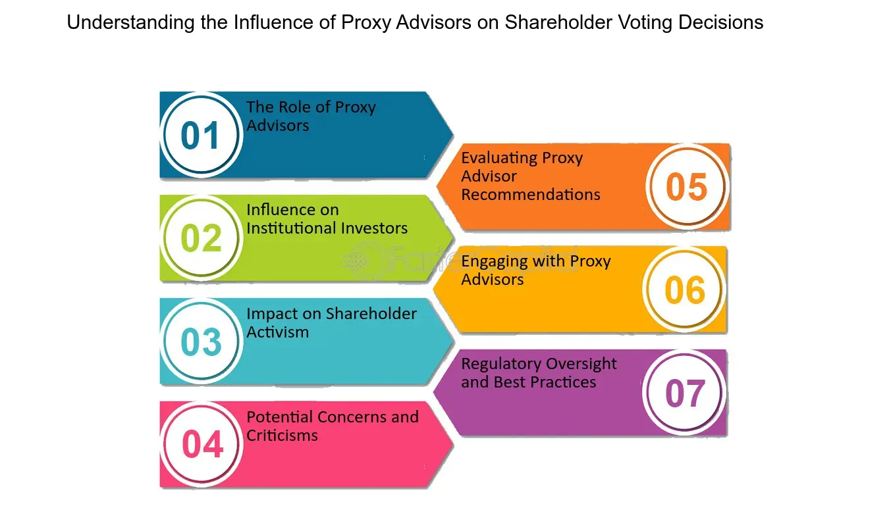

## Table of Contents

## What is proxy voting in the context of fund management?

Proxy voting in fund management is when someone votes on behalf of the shareholders of a fund. This happens because many funds have lots of investors, and it's not practical for each investor to vote on every decision. So, the fund managers vote for them. This is important because it lets the investors have a say in how the companies they invest in are run, without them having to do all the voting themselves.

The votes are usually about things like choosing the board of directors, approving big company decisions, or deciding on environmental and social issues. Fund managers try to vote in a way that will make the fund's investments more valuable. They often follow guidelines or policies to make sure their votes match what the investors want. This way, even though the investors aren't voting directly, their interests are still taken care of.

## How does proxy voting affect shareholder participation in funds?

Proxy voting makes it easier for shareholders in funds to have a say in the companies they invest in. Since many funds have lots of investors, it's hard for each person to vote on every decision. So, fund managers vote for them. This means shareholders can still influence important choices like who runs the company or big decisions, without having to do the voting themselves.

This system helps more people participate in how companies are managed, even if they don't have the time or knowledge to vote directly. Fund managers follow rules or guidelines to make sure they vote in a way that matches what the shareholders want. This way, even though the shareholders aren't voting themselves, their interests are still looked after, and they can feel involved in the decisions that affect their investments.

## What are the basic mechanics of proxy voting for fund shareholders?

Proxy voting for fund shareholders works like this: when a company where the fund has invested is going to have a meeting, they send out a list of things to vote on. These things can be about choosing who will be on the company's board, approving big decisions, or deciding on issues like the environment or how the company treats its workers. Since funds have many investors, it's not easy for each investor to vote on everything. So, the fund managers vote for them. They use the power of the shares the fund owns to cast votes at the company's meeting.

The fund managers follow a set of rules or guidelines to make sure they vote in a way that matches what the shareholders want. These rules might say to vote for things that will make the company more valuable or to support certain social issues. After the voting is done, the fund managers tell the shareholders how they voted. This way, even though the shareholders didn't vote themselves, they can see that their interests were taken care of. It's a way to make sure everyone's voice is heard, even if they can't vote directly.

## Can you explain the role of proxy advisory firms in fund voting?

Proxy advisory firms help fund managers with voting. These firms give advice on how to vote at company meetings. They look at what the company wants to vote on and tell the fund managers if they should say yes or no. This is helpful because fund managers manage money for lots of people and can't know everything about every company they invest in. The advice from proxy advisory firms helps them make better choices.

These firms also write reports that explain why they suggest voting a certain way. This can be about things like who should be on the company's board, big decisions the company wants to make, or issues like the environment or how the company treats its workers. Fund managers use these reports to decide how to vote on behalf of the people whose money they manage. This way, even though the investors aren't voting themselves, their interests are still looked after because the fund managers get good advice.

## How does proxy voting influence corporate governance within funds?

Proxy voting helps shape how companies are run within funds. When fund managers vote on behalf of the shareholders, they can influence big decisions like who is on the company's board or what big projects the company should do. This means they can push for changes that make the company work better or be more responsible. By voting, fund managers can make sure the companies they invest in are managed in a way that will help the fund grow and do well.

The way fund managers vote can also show what shareholders care about. For example, if many shareholders want the company to be more friendly to the environment, the fund managers can vote for things that support that goal. This helps make sure the companies the fund invests in match what the shareholders want. So, proxy voting is a powerful tool that lets shareholders have a say in how companies are run, even if they don't vote themselves.

## What are the common challenges faced by fund shareholders in proxy voting?

One big challenge for fund shareholders in proxy voting is not knowing enough about the companies they invest in. There are so many companies and so many things to vote on, it's hard for shareholders to understand it all. They have to trust the fund managers to vote in a way that's good for them, but sometimes they might not agree with how the managers vote. This can make shareholders feel like they don't have control over their investments.

Another challenge is that proxy voting can be complicated. Shareholders have to read long reports and understand lots of details to know how to vote. If they don't have time or don't understand it well, they might not feel confident in their choices. Plus, there's a lot of information out there, and it can be hard to know which advice to follow. This can make proxy voting feel overwhelming for some shareholders.

## How can fund shareholders increase their participation through proxy voting?

Fund shareholders can increase their participation in proxy voting by staying informed about the companies their fund invests in. They can read the reports and guidelines that the fund managers use to decide how to vote. This way, shareholders can understand what's being voted on and share their thoughts with the fund managers. If shareholders have concerns or different views, they can talk to the fund managers and let them know what they want. This helps make sure the votes reflect what the shareholders care about.

Another way to boost participation is by using the resources provided by proxy advisory firms. These firms give advice on how to vote and explain why they suggest certain choices. Shareholders can look at these reports to learn more about the voting issues and feel more confident in their decisions. By using this information, shareholders can better guide the fund managers and have a bigger say in how the companies are run. This makes proxy voting a powerful tool for shareholders to influence corporate decisions and make sure their voices are heard.

## What are the regulatory frameworks governing proxy voting in funds?

In the United States, the main rules for proxy voting in funds come from the Securities and Exchange Commission (SEC). The SEC says that fund managers have to vote in a way that's best for the shareholders. They also have to tell shareholders how they voted and why. This helps make sure that the votes are fair and that shareholders know what's going on. The SEC also says that fund managers have to follow certain rules when they use proxy advisory firms to help them vote. This is to make sure the advice they get is good and helps them make the best choices for the shareholders.

In Europe, the rules are a bit different but still focus on making sure shareholders have a say. The Shareholder Rights Directive (SRD II) is a big rule that says companies have to make it easy for shareholders to vote. It also says that fund managers have to be clear about how they vote and why. This helps shareholders feel more involved and know that their interests are being looked after. Both in the U.S. and Europe, the goal is to make sure that proxy voting is fair and helps shareholders have a voice in how the companies they invest in are run.

## How do different fund types (e.g., mutual funds, ETFs) handle proxy voting differently?

Mutual funds and ETFs handle proxy voting a bit differently because of how they are set up. Mutual funds are managed by people who pick the investments and vote on behalf of the shareholders. They usually have a team that looks at all the voting issues and decides how to vote based on what's best for the shareholders. They might use guidelines or get advice from proxy advisory firms to help them make these choices. This way, mutual fund shareholders can feel confident that their votes are being taken care of by experts.

ETFs, on the other hand, often track an index, which means they try to match the performance of a group of stocks. Because of this, [ETF](/wiki/etf-trading-strategies) managers might not have as much freedom to vote on each issue. They usually follow the voting policies of the index they are tracking. This can mean less active voting compared to mutual funds. But, like mutual funds, ETFs also have to tell their shareholders how they voted and why, so everyone knows what's happening with their investments.

## What are the advanced strategies fund managers use to optimize proxy voting outcomes?

Fund managers use different smart ways to make proxy voting work better for their shareholders. One way is by using special computer programs that help them look at a lot of information quickly. These programs can find patterns and tell the managers which votes are most important for making the fund's investments more valuable. They also use these tools to keep track of how companies are doing and make sure their votes match what the shareholders want. This helps them make better choices and vote in a way that helps the fund grow.

Another strategy is working closely with proxy advisory firms. These firms give advice on how to vote and explain why certain choices are good. Fund managers can use this advice to make sure they are voting in the best way possible. They might also talk to the companies they invest in to learn more about what's going on and make better voting decisions. By doing this, they can make sure their votes help the companies do better and make the fund's investments more successful.

## How does the geographical distribution of fund shareholders impact proxy voting?

When fund shareholders live in different places around the world, it can make proxy voting more complicated. Different countries have different rules about voting, and what's important to shareholders in one place might not be the same in another. This means fund managers have to think about lots of different things when they vote. They might need to follow rules from many countries and try to make everyone happy, even if shareholders in different places want different things.

To handle this, fund managers often use special guidelines that take into account the different needs and wants of shareholders from all over the world. They might also talk to shareholders in different countries to understand what they care about most. By doing this, fund managers can make sure their votes reflect what all the shareholders want, no matter where they live. This helps keep everyone happy and makes the fund's investments work better for everyone.

## What are the future trends and potential reforms in proxy voting for fund shareholder participation?

In the future, technology will play a bigger role in proxy voting. More funds might use special computer programs to help them vote better. These programs can look at a lot of information quickly and help fund managers make choices that will make the fund's investments more valuable. Also, voting might become easier for shareholders with online platforms that let them vote directly, even if they live far away. This could help more people take part in voting and feel like they have a say in how the companies they invest in are run.

There might also be new rules to make proxy voting fairer and more clear. Governments and rule-makers could change the laws to make sure fund managers vote in a way that really helps the shareholders. They might ask for more information to be shared about how votes are made and why. This way, shareholders can trust that their interests are being looked after. These changes could make proxy voting work better for everyone and help funds grow in a way that matches what the shareholders want.

## References & Further Reading

[1]: Palmiter, A. R. (2002). ["Mutual Fund Voting of Portfolio Shares: Why Not Disclose?"](https://www.researchgate.net/publication/228136886_Mutual_Fund_Voting_of_Portfolio_Shares_Why_Not_Disclose) Fordham Law Review, 71(3), 1131-1185.

[2]: Securities and Exchange Commission (2020). ["SEC Adopts Amendments to Modernize Shareholder Proposal Rules."](https://www.sec.gov/newsroom/press-releases/2020-220)

[3]: Aguilera, R. V., & Cuervo-Cazurra, A. (2004). ["Codes of Good Governance Worldwide: What is the Trigger?"](https://journals.sagepub.com/doi/10.1177/0170840604040669) Organization Studies, 25(3), 415-434.

[4]: BlackRock Investment Stewardship (2021). ["Proxy Voting and Shareholder Engagement."](https://www.blackrock.com/corporate/literature/fact-sheet/blk-responsible-investment-faq-global.pdf)

[5]: Goodman, J. W., & Wicks, D. G. (2017). ["The Role of Institutional Investors in Integrating ESG and Corporate Governance."](https://onlinelibrary.wiley.com/doi/full/10.1111/corg.12583) Harvard Law School Forum on Corporate Governance.

[6]: Metrick, A., & Yasuda, A. (2010). ["The Economics of Private Equity Funds."](https://web.stanford.edu/~piazzesi/Reading/MetrickYasuda2010.pdf) Review of Financial Studies, 23(6), 2303-2341.

[7]: Mitts, J. R. (2020). ["A Study of Mutual Fund Proxy Voting and Securities Lending."](https://papers.ssrn.com/sol3/cf_dev/AbsByAuth.cfm?per_id=1806223) Journal of Financial and Quantitative Analysis.